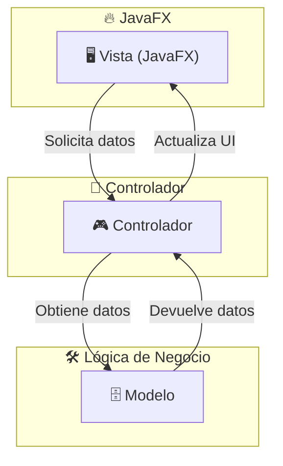

Repository: ivnmd/code-learn-joatham
Commit: a19d3cd70eb1fa54c358499f2414566f37881bb3
Subpath: /primero/pro
Files analyzed: 78

Estimated tokens: 114.4k

Directory structure:
└── pro/
    ├── README.md
    └── unidades/
        ├── comun/
        │   ├── ABSTRACTAS.md
        │   ├── DATE.md
        │   ├── DATETIMEFORMATTER.md
        │   ├── EXCEPCIONES.md
        │   ├── INTERFACES.md
        │   ├── POO.md
        │   ├── SIMPLEDATEFORMAT.md
        │   └── images/
        ├── images/
        │   └── README.md
        ├── unidad-0/
        │   ├── README.md
        │   ├── HERRAMIENTAS.md
        │   └── images/
        ├── unidad-1/
        │   ├── README.md
        │   ├── CLASES-ENVOLVENTES.md
        │   ├── COMO-ESCRIBIR-CODIGO-LIMPIO.md
        │   ├── CONVERSORES-DE-TIPO.md
        │   ├── ELEMENTOS-BASICOS-DE-UN-PROGRAMA-JAVA.md
        │   ├── ENTRADA-Y-SALIDA-BASICAS.md
        │   ├── ESTRUCTURA-DE-UN-PROGRAMA-JAVA.md
        │   ├── ESTRUCTURAS-CONDICIONALES-JAVA.md
        │   ├── ESTRUCTURAS-REPETITIVAS-O-BUCLES-JAVA.md
        │   ├── OPERADORES-CON-EXPRESIONES.md
        │   ├── OTROS-TIPOS-DE-ELEMENTOS.md
        │   ├── PRIMEROS-PASOS-JAVA.md
        │   ├── PROGRAMAS-LENGUAJES.md
        │   ├── SCANNER.md
        │   ├── TIPOS-DE-DATOS-BASICOS.md
        │   ├── VARIABLES-Y-OPERADORES.md
        │   └── images/
        ├── unidad-2/
        │   ├── README.md
        │   ├── AGREGACION-COMPOSICION.md
        │   ├── CLASE-EN-JAVA.md
        │   ├── CLASE-INTEGER.md
        │   ├── CLASE-MATH.md
        │   ├── CLASE-STRING.md
        │   ├── CLASES-ENVOLVENTES.md
        │   ├── DECLARACION-DE-METODOS.md
        │   ├── LIBERACION-MEMORIA.md
        │   ├── METODOS-ESTATICOS.md
        │   ├── PASO-PARAMETROS.md
        │   └── POO-EN-JAVA.md
        ├── unidad-3/
        │   ├── README.md
        │   ├── CREACION-DE-ARRAYS.md
        │   ├── collection/
        │   │   ├── README.md
        │   │   ├── ARRAYLIST.md
        │   │   ├── empty
        │   │   ├── HASHSET.md
        │   │   └── VECTOR.md
        │   ├── ejemplos/
        │   │   ├── README.md
        │   │   ├── ARRAYLIST.md
        │   │   ├── empty
        │   │   └── HASHSET.md
        │   ├── img/
        │   └── map/
        │       ├── README.md
        │       └── empty
        ├── unidad-3_b/
        │   └── README.md
        ├── unidad-4/
        │   ├── README.md
        │   ├── CSV-XML-JSON.md
        │   ├── FICHEROS-JSON.md
        │   ├── FICHEROS-XML.md
        │   ├── MANEJO-FICHEROS-JAVA.md
        │   └── images/
        ├── unidad-5/
        │   ├── README.md
        │   ├── PROYECTO-MAVEN.md
        │   ├── SCENEBUILDER.md
        │   └── images/
        ├── unidad-6/
        │   ├── README.md
        │   ├── CLASES-ESTATICAS.md
        │   ├── ENUMERADOS.md
        │   ├── EXPRESIONES-REGULARES.md
        │   ├── FICHEROS-PROPERTIES.md
        │   ├── RECUSIVIDAD.md
        │   └── images/
        └── unidad-7/
            ├── README.md
            ├── CRUD-SQLITE.md
            ├── empty
            ├── JDBC-JPA.md
            ├── JPA.md
            ├── MVC.md
            ├── SPRING-DATA.md
            ├── Ejemplos/
            │   ├── README.md
            │   └── file/
            │       ├── DbOperations.java
            │       ├── MainController.java
            │       └── script-usuarios.sql
            └── img/


================================================
FILE: primero/pro/README.md
================================================
#  Code & Learn (Programación)

## Unidades

- [Unidad 0](unidades/unidad-0/README.md)
  - [Herramientas](unidades/unidad-0/HERRAMIENTAS.md)
- [Unidad 1](unidades/unidad-1/README.md)
- [Unidad 2](unidades/unidad-2/README.md)
- [Unidad 3](unidades/unidad-3/README.md)
- [Unidad 4](unidades/unidad-4/README.md)
- [Unidad 5](unidades/unidad-5/README.md) 

## Licencia 📄

Este proyecto está bajo la Licencia (Apache 2.0) - mira el archivo [LICENSE.md](../LICENSE.md) para detalles


================================================
FILE: primero/pro/unidades/comun/ABSTRACTAS.md
================================================
<div align="justify">

#  Code & Learn (Clases Abstractas  en Java)

Las **clases abstractas** en Java son clases que no pueden ser instanciadas directamente. Su propósito es servir como una base común para otras clases y proporcionar un marco de trabajo que las subclases pueden extender. Pueden contener tanto métodos abstractos (sin implementación) como métodos con implementación concreta.

## **1. Definición**

Una **clase abstracta** es una clase que puede contener tanto métodos abstractos (métodos sin implementación) como métodos concretos (métodos con implementación). No se puede instanciar directamente una clase abstracta, pero puede ser utilizada como una clase base para otras clases que la extienden.

```java
public abstract class Animal {
    // Metodo abstracto (sin implementación)
    public abstract void hacerSonido();

    // Metodo concreto (con implementación)
    public void dormir() {
        System.out.println("El animal está durmiendo.");
    }
}
```

## **2. Características de una Clase Abstracta**

- **Métodos Abstractos**: Una clase abstracta puede declarar métodos abstractos, que son métodos sin cuerpo. Las subclases que heredan de la clase abstracta deben proporcionar una implementación de estos métodos.
- **Métodos Concretos**: Además de métodos abstractos, una clase abstracta puede tener métodos con implementación. Estos métodos no requieren que las subclases los sobrescriban, pero pueden hacerlo si lo desean.
- **No se puede Instanciar**: Una clase abstracta no se puede instanciar directamente, lo que significa que no puedes crear objetos de una clase abstracta. Sin embargo, puedes crear instancias de las clases concretas que heredan de la clase abstracta.
- **Herencia Simple**: A diferencia de las interfaces, una clase puede extender solo una clase abstracta, ya que Java no permite la herencia múltiple de clases.
- **Constructores**: Las clases abstractas pueden tener constructores, los cuales son invocados por las clases hijas cuando se crean instancias de ellas.

## **3. Ventajas de las Clases Abstractas**

- **Reutilización de Código**: Puedes proporcionar una implementación común para métodos que serán compartidos por todas las subclases. Esto reduce la duplicación de código.
- **Flexibilidad**: Permiten que las subclases puedan sobrescribir solo los métodos que necesiten modificar, mientras mantienen la funcionalidad común proporcionada por la clase abstracta.
- **Encapsulamiento y Herencia**: Permiten encapsular comportamientos comunes en una jerarquía de clases, lo que facilita la organización y el mantenimiento del código.

```java
public class Perro extends Animal {
    @Override
    public void hacerSonido() {
        System.out.println("Guau");
    }
}

public class Gato extends Animal {
    @Override
    public void hacerSonido() {
        System.out.println("Miau");
    }
}
```

```java
public class Principal {
    public static void main(String[] args) {
        Animal perro = new Perro();
        perro.hacerSonido();  // Output: Guau
        perro.dormir();       // Output: El animal está durmiendo.

        Animal gato = new Gato();
        gato.hacerSonido();   // Output: Miau
        gato.dormir();        // Output: El animal está durmiendo.
    }
}
```

## **4. Diferencias entre Clases Abstractas e Interfaces**

- **Métodos Abstractos**: Ambas pueden tener métodos abstractos, pero las clases abstractas también pueden tener métodos con implementación, mientras que las interfaces (en versiones anteriores a Java 8) no pueden.
- **Herencia**: Una clase puede extender solo una clase abstracta, pero puede implementar varias interfaces. Las clases abstractas permiten una **herencia simple**, mientras que las interfaces permiten **herencia múltiple**.
- **Campos de Datos**: Las clases abstractas pueden tener variables de instancia (atributos), mientras que las interfaces solo pueden tener constantes (en versiones anteriores a Java 8).
- **Métodos Estáticos**: Las interfaces pueden tener métodos estáticos, pero las clases abstractas no están limitadas en cuanto a los métodos estáticos.

## **5. Uso de las Clases Abstractas**

Las clases abstractas son ideales para modelar jerarquías de clases en las que quieres proporcionar una funcionalidad común pero aún permitir que las subclases implementen su propio comportamiento específico. Son útiles cuando:

- Deseas tener métodos con una implementación común que puedan ser reutilizados por todas las subclases.
- Quieres definir un conjunto de comportamientos obligatorios que las subclases deben implementar.
- Quieres asegurarte de que las clases que extienden la clase abstracta sigan un contrato común.

## **6. Cuándo Usar una Clase Abstracta**

Usa una clase abstracta cuando:

- Quieras proporcionar una implementación base para clases relacionadas.
- Tienes métodos comunes que las subclases deben compartir.
- Necesitas proporcionar una implementación predeterminada de algunos métodos, pero permitir que otros métodos sean sobrescritos por las subclases.

## **7. Resumen**

- Una **clase abstracta** es una clase que no se puede instanciar directamente, pero puede contener tanto métodos abstractos como concretos.
- Proporciona un mecanismo para **reutilizar código** y **organizar jerarquías de clases**.
- Las subclases de una clase abstracta deben proporcionar implementaciones para los métodos abstractos, pero pueden usar los métodos concretos de la clase base sin necesidad de sobrescribirlos.

Las clases abstractas son una herramienta poderosa en Java para crear jerarquías de clases flexibles y mantener el código limpio y modular.

## Ejemplos

Pulsa el siguiente [enlace](https://www.w3schools.com/java/java_abstract.asp) para ver y practicar algunos ejemplos.

## Licencia 📄

Este proyecto está bajo la Licencia (Apache 2.0) - mira el archivo [LICENSE.md](../../../../LICENSE) para detalles

</div>


================================================
FILE: primero/pro/unidades/comun/DATE.md
================================================
<div align="justify">

#  Code & Learn (DATE)

## `Date` en Java

La clase `Date` pertenece al paquete `java.util` y representa un instante específico en el tiempo, con precisión hasta los milisegundos. Originalmente, `Date` era la clase principal para representar fechas en Java, pero tiene varios inconvenientes, como el manejo implícito de horas y la falta de claridad en la API para trabajar solo con fechas.

Aunque sigue siendo válida, la clase `Date` ha sido reemplazada en gran medida por la nueva API de fechas y horas de Java 8 (`java.time`), que es más flexible y segura para trabajar con fechas y horas.

## Características de 

`Date`:

- Representa un **instante específico en el tiempo** (fecha y hora), almacenado en milisegundos desde la **época Unix** (1 de enero de 1970).
- La clase es **mutable**, lo que significa que su estado puede cambiar después de ser creada.
- Utiliza **milisegundos** como unidad de tiempo.
- Es **no segura para hilos**, lo que significa que no puede ser usada de manera concurrente sin protección adicional.
- **Métodos obsoletos** como `getYear()`, `getMonth()`, `getDate()`, etc., que no son recomendados para su uso.

### Ejemplo básico

```java
    fechaActual = new Date();
    System.out.println("Fecha actual: " + fechaActual);
```

En Java, el manejo de fechas y horas es un aspecto esencial para muchas aplicaciones. A partir de **Java 8**, se introdujo el paquete `java.time`, el cual proporciona una nueva API para trabajar con fechas y tiempos de manera más eficiente y sencilla. Esta documentación cubre las principales clases y métodos para trabajar con fechas en Java, desde la manipulación básica hasta las operaciones avanzadas.

## Importación de Clases

Para utilizar las funcionalidades de fechas y tiempos, es necesario importar las clases adecuadas del paquete `java.time`.

```java
import java.time.LocalDate;
import java.time.LocalTime;
import java.time.LocalDateTime;
import java.time.Month;
import java.time.format.DateTimeFormatter;
```

### Clases más comunes de `java.time`:

- **`LocalDate`**: Representa una fecha (año, mes, día) sin la hora.
- **`LocalTime`**: Representa una hora del día sin la fecha.
- **`LocalDateTime`**: Combina `LocalDate` y `LocalTime` para representar una fecha y hora.
- **`Instant`**: Representa un punto en el tiempo (por ejemplo, con la precisión de milisegundos).
- **`Duration`**: Para medir intervalos de tiempo entre instantes.
- **`Period`**: Para medir intervalos entre fechas.
- **`ZoneId`**: Representa una zona horaria.
- **`ZonedDateTime`**: Fecha y hora con zona horaria.

## Creación de Fechas y Horas

### `LocalDate`

Permite crear una fecha con año, mes y día.

```java
LocalDate fechaActual = LocalDate.now();
        System.out.println("Fecha actual: " + fechaActual);
```

# Diferencias entre `Date` y `LocalDate`

A continuación se presentan las principales diferencias entre la clase `Date` (de `java.util`) y la clase `LocalDate` (de `java.time`):

| Característica            | `Date`                                         | `LocalDate`                                    |
|---------------------------|-----------------------------------------------|------------------------------------------------|
| **Paquete**               | `java.util`                                   | `java.time`                                    |
| **Tipo de dato**          | Representa una **fecha y hora** (con precisión en milisegundos). | Representa solo una **fecha** (sin hora).      |
| **Precisión**             | Precisión de **milisegundos**, incluye fecha y hora. | Precisión de **días** (solo la parte de la fecha). |
| **Mutabilidad**           | **Mutable**, su estado puede modificarse después de ser creado. | **Inmutable**, su valor no puede cambiar después de ser creado. |
| **Operaciones de fecha**  | Necesita clases adicionales como `Calendar` o [SimpleDateFormat](SIMPLEDATEFORMAT.md) para manipular fechas. | Tiene métodos integrados como `plusDays()`, `minusDays()`, `isBefore()`, `isAfter()`, etc., para manipular fechas. |
| **Formato y conversión**  | Requiere el uso de `SimpleDateFormat` o `DateFormat` para convertir entre cadenas y objetos `Date`. | Usa [DateTimeFormatter](DateTimeFormatter) para formatear y convertir fechas fácilmente. |
| **Soporte de zona horaria**| No maneja zonas horarias directamente, utiliza `TimeZone` o `Calendar` para manejar la zona horaria. | No tiene concepto de zona horaria, solo maneja la fecha (año, mes, día). |
| **Propósito principal**   | Representa un punto en el tiempo, incluyendo la fecha y la hora. | Representa solo una fecha sin hora, útil para aplicaciones que solo necesitan la fecha (por ejemplo, cumpleaños, días de eventos). |
| **Compatibilidad**        | Antigua y parte de la API clásica, en desuso para algunas tareas debido a su diseño. | Introducida en Java 8, es parte de la nueva API de fechas y horas (`java.time`), recomendada para nuevas aplicaciones. |
| **Métodos obsoletos**     | Contiene métodos obsoletos como `getYear()`, `getMonth()`, `getDate()`, etc. | No tiene métodos obsoletos y proporciona una API moderna y segura para trabajar con fechas. |

### `LocalTime`

Permite crear una hora con horas y minutos (opcionalmente con segundos y nanosegundos).

```java
LocalDate fecha = LocalDate.of(2025, 1, 9);  // Anio, Mes, Dia
System.out.println("Fecha: " + fecha);
```

### `LocalDateTime`

Permite crear una fecha y hora combinada.

```java
    LocalDateTime ahora = LocalDateTime.now();
    System.out.println("Fecha y hora actual: " + ahora);

    // Crear una fecha y hora especifica
    LocalDateTime fechaEspecifica = LocalDateTime.of(2023, 12, 25, 15, 30);
    System.out.println("Fecha y hora específica: " + fechaEspecifica);
```

### `Instant`

Representa un punto específico en el tiempo, generalmente utilizado para medición de tiempo exacto.

```java
    Instant ahora = Instant.now();
    System.out.println("Instant actual: " + ahora);
```

## Operaciones con Fechas y Horas

### Sumar y Restar Fechas

- **`plusDays()`**: Suma días a una fecha.
- **`plusMonths()`**: Suma meses a una fecha.
- **`plusYears()`**: Suma años a una fecha.
- **`minusDays()`**: Resta días a una fecha.
- **`minusMonths()`**: Resta meses a una fecha.
- **`minusYears()`**: Resta años a una fecha.

### Comparación de Fechas

- **`isBefore()`**: Verifica si una fecha es anterior a otra.
- **`isAfter()`**: Verifica si una fecha es posterior a otra.
- **`isEqual()`**: Verifica si dos fechas son iguales.

### Diferencia entre Fechas

- **`Period.between()`**: Calcula la diferencia entre dos fechas en términos de años, meses y días.

## Formateo y Análisis de Fechas

### Formatear Fechas

- **`format()`**: Convierte una fecha u hora en una cadena de texto con un formato específico.

```java
    // Formatear el ZonedDateTime
    DateTimeFormatter formato = DateTimeFormatter.ofPattern("dd-MM-yyyy HH:mm:ss z");
    String fechaFormateada = fechaHoraEnZona.format(formato);
    System.out.println("Fecha formateada: " + fechaFormateada);
```

### Analizar Fechas

- **`parse()`**: Convierte una cadena de texto en una fecha utilizando un formato específico.

## Uso de `Instant` y `Duration`

### `Instant`

Representa un instante en el tiempo (usualmente en milisegundos o nanosegundos desde el 1 de enero de 1970).

### `Duration`

Permite calcular la duración entre dos instantes. Puede expresar la duración en segundos o en fracciones de segundo.

## Manejo de Zonas Horarias

### `ZonedDateTime`

Representa una fecha y hora con información de zona horaria.

### Conversiones de Zona Horaria

- **`withZoneSameInstant()`**: Convierte una fecha y hora a otra zona horaria, manteniendo el mismo instante.

## Consideraciones Importantes

- **Inmutabilidad**: Las clases de `java.time` son inmutables. Esto significa que en lugar de modificar un objeto existente, se crea un nuevo objeto con el cambio deseado.
- **Manejo de fechas y tiempos locales**: Las clases `LocalDate`, `LocalTime` y `LocalDateTime` no manejan zonas horarias. Para gestionar zonas horarias, se debe usar `ZonedDateTime`.
- **Precisión**: Las clases `Duration` e `Instant` tienen una alta precisión para manejar intervalos de tiempo, incluyendo milisegundos y nanosegundos.

## 8. Resumen de Métodos Clave

| Método               | Descripción                                                                 |
|----------------------|-----------------------------------------------------------------------------|
| `now()`              | Obtiene la fecha y hora actual.                                              |
| `of()`               | Crea una fecha o hora a partir de valores específicos.                       |
| `plusDays()`         | Suma días a una fecha.                                                      |
| `minusDays()`        | Resta días a una fecha.                                                     |
| `plusMonths()`       | Suma meses a una fecha.                                                     |
| `minusMonths()`      | Resta meses a una fecha.                                                    |
| `plusYears()`        | Suma años a una fecha.                                                      |
| `minusYears()`       | Resta años a una fecha.                                                     |
| `isBefore()`         | Compara si una fecha es anterior a otra.                                     |
| `isAfter()`          | Compara si una fecha es posterior a otra.                                    |
| `isEqual()`          | Compara si dos fechas son iguales.                                           |
| `format()`           | Formatea una fecha a una cadena de texto.                                    |
| `parse()`            | Analiza una cadena y la convierte en una fecha.                             |
| `Duration.between()` | Calcula la duración entre dos instantes.                                     |

## 9. Conversión entre `Date` y `LocalDateTime` en Java

En Java, las clases `Date` y `LocalDateTime` representan momentos en el tiempo, pero pertenecen a diferentes bibliotecas. `Date` es parte de `java.util` y fue utilizada ampliamente antes de Java 8, mientras que `LocalDateTime` es parte de la nueva API de fechas y horas (`java.time`), introducida en Java 8.

Este documento describe cómo realizar las conversiones entre estas dos clases.

### 9.1. Convertir de `Date` a `LocalDateTime`

Para convertir un objeto de tipo `Date` a un objeto de tipo `LocalDateTime`, el proceso involucra los siguientes pasos:

1. **Convertir `Date` a `Instant`**: Utiliza el método `toInstant()` de la clase `Date` para obtener un `Instant`, que representa un momento en el tiempo a nivel de segundos.

2. **Convertir `Instant` a `ZonedDateTime`**: Usando la zona horaria deseada (como `ZoneId.systemDefault()` para la zona horaria del sistema), convierte el `Instant` a un objeto `ZonedDateTime`.

3. **Convertir `ZonedDateTime` a `LocalDateTime`**: El `ZonedDateTime` tiene tanto la fecha como la hora junto con la zona horaria. Para obtener solo la fecha y la hora sin la zona horaria, utiliza el método `toLocalDateTime()`.

### 9.2. Convertir de `LocalDateTime` a `Date`

Para convertir un objeto de tipo `LocalDateTime` a un objeto de tipo `Date`, sigue estos pasos:

1. **Convertir `LocalDateTime` a `ZonedDateTime`**: Usando la zona horaria deseada (por ejemplo, `ZoneId.systemDefault()` para la zona horaria del sistema), convierte el `LocalDateTime` a un objeto `ZonedDateTime`.

2. **Convertir `ZonedDateTime` a `Instant`**: Una vez que tienes un `ZonedDateTime`, puedes obtener un `Instant` llamando al método `toInstant()`.

3. **Convertir `Instant` a `Date`**: Utiliza el método `Date.from(instant)` para convertir el `Instant` a un objeto `Date`.

### 9.3. Otras Formas de Conversión

Existen diferentes enfoques y consideraciones para realizar las conversiones dependiendo de las necesidades específicas del programa:

#### 9.3.1. Convertir `Date` a `LocalDateTime` sin considerar la zona horaria

Si no necesitas usar la zona horaria del sistema y solo te interesa trabajar con el tiempo en UTC, puedes realizar la conversión utilizando la zona horaria UTC en lugar de la zona horaria del sistema.

#### 9.3.2. Convertir `LocalDateTime` a `Date` usando una zona horaria diferente

Si deseas usar una zona horaria diferente para la conversión, puedes especificar la zona horaria deseada al convertir el `LocalDateTime` a `ZonedDateTime`.

#### 9.3.3. Uso de `Clock` para trabajar con el tiempo en una zona horaria específica

Si estás trabajando con una zona horaria distinta o necesitas una precisión más exacta, puedes utilizar la clase `Clock` para obtener un `Instant` en la zona horaria deseada y luego convertirlo a `Date`.

#### 9.3.4. En resumen de la Conversión

##### De `Date` a `LocalDateTime`:

1. Convertir `Date` a `Instant` con `date.toInstant()`.
2. Convertir `Instant` a `ZonedDateTime` con `instant.atZone(ZoneId.systemDefault())`.
3. Convertir `ZonedDateTime` a `LocalDateTime` con `toLocalDateTime()`.

##### De `LocalDateTime` a `Date`:

1. Convertir `LocalDateTime` a `ZonedDateTime` con `localDateTime.atZone(ZoneId.systemDefault())`.
2. Convertir `ZonedDateTime` a `Instant` con `toInstant()`.
3. Convertir `Instant` a `Date` con `Date.from(instant)`.

---

## 10. Consideraciones

- **Zona horaria**: `LocalDateTime` no tiene zona horaria, por lo que es necesario especificar una zona horaria al realizar las conversiones.
- **Compatibilidad**: Aunque `Date` sigue siendo común en muchos sistemas heredados, es recomendable usar la API `java.time` para trabajar con fechas y horas, ya que es más moderna y flexible.


## 11. Conclusión

La API `java.time` introducida en Java 8 proporciona una manera robusta, sencilla y eficiente de trabajar con fechas y horas. Permite realizar cálculos, comparaciones, análisis y formateos de manera muy flexible y con un enfoque orientado a objetos. Se recomienda siempre utilizar estas nuevas clases en lugar de las antiguas `Date` y `Calendar`, que tienen algunas limitaciones y comportamientos inesperados.

## Ejemplos

Pulsa el siguiente [enlace](https://www.w3schools.com/java/java_date.asp) para ver y practicar algunos ejemplos.


## Licencia 📄

Este proyecto está bajo la Licencia (Apache 2.0) - mira el archivo [LICENSE.md](../../../../LICENSE) para detalles

</div>


================================================
FILE: primero/pro/unidades/comun/DATETIMEFORMATTER.md
================================================
<div align="justify">

#  Code & Learn. Dando formato a las fechas(Datetimeformatter)

## Descripción

`DateTimeFormatter` es una clase utilizada para formatear y analizar objetos de fecha y hora en las clases del paquete `java.time` (como `LocalDate`, `LocalTime`, `LocalDateTime`, etc.). Es segura para hilos y ofrece una API moderna y flexible en comparación con clases como `SimpleDateFormat`.

```java
 DateTimeFormatter formatter = DateTimeFormatter.ofPattern("yyyy-MM-dd HH:mm:ss");
        LocalDateTime now = LocalDateTime.now();
        String formattedDate = now.format(formatter);
        System.out.println("Fecha formateada: " + formattedDate);
```

```java
DateTimeFormatter formatter = DateTimeFormatter.ofPattern("dd/MM/yyyy");
        LocalDate date = LocalDate.of(2025, 1, 17);
        String formattedDate = date.format(formatter);
        System.out.println("Fecha formateada: " + formattedDate);
```

---

## Métodos principales

### 1. `ofPattern(String pattern)`

Crea un `DateTimeFormatter` con un patrón de formato personalizado.

- **Parámetros:**  
  `pattern` (`String`): Cadena que define el formato deseado.

- **Retorno:**  
  Un objeto `DateTimeFormatter` configurado con el patrón especificado.

---

### 2. `format(TemporalAccessor temporal)`

Convierte un objeto de fecha y hora en una cadena formateada.

- **Parámetros:**  
  `temporal` (`TemporalAccessor`): Objeto que representa la fecha/hora a formatear.

- **Retorno:**  
  Una cadena (`String`) con la fecha/hora formateada.

---

### 3. `parse(CharSequence text)`

Convierte una cadena en un objeto de fecha y hora.

- **Parámetros:**  
  `text` (`CharSequence`): Cadena que representa la fecha/hora.

- **Retorno:**  
  Un objeto `TemporalAccessor` (como `LocalDate`, `LocalDateTime`, etc.).

- **Excepciones:**  
  Lanza `DateTimeParseException` si la cadena no coincide con el patrón definido.

```java
DateTimeFormatter formatter = DateTimeFormatter.ofPattern("dd-MM-yyyy");
        String dateString = "17-01-2025";
        LocalDate date = LocalDate.parse(dateString, formatter);
        System.out.println("Fecha analizada: " + date);
```

---

## Formatos predefinidos

`DateTimeFormatter` incluye constantes con formatos estándar:

| Constante                     | Descripción                            | Ejemplo               |
|-------------------------------|----------------------------------------|-----------------------|
| `ISO_LOCAL_DATE`              | Fecha en formato ISO-8601              | `2025-01-17`          |
| `ISO_LOCAL_TIME`              | Hora en formato ISO-8601               | `14:30:45`            |
| `ISO_LOCAL_DATE_TIME`         | Fecha y hora en formato ISO-8601       | `2025-01-17T14:30:45` |
| `BASIC_ISO_DATE`              | Fecha básica ISO-8601                  | `20250117`            |
| `ISO_ZONED_DATE_TIME`         | Fecha y hora con zona horaria          | `2025-01-17T14:30:45+01:00[Europe/Madrid]` |
| `RFC_1123_DATE_TIME`          | Fecha y hora según el estándar RFC 1123| `Fri, 17 Jan 2025 14:30:45 GMT` |

---

## Patrones de formato personalizados

`DateTimeFormatter` soporta una variedad de patrones para personalizar la salida y entrada de fechas y horas:

| Símbolo   | Significado                   | Ejemplo               |
|-----------|-------------------------------|-----------------------|
| `y`       | Año                          | `2025`                |
| `M`       | Mes (número o texto)         | `01`, `January`       |
| `d`       | Día del mes                  | `1`, `31`             |
| `E`       | Día de la semana             | `Fri`, `Friday`       |
| `H`       | Hora (24 horas)              | `0`, `23`             |
| `h`       | Hora (12 horas)              | `1`, `12`             |
| `m`       | Minutos                      | `0`, `59`             |
| `s`       | Segundos                     | `0`, `59`             |
| `a`       | AM/PM                        | `AM`, `PM`            |
| `z`       | Zona horaria                 | `UTC`, `GMT+1`        |
| `'texto'` | Texto literal entre comillas | `'at'` → `at`         |

---

## Consideraciones

1. **Seguridad para hilos:**  
   `DateTimeFormatter` es seguro para hilos, lo que lo hace adecuado para aplicaciones concurrentes.

2. **Formato estricto:**  
   El patrón debe coincidir exactamente con el formato de entrada o salida deseado.

3. **Configuración regional:**  
   Soporta diferentes configuraciones regionales para la representación de fechas y horas.

---

## Formatos comunes recomendados

- **Fecha (YYYY-MM-DD):** `yyyy-MM-dd`  
- **Fecha y hora (ISO-8601):** `yyyy-MM-dd'T'HH:mm:ss`  
- **Hora (HH:MM:SS):** `HH:mm:ss`  
- **Fecha en texto (día, mes, año):** `EEEE, MMMM d, yyyy`

---

## Alternativas

En aplicaciones modernas, `DateTimeFormatter` es la opción recomendada frente a `SimpleDateFormat`, ya que es más robusto, seguro y compatible con las clases de la API `java.time`.

---
</div>


================================================
FILE: primero/pro/unidades/comun/EXCEPCIONES.md
================================================
<div align="justify">

#  Code & Learn (Excepciones y/o errores controlados)


En Java, las excepciones son eventos que interrumpen el flujo normal de un programa. Las excepciones pueden ocurrir por diversas razones, como errores de entrada/salida, intentos de dividir entre cero, o el acceso a un índice fuera de los límites de un arreglo. Java proporciona un mecanismo robusto para manejar estas excepciones mediante la clase `Exception` y sus subclases.

## Introducción a las Excepciones

En un programa Java, las excepciones son eventos anormales que pueden ocurrir durante la ejecución del programa y que interrumpen su flujo normal. Las excepciones pueden ser causadas por diversos problemas, tales como un intento de acceder a una variable no inicializada, problemas con operaciones de entrada/salida, o problemas con operaciones matemáticas como dividir entre cero.

Java proporciona un mecanismo para manejar estas excepciones, lo que permite que el programa no termine abruptamente, sino que pueda gestionarlas de manera controlada.

## Jerarquía de Excepciones


En Java, todas las excepciones son objetos que heredan de la clase base `Throwable`. La jerarquía de excepciones se puede dividir en dos categorías principales: `Exception` y `Error`.

### Clase Throwable

La clase `Throwable` es la raíz de la jerarquía de excepciones en Java. Todas las excepciones y errores en Java heredan de esta clase. Existen dos subclases principales de `Throwable`:

- **Exception**: Para condiciones excepcionales que un programa puede manejar.
- **Error**: Para errores que no deberían ser manejados por el programa (problemas graves como errores del sistema).

```java
// Throwable no se utiliza directamente, pero todas las excepciones y errores la heredan.
Throwable throwable = new Exception("Este es un error");
```

### Clase Exception

La clase `Exception` es una subclase de `Throwable` y es la que comúnmente se usa para representar las excepciones que un programa puede capturar y manejar. `Exception` tiene varias subclases que representan diferentes tipos de excepciones, como `IOException`, `NullPointerException`, `ArithmeticException`, entre otras.

```java
try {
    throw new Exception("Esto es una excepción comprobada");
} catch (Exception e) {
    System.out.println(e.getMessage());
}
```

### Clase Error

La clase `Error` también es una subclase de `Throwable`, pero generalmente se usa para representar errores graves del sistema que no se deben manejar directamente en el código. Ejemplos de errores son `OutOfMemoryError` o `StackOverflowError`. Estos errores normalmente indican que el sistema está en un estado irrecuperable.

```java
// Esto representaría un error grave que no debe ser manejado normalmente.
try {
    throw new Error("Este es un error grave del sistema");
} catch (Error e) {
    System.out.println("Error no manejado: " + e.getMessage());
}
```

## Tipos de Excepciones

En Java, las excepciones se dividen en dos tipos principales:

### Excepciones Comprobadas (Checked Exceptions)

Las excepciones comprobadas son aquellas que deben ser manejadas explícitamente en el código. Estas excepciones son verificadas por el compilador, lo que significa que si un método puede generar una excepción comprobada, debe declarar dicha excepción con la palabra clave `throws` o capturarla con un bloque `try-catch`. Ejemplos de excepciones comprobadas son `IOException` o `SQLException`.

```java
try {
    // Intentamos leer un archivo que podría no existir
    FileReader fr = new FileReader("archivo_inexistente.txt");
} catch (IOException e) {
    System.out.println("Se ha producido un error de entrada/salida: " + e.getMessage());
}
```

### Excepciones No Comprobadas (Unchecked Exceptions)

Las excepciones no comprobadas son aquellas que no requieren ser declaradas ni capturadas por el programa. Estas excepciones son subclases de `RuntimeException` y pueden ocurrir en cualquier momento durante la ejecución del programa. El compilador no verifica estas excepciones. Ejemplos de excepciones no comprobadas son `NullPointerException`, `ArrayIndexOutOfBoundsException`, y `ArithmeticException`.

```java
try {
    int[] arr = new int[5];
    arr[10] = 100;  // Esto lanzará una ArrayIndexOutOfBoundsException
} catch (ArrayIndexOutOfBoundsException e) {
    System.out.println("Índice fuera de los límites: " + e.getMessage());
}
```

## Manejo de Excepciones

Java proporciona mecanismos para manejar excepciones de forma eficiente, lo que permite que el programa recupere el control y continúe ejecutándose incluso si se produce un error.

### Bloques try-catch

Los bloques `try-catch` se utilizan para manejar excepciones en Java. El código que podría generar una excepción se coloca dentro del bloque `try`, y el bloque `catch` captura y maneja esa excepción si ocurre.

La estructura básica de un bloque `try-catch` es la siguiente:

1. **`try`**: Contiene el código que puede generar una excepción.
2. **`catch`**: Contiene el código que maneja la excepción si se produce.

```java
try {
    int result = 10 / 0;  // Esto lanza una ArithmeticException
} catch (ArithmeticException e) {
    System.out.println("No se puede dividir entre cero");
}
```

## Bloque `finally`

El bloque `finally` es una sección opcional que puedes incluir después de un bloque `try-catch`. Este bloque **siempre se ejecutará** independientemente de si se lanza o no una excepción. Es útil para realizar tareas de limpieza o liberar recursos que deben ejecutarse sin importar si hubo o no una excepción (por ejemplo, cerrar archivos o conexiones a bases de datos).

El bloque `finally` se ejecuta después del bloque `try` y `catch`, incluso si hay un `return` dentro del `try` o `catch`. Esto garantiza que el código de limpieza siempre se ejecute.

```java
try {
    // Código que puede generar una excepción
} catch (TipoDeExcepcion e) {
    // Código para manejar la excepción
} finally {
    // Código que siempre se ejecutará
}
```

### Ejemplo de uso

Un ejemplo de uso es el siguiente:

```java
public void ejemploFinally() {
    try {
        // Intentamos dividir entre 0
        int resultado = 10 / 0;  // Esto lanza una ArithmeticException
    } catch (ArithmeticException e) {
        // Capturamos y manejamos la excepción
        System.out.println("Error: No se puede dividir entre cero.");
    } finally {
        // Este bloque siempre se ejecuta
        System.out.println("Este bloque siempre se ejecuta, independientemente de lo que ocurra.");
    }
}
```

### Características del Bloque `finally`

- **Ejecución garantizada**: El bloque `finally` se ejecutará siempre, ya sea que ocurra una excepción o no.
- **Liberación de recursos**: Es útil para liberar recursos, como cerrar archivos, conexiones a bases de datos o liberar memoria, ya que se asegura de que estos recursos se liberen al final de la ejecución, sin importar si hubo o no una excepción.
- **Flujo de control**: Aunque el bloque `finally` se ejecuta incluso si ocurre una excepción, no puede evitar que la excepción se propague si no se maneja correctamente en el bloque `catch`.

## Consideraciones Importantes

- Si el bloque `try` no lanza ninguna excepción, el bloque `catch` se omite, pero el bloque `finally` se ejecutará de todas maneras.
- Si no hay ninguna excepción, el flujo de control sigue normalmente al finalizar el bloque `finally`.
- Si el bloque `finally` contiene un `return`, este valor puede sobrescribir cualquier valor de retorno previamente definido en el bloque `try` o `catch`. Sin embargo, se recomienda tener precaución al usar `return` en el bloque `finally`.

> *El uso de bloques `try-catch` junto con el bloque `finally` es fundamental para manejar excepciones de manera eficaz en Java. El bloque `finally` garantiza que las tareas de limpieza se realicen siempre, independientemente de si ocurrió una excepción. Esto permite que las aplicaciones sean más robustas y resilientes frente a errores, mejorando la gestión de recursos y evitando posibles fugas de recursos.*

### Palabra clave throws

La palabra clave `throws` se utiliza en la declaración de un método para indicar que el método puede generar una o más excepciones. Si un método puede generar una excepción comprobada, debe declararla utilizando `throws`.

```java
public void miMetodo() throws IOException {
    throw new IOException("Archivo no encontrado");
}
```

### Palabra clave throw

La palabra clave `throw` se utiliza para lanzar explícitamente una excepción en el programa. Un `throw` se utiliza dentro de un método para generar una excepción cuando se encuentra una condición específica.

```java
public void verificarEdad(int edad) {
    if (edad < 18) {
        throw new IllegalArgumentException("Edad no válida, debes ser mayor de 18 años");
    }
}
```

## Creación de Excepciones Personalizadas

Java permite a los desarrolladores crear excepciones personalizadas para situaciones específicas de su programa. Para crear una excepción personalizada, se debe extender la clase `Exception` o una de sus subclases.

Al crear una excepción personalizada, se puede proporcionar un mensaje detallado o información adicional para ayudar a entender la causa de la excepción.

```java
// Definir una excepción personalizada
public class EdadInvalidaException extends Exception {
    public EdadInvalidaException(String message) {
        super(message);
    }
}

// Usar la excepción personalizada
public void verificarEdad(int edad) throws EdadInvalidaException {
    if (edad < 18) {
        throw new EdadInvalidaException("Edad no válida, debes ser mayor de 18 años");
    }
}
```

## Conclusión

Las excepciones son una parte fundamental del manejo de errores en Java. El mecanismo de manejo de excepciones permite a los desarrolladores escribir programas más robustos y confiables, ya que pueden manejar condiciones inesperadas de manera controlada. La jerarquía de excepciones en Java, que incluye clases como `Throwable`, `Exception`, y `Error`, ofrece una estructura clara para manejar diferentes tipos de errores.

El uso adecuado de las excepciones comprobadas y no comprobadas, así como las palabras clave `try-catch`, `throws` y `throw`, ayuda a garantizar que el flujo de ejecución de un programa no se vea interrumpido de manera inesperada y que los errores se manejen de manera eficiente.

</div>


================================================
FILE: primero/pro/unidades/comun/INTERFACES.md
================================================
<div align="justify">

#  Code & Learn (Interfaces  en Java)

En Java, las interfaces y las clases abstractas son herramientas clave para la abstracción y la herencia en la programación orientada a objetos. Ambas se utilizan para definir comportamientos comunes que pueden ser compartidos por varias clases, pero tienen diferencias significativas en su implementación y propósito.

## **1.1. Definición**

Una **interfaz** en Java es un contrato que define un conjunto de métodos que una clase debe implementar. Una interfaz no puede tener implementación de métodos, solo sus firmas. Desde Java 8, las interfaces pueden tener métodos con implementación utilizando **métodos predeterminados** (default methods) y **métodos estáticos**.

```java
public interface Animal {
    // Metodo abstracto
    void hacerSonido();
}
```

## **1.2. Características de una Interfaz**

- **Métodos Abstractos**: Los métodos definidos en una interfaz son por defecto abstractos, es decir, no tienen cuerpo.
- **Implementación obligatoria**: Las clases que implementan una interfaz deben proporcionar la implementación para todos los métodos abstractos de la interfaz.
- **No se pueden instanciar**: No se pueden crear objetos directamente de una interfaz.
- **Herencia múltiple**: Una clase puede implementar múltiples interfaces, lo que permite simular herencia múltiple.
- **Métodos predeterminados (default methods)**: Introducidos en Java 8, los métodos predeterminados permiten proporcionar una implementación por defecto en la interfaz.
- **Métodos estáticos**: Las interfaces también pueden tener `métodos estáticos`, que pueden ser invocados sin necesidad de implementar la interfaz.

```java
public class Perro implements Animal {
    @Override
    public void hacerSonido() {
        System.out.println("Guau");
    }
}

public class Gato implements Animal {
    @Override
    public void hacerSonido() {
        System.out.println("Miau");
    }
}

public class Programa {
    public static void main(String[] args) {
        Animal perro = new Perro();
        perro.hacerSonido(); // Output: Guau

        Animal gato = new Gato();
        gato.hacerSonido(); // Output: Miau
    }
}
```

### Métodos predeterminados

```java
public interface Vehiculo {
    // Metodo abstracto
    void conducir();

    // Metodo predeterminado
    default void encender() {
        System.out.println("El vehículo está encendido.");
    }
}

public class Coche implements Vehiculo {
    @Override
    public void conducir() {
        System.out.println("Conduciendo un coche.");
    }
}

public class Programa {
    public static void main(String[] args) {
        Vehiculo coche = new Coche();
        coche.conducir(); // Output: Conduciendo un coche.
        coche.encender(); // Output: El vehículo está encendido.
    }
}
```

### Herencia de interfaces

Una interfaz puede extender otra interfaz. En este caso, Ave extiende Animal, y las clases que implementen Ave también deben implementar el método hacerSonido() de Animal.

```java
public interface Animal {
    void hacerSonido();
}

public interface Ave extends Animal {
    void volar();
}

public class Pato implements Ave {
    @Override
    public void hacerSonido() {
        System.out.println("Cuac");
    }

    @Override
    public void volar() {
        System.out.println("El pato está volando.");
    }
}

public class Programa {
    public static void main(String[] args) {
        Ave pato = new Pato();
        pato.hacerSonido(); // Output: Cuac
        pato.volar();       // Output: El pato está volando.
    }
}
```

## **1.3. Ventajas de las Interfaces**

- Permiten **herencia múltiple**, ya que una clase puede implementar varias interfaces.
- **Flexibilidad**: Pueden ser implementadas por cualquier clase, independientemente de la jerarquía de clases.
- Permiten **la separación de preocupaciones** mediante la definición de contratos y comportamientos comunes.

## Ejemplos

Pulsa el siguiente [enlace](https://www.w3schools.com/java/java_interface.asp) para ver y practicar algunos ejemplos.

## Licencia 📄

Este proyecto está bajo la Licencia (Apache 2.0) - mira el archivo [LICENSE.md](../../../../LICENSE) para detalles

</div>


================================================
FILE: primero/pro/unidades/comun/POO.md
================================================
<div align="justify">

#  Code & Learn (Características Principales de la Programación Orientada a Objetos (POO))


La **Programación Orientada a Objetos (POO)** es un paradigma de programación basado en objetos, que se definen por sus atributos y comportamientos. Las principales características de la POO son:

---

## 1. Abstracción

- **Definición**: La abstracción es el proceso de ocultar los detalles de implementación y mostrar solo la funcionalidad relevante al usuario.
- **Objetivo**: Permitir a los desarrolladores centrarse en los aspectos esenciales de un objeto, ignorando los detalles innecesarios.
- **Cómo se logra**: A través de clases y objetos, utilizando métodos y propiedades públicas para exponer solo lo necesario.

---

## 2. Encapsulamiento

- **Definición**: El encapsulamiento es la ocultación del estado interno de un objeto y la protección de sus datos, proporcionando acceso controlado mediante métodos.
- **Objetivo**: Asegurar que los datos internos de un objeto solo puedan ser modificados de manera controlada, previniendo cambios no deseados o incorrectos.
- **Cómo se logra**: Definiendo atributos privados y proporcionando métodos públicos (getters y setters) para acceder a esos atributos.

---

## 3. Herencia

- **Definición**: La herencia es el mecanismo por el cual una clase puede heredar propiedades y comportamientos de otra clase.
- **Objetivo**: Reutilizar código y crear una jerarquía de clases. Las subclases heredan los métodos y atributos de una superclase.
- **Cómo se logra**: Utilizando la palabra clave `extends` en Java.

---

## 4. Polimorfismo

- **Definición**: El polimorfismo permite que un objeto o método adopte múltiples formas. Se refiere a la capacidad de un objeto de una clase derivada de ser tratado como un objeto de la clase base.
- **Objetivo**: Mejorar la flexibilidad y extensibilidad del código, permitiendo que un mismo método se comporte de manera diferente según el objeto que lo invoque.
- **Cómo se logra**: 
  - **Polimorfismo en tiempo de compilación**: Se logra mediante la sobrecarga de métodos.
  - **Polimorfismo en tiempo de ejecución**: Se logra mediante la sobrescritura (override) de métodos.

---

## 5. Composición

- **Definición**: La composición es un tipo de relación entre objetos donde un objeto contiene otros objetos como parte de su estructura. Es una forma de construir objetos complejos a partir de objetos más simples.
- **Objetivo**: Representar relaciones "tiene un" (en lugar de "es un" que corresponde a la herencia) y crear objetos más modulares.
- **Cómo se logra**: Usando atributos de tipo objeto dentro de una clase.

---

## 6. Abstracción (adicional)

- **Definición**: La abstracción también puede ser implementada mediante clases abstractas o interfaces, que definen métodos sin implementación, dejando que las subclases concreten los detalles.
- **Objetivo**: Reducir la complejidad del sistema al proporcionar solo las características esenciales de un objeto.
- **Cómo se logra**: Utilizando clases abstractas o interfaces para definir métodos que no se implementan hasta que una subclase o clase concreta los utilice.

---

## Resumen

1. **Abstracción**: Oculta los detalles internos y expone solo lo necesario.
2. **Encapsulamiento**: Protege los datos internos de un objeto y proporciona acceso controlado.
3. **Herencia**: Permite que una clase herede propiedades y comportamientos de otra.
4. **Polimorfismo**: Permite que objetos de diferentes clases respondan a un mismo mensaje de manera distinta.
5. **Composición**: Construye objetos complejos a partir de objetos más simples, representando relaciones "tiene un".
6. **Abstracción (más)**: Se implementa con clases abstractas o interfaces para definir métodos sin implementación.

Estas características facilitan la creación de software modular, flexible, reutilizable y fácil de mantener dentro de la **Programación Orientada a Objetos (POO)**.

## Licencia 📄

Este proyecto está bajo la Licencia (Apache 2.0) - mira el archivo [LICENSE.md](../../../../LICENSE) para detalles

</div>


================================================
FILE: primero/pro/unidades/comun/SIMPLEDATEFORMAT.md
================================================
<div align="justify">

#  Code & Learn. Dando formato a las fechas(SimpleDateFormat)

## Descripción

`SimpleDateFormat` es una clase utilizada para formatear y analizar fechas y horas. Permite convertir fechas en cadenas de texto con un formato específico y viceversa.

```java
```java
import java.text.SimpleDateFormat;
```

---

## Constructores

### 1. Constructor sin parámetros

Crea un objeto con un formato de fecha y hora predeterminado según la configuración regional del sistema.

```java
SimpleDateFormat sdf = new SimpleDateFormat();
Date date = new Date();
System.out.println(sdf.format(date)); // Salida: 17/01/25 14:30

```

### 2. Constructor con formato

Crea un objeto con un formato específico definido por una cadena que describe el patrón deseado.

```java
SimpleDateFormat sdf = new SimpleDateFormat("yyyy-MM-dd");
Date date = new Date();
System.out.println(sdf.format(date)); // Salida: 2025-01-17
```

### 3. Constructor con formato y configuración regional

Crea un objeto con un formato específico y ajustado a una configuración regional específica.

```java
import java.util.Locale;

SimpleDateFormat sdf = new SimpleDateFormat("EEEE, MMMM d, yyyy", Locale.FRENCH);
Date date = new Date();
System.out.println(sdf.format(date)); // Salida: vendredi, janvier 17, 2025
```

---

## Métodos principales

### Formateo

Convierte una fecha en una cadena de texto siguiendo el formato especificado.

```java
SimpleDateFormat sdf = new SimpleDateFormat("yyyy-MM-dd HH:mm:ss");

        // Obtener la fecha actual
        Date now = new Date();

        // Formatear la fecha actual
        String formattedDate = sdf.format(now);

        // Imprimir la fecha formateada
        System.out.println("Fecha formateada: " + formattedDate);
```

### Análisis

Convierte una cadena de texto en una fecha, verificando que cumpla el formato definido.

```java
// Crear un objeto SimpleDateFormat con el formato esperado
        SimpleDateFormat sdf = new SimpleDateFormat("yyyy-MM-dd");

        // Cadena de texto que representa una fecha
        String dateString = "2025-01-17";

        try {
            // Analizar la cadena y convertirla en un objeto Date
            Date parsedDate = sdf.parse(dateString);

            // Imprimir el objeto Date resultante
            System.out.println("Fecha analizada: " + parsedDate);
        } catch (Exception e) {
            // Manejar excepciones de análisis
            System.out.println("Error al analizar la fecha: " + e.getMessage());
        }
```

---

## Patrones de Formato

| Símbolo | Significado                   |
|---------|-------------------------------|
| `y`     | Año                          |
| `M`     | Mes (número o texto)         |
| `d`     | Día del mes                  |
| `H`     | Hora (24 horas)              |
| `h`     | Hora (12 horas)              |
| `m`     | Minutos                      |
| `s`     | Segundos                     |
| `a`     | AM/PM                        |
| `E`     | Día de la semana             |
| `z`     | Zona horaria                 |

---

## Consideraciones

- **No es seguro para hilos:** No puede utilizarse en entornos concurrentes sin protección adicional.
- **Compatibilidad regional:** La representación de texto depende de la configuración regional seleccionada.

---

## Otras Alternativas

Se recomienda usar `DateTimeFormatter` en lugar de `SimpleDateFormat` en aplicaciones modernas debido a su diseño seguro para hilos y mayor flexibilidad.

</div>


================================================
FILE: primero/pro/unidades/images/README.md
================================================
En esta carpeta se hospedan las imagenes que se van a insertar en la documentación sobre Java.


================================================
FILE: primero/pro/unidades/unidad-0/README.md
================================================
<div align="justify">

#  Code & Learn (Introducción a la programación. Algoritmia)

## 1. Introducción

La programación es el arte y la ciencia de dar instrucciones a un ordenador para que realice tareas específicas. A través de ella podemos resolver problemas, automatizar procesos y crear aplicaciones que mejoran la vida cotidiana. Para entenderla, es necesario conocer no solo los lenguajes, sino también los paradigmas, fases y técnicas que intervienen en el desarrollo de software.

---

## 2. Programas y programación

### 2.1 Buscando una solución

Todo proceso de programación nace de un problema que se quiere resolver. El programador debe analizarlo, comprenderlo y diseñar una estrategia para solucionarlo de forma eficiente y clara.

### 2.2 Algoritmos y programas

Un **algoritmo** es un conjunto ordenado y finito de pasos que resuelven un problema.  
Un **programa** es la implementación de ese algoritmo en un lenguaje de programación para que el ordenador lo ejecute.


### 2.3 ¿En qué consiste la programación?

La programación consiste en traducir ideas y soluciones en instrucciones precisas que una máquina pueda entender. Implica lógica, creatividad, disciplina y un enfoque sistemático.

---

## 3. Paradigmas de la programación

Un **paradigma de programación** es un estilo o modelo que define la forma en que los programadores estructuran y organizan su código.  
Cada paradigma responde a diferentes necesidades y proporciona herramientas conceptuales distintas para resolver problemas.

- **Programación estructurada**  
  Se basa en dividir el código en bloques secuenciales que utilizan estructuras de control como **condiciones** y **bucles**.  
  Elimina el uso excesivo del "goto" de los primeros lenguajes, mejorando la claridad.  
  *Ejemplo:* dividir un programa en funciones como `calcularSuma()` o `mostrarResultado()`.

- **Programación orientada a objetos (POO)**  
  Representa entidades del mundo real como **objetos** que tienen **atributos** (datos) y **métodos** (acciones).  
  Se apoya en principios como:  
  - *Encapsulación*: ocultar detalles internos.  
  - *Herencia*: reutilizar código de clases existentes.  
  - *Polimorfismo*: usar métodos con el mismo nombre que se comportan diferente.  
  *Ejemplo:* Una clase `Vehiculo` con subclases `Auto` y `Moto`.

- **Programación funcional**  
  Basada en la idea matemática de funciones.  
  Evita modificar variables globales y estados, promoviendo código más seguro y predecible.  
  *Ejemplo:* En Python, usar funciones puras como `map()`, `filter()` o `reduce()`.

- **Programación lógica**  
  Se basa en reglas y hechos para que la máquina deduzca soluciones por sí misma.  
  Usada en inteligencia artificial y resolución de problemas complejos.  
  *Ejemplo:* En Prolog, definir hechos como `padre(juan, maria).` y reglas para consultar parentescos.

---

## 4. Fases de la programación

Desarrollar un programa requiere seguir fases bien estructuradas:  

1. **Análisis del problema**  
   - Identificar lo que se desea resolver.  
   - Determinar entradas (datos iniciales) y salidas (resultados esperados).  

2. **Diseño del algoritmo**  
   - Plasmar la solución paso a paso en forma de **pseudocódigo** o **diagramas de flujo**.  

3. **Codificación en un lenguaje**  
   - Traducir el algoritmo al lenguaje elegido (Python, C, Java, etc.).  

4. **Prueba y depuración**  
   - Ejecutar el programa para detectar errores (bugs).  
   - Ajustar y corregir hasta lograr la funcionalidad deseada.  

5. **Documentación**  
   - Explicar el código, decisiones de diseño y cómo usar el programa.  
   - Facilita la comprensión a otros programadores.  

6. **Mantenimiento y mejora**  
   - Actualizar el software para añadir funciones, optimizar rendimiento o corregir fallos futuros.  

---

## 5. Ciclo de vida del software

El **ciclo de vida** de un software describe todas las etapas desde que se concibe hasta que deja de usarse:  

1. **Análisis de requisitos**  
   - Reunir información del cliente o usuario final.  
   - Documentar qué se espera que haga el software.  

2. **Diseño**  
   - Crear diagramas y arquitecturas.  
   - Definir cómo interactúan los módulos.  

3. **Implementación (programación)**  
   - Escribir el código siguiendo el diseño.  

4. **Pruebas**  
   - Validar que cumple con los requisitos.  
   - Hacer pruebas unitarias, de integración y de aceptación.  

5. **Implantación**  
   - Instalar el sistema en el entorno real.  
   - Capacitar a los usuarios finales.  

6. **Mantenimiento**  
   - Corregir errores que aparezcan.  
   - Adaptar el software a nuevas necesidades o entornos tecnológicos.  

---

## 6. Técnicas de programación

Son estrategias que ayudan a programar de manera más eficiente:  

- **Programación modular**  
  - Dividir un sistema grande en módulos más pequeños e independientes.  
  - Cada módulo se encarga de una tarea específica.  

- **Programación estructurada**  
  - Uso de estructuras claras como secuencia, selección y repetición.  
  - Permite un flujo lógico más fácil de entender y depurar.  

- **Programación orientada a objetos**  
  - Ideal para proyectos grandes y escalables.  
  - Facilita la reutilización del código y la abstracción de datos.  

- **Programación ágil**  
  - Basada en ciclos cortos de desarrollo (sprints).  
  - Promueve la colaboración con el cliente y la adaptación a cambios.  
  - Metodologías como **Scrum** o **Kanban** son comunes.  

---

## 7. Fases en la creación de un programa

La **creación de un programa** sigue un flujo ordenado:  

1. **Planteamiento del problema**: definir con claridad qué se desea resolver.  
2. **Diseño de la solución**: crear algoritmos, diagramas de flujo o pseudocódigo.  
3. **Elección del lenguaje**: seleccionar el más adecuado según el proyecto (ej. C para sistemas, Python para ciencia de datos).  
4. **Codificación**: traducir el diseño al lenguaje elegido.  
5. **Verificación y pruebas**: comprobar que funciona correctamente y cumple requisitos.  
6. **Documentación**: explicar funciones, uso y estructura del programa.  
7. **Distribución y mantenimiento**: entregar el software y garantizar su funcionamiento a lo largo del tiempo.  

---

## 8. Lenguajes de programación

Los lenguajes son herramientas que permiten expresar algoritmos en instrucciones que entiende la computadora. Se dividen en distintos niveles:  

### 8.1 Lenguaje máquina

- Compuesto exclusivamente por **ceros y unos** (binario).  
- Directamente entendido por la CPU.  
- Muy eficiente pero impracticable para el ser humano.  

#### 8.2 Lenguaje ensamblador

- Usa **mnemónicos** para representar instrucciones de máquina.  
- Depende del tipo de procesador (x86, ARM, etc.).  
- Ejemplo: `MOV AX, 5` para mover el valor 5 al registro AX.  

#### 8.3 Lenguajes compilados

- El programa se **traduce completo** a lenguaje máquina mediante un compilador antes de ejecutarse.  
- Ofrecen gran velocidad en ejecución.  
- Ejemplos: **Java,C, C++, Rust, Go**.  

#### 8.4 Lenguajes interpretados

- Se **ejecutan línea a línea** mediante un intérprete.  
- Permiten gran flexibilidad y rapidez en el desarrollo.  
- Más lentos que los compilados, pero ideales para scripting y aplicaciones dinámicas.  
- Ejemplos: **Python, JavaScript, PHP, Ruby**.  

---

## 9. Pseudocódigo y resolución de problemas

El **pseudocódigo** es una herramienta que permite describir algoritmos de manera informal, utilizando un lenguaje cercano al natural, pero con una estructura lógica semejante a la de los lenguajes de programación.  
Su objetivo es ayudar a **planificar** y **organizar** las soluciones antes de codificarlas en un lenguaje real.  
No sigue reglas estrictas de sintaxis, lo que lo hace flexible y fácil de entender para programadores y no programadores.

---

### 9.1 Variables

Las **variables** son espacios de memoria donde se guardan valores que pueden cambiar durante la ejecución del programa.  
En pseudocódigo se definen indicando su tipo y nombre, y se les puede asignar un valor inicial.

```code
entero edad ← 25
```

### 9.2 Condiciones

Las **estructuras condicionales** permiten que un algoritmo tome decisiones.  
Su función es evaluar una expresión lógica y, en función de si es **verdadera** o **falsa**, ejecutar diferentes instrucciones.

```code
si edad ≥ 18 entonces
    mostrar "Eres mayor de edad"
fin si
```

---

### 9.3 Bucles

Los **bucles** son estructuras de control que repiten un conjunto de instrucciones hasta que se cumpla una condición o un número de repeticiones.  
Existen diferentes tipos de bucles, como los definidos por un contador (para) o los controlados por una condición (mientras).

```code
para i desde 1 hasta 5 hacer
    mostrar i
fin para
```

---

### 9.4 Funciones

Las **funciones** son bloques de instrucciones que realizan una tarea específica.  
Se utilizan para dividir el programa en partes más pequeñas y reutilizables, lo que facilita la legibilidad y el mantenimiento del código.

```code
funcion suma(a, b)
    retornar a + b
fin funcion
```

---

### 9.5 Arrays

Los **arrays** o **vectores** son estructuras de datos que permiten almacenar varios valores bajo un mismo nombre de variable.  
Cada elemento se identifica mediante un índice, lo que facilita el acceso y la manipulación de conjuntos de datos.

```code
numeros ← [2, 4, 6, 8]
mostrar numeros[2]   // imprime 6
```

#### Problema 1

Diseñar un algoritmo que pida al usuario su edad y muestre un mensaje indicando si es mayor o menor de edad.  

#### Problema 2

Diseñar un algoritmo que pida un número N y calcule la suma de los primeros N números naturales.

#### Problema 3

Diseñar un algoritmo que pida la cantidad de calificaciones de un estudiante, las guarde en un array, y calcule el promedio.  
Luego, mostrar si el estudiante **aprueba** (promedio ≥ 6) o **reprueba** (promedio < 6).


</div>


================================================
FILE: primero/pro/unidades/unidad-0/HERRAMIENTAS.md
================================================
<div align="justify">

#  Code & Learn (Introducción a la programación. Herramientas necesarias para el desarrollo de software)

El proceso de programación y desarrollo de software requiere diversas herramientas que facilitan cada etapa del ciclo de vida.  
Entre las más importantes se encuentran:

---

## 1. Editores de texto y Entornos de Desarrollo (IDE)

Permiten escribir y organizar el código de manera eficiente.  

- **Editores de texto**: Visual Studio Code, Sublime Text, Atom.
- **IDE (Integrated Development Environment)**: PyCharm, Eclipse, NetBeans, IntelliJ IDEA.  


<br>


---

## 2. Compiladores e intérpretes

Se encargan de traducir el código fuente a un lenguaje que entienda la computadora.  

- **Compiladores**: GCC (para C/C++), javac (para Java).
- **Intérpretes**: Python, Node.js, PHP.  


---

## 3. Control de versiones

Permiten llevar un historial de cambios en el código y trabajar en equipo.  

- Git (el más popular).  
- Plataformas de colaboración/seguimiento de proyectos: GitHub, GitLab, Bitbucket.

  

---

## 4. Herramientas de construcción y automatización

Automatizan tareas como compilación, empaquetado y despliegue.  

- Maven, Gradle, Make, npm scripts.


---

## 5. Pruebas y depuración

Sirven para detectar errores y validar que el software funcione correctamente.  

- Frameworks de pruebas: JUnit (Java), PyTest (Python), Mocha (JavaScript).  
- Depuradores integrados en IDEs o herramientas como GDB.  


---

## 6. Bases de datos

Sistemas para almacenar y gestionar datos de aplicaciones.  

- Relacionales: Sqlite3, MySQL, PostgreSQL, Oracle.  
- NoSQL: MongoDB, Redis, Firebase.  


---

## 7. Herramientas de documentación

Ayudan a registrar el funcionamiento del software y facilitar su mantenimiento.  

- Markdown, Javadoc, Sphinx, Doxygen, Swagger (para APIs).


---

## 8. Contenedores y virtualización

Permiten desplegar aplicaciones de manera aislada y replicable.  

- Docker, Kubernetes, Vagrant.  


---

## 9. Servicios en la nube

Ofrecen infraestructura y servicios para el desarrollo y despliegue.  

- AWS, Microsoft Azure, Google Cloud Platform.


---

## 10. Comunicación y gestión de proyectos

Herramientas que facilitan la organización de equipos y proyectos.

- Gestión ágil: Jira, Trello, Asana.
- Comunicación: Slack, Microsoft Teams, Discord.


---

</div>


================================================
FILE: primero/pro/unidades/unidad-1/README.md
================================================
#  Code & Learn (Programación: Introducción a la Programación)

## Elementos de un programa informático

- Estructura de bloques
- Entornos integrados de desarrollo → Frameworks
- Uso de variables (modificables)
- Diferentes tipos de datos
- Constantes (inmodificables)

## Lenguajes de programación


Lenguaje de alto nivel → Lenguaje más parecido al humano

Java, C#, PHP, Python…

Lenguaje de bajo nivel → Lenguaje más computacional 

Ensamblador, COBOL, C…

## Compilación y ejecución de java

1. Edición de código java
    
    Crea un archivo .java
    
2. Compilador → javac [archivo.java]
    
    Crea un ejecutable .class
    
3. El computador interpreta el código con el ejecutable .class y ejecuta el código del archivo


## Objetos y clases

- **Objeto:** conjunto de variables junto con los métodos relacionados
con estas. Contiene la información (las variables) y la forma de
manipular la información (los métodos).
- **Clase:** prototipo que define las variables y métodos que va a
emplear un determinado tipo de objeto.
- **Atributos/Propiedades:** contienen la información relativa a la clase.
- **Métodos:** permiten manipular dicha información.
- **Constructores:** reservan memoria para almacenar un objeto de esa
clase.

## Tipos de datos primitivos

| Tipo | Ocupación en memoria | Descripción | Ejemplos |
| --- | --- | --- | --- |
| byte | 8 bits | Entero de 1 byte (deprecated) | 210 |
| short  | 16 bits | Entero corto | 21000 |
| int | 32 bits | Entero | 2100000 |
| long | 64 bits | Entero largo | 210000l |
| float | 32 bits | Decimal simple | 3.1223f |
| double | 64 bits | Decimal doble | 3.141596d |
| char | 16 bits | Carácter simple | 'a’ |
| String | +16 bits | Cadena de caracteres | “cadena” |
| boolean | true / false | verdadero / falso | true, false |

## Comentarios en Java

// → Comentarios para una sola linea

/* [codigo] */ → Comentarios de una o más líneas

/** [codigo] */ → Comentarios de documentacion para Javadoc, de una o más líneas

- Al exportarlo te genera un archivo .xml con todos los comentarios en Javadoc

## Comentarios en Java (Javadoc)

Javadoc, es una herramienta del SDK que permite documentar, de una manera rápida y sencilla, las clases y métodos que se proveen, siendo de gran utilidad para la compresión del desarrollo.

| Etiqueta | Descripción |
| --- | --- |
| @author | Autor del elemento a documentar |
| @version | Versión del elemento de la clase |
| @return | Indica los parámetros de salida |
| @exception | Indica la excepción que puede generar |
| @param | Código para documentar cada uno de los parámetros |
| @see | Una referencia a otra utilidad |
| @deprecated | El método ha sido reemplazado por otro |

## Operadores aritmeticos

| Operador | Significado | Ejemplo |
| --- | --- | --- |
| + | Suma | a+b |
| - | Resta | a-b |
| * | Multiplicación | a*b |
| / | División | a/b |
| % | Módulo / Resto | a%b |

## Operadores de asignación

| Operador | Significado | Ejemplo |
| --- | --- | --- |
| = | Asignación | a=b |
| += | Suma y asignación | a+=b → a=a+b |
| -= | Resta y asignación | a-=b → a=a-b |
| *= | Multiplicación y asignación | a*=b → a=a*b |
| /= | División y asignación | a/=b → a=a/b |
| %= | Módulo y asignación | a%=b → a=a%b |

## Operadores relacionales

| Operador | Significado | Ejemplo |
| --- | --- | --- |
| == | Igualdad | a==b |
| != | Distinto | a!=b |
| < | Menor que | a<b |
| > | Mayor que | a>b |
| <= | Menor o igual que | a<=b |
| >= | Mayor o igual que | b>=b |

## Operadores lógicos

| Operador | Significado | Ejemplo | Descripción |
| --- | --- | --- | --- |
| && | y (AND) | (7>2) && (2<4) | Las dos condiciones son verdaderas |
| || | o (OR) | (7>2) || (2<4) | Al menos una de las condiciones es verdadera |
| ! | no (NOT) | !(7>2) | La condición es falsa |

| Valor A | Valor B | AND && |
| --- | --- | --- |
| F | F | F |
| F | V | F |
| V | F | F |
| V | V | V |

| Valor A | Valor B | OR |
| --- | --- | --- |
| F | F | F |
| F | V | V |
| V | F | V |
| V | V | V |

| Valor A | Not A |
| --- | --- |
| F | V |
| V | F |

## Operadores especiales

| Operador | Significado | Ejemplo |
| --- | --- | --- |
| ++ | Incremento | a++ (posincremento)
++a (preincremento) |
| -- | Decremento | a-- (posdecremento)
--a (predecremento) |
| (tipo)expr | Cast | a=(int)b |
| + | Concatenación de cadenas | a=“cad1”+“cad2” → cad1cad2 |
| . | Acceso a variables y métodos | a=obj.var1 |
| ( ) | Agrupación de expresiones | a=(a+b)*c |

## Primeros pasos con un Ide

Vamos a realizar la instalación y configuración de nuestro ide a través del siguiente [enlace](../../../../comun/jdk/README.md).

## Comenzandoa a ver algo de código

Antes de empezar con Java, es necesario tener claros algunos conceptos sobre los programas y lenguajes de programación, así como el software necesario para desarrollarlos. Esta sección forma parte de otro curso en el que explicamos algunos conceptos básicos sobre desarrollo e ingeniería de software.

- [Programas, lenguajes y compiladores](PROGRAMAS-LENGUAJES.md).
- [Primeros pasos en java](PRIMEROS-PASOS-JAVA.md)
- [Estructura de un programa en java](ESTRUCTURA-DE-UN-PROGRAMA-JAVA.md)
- [Variables y operadores](VARIABLES-Y-OPERADORES.md).
- [Tipos de datos básicos](TIPOS-DE-DATOS-BASICOS.md).
- [Entrada y salida básicas](ENTRADA-Y-SALIDA-BASICAS.md).
- [Conversores de Tipo](CONVERSORES-DE-TIPO.md)
- [Clases envolventes](CLASES-ENVOLVENTES.md)
- [Otros tipos de Elementos](OTROS-TIPOS-DE-ELEMENTOS.md)
- [Operadores con Expresiones](OPERADORES-CON-EXPRESIONES.md)
- [Estructuras condicionales en java](ESTRUCTURAS-CONDICIONALES-JAVA.md)
- [Cómo escribir código limpio](COMO-ESCRIBIR-CODIGO-LIMPIO.md).

## Licencia 📄

Este proyecto está bajo la Licencia (Apache 2.0) - mira el archivo [LICENSE.md](../LICENSE.md) para detalles.


================================================
FILE: primero/pro/unidades/unidad-1/CLASES-ENVOLVENTES.md
================================================
<div align="justify">

#  Code & Learn (Clases envolventes)

Para cada uno de los tipos de datos primitivos existen una clase de envoltura asociada:

| Tipo primitivo | Clase envolvente |
| --- | --- |
| byte | Byte |
| short | Short |
| int | Integer |
| long | Long |
| float | Float |
| double | Double |
| char | Character |
| boolean | Boolean |

Estas clases proporcionan métodos que permiten manipular el tipo de dato primitivo como si fuese un objeto.

```java
//Ejemplo seudocodigo
public class PruebaDatosPrimitivos {

	public static void main(String[] args) {

		System.out.println("Máximo y mínimo valor para un tipo de dato byte:");
		System.out.println(Byte.MIN_VALUE + " " + Byte.MAX_VALUE);
		System.out.println("Máximo y mínimo valor para un tipo de dato short:");
		System.out.println(Short.MIN_VALUE + " " + Short.MAX_VALUE);
		System.out.println("Máximo y mínimo valor para un tipo de dato int:");
		System.out.println(Integer.MIN_VALUE + " " + Integer.MAX_VALUE);
		System.out.println("Máximo y mínimo valor para un tipo de dato long:");
		System.out.println(Long.MIN_VALUE + " " + Long.MAX_VALUE);
		System.out.println("Máximo y mínimo valor para un tipo de dato float:");
		System.out.println(Float.MIN_VALUE + " " + Float.MAX_VALUE);
		System.out.println("Máximo y mínimo valor para un tipo de dato double:");
		System.out.println(Double.MIN_VALUE + " " + Double.MAX_VALUE);
	}

}
```

Las conversiones entre los tipos primitivos y sus clases envolventes son automáticas. No es necesario hacer un casting. Para realizarlas se utiliza el Boxing/Unboxing.

**Boxing:** Convertir un tipo primitivo en su clase Wrapper.

**Unboxing:** Convertir un objeto de una clase Wrapper en su tipo primitivo.


## Clase Integer

En la siguiente tabla aparecen algunos métodos de la clase Integer. El resto de
clases envolventes correspondientes a tipos primitivos numéricos tienen
métodos similares.

| Método | Descripción | Ejemplo |
| --- | --- | --- |
| Integer(int valor) | Constructor a partir de un int | Integer n=new Integer(20); |
| Integer(String valor) | Constructor a partir de un String | String s=”123456”;
Integer a=new Integer(s); |
| int intValue()
float floatValue()
double doubleValue()
… | Devuelve el valor equivalente | Integer n=new Integer(30);
int x=n.intValue();
double y=n.doubleValue(); |
| int parseInt(String s) | Método estático que devuelve un int a partir de un String | String s=”123456”;
int z=Integer.parseInt(s); |
| String toBinaryString(int i)
String toOctalString(int i)
String toHexString(int i) | Métodos estáticos que devuelven un String con la representación binaria, octal o hexadecimal del número | int numero=12;
String hexa=Integer.toHexString(numero); |
| Integer valueOf(String s) | Método estático que devuelve un Integer a partir de un String | Integer m=Integer.valueOf(”123”); |

## Clase Character

Provee una serie de métodos para manipular los datos de tipo char. En la siguiente tabla aparecen algunos de estos métodos.

| Método | Descripción | Ejemplo |
| --- | --- | --- |
| Character(char c) | Constructor a partir de un char | char car=’x’;
Character a=new Character(char); |
| char charValue() | Devuelve el char equivalente | Character n=new Character(’q’);
char c=n.charValue(); |
| boolean isLowerCase(char ch)
boolean isUpperCase(char ch)
boolean isDigit(char ch)
boolean isLetter(char ch) | Comprueba si es un carácter en minúscula
Comprueba si es un carácter en mayúscula
Comprueba si es un dígito (0 al 9)
Comprueba si es una letra
Todos son estáticos | if(Character.isUpperCase(c) {
   ….
} |
| char toLowerCase(char ch)
char toUpperCase(char ch) | Devuelve el char en mayúscula
Devuelve el char en minúscula
Métodos estáticos | char car=’u’;
System.out.println(Character.toUpperCase(car)); |
| Character valueOf(char c) | Método estático
Devuelve un Character a partir de un char | Character m=Character.valueOf(’a’); |

## Licencia 📄

Este proyecto está bajo la Licencia (Apache 2.0) - mira el archivo [LICENSE.md](../../../../LICENSE) para detalles

</div>


================================================
FILE: primero/pro/unidades/unidad-1/COMO-ESCRIBIR-CODIGO-LIMPIO.md
================================================
<div align="justify">

#  Code & Learn (Cómo escribir código limpio)

## Introducción al código limpio

Cuando escribimos un programa, no solo debemos pensar en lo que el programa debe hacer, sino que también debemos plantearnos otras preguntas, como por ejemplo:

- __¿Qué pasa si tengo que retomar este proyecto dentro de dos años?__ - __¿Entenderé el código?__
- __¿Qué sucederá si alguien más tiene que encargarse de este proyecto en el futuro?__
- __¿Entenderá el código?__
  
Después de estas preguntas, debes pensar en una forma de escribir tu código de manera que sea fácil de leer y comprender. Aquí es donde entran en juego las reglas de código limpio.

## ¿Qué es el código limpio?

Puedes encontrar muchos ejemplos y buenas explicaciones a esta pregunta en el libro __Clean Code , de Robert C. Martin__. Aquí sólo resumo algunas de estas ideas:

- __El código debe ser elegante y fácil de leer, simple y directo. Un código limpio se lee como prosa bien escrita (Grady Booch)__.
- __La lógica debe ser sencilla para que a los errores les resulte difícil ocultarse__.
- __El rendimiento debe ser cercano al óptimo para no tentar a las personas a realizar más cambios__.

- __Tenga en cuenta la regla de los Boy Scouts: dejar el campamento más limpio de lo que lo encontró.__

## La importancia de la práctica

Escribir código limpio no consiste únicamente en leer documentos como este para tener en cuenta algunas reglas, sino también en ponerlas en práctica continuamente. Por ejemplo, puedes leer cómo montar en bicicleta, pero no aprenderás a hacerlo hasta que practiques.

Además, si no empezamos a escribir código limpio desde el principio de un proyecto, puede haber algunas consecuencias terribles más adelante: los proyectos pueden crecer demasiado y entonces puede ser difícil aplicar las reglas del código limpio a todo el código: el tiempo que pasemos arreglando el código en el futuro puede afectar a los plazos, al mantenimiento, a las versiones futuras...

## ¿Por qué existe código malo?

Aunque todos deberían aplicar reglas de código limpio en sus programas, y podemos ver fácilmente los beneficios de trabajar de esta manera, hay muchas razones por las que existe código malo:

- Horarios demasiado ajustados
- Gerentes de proyectos sin experiencia
- Docilidad del programador (no quiere que lo despidan)
- Aburrimiento (siempre hacer el mismo tipo de proyectos)
- …
## ¿Qué viene a continuación?

En esta sección nos centraremos en algunos aspectos básicos de las reglas de código limpio, como cómo asignar nombres de variables y cómo colocar comentarios en nuestro código.

### Cómo manejar nombres de variables

Los __nombres son esenciales__ en programación, ya que asignaremos un nombre a (casi) todo lo que incluyamos en nuestro programa. A esta altura ya deberías saber qué es una variable y su propósito principal (almacenar valores que se pueden modificar a lo largo de la ejecución del programa). Pero no deberías asignar un nombre de variable sin cuidado. Deberías usar nombres significativos para tus variables.

_Al leer el nombre de una variable (o cualquier otro elemento del código), se deben responder algunas preguntas básicas, como por qué existe, qué hace y cómo se utiliza_. ___Si un nombre requiere un comentario para explicar su significado, entonces no es un nombre adecuado__. Por ejemplo, si queremos almacenar en una variable la edad promedio de una lista de personas, NO debemos hacer esto:

```java
int a;			// Age average
```

Podríamos hacer esto en su lugar:

```java
int ageAverage;
```

Algunos otros aspectos que debemos tener en cuenta al tratar con nombres de variables:

- Intenta no usar nombres demasiado similares. Las variables como ___totalRegisteredUsers__ y__ ___totalUnregisteredUsers___ solo difieren en dos letras, y podrías usar la incorrecta en un fragmento de código determinado. Es mejor llamarlas __registered__ y __anonymous__.
- Agrega un contexto significativo cuando sea necesario. Por ejemplo, si una variable se llama __account__, ¿qué significa? ¿Una cuenta de usuario? ¿Una cuenta bancaria? Es mejor ser más específico y llamarla __bankAccount__, por ejemplo.
- Elija una palabra por concepto : si declara muchas variables en muchas partes de su código para referirse al inicio de sesión de un usuario, siempre debe llamarlas de la misma manera: user, o login, por ejemplo, pero no cambie el nombre en cada situación.
- No utilice nombres cortos, como _n_, o _e_, porque será difícil encontrar su variable entre otras palabras similares en el texto.
- Intenta utilizar __nombres legibles__. Es mejor utilizar un nombre como __birthDate, ddmmyyyyya__ que podrás pronunciarlo en una conversación.

### ¿Mayúsculas o minúsculas?

El uso de letras mayúsculas y minúsculas en los nombres depende del lenguaje de programación en sí. Existen principalmente cuatro estándares de nombres:

- __Camel Case__ : se utiliza en lenguajes como __Java o Javascript__. Todas las palabras del nombre de la variable comienzan con mayúscula, excepto la primera palabra. Por ejemplo:

```java
String personName;
```

Existe un subconjunto del estándar __CamelCase, llamado PascalCase__, en el que la primera palabra del nombre también comienza con mayúscula. __C# utiliza este subconjunto para definir elementos públicos__ (los elementos privados se nombran con CamelCase). Por ejemplo:

```c
string personName;
public int PersonAge;
```

- __Snake Case__: se utiliza en lenguajes como PHP. Las palabras variables se separan con guiones bajos:

```php
$person_name = "Nacho";
```

- __Caso Kebab__ : _las palabras de las variables se separan con guiones_. No es muy popular entre los lenguajes de programación, ya que muchos de ellos no permiten el guión como parte del nombre de la variable (para no mezclarlo con el operador de resta). Hay algunos ejemplos, como Lisp o Clojure.
(def person-name "Nacho")
- __Mayúsculas__: __se utilizan en muchos lenguajes para definir constantes__. Las palabras del nombre suelen estar separadas por guiones bajos, como en el caso estándar de Snake Case:
  
```java
static final int MAXIMUM_SIZE = 100;
```

## Colocación de comentarios

Los comentarios bien ubicados nos ayudan a entender el código que los rodea, mientras que los comentarios mal ubicados pueden perjudicar la comprensión del código. Algunos programadores piensan que los comentarios son un fracaso y que se deben evitar tanto como sea posible. Una de las razones que se argumenta es que son difíciles de mantener. Si cambiamos el código después de escribir un comentario, podemos olvidarnos de actualizar el comentario y, por lo tanto, hablaría de algo que ya no está presente en el código.

Otra razón para evitar los comentarios es que están estrechamente vinculados con el código incorrecto. Cuando escribimos código incorrecto, a menudo pensamos que podemos escribir algunos comentarios para que sea más comprensible, en lugar de limpiar el código en sí.

En esta sección aprenderemos dónde colocar los comentarios. Primero veremos qué tipo de comentarios son necesarios (lo que llamamos buenos comentarios ) y luego veremos qué comentarios son evitables ( malos comentarios ).

### Buenos comentarios

Se consideran necesarios los siguientes comentarios:

Comentarios legales , como derechos de autor o autoría, según los estándares de la empresa. Este tipo de comentarios se colocan normalmente al principio de cada archivo fuente que pertenece al autor o a la empresa.
Comentarios de introducción : un comentario breve al comienzo de cada archivo fuente (normalmente, clases) que explica el propósito principal de este archivo fuente o clase. Este comentario suele colocarse junto con un comentario legal al comienzo de un archivo fuente:

```java
/*
 This class stores information about a user account
 
 Created by jpexposito
 */

public class User
{
    ...
}
```

Explicación de la intención . Estos comentarios se utilizan cuando:
___Intentamos conseguir una mejor solución al problema pero no pudimos, y luego explicamos que una parte del código podría ser mejorable___.
Hay una parte del código que no sigue el mismo patrón que el código que lo rodea (por ejemplo, una variable entera entre un grupo de flotantes) y queremos explicar por qué hemos utilizado esta instrucción o tipo de datos.
Comentarios __TODO__ , que se colocan en partes incompletas. Nos ayudan a recordar todas las tareas pendientes. Este tipo de comentarios se han vuelto tan populares que muchos IDE los detectan y resaltan automáticamente.
Documentación de la API . Algunos lenguajes de programación, como __Java o C#__, nos permiten añadir algunos comentarios en algunas partes del código para que estos comentarios se exporten a formato __HTML o XML__ y formen parte de la documentación.

### Malos comentarios

Los siguientes son ejemplos de malos comentarios que podemos evitar…

- Algunos tipos de comentarios informativos se pueden evitar cambiando el nombre del elemento que explican. Por ejemplo, si tenemos este comentario con esta variable:

```java
// Total number of customers
int total;
```

Podemos evitar el comentario renombrando la variable de esta manera:

```java
int totalCustomers;
```

Comentarios redundantes , es decir, comentarios que son más largos de leer que el código que intentan explicar, o que simplemente son innecesarios, porque el código se explica por sí solo. Por ejemplo, el siguiente comentario es redundante, ya que el código que explica es bastante comprensible:

```java
/* We ask the user two numbers and add them */
Scanner sc = new Scanner(System.in);
System.out.println("Enter two numbers");
int number1 = sc.nextInt();
int number2 = sc.nextInt();
System.out.println(number1 + number2);
```

Comentarios sin contexto , es decir, comentarios que no van seguidos del código correspondiente. Por ejemplo, el siguiente comentario no se completa con el código apropiado. Decimos que estamos escribiendo datos en un archivo, pero no se ejecuta nada después de eso. Quizás había algún fragmento de código, pero se eliminó.

```java
/* We ask the user two numbers and add them */
Scanner sc = new Scanner(System.in);
System.out.println("Enter two numbers");
int number1 = sc.nextInt();
int number2 = sc.nextInt();
System.out.println(number1 + number2);
// We print the result in a text file
```

No debería haber comentarios obligatorios . Algunas personas piensan que cada variable, por ejemplo, debe tener un comentario que explique su propósito. Pero esa no es una buena decisión, ya que podemos evitar la mayoría de estos comentarios utilizando nombres de variable adecuados.

Además, no debería haber comentarios en el diario : a veces, se coloca un registro de edición al principio de un archivo fuente. Contiene todos los cambios realizados en el código, incluida la fecha y el motivo del cambio. Pero hoy en día, podemos usar aplicaciones de control de versiones, como __GitHub__, para mantener este registro fuera del código en sí.

Hace algún tiempo, algunos programadores solían colocar algunos marcadores de posición y/o separadores de código , para encontrar rápidamente un lugar en el código, o para separar algunos bloques de código que son bastante largos. Ambos tipos de comentarios no son recomendables si el código está formateado correctamente.

```java
// =================== VARIABLES ====================
int age;
String name;
...
// =================== MAIN =========================
public static void main(String[] args)
{
    ...
    ////// FINAL RESULT
}
```

Tampoco se recomiendan los comentarios de llaves de cierre . Se colocan en cada llave de cierre para explicar qué elemento cierra esta llave. Estos comentarios se pueden evitar, ya que la mayoría de los IDE actuales resaltan cada par de llaves cuando hacemos clic en ellas, de modo que podemos hacer coincidir cada par automáticamente.

```java
public static void main(String[] args)
{
    ...
} // end main
```

Las advertencias se utilizan cuando tenemos algún código que puede causar problemas en determinadas situaciones, porque es necesario revisarlo. Es muy habitual encontrar algunos bloques de código completamente comentados, y un mensaje de advertencia explicando el problema que presenta. Estos comentarios deberían convertirse en comentarios __“TODO”__, para avisar al programador de que ese código necesita ser revisado en el futuro, en lugar de simplemente eliminar los comentarios.

> __Ejercicio 1__: Este programa pide al usuario introducir tres números y obtiene el promedio de los mismos. Discuta en clase qué partes del código no están limpias o podrían mejorarse, en cuanto a nombres de variables y comentarios.

```java
import java.util.Scanner;

public class AverageNumbers
{
    public static void main(String[] args)
    {
        // Variables to store the three numbers and the average
        int n1, n2, n3;
        int Result;
        Scanner sc = new Scanner(System.in);

        // We ask the user to enter three numbers
        System.out.println("Introduce three numbers:");
        n1 = sc.nextInt();
        n2 = sc.nextInt();
        n3 = sc.nextInt();
        // The result is the average of these numbers
        /* We could have used a float number instead, 
            but we decided to keep this program as 
            simple as we could */
        Result = (n1+n2+n3)/3;
        System.out.println("The average is " + Result);
    }
}
```

</div>


================================================
FILE: primero/pro/unidades/unidad-1/CONVERSORES-DE-TIPO.md
================================================
<div align="justify">

#  Code & Learn (Tipos de Datos en Java)

__Java__ es un __lenguaje de programación fuertemente tipado__, lo que significa que __cada variable y expresión tiene un tipo de datos asociado__. Los tipos de datos en Java se pueden clasificar en dos categorías principales: primitivos y de referencia.

## Tipos de Datos Primitivos

Los tipos de datos primitivos representan valores simples. Java tiene ocho tipos primitivos:

- **Enteros:**
  - `byte`: 8 bits, rango de -128 a 127.
  - `short`: 16 bits, rango de -32,768 a 32,767.
  - `int`: 32 bits, rango de -2^31 a 2^31 - 1.
  - `long`: 64 bits, rango de -2^63 a 2^63 - 1.

- **Punto Flotante:**
  - `float`: 32 bits, precisión simple.
  - `double`: 64 bits, precisión doble.

- **Caracteres:**
  - `char`: 16 bits, representa __un solo carácter__ Unicode.

- **Booleano:**
  - `boolean`: Representa valores de verdad, `true` o `false`.

## Tipos de Datos de Referencia

Los tipos de datos de referencia se refieren a objetos. Algunos de los tipos de datos de referencia comunes incluyen:

- **Cadenas (String):**
  - `String`: Secuencia de caracteres.

- **Array´s:**
  - Ejemplo: `int[] numeros;`

- **Clases Personalizadas:**
  - Definidas por el usuario, por ejemplo, `MiClase`.

## Casting (Transformaciones de Tipo)

En Java, es posible convertir un tipo de dato a otro mediante casting. Existen dos tipos principales:

- **Casting Implícito:**
  - Ocurre automáticamente cuando __no hay pérdida de datos__, por ejemplo, convertir un `int` a `double`.
  
    ```java
    // ## Ejemplo de Casting Implícito
        int entero = 5;
        float flotante = entero; // Casting implícito
    ```
    >
    > __Nota__:En este ejemplo, se realiza un casting implícito al convertir un __int__ en un __float__. ___No hay pérdida de datos en este caso___.

- **Casting Explícito:**
  - Requiere una intervención manual y __puede implicar pérdida de datos__, por ejemplo, convertir un `double` a `int`.

    ```java
    double numeroDoble = 123.456;
    int numeroEntero = (int) numeroDoble; // Casting explícito
    ```
    >
    > __Nota__: En este caso, se realiza un casting explícito para convertir un __double__ en un __int__. ___Existe la posibilidad de pérdida de datos, ya que la parte decimal se trunca___.

- **Casting entre Clases**
  - Requiere el __control de herencia__ entre clases. Además se podrán emplear librerías externas para automatizar el proceso. Se verá con detalle en el futuro. Un ejemplo sería el siguiente:

    ```java
    class Animal { }
    class Perro extends Animal { }

    Animal animal = new Perro(); // Casting implícito
    Perro perro = (Perro) animal; // Casting explícito
    ```

    >__Nota__: En este ejemplo, se muestra cómo realizar __casting entre clases relacionadas por herencia__. El casting explícito se utiliza para indicar al compilador que estás consciente de la relación entre las clases.

Es crucial entender los tipos de datos en Java y cómo se manejan las conversiones para evitar errores y garantizar un código robusto.

## Licencia 📄

Este proyecto está bajo la Licencia (Apache 2.0) - mira el archivo [LICENSE.md](../../../../LICENSE) para detalles

</div>


================================================
FILE: primero/pro/unidades/unidad-1/ELEMENTOS-BASICOS-DE-UN-PROGRAMA-JAVA.md
================================================
<div align="justify">

#  Code & Learn (Elementos básicos de un programa Java)

- [Estructura de un programa Java](ESTRUCTURA-DE-UN-PROGRAMA-JAVA.md).
- [Variables y operadores](VARIABLES-Y-OPERADORES.md).
- [Tipos de datos básicos](TIPOS-DE-DATOS-BASICOS.md).
- [Entrada y salida básicas](ENTRADA-Y-SALIDA-BASICAS.md).
- [Cómo escribir código limpio](COMO-ESCRIBIR-CODIGO-LIMPIO.md).

</div>


================================================
FILE: primero/pro/unidades/unidad-1/ENTRADA-Y-SALIDA-BASICAS.md
================================================
<div align="justify">

#  Code & Learn (Entrada y salida básicas)

En este apatado vamos a aprender a interactuar con el usuario final. En primer lugar, veremos cómo imprimir valores en la pantalla mediante diferentes instrucciones y, a continuación, veremos cómo recopilar información del teclado y convertirla al tipo de dato adecuado.

## Salida del programa

Puede utilizar la instrucción ___System.out.print___ o ___System.out.println___ _(según desee o no una nueva línea al final)_ para imprimir mensajes en la pantalla. 
>__Puede unir varios valores utilizando el operador de enlace ( +):

```java
int result = 12;
System.out.println("The result is " + result);
System.out.print("Have a nice day!");
```

### Salida formateada

Además de __System.out.println__ la instrucción tradicional para imprimir datos, podemos utilizar otras opciones si queremos que estos datos tengan un formato de salida determinado. Para ello, podemos utilizar __System.out.printf__ la instrucción en lugar de la anterior. Esta instrucción se comporta de forma similar a la __printf__, función original del _lenguaje C_. ___Tiene un número variable de parámetros, y el primero de todos es la cadena que se va a imprimir. Luego, esta cadena puede tener algunos caracteres especiales dentro de ella, que determinan los tipos de datos que deben reemplazar a estos caracteres___. Por ejemplo, si utilizamos esta instrucción:

```java
System.out.printf("The number is %d", number);
```
entonces el símbolo __%d__ será reemplazado por la __variable number__, y esta variable debe ser _un entero_ (esto es lo que __%d__ significa).

Existen otros símbolos que representan distintos tipos de datos. A continuación se muestran algunos de ellos:

| Secuencia | Significado       |
|-----------|------------------------------------------------------------------------------|
| %d        | Para tipos enteros (long, int)          |
| %f        | Para tipos reales (float y double)               |
| %s        | Para cuerdas (strings)                                                       |
| %c        | Para caracteres (char)                                                       |
| %n        | Para representar una nueva línea (similar a \n, pero independiente de la plataforma) |

Podemos colocar tantos símbolos como queramos __dentro de la cadena de salida y luego tendremos que agregar la cantidad correspondiente de parámetros al final de la printfinstrucción__. Por ejemplo:

```java
System.out.printf("The average of %d and %d is %f", 
    number1, number2, average);
```

Además de los símbolos primarios __%d__ y __%f__, podemos agregar otra información entre el __'%'__ y la letra, que especifica información de formato.

Especificación de dígitos enteros

Por ejemplo, si queremos generar un número entero con un número determinado de dígitos, podemos hacerlo de esta manera:

```java
System.out.printf("The number is %05d", number);
```

donde __05__ significa que el entero tendrá, al menos, 5 dígitos, y si no hay suficientes dígitos en el número, entonces se llenará con ceros. La salida de esta instrucción si el número es __33__,sería __The number is 00033__. Si no ponemos __0__, entonces el número se llenará con espacios en blanco. Entonces esta instrucción:

```java
System.out.printf("The number is %10d", number);
```

Si el número es 33, producirá el siguiente resultado: 
__The number is         33.
__

#### Especificación de dígitos fraccionarios

De la misma forma que formateamos números enteros, podemos formatear números reales. Podemos utilizar el mismo patrón visto anteriormente para especificar la cantidad total de dígitos enteros:

```java
System.out.printf("The number is %3f", number);
```

Pero, además, podemos especificar el número total de dígitos de la fracción añadiendo un punto y el número total deseado, de esta manera:

```java
System.out.printf("The number is %3.3f", number);
```

Entonces, si el número es 3.14159, la salida sería __The number is   3.142__.

## Obtener la entrada del usuario

Para obtener la entrada del usuario, la forma más sencilla puede ser a través del objeto __Scanner__. Necesitamos importarlo __java.util.Scanner__ para poder usarlo y luego creamos un elemento __Scanner__ y llamamos a algunos de sus métodos para leer los datos del usuario. Algunos de ellos son __nextLine(para leer una línea completa de texto hasta que el usuario presione Enter)__ y __nextInt(para leer un número entero explícitamente):__

```java
import java.util.Scanner;
...
public class ClassName
{ 
    public static void main(String[] args)
    {
        Scanner sc = new Scanner(System.in);
        int number = sc.nextInt();
        String text = sc.nextLine();	
        sc.close();
    }
```

Existen otros métodos, como __nextFloat, nextBoolean…__ pero son muy similares a __nextInt__, y nos ayudan a leer tipos de datos específicos de la entrada, en lugar de leer textos y luego convertirlos al tipo correspondiente (como __Console.ReadLine__ se hace en C#). Puedes introducir estos datos separados por espacios en blanco o nuevas líneas ( Intro ).

```java
int number1, number2;
number1 = sc.nextInt();
number2 = sc.nextInt();
```

Tenga cuidado al combinar tipos de datos

Supongamos que tienes que leer esta información desde la entrada:
```java
23 43
Hello world
```

Puede pensar que necesita usar el método __nextInt__  dos veces y luego el método __nextLine__ para leer la última cadena, pero este enfoque __NO__ es correcto: cuando usa el método __nextInt__ para leer los valores enteros, no lee el final de la línea que existe más allá del número 43, por lo que, cuando usa nextLineel método una vez, solo lee esta nueva línea, pero no la segunda línea. La secuencia correcta sería esta:

```java
int number1 = sc.nextInt();
int number2 = sc.nextInt();
sc.nextLine(); 
String text = sc.nextLine();
```

La tercera línea lee y descarta la nueva línea después del número 43.

### Uso de System.console().readLine()

Existe una forma adicional de leer datos de la entrada del usuario. 
Consiste en usar __System.console().readLine()__ el método, que es similar al emétodo newLin de Scanner: _lee la línea completa hasta que el usuario presiona Intro_ , por lo que __SIEMPRE__ leemos una cadena con esta instrucción y luego debemos convertirla a su tipo de datos correspondiente:

```java
System.out.println("Write a number:");
String text = System.console().readLine();
int number = Integer.parseInt(text);
```

El principal inconveniente de esta instrucción es que no funciona bien en la terminal de algunos __IDE__, ya que la terminal de este IDE no es una terminal de sistema , por lo que no se puede confiar en ella en determinadas situaciones.

> Ejercicio 1: Cree un programa llamado __FormattedDate__ con una clase con el mismo nombre dentro. El programa le pedirá al usuario que ingrese el día, mes y año de nacimiento (todos los valores son números enteros). Luego, imprimirá su fecha de nacimiento con el formato d/m/y . Por ejemplo, si el usuario ingresa day = 7, month = 11, year = 1990, el programa imprimirá 7/11/1990 .

> __Ejercicio 2__:Crea un programa llamado __GramOunceConverter__ que convierta de gramos a onzas. El programa solicitará al usuario que ingrese un peso en gramos (un número entero) y luego mostrará el peso correspondiente en onzas (un número real), teniendo en cuenta que 1 onza = 28,3495 gramos.

>__Ejercicio 3__: Cree un programa llamado __NumbersStrings__ . Este programa debe pedirle al usuario que ingrese 4 números, que se almacenarán en 4 variables Strings. Luego, el programa unirá el primer par de números en un solo valor entero y el segundo par de números en otro valor entero y luego sumará estos valores. Por ejemplo, si el usuario ingresa los números 23, 11, 45 y 112, entonces el programa creará un primer valor entero de 2311 y un segundo valor entero de 45112. Luego, sumará estos dos valores y obtendrá un resultado final de 47423.

> __Ejercicio 4__:Cree un programa llamado __CircleArea__ que defina una constante flotante llamada __PI__ con el valor _3.14159_. Luego, el programa le pedirá al usuario que ingrese el radio de un círculo y mostrará el área del círculo _( PI* radio * radio)_. Esta área se imprimirá con dos dígitos decimales.
</div>


================================================
FILE: primero/pro/unidades/unidad-1/ESTRUCTURA-DE-UN-PROGRAMA-JAVA.md
================================================
<div align="justify">

#  Code & Learn (Estructura de un programa Java)

## Estructura de un programa Java

Java es un lenguaje de programación __orientado a objetos__, y esto implica que necesitamos trabajar con __clases y objetos__. Más adelante veremos qué es una clase, pero, por ahora, solo necesitamos saber que cada fragmento de código en Java debe colocarse dentro de una classcláusula.

1. Nuestro primer programa Java
Veamos cómo empezar con Java, creando un programa Java simple que imprime “Hola” en la pantalla.

```java
public class MyClass
{
    public static void main(String[] args)
    {
        System.out.println("Hello");
    }
}
```

Vamos a explicar este código:

- La primera línea inicializa la clase en la que vamos a colocar el código. Estamos creando una clase llamada __MyClass__ .
- Todo código dentro de esta clase debe estar entre llaves __{ …}__
A continuación, iniciamos otro fragmento de código llamado __main__ , que es el fragmento de _código principal que se_ ___iniciará___ _cuando ejecutemos el programa_. En Java, _este bloque principal siempre debe ser_ ___public , static y void___ , y debe tener un conjunto de parámetros ___String[]___ . Más adelante aprenderemos qué significa todo esto. Nuevamente, todo el código que pertenece a este bloque principal debe estar encerrado entre sus llaves correspondientes.
- Finalmente, dentro de las llaves del bloque principal , añadimos todas las instrucciones que queremos ejecutar. En este caso, añadimos una instrucción System.out.println , que se encarga de imprimir en pantalla el texto que especifiquemos ( Hello , en este caso). Además, es importante terminar cada instrucción con un punto y coma ;. Esto le indica al compilador que la instrucción ha terminado y podemos empezar a evaluar la siguiente. Podríamos, de esta forma, escribir más de una instrucción por línea, aunque esta forma de escribir programas no es muy habitual.

2. Más sobre este ejemplo

La estructura de este programa es muy similar a la del mismo programa escrito en __C#__: siempre necesitamos definir una clase, aunque solo necesitemos un mainbloque. Este mainbloque está escrito en minúsculas en Java.

Además, cada clase pública debe tener el mismo nombre que el archivo fuente que la contiene, por lo que necesitamos almacenar el código fuente del ejemplo anterior en un archivo llamado ___MyClass.java__ _(los archivos fuente de Java tienen extensión .java)_. Si queremos compilar este código, utilizamos javacherramientas de nuestra instalación de __JDK__. _Podemos hacerlo a través de cualquier IDE, como Geany, o IntelliJ, siempre y cuando tengamos Java JDK correctamente instalado_.

```java
javac MyClass.java
```

Luego __MyClass.class__ se generará. Este es el archivo compilado que se puede ejecutar bajo la máquina virtual de Java __(JVM)__, mediante el javacomando. Este último paso también se puede realizar bajo cualquier IDE.

```java
java MyClass
```

Después de ejecutar este programa, veremos un mensaje de __“Hola”__ en la pantalla.

## Licencia 📄

Este proyecto está bajo la Licencia (Apache 2.0) - mira el archivo [LICENSE.md](../../../../LICENSE) para detalles

</div>


================================================
FILE: primero/pro/unidades/unidad-1/ESTRUCTURAS-CONDICIONALES-JAVA.md
================================================
#  Code & Learn (Programación: Estructuras Condicionales en Java (if, if else, if else if y switch)

En Java, el flujo de ejecución es lineal, ejecutándose línea por línea en el orden en que aparece. Sin embargo, es fundamental tener sentencias para controlar el flujo de ejecución. Las estructuras condicionales permiten ejecutar partes del código según se cumplan ciertas condiciones. En Java, las estructuras condicionales básicas son:

- `if`
- `if else`
- `if else if`
- `switch`

## If en Java

La estructura condicional más sencilla es `if`. Evalúa una condición, y si se cumple, ejecuta el código entre llaves `{}`. Si no se usan llaves, solo se ejecutará la primera instrucción tras el `if`.

```java
if (condicion) {
    // Código a ejecutar si la condición es verdadera
}
```

__Un ejemplo visual__:


El __uso de llaves es opcional cuando solo hay una línea de código, pero puede generar errores si se olvida añadirlas al añadir más líneas__.

```java
if (temperatura > 25) {
    System.out.println("A la playa!!!");
}

if (haceSol) {
    System.out.println("No te olvides la sombrilla");
}

if (nevando || haceSol) {
    System.out.println("Qué bien");
}

if (nevando && (temperatura >= 20 && temperatura <= 30)) {
    System.out.println("No me lo creo");
}

if ((temperatura < 0 || temperatura > 30) && haceSol) {
    System.out.println("Mejor me quedo en casa");
}
```

## If Else en Java

El _if else_ permite ejecutar una instrucción alternativa cuando la condición no se cumple.

```java
if (condicion) {
    // Código si la condición es verdadera
} else {
    // Código si la condición es falsa
}
```

__Un ejemplo visual__:


### Ejemplo de uso

```java
if (temperatura > 25) {
    System.out.println("A la playa!!!");
} else {
    System.out.println("Esperando al buen tiempo...");
}
```

## If Else If en Java

Permite evaluar __múltiples condiciones consecutivas__. El último bloque else se ejecuta si ninguna de las condiciones anteriores es verdadera.

```java
if (condicion1) {
    // Código si la condición1 es verdadera
} else if (condicion2) {
    // Código si la condición2 es verdadera
} else {
    // Código si ninguna de las condiciones anteriores es verdadera
}
```

__Un ejemplo visual__:


### Ejemplo de uso

Veamos un ejemplo:

```java
if (temperatura > 25) {
    System.out.println("A la playa!!!");
} else if (temperatura > 15) {
    System.out.println("A la montaña!!!");
} else if (temperatura < 5 && nevando) {
    System.out.println("A esquiar!!!");
} else {
    System.out.println("A descansar... zZz");
}
```

## Operador Ternario en Java (IMP)

El operador ternario __?:__ es una forma compacta de escribir un __if-else__ que devuelve un valor u otro según una condición.

```code
resultado = (condicion) ? valor_si_se_cumple : valor_si_no_se_cumple;
```

Un Ejemplo de uso sería:

```java
String queHacer = (temperatura > 25) ? "A la playa!!!" : "Esperando al buen tiempo...";

double numero = (temperatura > 10) ? (Math.random() * 10) : 0;

Comida miComida = cansado ? pedirComida("china") : hacerComida();
```

## Switch en Java

El __switch__ es útil cuando se tiene un conjunto de valores conocidos. Evalúa una expresión y ejecuta el código asociado al caso que coincida.

```java
switch (variable) {
    case valor1:
        // Código si variable es igual a valor1
        break;
    case valor2:
        // Código si variable es igual a valor2
        break;
    default:
        // Código si ninguno de los valores coincide
        break;
}
```

__Un ejemplo de uso sería__:

```java
Integer dia = Calendar.getInstance().get(Calendar.DAY_OF_WEEK);

switch (dia) {
    case 1:
        System.out.println("Domingo");
        break;
    case 2:
        System.out.println("Lunes");
        break;
    case 3:
        System.out.println("Martes");
        break;
    case 4:
        System.out.println("Miércoles");
        break;
    case 5:
        System.out.println("Jueves");
        break;
    case 6:
        System.out.println("Viernes");
        break;
    case 7:
        System.out.println("Sábado");
        break;
    default:
        System.out.println("La semana solo tiene 7 días");
        break;
}
```

Con __String__ como condición:

```java
String tipoVehiculo = "coche";

switch (tipoVehiculo) {
    case "coche":
        System.out.println("Puedes pasar de 00:00 a 08:00");
        break;
    case "camion":
        System.out.println("Puedes pasar de 08:00 a 16:00");
        break;
    case "moto":
        System.out.println("Puedes pasar de 16:00 a 24:00");
        break;
    default:
        System.out.println("No se puede pasar con un " + tipoVehiculo);
        break;
}
```

## Licencia 📄

Este proyecto está bajo la Licencia (Apache 2.0) - mira el archivo [LICENSE.md](../LICENSE.md) para detalles.


================================================
FILE: primero/pro/unidades/unidad-1/ESTRUCTURAS-REPETITIVAS-O-BUCLES-JAVA.md
================================================
#  Code & Learn (Programación: Estructuras Repetitivas en Java (for/while/...)

Los bucles, iteraciones o sentencias repetitivas modifican el flujo secuencial de un programa permitiendo la ejecución reiterada de una sentencia o sentencias. En Java hay tres tipos diferentes de bucles: for, while y do-while.

### Sentencia for

Un for permite la ejecución de un bloque de código delimitado entre llaves un número determinado de veces. La sintaxis de un bucle for es la siguiente:

```java
for (inicio; termino; iteracion)
    sentencia;
```

o si se desean repetir un conjunto sentencias:

```java
for (inicio; termino; iteracion) {
    sentencia_1;
    sentencia_2;
    sentencia_n;
}
```

Es un bucle o sentencia repetitiva que:

1. Ejecuta la sentencia de inicio.
2. Verifica la expresión booleana de término.
    * Si es cierta, ejecuta la sentencia entre llaves y la sentencia de iteración para volver a verificar la expresión booleana de término.
    * Si es falsa, sale del bucle.
    

Flujo de la sentencia for:

![img_02][img_02]

Las llaves sólo son necesarias si se quieren repetir varias sentencias, aunque se recomienda su uso porque facilita la lectura del código fuente y ayuda a evitar errores al modificarlo.

Habitualmente, en la expresión lógica de término se verifica que la variable de control alcance un determinado valor. Por ejemplo:

```bash
for (i = valor_inicial; i <= valor_final; i++) {
    sentencia;
}
```

Es completamente legal en Java declarar una variable dentro de la cabecera de un bucle for. De esta forma la variable (local) sólo tiene ámbito dentro del bucle. 

Ejemplo sencillo:

```java
System.out.println("Tabla de multiplicar del 5");
for (int i =0 ; i <= 10; i++) {
    System.out.println(5 + " * " + i + " = " + 5*i );
}
```

Salida por pantalla al ejecutar el código anterior:

```bash
5 * 0 = 0
5 * 1 = 5
5 * 2 = 10
5 * 3 = 15
5 * 4 = 20
5 * 5 = 25
5 * 6 = 30
5 * 7 = 35
5 * 8 = 40
5 * 9 = 45
5 * 10 = 50
``` 

A continuación se muestra un ejemplo completo de un programa que visualiza la tabla de multiplicar del valor numérico entero introducido como parámetro de la línea de ejecución:

### Sentencia while

Es un bucle o sentencia repetitiva con una condicion al principio. Se ejecuta una sentencia mientras sea cierta una condición. La sentencia puede que no se ejecute ni una sola vez.

Sintaxis:

```java
[inicializacion;]
while (expresionLogica) {
    sentencias;
    [iteracion;]
}
```

Flujo de la sentencia while:

![img_03][img_03]

Ejemplo de programa:

/**
* Ejemplo de sentencia while

```java
public class LeerNumero {
    public static void main (String [] args) {

        Scanner sc = new Scanner(System.in);
        int numero = -1;

        while (numero <= 0) {
            System.out.println("Introduce un numero positivo: ");
            numero = sc.nextInt();
        }

        System.out.println("El numero positivo es " + numero);

        sc.close();
   
   }

}   
```

Ejemplo de ejecución y salida correspondiente por pantalla:

```bash
Introduce un numero positivo:
-5
Introduce un numero positivo:
5
El numer positivo es 5
```

### Sentencia do-while

Es un bucle o sentencia repetitiva con una condicion al final. Se ejecuta una sentencia mientras sea cierta una condición. La diferencia con respecto al bucle while es que __la sentencia se ejecuta al menos una vez__. La sintaxis es la siguiente:

```java
do {
    sentencias;
    [iteracion;]
} while (expresionLogica);
```

Flujo de la sentencia do-while:

![img_04][img_04]


Ejemplo de programa:

```java
/**
* Ejemplo de sentencia while
*/
public class LeerNumero {
    public static void main (String [] args) {

        Scanner sc = new Scanner(System.in);
        int numero = -1;

        do {
            System.out.println("Introduce un numero positivo: ");
            numero = sc.nextInt();
        } while (numero <= 0);

        System.out.println("El numero positivo es " + numero);

        sc.close();
   
   }

}   
```

## Arrays Unidimensionales

Un array es una estructura para guardar un conjunto de objetos de la misma clase. Se accede a cada elemento individual del array mediante un número entero denominado índice. 0 es el índice del primer elemento y n-1 es el índice del último elemento, siendo n, la dimensión del array.

![img_05][img_05]

Para declarar un array se usa la siguiente sintaxis:

```java
    tipo_de_dato[] nombre_del_array;
```

Por, ejemplo, para declarar un array de enteros escribimos lo siguiente:

```java
    int[] numeros;
```

Para crear un array de 4 números enteros escribimos lo siguiente:

```java
    numeros = new int[4];
```

La declaración y la creación del array se puede hacer en una misma línea:

```java
    int[] numeros = new int[4];
 ```

Para inicializar el array de 4 enteros escribimos lo siguiente: 

```java
int[] numeros = new int[4];

numeros[0] = 2;
numeros[1] = -4;
numeros[2] = 15;
numeros[3] = -25;
```

Los arrays se pueden declarar, crear e inicializar en una misma línea, de la siguiente manera:

```java
int[] numeros = {2, -4, 15, -25};

String[] nombres = {"Juan", "José", "Miguel", "Antonio"};
```

Los arrays se pueden declarar, crear e inicializar en una misma línea, del siguiente modo

```java
int[] numeros = {2, -4, 15, -25};

String[] nombres = {"Juan", "José", "Miguel", "Antonio"};
```

Para imprimir a los elementos de array nombres  se escribe

```java
for(int i=0; i < nombres.length; i++){
    System.out.println(nombres[i]);
}
```

Un _array_ tiene la propiedad __length__, que retorna su número de elementos. 

### Ejemplo: Invertir un array

Para invertir un array en Java, necesitamos intercambiar los elementos de tal forma que el primero pase a ocupar la posición del último, el segundo ocupe el lugar del penúltimo, y así sucesivamente. Este proceso continúa hasta que llegamos a la mitad del array.

#### Paso 1: Array original

El array comienza con los elementos en sus posiciones originales. La estructura del array es la siguiente:

```plaintext
Índice:  0   1   2   3   4
        [1] [2] [3] [4] [5]
```

#### Paso 2: Creamos un array del mismo tamaño

La forma más sencilla es crear un nuevo array:

__arrayFinal__:

```plaintext
Índice:  0   1   2   3   4
        [0] [0] [0] [0] [0]
```

#### Paso 3: Recorrer el array orignal y copiar la el valor de la posición en el lugar opuesto

El siguiente paso es recorrer el primer array, y colocar su valor en la posición opuesta.

```plaintext
Índice:  0   1   2   3   4
        [4] [0] [0] [0] [0]
```

> __¿Cómo lo conseguimos?__

```java
for (int i= 0; i < arrayOriginal.lenght; i++) {
   int valor = valor arrayOriginal[i];
   arrayFinal[arrayOriginal.length-1-i] 
}
```

Veamos como cambia:

```bash
i = 0;
arrayOriginal.length = 5;

valor arrayOriginal[0] = 0;

arrayFinal[arrayOriginal.length-1-0] => arrayFinal[5-1-0] => arrayFinal[4]
arrayFinal[4] = 0;
```

```bash
i = 1;
arrayOriginal.length = 5;

valor arrayOriginal[1] = 1;

arrayFinal[arrayOriginal.length-1-1] => arrayFinal[5-1-1] => arrayFinal[3]
arrayFinal[4] = 1;
```

```bash
i = 2;
arrayOriginal.length = 5;

valor arrayOriginal[2] = 2;

arrayFinal[arrayOriginal.length-1-2] => arrayFinal[5-1-2] => arrayFinal[2]
arrayFinal[4] = 2;
```

___... y asi consecutivamente___.

#### Otra forma de hacerlo más optima

__Original__

```plaintext
Índice:  0   1   2   3   4
        [1] [2] [3] [4] [5]
```

Se trata de intercambiar los valores de las posiciones.

##### Primer intercambio cuando i = 0

En la primera iteración, el primer elemento (índice 0) se intercambia con el último elemento (índice 4). El array ahora se verá así:

```plaintext
Índice:  0   1   2   3   4
        [5] [2] [3] [4] [1]

```

##### Intercambio cuando i = 1

En la segunda iteración, el segundo elemento (índice 1) se intercambia con el penúltimo (índice 3). El array ahora se verá de la siguiente manera:

```plaintext
Índice:  0   1   2   3   4
        [5] [4] [3] [2] [1]
```

##### Finalización cuando i = 2

Cuando i llega al valor 2, hemos llegado a la mitad del array. En este punto, todos los elementos han sido intercambiados correctamente y no es necesario realizar más operaciones.

```java
public class Main {
    public static void main(String[] args) {
        // Declaración e inicialización de un array de enteros
        int[] numeros = {1, 2, 3, 4, 5};

        int tamanioArray = array.length;
        for (int i = 0; i < tamanioArray / 2; i++) {
            int temp = array[i]; // Guardar temporalmente el valor del primer elemento
            array[i] = array[tamanioArray - i - 1]; // Intercambiar con el último
            array[tamanioArray - i - 1] = temp; // Asignar el valor temporal al último
        }
        
        for (int numero : array) {
            System.out.print(numero + " ");
        }
        System.out.println();
    }
}
```

## Licencia 📄

Este proyecto está bajo la Licencia (Apache 2.0) - mira el archivo [LICENSE.md](../LICENSE.md) para detalles.


================================================
FILE: primero/pro/unidades/unidad-1/OPERADORES-CON-EXPRESIONES.md
================================================
<div align="justify">

#  Code & Learn (Operadores y Expresiones en Java)

En Java, los operadores son símbolos especiales que realizan operaciones en uno o más operandos. Las expresiones son combinaciones de variables, valores y operadores que producen un resultado. Aquí tienes una explicación de los operadores más comunes en Java y cómo se utilizan en expresiones.

## Operadores Aritméticos:

- __Suma (+)__: Suma dos operandos.
- __Resta (-)__: Resta el segundo operando del primero.
- __Multiplicación (*)__: Multiplica dos operandos.
- __División (/)__: Divide el primer operando por el segundo.
- __Módulo (%)__: Devuelve el residuo de la división del primer operando por el segundo.

```java

int a = 10, b = 3;
int suma = a + b;        // 13
int resta = a - b;       // 7
int multiplicacion = a * b;  // 30
int division = a / b;    // 3
int modulo = a % b;      // 1
```

## Operadores de Asignación:

- __Asignación (=)__: Asigna el valor de la derecha al operando de la izquierda.
- __Operadores compuestos (+=, -=, *=, /=)__: Realizan la operación y asignan el resultado.

```java

int x = 5;
x += 3;  // x = x + 3;   // 8
```

## Operadores de Comparación:

Igual (==), No Igual (!=), Mayor que (>), Menor que (<), Mayor o Igual que (>=), Menor o Igual que (<=): Comparan dos valores y devuelven un valor booleano.

```java

int num1 = 10, num2 = 5;
boolean igual = (num1 == num2);     // false
boolean mayorQue = (num1 > num2);   // true
```

## Operadores Lógicos:

__AND__ lógico __&&__, OR lógico __||__, NOT lógico __!__: Realizan operaciones lógicas y devuelven un valor booleano.

```java
boolean a = true, b = false;
boolean and = (a && b);    // false
boolean or = (a || b);     // true
boolean not = !a;          // false
```

## Operadores de Incremento y Decremento:

Incremento (++), Decremento (--): Aumentan o disminuyen el valor de la variable en uno.

```java
int contador = 0;
contador++;    // Incrementa en 1
```

## Operador Ternario:

? :: Evalúa una condición y devuelve un valor basado en si la condición es verdadera o falsa.

```java
int edad = 20;
String mensaje = (edad >= 18) ? "Eres mayor de edad" : "Eres menor de edad";
```

## Licencia 📄

Este proyecto está bajo la Licencia (Apache 2.0) - mira el archivo [LICENSE.md](../../../../LICENSE) para detalles

</div>


================================================
FILE: primero/pro/unidades/unidad-1/OTROS-TIPOS-DE-ELEMENTOS.md
================================================
<div align="justify">

#  Code & Learn (Trabajo con elementos y ordenación)

Supongamos que tenemos 5 números, puedes utilizar un enfoque simple de comparación e intercambio. Aquí tienes un ejemplo en Java:

```java
public class OrdenarNumeros {

    public static void main(String[] args) {
        int num1 = 30;
        int num2 = 10;
        int num3 = 50;
        int num4 = 20;
        int num5 = 40;

        if (num1 > num2) { 
            int temp = num1;
            num1 = num2;
            num2 = temp;
        }
        if (num2 > num3) { 
            int temp = num2;
            num2 = num3;
            num3 = temp;
        }
        if (num3 > num4) {
            int temp = num3;
            num3 = num4;
            num4 = temp; 
        }
        if (num4 > num5) {
            int temp = num4;
            num4 = num5;
            num5 = temp;
        }
        if (num1 > num2) {
            int temp = num1;
            num1 = num2;
            num2 = temp;
            }
        if (num2 > num3) {
            int temp = num2;
            num2 = num3;
            num3 = temp;
        }
        if (num3 > num4) {
            int temp = num3;
            num3 = num4;
            num4 = temp;
        }
        if (num1 > num2) {
            int temp = num1;
            num1 = num2;
            num2 = temp;
        }
        if (num2 > num3) {
            int temp = num2;
            num2 = num3;
            num3 = temp;
        }
        if (num1 > num2) {
            int temp = num1;
            num1 = num2;
            num2 = temp;
        }

        System.out.println("Números ordenados: " + num1 + ", " + num2 + ", " + num3 + ", " + num4 + ", " + num5);
    }
}
```

## Arrays Unidimensionales

Un array es una estructura para guardar un conjunto de objetos de la misma clase. Se accede a cada elemento individual del array mediante un número entero denominado __índice (index en inglés)__. __0__ es el índice del primer elemento y __n-1__ es el índice del último elemento, siendo __n__, la dimensión del array.

Para declarar un array se usa la siguiente sintaxis:

```java
tipo_de_dato[] nombre_del_array;
```

Para declarar y inicializar un array en Java, puedes hacerlo de la siguiente manera:

| Tipo de Dato | Nombre del Array | Tamaño del Array | Elementos |
|--------------|-------------------|-------------------|-----------|
| int          | numeros           | 4                 | [2, -4, 15, -25] |

Por, ejemplo, para declarar un array de enteros escribimos lo siguiente:

```java
int[] numeros;
```

Para crear un array de 4 números enteros escribimos lo siguiente:

```java
numeros = new int[4];
```

La declaración y la creación del array se puede hacer en una misma línea:

```java
int[] numeros = new int[4];
```

Para inicializar el array de 4 enteros escribimos lo siguiente:

```java
int[] numeros = new int[4];
numeros[0] = 2;
numeros[1] = -4;
numeros[2] = 15;
numeros[3] = -25;
```

| Índice | Valor |
|-------|-------|
| 0     | 2 |
| 1     | -4 |
| 2     | 15 |
| 3     | -25 |

Los arrays se pueden declarar, crear e inicializar en una misma línea, de la siguiente manera:

```java
int[] numeros = {2, -4, 15, -25};
String[] nombres = {"Juan", "José", "Miguel", "Antonio"};
```

Para imprimir a los elementos de array nombres se escribe

```java
for(int i=0; i < nombres.length; i++){
    System.out.println(nombres[i]);
}
```

Un array tiene la propiedad __length__, que retorna su número de elementos.

Veamos algunos ejemplos:

### Inicializar y Acceder a Elementos en un Array

```java
public class EjemploArrays {

    public static void main(String[] args) {
        int[] numeros = {10, 20, 30, 40, 50};

        System.out.println("El primer elemento es: " + numeros[0]);
        System.out.println("El segundo elemento es: " + numeros[1]);
    }
}
```

> __Importante__: Definicimos un array de tamaño __5__ (__lenght__).
La posición __numeros[0]__ contiene el valor __10__.
La posición __numeros[1]__ contiene el valor __20__.

El código:

```java
System.out.println("El primer elemento es: " + numeros[0]);
System.out.println("El segundo elemento es: " + numeros[1]);
```

```code
El primer elemento es: 10
El segundo elemento es: 20
```

### Recorrer un Array con un Bucle

```java
public class EjemploArrays {

    public static void main(String[] args) {
        String[] nombres = {"Juan", "María", "Carlos", "Elena"};

        for (String nombre : nombres) {
            System.out.println("Nombre: " + nombre);
        }
    }
}
```

> __Importante__: Definicimos un array de tamaño __4__ (__lenght__).
La posición __nombres[0]__ contiene el valor __Juan__.
La posición __nombres[1]__ contiene el valor __María__, y así sucesivamente.


El bucle:

```java
for (String nombre : nombres) {
    System.out.println("Nombre: " + nombre);
}
```

Muestra la siguiente salida:

```code
Nombre: Juan
Nombre: María
Nombre: Carlos
Nombre: Elena
```

### Encontrar el Valor Máximo en un Array:

```java
public class EjemploArrays {

    public static void main(String[] args) {
        int[] numeros = {30, 10, 50, 20, 40};

        int maximo = numeros[0];
        for (int i = 1; i < numeros.length; i++) {
            if (numeros[i] > maximo) {
                maximo = numeros[i];
            }
        }

        System.out.println("El valor máximo es: " + maximo);
    }
}
```

> __Importante__: Definicimos un array de tamaño __4__ (__lenght__).
Donde los valores son: __30,10__,... .

El algoritmo realiza:

- Fija un valor máximo al inicio, cuyo valor es primer elemento del array (__30__).
- Comenzamos recorriendo el array en la posición __1__, y no en la __0__, dado que es el valor máquino y no tiene sentido __->__ (__30 = 30__).
- Si el elmento que se hace refrencia a través del __índice__ es mayor que el __máximo__ en ese momento, se actualiza.
- El __máximo__ se encuentra en cunado el __índice__ vale __2__ y se hace referencia al valor _50_ -> __(numeros[2] = 50)__.

### Copiar un Array a Otro

```java
public class EjemploArrays {

    public static void main(String[] args) {
        int[] original = {1, 2, 3, 4, 5};
        int[] copia = new int[original.length];

        for (int i = 0; i < original.length; i++) {
            copia[i] = original[i];
        }

        System.out.println("Copia del array original:");
        for (int elemento : copia) {
            System.out.print(elemento + " ");
        }
    }
}
```

> __Importante__: Definicimos un array de tamaño __4__ (__lenght__).

En esta parte del código se define el tamaño del __array copia__, que tiene el valor del tamaño del __array original__.

```java
int[] copia = new int[original.length];
```

El bucle:

```java
for (int i = 0; i < original.length; i++) {
    copia[i] = original[i];
}
```

copia el contenido de un array en el otro.

### Copiar un Array en orden inverso:

```java
int[] arrayOriginal = {1, 2, 3, 4, 5};

int[] arrayInverso = new int[arrayOriginal.length];

for (int i = 0; i < arrayOriginal.length; i++) {
    arrayInverso[i] = arrayOriginal[arrayOriginal.length - 1 - i];
}
```

| Array Original | Array Inverso |
|----------------|---------------|
| `[1, 2, 3, 4, 5]` | `[0, 0, 0, 0, 0]` |

_Iterando sobre el array original en orden inverso_:

- Para __i = 0__:
arrayInverso[0] = arrayOriginal[4] => [__5__, 0, 0, 0, 0]

- Para __i = 1__:
arrayInverso[1] = arrayOriginal[3] => [__5, 4__, 0, 0, 0]

- Para __i = 2__:
arrayInverso[2] = arrayOriginal[2] => [__5, 4, 3__, 0, 0]

- Para __i = 3__:
arrayInverso[3] = arrayOriginal[1] => [__5, 4, 3, 2__, 0]

- Para __i = 4__:
arrayInverso[4] = arrayOriginal[0] => [__5, 4, 3, 2, 1__]

### Ordenar un Array:

```java
import java.util.Arrays;

public class EjemploArrays {

    public static void main(String[] args) {
        int[] numeros = {30, 10, 50, 20, 40};

        Arrays.sort(numeros);

        System.out.println("array ordenado:");
        for (int numero : numeros) {
            System.out.print(numero + " ");
        }
    }
}
```

> __Importante__: Definicimos un array de tamaño __4__ (__lenght__).

En este ejemplo se hace uso de la sentencia __Array.sort__ que recibe una __array__ como parámetro de entrada, y realiza la ordenación.

```java
Arrays.sort(numeros);
```

__Sin Array.sort___:

```java
public class EjemploBubbleSort {

    public static void main(String[] args) {
        int[] numeros = {30, 10, 50, 20, 40};

        bubbleSort(numeros);

        System.out.println("array ordenado:");
        for (int numero : numeros) {
            System.out.print(numero + " ");
        }
    }

    public static void bubbleSort(int[] arr) {
        int n = arr.length;
        for (int i = 0; i < n-1; i++) {
            for (int j = 0; j < n-i-1; j++) {
                if (arr[j] > arr[j+1]) {
                    int temp = arr[j];
                    arr[j] = arr[j+1];
                    arr[j+1] = temp;
                }
            }
        }
    }
}
```

En este ejemplo, la función __bubbleSort__ implementa el algoritmo de ordenación _Bubble Sort_. Funciona _comparando elementos adyacentes y los intercambia si están en el orden incorrecto. Este proceso se repite hasta que el array esté completamente ordenado_.

Por favor, ten en cuenta que __Bubble Sort__ __NO__ es la opción más eficiente para grandes conjuntos de datos, ya que tiene una complejidad de tiempo de __O(n^2)__. Para conjuntos de datos más grandes, se recomiendan algoritmos más eficientes como __QuickSort o MergeSort__.

# Arrays Bidimensionales

Una matriz bidimensional en __es simplemente un array de arrays__, lo que significa que contiene otros arrays como sus elementos. __Cada uno de estos "arrays internos" representa una fila de la matriz__.

## Matrices Bidireccionales

En Java, una matriz bidimensional se declara y se inicializa de la siguiente manera:

```java
tipoDato[][] nombreMatriz = new tipoDato[numFilas][numColumnas];
```

Donde __tipoDato__ es el tipo de datos que contendrá la matriz, __nombreMatriz__ es el nombre de la matriz, __numFilas__ es el número de filas y __numColumnas__ es el número de columnas. Su definicial es similar a los __Array´s Unidimensionales__. 

### Ejemplo

Supongamos que queremos crear una matriz bidimensional de enteros de 2x3 e inicializarla con algunos valores. Aquí está el código Java para hacerlo:

```java
int[][] matriz = {{1, 2, 3}, {4, 5, 6}};
```

Esta matriz se vería como sigue:

```code
|---|---|---|
| 1 | 2 | 3 |
|---|---|---|
| 4 | 5 | 6 |
|---|---|---|
```

La matriz matriz es de tipo __int__, tiene __2__ filas y __3__ columnas, y está inicializada con los valores del __1 al 6__ _distribuidos en las filas y columnas_.

### Acceso a Elementos de una Matriz Bidimensional

Para acceder a los elementos de una matriz bidimensional, utilizamos dos índices: uno para la fila y otro para la columna. Por ejemplo, para acceder al elemento en la segunda fila y tercera columna de la matriz anterior, usaríamos:

```java
// Esto asignaría el valor 6 a la variable "elemento"
int elemento = matriz[1][2]; 
```

### Modificación de Elementos de una Matriz Bidimensional

Para modificar un elemento de una matriz bidimensional, también utilizamos dos índices. Por ejemplo, para cambiar el valor en la primera fila y segunda columna a 10, usaríamos:

```java
matriz[0][1] = 10;
```

### Recorriendo una Matriz Bidimensional

Para recorrer una matriz bidimensional, utilizamos dos bucles for. El primer bucle itera sobre las filas y el segundo bucle itera sobre las columnas. Por ejemplo, para imprimir todos los elementos de la matriz, podríamos usar:

```java
// Tenemos el iterados i para las filas
for (int i = 0; i < matriz.length; i++) {
    //Tenemos el iterador j para las columnas
    for (int j = 0; j < matriz[i].length; j++){
        System.out.print(matriz[i][j] + " ");
    }
    //Salta de fila
    System.out.println();
}
```

Este código imprimiría:

```code
1 2 3 
4 5 6 
```

## Matrices tridireccionales

Una matriz tridimensional en es un array de arrays de arrays, lo que significa que contiene otros __arrays bidimensionales__ como sus elementos. __Cada uno de estos "arrays internos" representa una matriz bidimensional__, que a su vez representa una capa de la matriz tridimensional.

Representación

En Java, una matriz tridimensional se declara y se inicializa de la siguiente manera:

```code
tipoDato[][][] nombreMatriz = new tipoDato[numCapas][numFilas][numColumnas];
```

Donde __tipoDato__ es el tipo de datos que contendrá la matriz, __nombreMatriz__ es el nombre de la matriz, __numCapas__ es el número de capas, __numFilas__ es el número de filas y __numColumnas__ es el número de columnas.

### Ejemplo de Matriz Tridimensional

Supongamos que queremos crear una matriz tridimensional de enteros de __2x3x2__ e _inicializarla con algunos valores_.

```java
int[][][] matriz = {{{1, 2}, {3, 4}, {5, 6}}, {{7, 8}, {9, 10}, {11, 12}}};
```

Esta matriz se vería como sigue:

```yaml
Capa 1:
| 1  2 |
| 3  4 |
| 5  6 |

Capa 2:
| 7  8 |
| 9 10 |
| 11 12 |

```

La matriz matriz es de tipo int, tiene _2 capas, 3 filas y 2 columnas__, y está inicializada con los valores del __1 al 12__ distribuidos en las __capas, filas y columnas__.

### Acceso a Elementos de una Matriz Tridimensional

```java
int elemento = matriz[1][2][0]; // Esto asignaría el valor 11 a la variable "elemento"
```

#### Modificación de Elementos de una Matriz

```java
matriz[0][1][1] = 20;
```

#### Recorriendo una Matriz Tridimensional

```java

// Tenemos el iterados i para las capas
for (int i = 0; i < matriz.length; i++) {
    System.out.println("Capa " + (i+1) + ":");
    // Tenemos el iterados j para las filas
    for (int j = 0; j < matriz[i].length; j++) {
        // Tenemos el iterados k para las columnas
        for (int k = 0; k < matriz[i][j].length; k++) {
            System.out.print(matriz[i][j][k] + " ");
        }
        //Salta de fila
        System.out.println();
    }
    //Salta de capa
    System.out.println();
}
```

## Licencia 📄

Este proyecto está bajo la Licencia (Apache 2.0) - mira el archivo [LICENSE.md](../../../../LICENSE) para detalles

</div>


================================================
FILE: primero/pro/unidades/unidad-1/PRIMEROS-PASOS-JAVA.md
================================================
<div align="justify">

#  Code & Learn (Primeros pasos en Java)

## Lenguaje de programación Java

___Java es un lenguaje orientado a objetos___, creado a principios de los años 90 por Sun Microsystems . Cuenta con su propia máquina virtual para ejecutar los programas, por lo que las aplicaciones Java son independientes de la plataforma, y ​​podemos ejecutarlas tanto en Linux, Windows, Mac y otros sistemas. De hecho, Java fue concebido para programar varios tipos de dispositivos electrónicos, incluidos los electrodomésticos. Pero se hizo tan popular que rápidamente se centró en aplicaciones informáticas.

Con Java y algunos otros lenguajes de aquellos años, empezamos a decir adiós a esta “puerta abierta” al mundo de bajo nivel. El acceso a la memoria y al sistema está mucho más restringido, y el lenguaje aporta otras funcionalidades de alto nivel, como el recolector de basura , que se encarga de limpiar la memoria periódicamente, eliminando todo elemento que ya no se utiliza. Esta tarea era completamente manual en lenguajes anteriores (C o C++).

Java tiene hoy en día un amplio campo de aplicación: podemos desarrollar aplicaciones de escritorio con librerías como JavaFX, aplicaciones móviles __(Android usa Java)__, aplicaciones web (con servlets y páginas JSP, o incluso con frameworks más avanzados, __como Spring__), etc.

## Instalación de Java

Consulta la instalación de java en el siguiente [enlace](../../../../comun/jdk/README.md).

## Comprobación de comandos JDK

Para comprobar que todo está instalado correctamente, abre una terminal y escribe javac -version. Deberías ver algo como esto en la terminal (la versión puede variar según tu instalación actual):

```code
java -version
```

## Licencia 📄

Este proyecto está bajo la Licencia (Apache 2.0) - mira el archivo [LICENSE.md](../../../../LICENSE) para detalles

</div>


================================================
FILE: primero/pro/unidades/unidad-1/PROGRAMAS-LENGUAJES.md
================================================
<div align="justify">

#  Code & Learn (Programas, lenguajes y compiladores)

## Conceptos iniciales

### Software

Si buscamos la definición de software en Internet, podemos encontrar algunas de ellas, aunque básicamente son las mismas. Llamamos software al conjunto de programas, documentación y datos estrechamente relacionados entre sí para conformar una aplicación informática.

Cada producto software es (o puede ser) diferente al resto, porque está desarrollado para un cliente distinto, o para cumplir un propósito distinto. Por tanto, desarrollar ese producto implica unos pasos previos: entender lo que tenemos que hacer, hacer un diseño previo e implementarlo, como veremos más adelante. Por tanto, no podemos comparar el desarrollo de software con la producción industrial (como la fabricación de teclados, por ejemplo), donde todo está mucho más automatizado. El desarrollo de software requiere la creación de un proyecto de software, y un grupo de personas trabajando de forma coordinada. Además, el software no se estropea con el tiempo, aunque sí puede reducir su rendimiento por sus propias actualizaciones y mejoras.

### Componentes del software

De la definición anterior de software, podemos deducir que está compuesto de tres elementos:

- __Programas__ : conjuntos de instrucciones que proporcionan la funcionalidad deseada. Están escritos en un lenguaje de programación específico.
__Datos__ : los programas necesitan datos para trabajar con ellos. Estos datos se pueden recuperar y/o almacenar desde bases de datos o archivos.
__Documentación__ : los documentos del software explican cómo usarlo, qué elementos lo forman y cómo están interconectados, para que pueda actualizarse o corregirse en el futuro.

### Tipos de software

Hay dos tipos principales de software:

- __Software de aplicación__ : aportan algún tipo de servicio al cliente, como procesadores de texto, hojas de cálculo, dibujo, etc. Dentro de este tipo de software podemos encontrar algunas subcategorías, como software de gestión (nóminas, contabilidad), software de ingeniería o científico (CAD, simuladores…), software de red (navegadores web, clientes o servidores FTP…), etc.
- __Software de sistema__ : gestionan un sistema informático. Básicamente son programas que dan soporte o ayudan a otros programas. En esta categoría podemos hablar de sistemas operativos o compiladores, por ejemplo.

## Lenguajes y compiladores

Hemos visto que los programas son conjuntos de instrucciones que se le proporcionan a un ordenador para que realice una tarea. Estas instrucciones están escritas en un lenguaje de programación de nuestra elección, y de esta manera creamos unos archivos de texto llamados código fuente , escritos en el lenguaje elegido.

### Tipos de lenguaje

Cuando queremos elegir un lenguaje de programación específico, distinguimos entre lenguajes de alto nivel (cercanos al lenguaje humano, y por tanto, más fáciles de entender por los programadores), y lenguajes de bajo nivel (cercanos al lenguaje máquina, y por tanto, más difíciles de entender por los programadores, pero más eficientes).

Disponemos de una gran variedad de lenguajes de alto nivel entre los que elegir, dependiendo del tipo de aplicación que queramos implementar. Podemos hablar de C, C++, C#, Java, Javascript, PHP, Python, etc.
Entre los lenguajes de bajo nivel , quizás el más popular sea el lenguaje ensamblador, un conjunto muy concreto de instrucciones que se traducen fácilmente al lenguaje máquina.
Aquí podemos ver un programa simple escrito en Java que simplemente imprime “Hola” en la pantalla:

```java
public class Test {
    public static void main(String[] args)
    {
        System.out.println("Hello");
    }
}
```

El mismo programa escrito en C podría verse más o menos así:

```c
#include <stdio.h>

int main(){
    printf("Hello");
    return 0;
}
```

### Procesadores de lenguaje

Las computadoras no pueden entender ninguno de los lenguajes de programación que los humanos usan para crear sus programas. Para que funcionen, sus instrucciones deben traducirse a un lenguaje que las computadoras puedan entender. Este lenguaje se llama código de máquina y está compuesto de bits (ceros y unos).

Si queremos traducir un lenguaje de programación determinado a código máquina, utilizamos una herramienta llamada compilador , aunque esta afirmación no es del todo cierta. Existen diferentes procesadores de lenguaje que se pueden utilizar, dependiendo del lenguaje en sí:

- __Compiladores__ : traducen el código escrito en un lenguaje específico a código máquina y generan un archivo ejecutable con el resultado. Por ejemplo, si compilamos un programa escrito en C bajo Windows, obtendremos un archivo EXE que podremos ejecutar.
Intérpretes : traducen del lenguaje de programación especificado a código máquina “al vuelo”. Es decir, no generan ningún archivo ejecutable. Por lo que, cada vez que necesitemos ejecutar el programa, necesitaremos tener disponible el archivo fuente. Este tipo de procesadores de lenguaje son muy habituales en lenguajes como PHP o Python. De esta forma, el tiempo de respuesta aumenta un poco, pero el programa puede ejecutarse en múltiples plataformas.
- __Máquinas virtuales__ : una solución intermedia entre compiladores e intérpretes es la que utilizan lenguajes como Java. Estos programas no se compilan a código máquina nativo (en Java no existe ningún archivo EXE , por ejemplo), ni se interpretan. Java compila el código fuente y lo traduce a su propio código máquina intermedio. Después, ejecuta su máquina virtual (JVM, Java Virtual Machine ), que se encarga de interpretar y ejecutar ese código cada vez que lo necesitemos. De esta forma, no necesitamos tener disponible el código fuente antes de ejecutar el programa, ni dependemos de una plataforma determinada (Windows, Linux, etc.). Tan solo necesitamos tener una JVM instalada en nuestro sistema para poder ejecutar nuestros programas Java. Lo mismo ocurre con C# y su plataforma virtual .NET .

### Algunos idiomas populares

Existen algunos estudios y análisis que intentan clasificar los lenguajes de programación según su popularidad o uso actual. Algunos de los más populares son:

- Índice TIOBE.
- Clasificación de RedMonk.

En cuanto a este último, se basa en cruzar datos entre el repositorio principal de código fuente __(GitHub)__ y la página principal de ayuda de programación __(StackOverflow)__. Echa un vistazo a ambos rankings, comprueba los resultados y comprueba si difieren en algún lenguaje importante. como Java, C, Python, JavaScript o PHP.

## Editores Online

- [Ideone](https://www.ideone.com/).

## Licencia 📄

Este proyecto está bajo la Licencia (Apache 2.0) - mira el archivo [LICENSE.md](../../../../LICENSE) para detalles

</div>


================================================
FILE: primero/pro/unidades/unidad-1/SCANNER.md
================================================
<div align="justify">

#  Code & Learn (Scanner)

## Introducción

La clase `Scanner` (perteneciente al paquete `java.util`) es una utilidad para **escaneo de texto**. Permite leer datos de distintas fuentes (por ejemplo, `System.in`, archivos, cadenas) y convertirlos a tipos primitivos (int, double, boolean, etc.) o cadenas.

El escáner divide su entrada en *tokens* usando un *delimitador* (por defecto, espacios en blanco). Luego esos tokens pueden transformarse en diferentes tipos mediante métodos `nextXXX()`.

---

## Declaración de la clase

```java
public final class Scanner extends Object implements Iterator<String>, Closeable
```

- `final`: no permite subclases.  
- Implementa `Iterator<String>`: permite iterar tokens de tipo `String`.  
- Implementa `Closeable`: puede cerrarse para liberar recursos.  

---

## Constructoras comunes

| Constructor | Fuente / Descripción |
|---|---|
| `Scanner(InputStream source)` | Escanea desde un `InputStream` como `System.in`. |
| `Scanner(String source)` | Escanea desde una cadena de texto. |
| `Scanner(File source)` | Escanea desde un archivo. |
| `Scanner(File source, String charsetName)` | Escanea desde un archivo con codificación específica. |

---

## Principales métodos

### Lectura de tokens / datos

- `boolean hasNext()` — Indica si hay otro token en la entrada.  
- `String next()` — Retorna el siguiente token (como `String`).  
- `String nextLine()` — Lee la línea completa restante (incluyendo espacios).  
- `int nextInt()` — Lee el siguiente token y lo convierte a `int`.  
- `long nextLong()` — Similar para `long`.  
- `double nextDouble()` — Similar para `double`.  
- `boolean nextBoolean()` — Lee el siguiente token y lo interpreta como `true` o `false`.  
- `byte nextByte()`, `short nextShort()`, `float nextFloat()` — versiones para otros tipos numéricos.  

### Verificaciones previas

- `boolean hasNextInt()` — True si el próximo token puede convertirse a `int`.  
- `boolean hasNextLong()`, `hasNextDouble()`, etc. — versiones para otros tipos.  
- `boolean hasNextBoolean()` — True si el próximo token es `true` o `false` (ignorando mayúsculas).  
- `boolean hasNext(String pattern)` / `hasNext(Pattern pattern)` — True si el siguiente token coincide con el patrón dado.

### Delimitadores, localización y radix

- `Scanner useDelimiter(String pattern)` / `useDelimiter(Pattern pattern)` — cambia el patrón de delimitador (por defecto, espacios en blanco).  
- `Pattern delimiter()` — Obtiene el patrón actual de delimitador.  
- `Scanner useLocale(Locale locale)` — Establece la *localización* (influyendo en formatos numéricos).  
- `Locale locale()` — Obtiene la localización actual.  
- `Scanner useRadix(int radix)` — Cambia la base numérica usada (por defecto 10).  
- `int radix()` — Retorna la base numérica usada actualmente.  
- `reset()` — Restablece delimitador, localización y radix a sus valores por defecto.  

### Otras operaciones útiles

- `String findInLine(Pattern pattern)` / `findWithinHorizon(...)` — busca un patrón ignorando delimitadores.  
- `Scanner skip(Pattern pattern)` — salta entrada que coincida con el patrón, sin respetar delimitadores.  
- `MatchResult match()` — obtiene el resultado de la última operación de coincidencia (por ejemplo, después de `nextInt()`).  
- `void close()` — cierra el scanner y libera recursos.  

---

## Comportamientos y advertencias

- `Scanner` **no es seguro para uso simultáneo (multihilo)** sin sincronización externa.  
- Operaciones pueden **bloquearse** esperando entrada (por ejemplo, `next()` esperará hasta recibir un token).  
- Si un `hasNextXXX()` falla por tipo, el token no se consume, permitiendo que sea leído o descartado después.  
- Al cerrar el `Scanner`, también se cierra su fuente si esta implementa `Closeable`.  
- Pasar `null` como argumento a muchos métodos lanzará `NullPointerException`.  

---

## Ejemplo de uso

```java
import java.util.Scanner;

public class EjemploScanner {
    public static void main(String[] args) {
        Scanner sc = new Scanner(System.in);

        System.out.print("Ingresa tu nombre: ");
        String nombre = sc.nextLine();

        System.out.print("Ingresa tu edad: ");
        int edad = sc.nextInt();

        System.out.println("Hola " + nombre + ", tienes " + edad + " años.");

        sc.close();
    }
}
```

---

## Referencias

- [Documentación oficial Java 8 - Scanner](https://docs.oracle.com/javase/8/docs/api/java/util/Scanner.html)
- [Documentación oficial Java 17 - Scanner](https://docs.oracle.com/en/java/javase/17/docs/api/java.base/java/util/Scanner.html)

## Licencia 📄

Este proyecto está bajo la Licencia (Apache 2.0) - mira el archivo [LICENSE.md](../../../../LICENSE) para detalles

</div>


================================================
FILE: primero/pro/unidades/unidad-1/TIPOS-DE-DATOS-BASICOS.md
================================================
<div align="justify">

#  Code & Learn (Tipos de datos básicos)

En secciones anteriores hemos hablado sobre variables. Hemos aprendido que podemos usarlas para almacenar valores, y que estos valores pueden ser de diferentes tipos. En esta sección vamos a aprender sobre los tipos de datos básicos que proporciona Java y cómo podemos usarlos para almacenar valores en nuestros programas.

## Tipos numéricos

Hay dos tipos numéricos principales en Java:

- __Valores enteros__, que pueden representarse mediante bytelos tipos de datos short, intolong
- __Valor real__, que puede representarse mediante tipos de datos floato double.

### Tipos de datos enteros

Como hemos dicho antes, podemos elegir entre 4 tipos de datos diferentes para representar valores enteros. La elección puede venir determinada por el rango de valores con los que necesitamos trabajar. En esta tabla se puede ver el rango de valores permitidos por cada tipo de dato:

| __Tipo de datos__ | __Memoria (bytes)__ | __Rango permitido__                        |
|---------------|-----------------|----------------------------------------|
| byte          | 1               | -128 a 127                             |
| short         | 2               | -65.536 a 65.535                       |
| int           | 4               | -2.147.483.648 a 2.147.483.647          |
| long          | 8               | hasta números de 18-19 dígitos         |

Por ejemplo, si queremos gestionar la _edad de una persona_, podríamos utilizar una variable __int__, pero desperdiciaríamos memoria, ya que esta edad suele ser _inferior a 100, y sólo necesitaríamos un único byte para almacenarla. byte En su lugar, podríamos utilizar una variable:

```java
byte age = 34;
```

Sin embargo, si queremos almacenar el precio de un objeto, debemos utilizar una variable __short__ o incluso una variable __int__, dado que permite valores mayores:

```java
short price = 4200;
int higherPrice = 2223424;
```

### Tipos de datos reales

Si queremos trabajar con números reales, Java proporciona dos tipos de datos diferentes, cada uno con su propio espacio de memoria y rango:
- __float__ El tipo de datos necesita 4 bytes de memoria y nos permite gestionar números con hasta 6 o 7 números significativos. Por ejemplo, si queremos almacenar el valor PI en una variable flotante con solo 4 o 5 dígitos fraccionarios (es decir, 3.14159 ), podemos usar una variable float.

```java
float pi = 3.14159;
```

- __double__. Este tipo de datos necesita 8 bytes de memoria y nos permite manejar números con hasta 15 números significativos. De esta manera podemos almacenar más dígitos fraccionarios, si queremos:

```java
double pi = 3.14159265359;
```

En cuanto a float, las variables, si queremos asignarles un valor directo, debemos especificar un __f__ símbolo al final de dicho valor. Por lo tanto, el ejemplo dado anteriormente debe escribirse así (de lo contrario, obtendremos un error de compilación):

```java
float pi = 3.14159f;
```

### El problema del desbordamiento

Cuando trabajamos con números, es posible que necesitemos realizar algunas operaciones que excedan el rango máximo permitido por un tipo de dato. Por ejemplo, si trabajamos con dos bytevalores y los sumamos, es posible que excedamos el rango máximo permitido por byte el tipo de dato, que es __127__. Esta situación se denomina desbordamiento .

Por lo tanto, debemos tener cuidado con los tipos de datos que elegimos para cada situación, teniendo en cuenta las diferentes operaciones que esperamos realizar con estas variables.

## Tipos de texto

Para tratar con textos, Java proporciona dos tipos de datos:

- __char__ Tipo de datos si queremos utilizar ___caracteres individuales o símbolos___.
- __String__ Tipo de dato si queremos gestionar __textos complejos__ _(con más de un carácter o símbolo)_.
En cuanto al tipo __char__, tiene una longitud de 2 bytes, por lo que podemos representar cualquier carácter o símbolo posible. Simplemente declaramos la variable correspondiente y le asignamos el carácter representado entre comillas simples:

```java
char symbol = 'a';
```

Si queremos trabajar con textos más largos, entonces utilizamos variables __String__, especificando el texto entre comillas dobles:

```java
String text = "Hello world";
```

## Secuencias de escape

Existen algunos caracteres especiales que no se pueden representar fácilmente con el teclado en un archivo fuente. Por ejemplo, el carácter de nueva línea o incluso las comillas dentro de un texto citado. Para ello, podemos utilizar secuencias de escape , es decir, símbolos especiales que representan estos elementos no editables. A continuación, se muestra una lista de los caracteres o secuencias de escape más populares:

| Secuencia | Significado         |
|-----------|---------------------|
| \n        | Nueva línea         |
| \t        | Tabulación          |
| \"        | Comillas dobles      |
| \'        | Comillas simples     |
| \\        | Barra invertida      |

Estas secuencias de escape se pueden colocar dentro de un valor de carácter o cadena:

```java
char newLine = '\n';
String message = "Hello world.\n\"Quoted text\"";
```

### Operaciones con caracteres

Podemos realizar algunas operaciones básicas con caracteres. Hay que tener en cuenta que Java trata internamente los caracteres como valores numéricos, asignando a cada carácter un código numérico. Por ejemplo, los caracteres del alfabeto se representan mediante valores numéricos consecutivos, de aa z. De esta forma, si sumamos 3 a avalor, obtendremos dvalor:

```java
char symbol = 'a';
symbol += 3;
```

También podemos utilizar +el operador en textos ( cadenas ), pero en este caso no estamos haciendo ninguna suma, solo estamos concatenando textos o expresiones. Esta expresión produce el texto __“Hola3”__:

```java
String text = "Hello" + 3;
```

Tenga en cuenta que no se pueden combinar operaciones aritméticas y de texto directamente en una sola línea. La siguiente expresión produce un resultado de “Hello32”:

String text = "Hello" + 3 + 2;
Si desea calcular la suma y luego concatenar el resultado, debe priorizar la suma utilizando paréntesis. Esta expresión produce un resultado de “Hola5”:

```java
String text = "Hello" + (3 + 2);
```

## Conversión entre tipos de datos

A veces necesitamos convertir un valor de un tipo en otro diferente. La forma en que realizamos este paso depende de los tipos involucrados.

### Algunas conversiones básicas

#### Conversión de tipos

Las conversiones entre valores numéricos son bastante sencillas. Solo tenemos que hacer un typecast , es decir, especificar entre paréntesis el tipo de dato al que queremos convertir la expresión. En este ejemplo, estamos convirtiendo piun valor real a un entero (por lo que obtenemos 3 como resultado final):

```java
float pi = 3.1416f;
int piInteger = (int)pi;
```

También se puede realizar el paso inverso. En este caso, convertiremos un valor entero en uno doble (el valor final será 5,0):

```java
int number = 5;
double realNumber = (double)number;
```

Sin embargo, este paso NO es necesario si el tipo de origen es más pequeño que el tipo de destino. Por ejemplo, byteno es necesario convertir a en int:

```java
byte value = 3;
int number = value;
```

La conversión de tipos puede ser útil, por ejemplo, para convertir divisiones de números enteros en números reales. Este ejemplo divide dos valores enteros, pero, como estamos convirtiendo uno de ellos en __float__, el resultado final será un número real, con los dígitos fraccionarios correspondientes, y se puede almacenar en una variable __float__:

```java
float result = (float) 3 / 2;
```

En general, cada operación aritmética intenta producir un resultado del mismo tipo de sus operandos (si dividimos dos enteros, obtenemos un resultado entero, por ejemplo). Sin embargo, en ciertas operaciones, como las sumas o multiplicaciones, Java intenta convertir el resultado a un tipo superior, y necesitamos convertirlo en un tipo. En este ejemplo, intentamos sumar dos valores de bytes, pero Java intenta convertir el resultado a int, por lo que debemos especificar que queremos seguir usando a bytecomo resultado (aunque podríamos provocar un desbordamiento):

```java
byte a = 3, b = 2;
byte result = (byte)(a + b);
```

Si mezclamos dos tipos diferentes en una operación aritmética, entonces Java convierte el resultado al mayor de ellos. Esta multiplicación obtiene un floatnúmero porque uno de los operandos es float:

```java
float a = 3.5f;
int b = 4;
float result = a * b;
```

### Conversión de / a cadena

En algunas situaciones, podemos leer valores numéricos de fuentes textuales, como un archivo de texto o una entrada del usuario. En este caso, necesitamos convertir el texto en el valor numérico correspondiente . Para ello, Java proporciona algunas instrucciones útiles. Aquí puedes ver las más útiles:

- __Integer.parseInt__ convierte un valor de texto en int:

```java
int value = Integer.parseInt("23");
```

- __Float.parseFloat, Double.parseDouble, Byte.parseByte, Short.parseShort y Long.parseLong__ hace lo mismo con sus tipos de datos correspondientes:

```java
float value = Float.parseFloat("3.1416");
```

Si queremos convertir un valor numérico en una cadena , podemos elegir una de estas soluciones:

Concatenar el valor numérico con una cadena vacía "":

```java
int number = 23;
String text = "" + number;
```

Utilice ___String.valueOf__ la instrucción para convertir el valor especificado en una cadena:

```java
int number = 23;
String text = String.valueOf(number);
```

> __Ejercicio 1__: Crea un programa llamado Ages.java que:
>
> - Define dos variables byte para almacenar tu edad y la edad de un amigo.
> Define otra variable byte para almacenar la suma de ambas edades (es posible que tengas que convertir el resultado a un tipo de variable)
> - Define una variable __float__ para almacenar el promedio de estas edades, incluidos los dígitos fraccionarios.
> - Imprime el mensaje __“El promedio de edad es” seguido del promedio calculado en el paso anterior__

### Tipos Booleanos

Java proporciona el tipo `boolean` para manejar valores lógicos, que solo pueden ser `true` o `false`. Estos valores booleanos suelen ser utilizados en condiciones y ciclos de control de flujo.

#### Declaración y Asignación de `boolean`

```java
boolean esJavaDivertido = true;
boolean esMayor = 10 > 5;  // true
boolean esIgual = (5 == 5);  // true
```

#### Ejemplos de Operaciones con `boolean`

##### Comparaciones

El resultado de las comparaciones siempre será un valor booleano (`true` o `false`).

```java
boolean esMayor = 20 > 15;      // true
boolean esMenor = 10 < 5;       // false
boolean esIgual = 10 == 10;     // true
boolean esDistinto = 5 != 10;   // true
```

#### Operadores Lógicos

Los operadores lógicos permiten combinar múltiples condiciones.

- __AND (&&)__: Verdadero si ambas condiciones son verdaderas.
- __OR (||)__: Verdadero si al menos una de las condiciones es verdadera.
- __NOT (!)__: Invierte el valor lógico.

```java
boolean resultadoAnd = (5 > 3) && (8 > 6);   // true
boolean resultadoOr = (5 > 10) || (8 > 6);   // true
boolean resultadoNot = !(5 > 3);             // false
```

## Licencia 📄

Este proyecto está bajo la Licencia (Apache 2.0) - mira el archivo [LICENSE.md](../../../../LICENSE) para detalles.

</div>


================================================
FILE: primero/pro/unidades/unidad-1/VARIABLES-Y-OPERADORES.md
================================================
<div align="justify">

#  Code & Learn (Variables y operadores)

## Uso de variables

Las __variables son elementos esenciales en todo programa__, ya que nos permiten almacenar valores en ellas, de modo que podamos operar con ellas, o modificarlas a lo largo de la ejecución del programa. Cada variable tiene un tipo que nos permite saber qué tipo de información podemos almacenar en ella. Por ejemplo, existen las variables enteras , que nos permiten almacenar números enteros, o las variables de cadena para manejar textos. Aprenderemos sobre los tipos de datos en otras secciones.

Siempre que queramos utilizar una variable debemos declararla . Este paso consiste en:

- Especificar el_ ___tipo de dato___ _de la variable_ (entero, texto…).
- Especificar el ___nombre___ de la variable, que también se conoce como ___identificador de variable___ .
Por ejemplo, de esta manera declaramos una variable para almacenar valores enteros, usando la palabra intpara especificar el tipo de datos:

```java
int myVariable;
```

- Además, también podemos asignar un valor a la variable. Este paso se puede realizar cuando la declaramos o más adelante en el código:

```java
int myVariable = 3;
int myOtherVariable;
myOtherVariable = 5;
...
```

Además, las variables pueden cambiar sus valores en oraciones posteriores.

```java
int myVariable = 3;
...
myVariable = 5;
```

También podemos declarar varias variables del mismo tipo en la misma línea, separadas por comas, y podemos decidir para cada una si queremos asignar un valor inicial o no:

```java
//PERO ESTE CÓDIGO NO ES CLARO
int number1 = 0, number2, result = 1;
```

En cuanto al identificador , puede contener letras (en mayúsculas o minúsculas), dígitos y el símbolo de subrayado _, pero no puede comenzar con un dígito. Estos son ejemplos de identificadores válidos (suelen comenzar con una letra minúscula en Java, pero no es obligatorio)

```java
int aNumber;
int another_number;
int number1;
int _one_more_number;
```

Considerando que estos son ejemplos de identificadores no válidos:

```java
int 1number;
int another number;
```

Podemos utilizar la ___System.out.println___ instrucción para mostrar el valor de una variable en la pantalla:

```java
public class MyClass
{
    public static void main(String[] args)    
    {
        int myVariable = 3;
        System.out.println(myVariable);
    }
}
```

## Algunos operadores básicos de Java

Los operadores nos permiten evaluar expresiones y producir un resultado determinado. Por ejemplo, si utilizamos el operador de suma, +podemos sumar un par de números y obtener el resultado final. Este resultado final puede asignarse a una variable o mostrarse en la pantalla.

```java
int result = 3 + 4;
System.out.println(32 + 52);
```

### Operadores aritméticos

Los operadores aritméticos nos permiten realizar algunas operaciones matemáticas básicas con números. Esta es la lista de operadores aritméticos básicos en Java:

| __Operador__ | __Significado__         |
|----------|----------------------|
| +        | Suma                 |
| -        | Resta                |
| *        | Multiplicación        |
| /        | División             |
| %        | Módulo de división   |

Respecto al operador de división , ___debemos tener en cuenta que produce un resultado del mismo tipo que los números involucrados. En otras palabras, si dividimos dos números enteros, como por ejemplo 5/2, entonces el resultado será entero (2), no real. El operador módulo obtiene el módulo de una división entera. En el ejemplo anterior, 5 % 2 obtiene el módulo de dividir 5 entre 2, que es 1___.

#### Precedencia de operadores

El orden en el que se evalúan los operadores en una expresión aritmética es importante. Por ejemplo, si establecemos una expresión como esta:

```java
int result = 4 + 2 / 2;
```

___Entonces resultla variable obtiene un valor final de 5___, porque la división 2 / 2se evalúa ANTES de la suma. Este es el orden de precedencia de los operadores aritméticos:
- Multiplicaciones, divisiones y módulos
- Sumas y restas

> Si en una operación hay más de un operador del mismo rango, se evalúan de izquierda a derecha. Por ejemplo, en este caso, primero aplicamos la multiplicación y luego la división, y el resultado final es 2:

```java
int result = 4 * 3 / 6;
```

_Sin embargo, podemos alterar el orden en el que se evalúan las operaciones en una expresión, poniendo entre paréntesis las operaciones que queremos evaluar en primer lugar. Esta expresión tiene un resultado 0, porque estamos forzando a evaluar la división 3/6 = 0 en primer lugar_.

```java
int result = 4 * (3 / 6);
```

_Esta otra expresión tiene un resultado de 3, porque estamos forzando a evaluar la suma antes que la división:

```java
int result = (4 + 2) / 2;
```

> __Ejercicio 1__:Intenta determinar el valor final almacenado en resultla variable en cada una de estas expresiones. Puedes escribir un pequeño programa en Java más tarde para comprobar tus respuestas:
- int result = 4 + 8 * 2 / 4
- int result = (4 + 8) * 2 / 4
- int result = (4 + 8) * 3 % 5

### Operadores de asignación

Ya hemos utilizado el __=__,operador para asignar un valor a una variable. Pero hay otros operadores de asignación que podemos utilizar si queremos incluir alguna operación aritmética en el proceso. Por ejemplo, __+=__ el operador , que también se conoce como operador de __suma automática__ , _suma automáticamente el valor especificado al valor actual de la variable_. En este ejemplo, el valor final de la resultvariable es 5:

```java
int result = 3;
result += 2;
```

Esta es la lista de los operadores de asignación disponibles:

| __Operador__ | __Significado__              |
|----------|--------------------------|
| =        | Tarea sencilla           |
| +=       | Adición automática        |
| -=       | Auto-sustracción          |
| *=       | Multiplicación automática |
| /=       | División automática       |
| %=       | Módulo automático         |

#### Operadores de incremento y decremento automático

Java también proporciona dos operadores adicionales, que son una combinación de operadores aritméticos y de asignación. Estos operadores son los operadores de incremento automático __++__ y decremento automático __--__. Se aplican a una sola variable y aumentan o disminuyen automáticamente su valor en 1 unidad, respectivamente.

Por ejemplo, el valor final de resultla variable en el siguiente código es 4:

```java
int result = 3;
result++;
```

_Estos operadores pueden colocarse tanto antes como después de la variable afectada. Hay una diferencia importante que debes tener en cuenta en cuanto a la colocación de los operadores_:

- Si colocamos el operador __ANTES__ de la variable en una expresión compleja, ___primero aumentamos o disminuimos la variable afectada y luego completamos la expresión___. Por ejemplo, en este código, el valor final de la bvariable es 6, porque primero aumentamos ael valor (a 4) y luego sumamos automáticamente este valor para obtener b.

    ```java
    int a = 3, b = 2;
    b += ++a;
    ```

- Si colocamos el operador __DESPUÉS__ de la variable en una expresión compleja, primero evaluamos toda la expresión, asignamos el valor y luego, incrementamos/disminuimos la variable afectada. El mismo código del ejemplo anterior obtiene un resultado de 5 para bvariable si lo escribimos así, aunque avariable terminará con el mismo resultado final, que es 4.

    ```java
    int a = 3, b = 2;
    b += a++;
    ```

Tenga en cuenta que estas reglas no se aplican si utilizamos el operador de incremento o decremento automático en una sola línea. Estas dos líneas tienen el mismo efecto sobre la variable a:

```java
a++;
++a;
```

> Ejercicio 2: Determine el valor final de resultla variable después de ejecutar todas estas instrucciones:

```java
int result = 4;
```

- result += 3;
- result *= 2;
- result--;
- result %= 4;

## Declaración de constantes

___Las constantes son valores que nunca cambian___. En Java, declaramos las constantes declarando los datos como finaly static(más adelante aprenderemos el significado de estos términos). Normalmente, estas constantes se colocan al principio de la clase.

```java
class MyClass
{
    static final int MAX_USERS = 10;
    ...
}
```

## Comentarios

Los comentarios nos ayudan a aclarar algunas partes de nuestro código, _ya que agregan texto “humano”_. __El compilador ignora este texto__, pero ayuda al desarrollador a comprender o encontrar algunas partes del código.

En Java, hay dos tipos de comentarios:

- Comentarios de una sola línea, que están precedidos por una barra doble __//__:

```java
// Yo soy un comentario de tu profesor
int variable = 3;
```

Comentarios de varias líneas, que comienzan con __/*__ y terminan con __\*/__. Todo lo que se encuentra entre ellos constituye el comentario, que el compilador ignora:

```java
/* SOY OTRO COMENTADIO DE TU PROFESOR */

int variable = 3;
```

## Licencia 📄

Este proyecto está bajo la Licencia (Apache 2.0) - mira el archivo [LICENSE.md](../../../../LICENSE) para detalles.

</div>


================================================
FILE: primero/pro/unidades/unidad-2/README.md
================================================


================================================
FILE: primero/pro/unidades/unidad-2/AGREGACION-COMPOSICION.md
================================================
<div align="justify">

#  Code & Learn (Agregación y Composición en Programación Orientada a objetos)

En Java, la __agregación y la composición__ son dos formas de __establecer relaciones entre clases y objetos__. Ambos son __mecanismos fundamentales__ para la construcción de __estructuras de datos complejas__.

## Agregación

La agregación es una relación entre dos clases donde una clase contiene una referencia a otra, pero ambas pueden existir independientemente. La clase que contiene la referencia se conoce como la __clase contenedora__, y la clase que es __referenciada__ se conoce como la __clase contenida__.

Un ejemplo común de agregación es una relación entre una clase __"Universidad"__ y una clase __"Estudiante"__:

```java

public class Estudiante {
    private String nombre;
    private int edad;
    // Otros atributos y métodos
}

public class Universidad {
    private List<Estudiante> estudiantes;
    
    public Universidad() {
        this.estudiantes = new ArrayList<>();
    }
    
    public void agregarEstudiante(Estudiante estudiante) {
        estudiantes.add(estudiante);
    }
}
```

__En este ejemplo, la clase Universidad tiene una lista de estudiantes como referencia. Si la universidad se destruye, los estudiantes aún pueden existir de forma independiente__.

## Composición

La __composición__ es una relación más fuerte entre dos clases, donde __una clase contiene a la otra como parte fundamental de su estructura__. En una relación de composición, si la clase contenedora se destruye, también lo hacen las clases contenidas.

Un ejemplo común de composición es una relación entre una clase __"Casa"__ y una clase __"Habitación"__:

```java
public class Habitacion {
    private int area;
    // Otros atributos y métodos
    
    public Habitacion(int area) {
        this.area = area;
    }
}

public class Casa {
    private Habitacion habitacionPrincipal;
    private Habitacion habitacionSecundaria;
    
    public Casa(int areaHabitacionPrincipal, int areaHabitacionSecundaria) {
        this.habitacionPrincipal = new Habitacion(areaHabitacionPrincipal);
        this.habitacionSecundaria = new Habitacion(areaHabitacionSecundaria);
    }
}
```

_En este ejemplo, la clase Casa tiene dos habitaciones (_ __habitacionPrincipal y habitacionSecundaria__ _) como parte esencial de su estructura. Si se destruye una casa, también se destruyen sus habitaciones_.

## Conclusiones

La agregación y la composición son __dos formas importantes de establecer relaciones entre clases__. Es esencial entender cuándo usar cada una, dependiendo de la naturaleza de la relación entre los objetos que estás modelando.

## Licencia 📄

Este proyecto está bajo la Licencia (Apache 2.0) - mira el archivo [LICENSE.md](../../../../LICENSE) para detalles.

</div>


================================================
FILE: primero/pro/unidades/unidad-2/CLASE-EN-JAVA.md
================================================
<div align="justify">

#  Code & Learn (Definición de Clases en Java)

Una **clase** en Java es una plantilla que define la estructura y el comportamiento de los objetos que se crearán a partir de ella. Las clases encapsulan datos y métodos que operan sobre esos datos, permitiendo la creación de objetos que representan entidades del mundo real o conceptos abstractos en un programa.

Las clases son fundamentales en la programación orientada a objetos, permitiendo la creación de programas modulares y reutilizables.

## Componentes de una Clase

1. **Modificadores de Acceso**
   - Controlan la visibilidad de la clase y sus miembros (atributos y métodos).
   - **`public`**: Accesible desde cualquier parte del programa.
   - **`private`**: Accesible solo dentro de la misma clase.
   - **`protected`**: Accesible desde la misma clase, clases derivadas y otras clases en el mismo paquete.
   - **Sin modificador** (default): Accesible solo dentro del mismo paquete.

2. **Atributos (Variables de Instancia)**
   - Son las características o propiedades de un objeto.
   - Pueden ser de diferentes tipos de datos (int, String, boolean, etc.).
   - Se declaran dentro de la clase pero fuera de los métodos.
  
   ```java
   private String nombre;
   private int edad;
   ```

3. **Constructor**

- Es un método especial que se llama cuando se crea un objeto de la clase.
- Tiene el mismo nombre que la clase y no tiene tipo de retorno.
- Se utiliza para inicializar los atributos de un objeto.

    ```java
    public NombreDeLaClase(String nombre, int edad) {
        this.nombre = nombre;
        this.edad = edad;
    }
    ```

4. **Métodos**

- Definen las acciones que un objeto de la clase puede realizar.
- Pueden recibir parámetros y devolver valores.
- Pueden ser métodos de __instancia (operan sobre instancias de la clase)__ o __métodos estáticos (pertenecen a la clase en sí)__.

    ```java
    public String obtenerNombre() {
        return nombre;
    }

    public void establecerNombre(String nombre) {
        this.nombre = nombre;
    }
    ```

5. **this**
   
- Es una referencia al objeto actual.
- Se utiliza para diferenciar entre atributos de clase y __parámetros de métodos o constructores con el mismo nombre__.

    ```java
    public void establecerNombre(String nombre) {
        this.nombre = nombre;  // `this` se refiere al atributo de la clase
    }
    ```

6. **Métodos static**

- Son métodos que pertenecen a la clase en lugar de a las instancias de la clase.
- Pueden ser llamados sin crear una instancia de la clase.

    ```java
    public static void metodoEstatico() {
        System.out.println("Este es un método estático.");
    }
    ```

7. **Método main**

- Es el punto de entrada de un programa Java.
- Es un método estático que se utiliza para ejecutar el código.

```java
public static void main(String[] args) {
    // Código que se ejecuta al iniciar el programa
}
```

[PROGRAMACIÓN ORIENTADA A OBJETOS](POO-EN-JAVA.md).

## Licencia 📄

Este proyecto está bajo la Licencia (Apache 2.0) - mira el archivo [LICENSE.md](../../../../LICENSE) para detalles

</div>


================================================
FILE: primero/pro/unidades/unidad-2/CLASE-INTEGER.md
================================================
<div align="justify">

#  Code & Learn (Clase Integer en Java)

La clase `Integer` en Java es una **clase envolvente** para el tipo primitivo `int`. Se utiliza para encapsular un valor primitivo en un objeto, lo que permite tratar los enteros como objetos en contextos donde los tipos primitivos no son aceptados (como en colecciones como `List`, `Set`, o `Map`).

La clase `Integer` pertenece al paquete `java.lang` y es **inmutable**, lo que significa que una vez que se crea un objeto `Integer`, su valor no puede cambiar.

## Características clave de la clase `Integer`
- Permite trabajar con enteros como objetos.
- Proporciona métodos para convertir entre cadenas y enteros.
- Soporta métodos útiles para comparar, sumar, obtener el valor máximo y mínimo de dos enteros, etc.
- Implementa las interfaces `Comparable<Integer>` y `Serializable`.

| Método                                   | Descripción                                                         |
| ---------------------------------------- | ------------------------------------------------------------------- |
| `parseInt(String s)`                     | Convierte una cadena en un valor primitivo `int`.                   |
| `valueOf(String s)`                      | Convierte una cadena en un objeto `Integer`.                        |
| `intValue()`                             | Devuelve el valor primitivo `int` de un objeto `Integer`.           |
| `toString()`                             | Convierte el valor de `Integer` en una cadena.                      |
| `compareTo(Integer anotherInteger)`      | Compara dos objetos `Integer`. Devuelve negativo, 0 o positivo.     |
| `max(int a, int b)`                      | Devuelve el mayor de dos valores enteros.                           |
| `min(int a, int b)`                      | Devuelve el menor de dos valores enteros.                           |
| `sum(int a, int b)`                      | Devuelve la suma de dos valores enteros.                            |

## Ejemplo de uso

```java
public class IntegerExample {
    public static void main(String[] args) {
        // 1. Convertir cadena a primitivo int
        int num = Integer.parseInt("123");
        System.out.println("Número entero: " + num); // Salida: 123

        // 2. Convertir cadena a objeto Integer
        Integer numObj = Integer.valueOf("456");
        System.out.println("Objeto Integer: " + numObj); // Salida: 456

        // 3. Obtener valor primitivo int de un Integer
        int primitiveInt = numObj.intValue();
        System.out.println("Valor primitivo: " + primitiveInt); // Salida: 456

        // 4. Convertir un Integer a cadena
        String str = numObj.toString();
        System.out.println("Cadena: " + str); // Salida: "456"

        // 5. Comparar dos Integer
        Integer num1 = 100;
        Integer num2 = 200;
        int comparison = num1.compareTo(num2);
        System.out.println("Resultado de comparación: " + comparison); // Salida: negativo (100 < 200)

        // 6. Obtener el mayor de dos enteros
        int maxVal = Integer.max(10, 20);
        System.out.println("Mayor valor: " + maxVal); // Salida: 20

        // 7. Obtener el menor de dos enteros
        int minVal = Integer.min(10, 20);
        System.out.println("Menor valor: " + minVal); // Salida: 10

        // 8. Sumar dos enteros
        int sumVal = Integer.sum(10, 20);
        System.out.println("Suma: " + sumVal); // Salida: 30
    }
}
```

## Licencia 📄

Este proyecto está bajo la Licencia (Apache 2.0) - mira el archivo [LICENSE.md](../../../../LICENSE) para detalles

</div>


================================================
FILE: primero/pro/unidades/unidad-2/CLASE-MATH.md
================================================
<div align="justify">

#  Code & Learn (Clase Math en Java)


La clase `Math` en Java proporciona métodos estáticos para realizar operaciones matemáticas comunes, como exponentes, raíces, logaritmos, funciones trigonométricas y más. Esta clase no puede ser instanciada porque todos sus métodos son estáticos.

Pertenece al paquete `java.lang`, por lo que no es necesario importar ninguna clase adicional para su uso.

## Características clave de la clase `Math`

- Todos los métodos son estáticos (`static`), lo que significa que se pueden llamar directamente a través de la clase sin necesidad de crear un objeto.
- Soporta funciones matemáticas básicas y avanzadas, incluyendo trigonometría, logaritmos y exponenciación.
- Proporciona constantes matemáticas como `PI` y `E`.

| Método                                      | Descripción                                                         |
| ------------------------------------------- | ------------------------------------------------------------------- |
| `abs(int a)`                                | Devuelve el valor absoluto de un número entero.                     |
| `sqrt(double a)`                            | Devuelve la raíz cuadrada de un número.                             |
| `pow(double a, double b)`                   | Calcula `a` elevado a la potencia de `b`.                           |
| `random()`                                  | Devuelve un número aleatorio entre 0.0 y 1.0.                       |
| `max(int a, int b)`                         | Devuelve el mayor de dos números enteros.                           |
| `min(int a, int b)`                         | Devuelve el menor de dos números enteros.                           |
| `sin(double a)`                             | Devuelve el seno de un ángulo (en radianes).                        |
| `cos(double a)`                             | Devuelve el coseno de un ángulo (en radianes).                      |
| `log(double a)`                             | Devuelve el logaritmo natural de un número (base `e`).              |
| `round(double a)`                           | Redondea un número decimal al entero más cercano.                   |

## Ejemplo de uso de la clase `Math`

```java
public class MathExample {
    public static void main(String[] args) {
        // 1. Valor absoluto
        int absVal = Math.abs(-25);
        System.out.println("Valor absoluto: " + absVal); // Salida: 25

        // 2. Raíz cuadrada
        double sqrtVal = Math.sqrt(64);
        System.out.println("Raíz cuadrada de 64: " + sqrtVal); // Salida: 8.0

        // 3. Potencia (2^3)
        double powVal = Math.pow(2, 3);
        System.out.println("2 elevado a 3: " + powVal); // Salida: 8.0

        // 4. Número aleatorio
        double randomVal = Math.random();
        System.out.println("Número aleatorio entre 0.0 y 1.0: " + randomVal);

        // 5. Valor máximo
        int maxVal = Math.max(10, 20);
        System.out.println("Mayor valor entre 10 y 20: " + maxVal); // Salida: 20

        // 6. Valor mínimo
        int minVal = Math.min(10, 20);
        System.out.println("Menor valor entre 10 y 20: " + minVal); // Salida: 10

        // 7. Seno de un ángulo (π/2 radianes)
        double sinVal = Math.sin(Math.PI / 2);
        System.out.println("Seno de π/2: " + sinVal); // Salida: 1.0

        // 8. Logaritmo natural (base e)
        double logVal = Math.log(Math.E);
        System.out.println("Logaritmo natural de e: " + logVal); // Salida: 1.0

        // 9. Redondear un número decimal
        long roundedVal = Math.round(9.7);
        System.out.println("Redondear 9.7: " + roundedVal); // Salida: 10
    }
}
```

## Licencia 📄

Este proyecto está bajo la Licencia (Apache 2.0) - mira el archivo [LICENSE.md](../../../../LICENSE) para detalles

</div>


================================================
FILE: primero/pro/unidades/unidad-2/CLASE-STRING.md
================================================
<div align="justify">

#  Code & Learn (Clase String en Java)

La clase `String` en Java es inmutable y proporciona muchos __métodos útiles__ para manipular cadenas de caracteres. Algunos de los métodos más importantes son:

| Método                                   | Descripción                                                         |
| ---------------------------------------- | ------------------------------------------------------------------- |
| `length()`                               | Devuelve la longitud de la cadena.                                  |
| `charAt(int index)`                      | Devuelve el carácter en la posición especificada.                   |
| `substring(int beginIndex, int endIndex)`| Devuelve una subcadena entre los índices especificados.             |
| `indexOf(String str)`                    | Devuelve el índice de la primera aparición de una subcadena.        |
| `toLowerCase()`                          | Convierte la cadena a minúsculas.                                   |
| `toUpperCase()`                          | Convierte la cadena a mayúsculas.                                   |
| `trim()`                                 | Elimina los espacios en blanco al principio y al final de la cadena.|
| `replace(CharSequence target, CharSequence replacement)` | Reemplaza una subcadena por otra.                                   |
| `equals(Object anObject)`                | Compara dos cadenas y devuelve `true` si son iguales.               |
| `split(String regex)`                    | Divide la cadena en partes utilizando un delimitador (expresión regular). |
| contains| El método contains() devuelve true si el String contiene la secuencia de caracteres especificada.|

## Ejemplo de uso

```java
public class StringExample {
    public static void main(String[] args) {
        String str = "  Hola Mundo  ";

        // 1. Longitud de la cadena
        int length = str.length();
        System.out.println("Longitud: " + length); // Salida: 13

        // 2. Obtener el carácter en la posición 6
        char ch = str.charAt(6);
        System.out.println("Carácter en la posición 6: " + ch); // Salida: M

        // 3. Subcadena del índice 2 al 7
        String subStr = str.substring(2, 7);
        System.out.println("Subcadena: " + subStr); // Salida: "Hola "

        // 4. Buscar la posición de "Mundo"
        int index = str.indexOf("Mundo");
        System.out.println("Índice de 'Mundo': " + index); // Salida: 7

        // 5. Convertir a minúsculas
        String lowerStr = str.toLowerCase();
        System.out.println("Minúsculas: " + lowerStr); // Salida: "  hola mundo  "

        // 6. Convertir a mayúsculas
        String upperStr = str.toUpperCase();
        System.out.println("Mayúsculas: " + upperStr); // Salida: "  HOLA MUNDO  "

        // 7. Eliminar espacios en blanco al principio y al final
        String trimmedStr = str.trim();
        System.out.println("Trimmed: " + trimmedStr); // Salida: "Hola Mundo"

        // 8. Reemplazar "Mundo" por "Java"
        String replacedStr = str.replace("Mundo", "Java");
        System.out.println("Reemplazado: " + replacedStr); // Salida: "  Hola Java  "

        // 9. Comparar dos cadenas
        String str2 = "Hola Mundo";
        boolean isEqual = trimmedStr.equals(str2);
        System.out.println("Son iguales: " + isEqual); // Salida: true

        // 10. Dividir la cadena por espacios
        String[] parts = trimmedStr.split(" ");
        for (String part : parts) {
            System.out.println(part); // Salida: "Hola", "Mundo"
            String texto = "Hola, mundo!";
            char caracter = 'm';

            boolean contiene = texto.contains(String.valueOf(caracter));

            System.out.println("¿El texto contiene el carácter '" + caracter + "'? " + contiene);
        }
    }
}
```

## Licencia 📄

Este proyecto está bajo la Licencia (Apache 2.0) - mira el archivo [LICENSE.md](../../../../LICENSE) para detalles

</div>


================================================
FILE: primero/pro/unidades/unidad-2/CLASES-ENVOLVENTES.md
================================================
<div align="justify">

#  Code & Learn (Clases envolventes)

# Clases Envolventes en Java

En Java, las **clases envolventes** (*wrapper classes*) proporcionan una representación orientada a objetos de los tipos de datos primitivos. Cada tipo primitivo tiene una clase envolvente correspondiente, lo que permite tratarlos como objetos cuando es necesario (por ejemplo, en colecciones).

| Tipo Primitivo | Clase Envolvente |
| -------------- | ---------------- |
| `byte`         | `Byte`           |
| `short`        | `Short`          |
| `int`          | `Integer`        |
| `long`         | `Long`           |
| `float`        | `Float`          |
| `double`       | `Double`         |
| `char`         | `Character`      |
| `boolean`      | `Boolean`        |

## Principales Características

1. **Autoboxing y Unboxing**: Conversión automática entre tipos primitivos y clases envolventes.
   - *Autoboxing*: Convertir un tipo primitivo a su correspondiente clase envolvente.
   - *Unboxing*: Convertir una clase envolvente a su tipo primitivo.
2. **Métodos útiles**: Las clases envolventes proporcionan ___métodos útiles para convertir, comparar y manipular valores___.

## Métodos Relevantes

A continuación se describen algunos de los métodos más relevantes de cada clase envolvente:

### `Byte`

- **`byteValue()`**: Devuelve el valor primitivo `byte` del objeto `Byte`.
- **`compareTo(Byte anotherByte)`**: Compara dos objetos `Byte`.
- **`parseByte(String s)`**: Convierte una cadena en un valor primitivo `byte`.

### `Short`

- **`shortValue()`**: Devuelve el valor primitivo `short` del objeto `Short`.
- **`compareTo(Short anotherShort)`**: Compara dos objetos `Short`.
- **`parseShort(String s)`**: Convierte una cadena en un valor primitivo `short`.

### `Integer`

- **`intValue()`**: Devuelve el valor primitivo `int` del objeto `Integer`.
- **`compareTo(Integer anotherInteger)`**: Compara dos objetos `Integer`.
- **`parseInt(String s)`**: Convierte una cadena en un valor primitivo `int`.
- **`valueOf(String s)`**: Convierte una cadena en un objeto `Integer`.

### `Long`

- **`longValue()`**: Devuelve el valor primitivo `long` del objeto `Long`.
- **`compareTo(Long anotherLong)`**: Compara dos objetos `Long`.
- **`parseLong(String s)`**: Convierte una cadena en un valor primitivo `long`.
- **`valueOf(String s)`**: Convierte una cadena en un objeto `Long`.

### `Float`

- **`floatValue()`**: Devuelve el valor primitivo `float` del objeto `Float`.
- **`compareTo(Float anotherFloat)`**: Compara dos objetos `Float`.
- **`parseFloat(String s)`**: Convierte una cadena en un valor primitivo `float`.

### `Double`

- **`doubleValue()`**: Devuelve el valor primitivo `double` del objeto `Double`.
- **`compareTo(Double anotherDouble)`**: Compara dos objetos `Double`.
- **`parseDouble(String s)`**: Convierte una cadena en un valor primitivo `double`.
- **`valueOf(String s)`**: Convierte una cadena en un objeto `Double`.

### `Character`

- **`charValue()`**: Devuelve el valor primitivo `char` del objeto `Character`.
- **`compareTo(Character anotherCharacter)`**: Compara dos objetos `Character`.
- **`isLetter(char ch)`**: Comprueba si el carácter es una letra.
- **`isDigit(char ch)`**: Comprueba si el carácter es un dígito.

### `Boolean`

- **`booleanValue()`**: Devuelve el valor primitivo `boolean` del objeto `Boolean`.
- **`compareTo(Boolean anotherBoolean)`**: Compara dos objetos `Boolean`.
- **`parseBoolean(String s)`**: Convierte una cadena en un valor primitivo `boolean`.

## Ejemplo de Uso

```java
// Ejemplo con Integer
Integer numObj = 10; // Autoboxing
int numPrim = numObj; // Unboxing

// Uso de métodos
String str = "123";
int parsedInt = Integer.parseInt(str); // Convierte cadena en int
System.out.println("Parsed int: " + parsedInt);

// Comparar objetos Integer
Integer num1 = 100;
Integer num2 = 200;
int comparison = num1.compareTo(num2); // Resultado será negativo, ya que 100 < 200
System.out.println("Comparison result: " + comparison);
```

## Licencia 📄

Este proyecto está bajo la Licencia (Apache 2.0) - mira el archivo [LICENSE.md](../../../../LICENSE) para detalles

</div>


================================================
FILE: primero/pro/unidades/unidad-2/DECLARACION-DE-METODOS.md
================================================
<div align="justify">

#  Code & Learn (Métodos y Sentencia Return)

## Objetivos

- Describir el funcionamiento de la sentencia return.
- Interpretar el resultado de una sentencia return en el código fuente de una aplicación Java.
- Codificar una tarea sencilla convenientemente especificada utilizando la sentencia return.

# Sentencia return

La sentencia __return__ se emplea para _salir de la secuencia de ejecución de las sentencias de un método_ y, __opcionalmente__, _devolver un_ __valor__. _Tras la salida del método se vuelve a la secuencia de ejecución del programa al lugar de llamada de dicho método_.
La sintaxis de la sentencia return es la siguiente:

```java
return expresion;
```

# Declaración y uso de métodos

Un __método__ es un __trozo de código que puede ser llamado o invocado por el programa principal o por otro método para realizar alguna tarea específica__. El término __método en Java__ es equivalente al de _subprograma, rutina, subrutina, procedimiento o función en otros lenguajes de programación_. El método _es llamado por su_ __nombre o identificador seguido por una secuencia de parámetros o argumentos__ (datos utilizados por el propio método para sus cálculos) entre paréntesis. Cuando _el método finaliza sus operaciones, devuelve habitualmente un valor simple al programa que lo llama, que utiliza dicho valor de la forma que le convenga_. El tipo de dato devuelto por la sentencia __return__ debe coincidir con el tipo de dato declarado en la cabecera del método.
La sintaxis de declaración de un método es la siguiente:

```java
[modificadores] tipoDeDato identificadorMetodo (lista de parametros) {
declaraciones de variables locales;
sentencia_1;
sentencia_2;
...
sentencia_n;
// Si el método devuelve algún valor debe indicarse la sentencia return
return valor;
// dentro de estas sentencias se incluye al menos un return
}
```

>__Nota__: La __primera línea__ de código corresponde a la __cabecera del método__. Los __modificadores especifican como puede llamarse al método, el tipo de dato indica el tipo de valor que devuelve la llamada al método y los parámetros (entre paréntesis) introducen información para la ejecución del método__. Si no existen parámetros explícitos se dejan los paréntesis vacíos.
Las __sentencias entre llaves__ componen el _cuerpo del método_. Dentro del cuerpo del método se localiza, al menos, _una sentencia return_.

A continuación, se muestra un ejemplo de declaración y uso de un método que devuelve el cubo de un valor numérico real con una sentencia return:

```java

/**
* Demostracion del metodo cubo
**/

public class CalculoCubo {
    public static void main (String [] args) {
    System.out.println("El cubo de 7.5 es: " + cubo(7.5)); // llamada
    }
    public static double cubo (double x){
        return x*x*x;
    }
}
```

A diferencia de otros lenguajes de programación, como Pascal, __en Java__, la declaración del método puede realizarse en el código fuente después de la llamada al propio método. En el caso anterior, __public static__ son los modificadores especificados en la _cabecera del método_. El uso de estos dos modificadores permite que el tipo de método sea similar al de una función global de Pascal o C. El _identificador_ __double__ hace referencia al tipo de dato que devuelve la llamada al método, __cubo__ es el identificador del método y __x__ es el identificador del parámetro en la declaración de la cabecera del método.
Ejemplo de ejecución del código anterior y salida correspondiente por pantalla:

```console
$ java CalculoCubo
El cubo de 7.5 es: 421.875
```

En __Java__, los __métodos__ suelen ir asociados con los __objetos o instancias en particular a los que operan (métodos de instancia)__. Los métodos __que NO__ _necesitan crear un objeto para poder utilizarlos_ se denominan __métodos estáticos o métodos de clase__ y se declaran con el modificador __static__. Los métodos estáticos o de clase son equivalentes a las rutinas (funciones o procedimientos) de los lenguajes que no emplean la programación orientada a objetos. _Por ejemplo, el método_ __sqrt__ _de la clase Math es un método estático_. También lo es el método cubo del ejemplo anterior.

>__Nota__: Todo programa o aplicación Java tiene un __método principal main__ que __será́ siempre un método estático__.

¿Por qué́ se emplea la palabra static para los métodos de clase? El significado o la acepción más común de la palabra estático (que permanece quieto en un lugar) parece no tener nada que ver con lo que hacen los métodos estáticos. Java emplea la palabra static porque C++ lo utiliza en el mismo contexto: para designar métodos de clase. Aprovechando su empleo en variables que tienen una única localización en memoria para diferentes llamadas a métodos, C++ lo empezó́ a utilizar en la designación de los métodos de clase para diferenciarlos de los métodos de instancia y no confundir al compilador.
En el siguiente ejemplo se introduce la declaración del método estático factorial que devuelve el factorial de un valor entero n dado como parámetro o argumento. Dentro del método factorial se declara localmente la variable aux de tipo int y se incluye una sentencia for.

>__Nota__: El factorial, n!, se define como el producto de 1·2·3·...·(n-1)·n cuando n es mayor que 1, siendo 1! = 1.

```java
/**
* Demostracion de la funcion factorial
**/
public class CalculoFactorial {
    public static void main (String [] args) {
    System.out.println("El factorial de 10 es: " + factorial(10));
    }

    public static int factorial (int n) {
    int aux = 1;
    for (int i = 2; i <= n; i++) {
    aux *= i;
    }
    return aux;
    }
}
```

Ejemplo de ejecución y salida correspondiente por pantalla:

```console
$ java CalculoFactorial
El factorial de 10 es: 3628800
```

# Uso de parámetros

Por otro lado, el número de parámetros o argumentos de los métodos puede ser 0, 1, 2...
En el siguiente ejemplo, el método producto devuelve el producto de dos valores enteros, a y b, dados como parámetros o argumentos:

```java
/**
* Demostracion de la funcion producto
*/
public class CalculoProducto {
    public static void main (String [] args) {
    System.out.println("Tabla de multiplicar del 5");
        for (int i = 0; i <= 10; i++) {
        System.out.println("5 x " + i + " = " + producto(5, i));
        }
    }
    public static int producto (int a, int b) {
    return a * b;
    }
}
```

Ejemplo de ejecución y salida correspondiente por pantalla:
```console
$ java CalculoProducto
5 x 0 = 0
5 x 1 = 5
5 x 2 = 10
5 x 3 = 15
5 x 4 = 20
5 x 5 = 25
5 x 6 = 30
5 x 7 = 35
5 x 8 = 40
5 x 9 = 45
5 x 10 = 50
```

# Return y void

En algunas ocasiones, no es necesario que el método estático tenga que devolver un valor al finalizar su ejecución. En este caso, el tipo de dato que debe indicar en la cabecera de declaración del método es el tipo __void__ y la __sentencia return no hace falta ponerla__, y _si se pone_, __no viene seguida de ninguna expresión__:

```java
return;
```

En el siguiente código se incluye un ejemplo de método que no devuelve un valor (de tipo void):

```java
/**
* Demostracion del metodo tabla
*/
public class PruebaTabla {
    public static void main (String [] args) {
    tabla(4);
    tabla(7);
    }
    public static void tabla (int n) {
        for (int i = 0; i <= 10; i++) {
        System.out.println(n + " x " + i + " = " + producto(n,i));
        return; // No hace falta ponerlo
    }
    
    public static int producto (int a, int b) {
    return a * b;
    }
}
```
Ejemplo de ejecución y salida correspondiente por pantalla:

```console
$ java PruebaTabla
Tabla de multiplicar del número 4:
4 x 0 = 0
4 x 1 = 4
4 x 2 = 8
4 x 3 = 12
4 x 4 = 16
4 x 5 = 20
4 x 6 = 24
4 x 7 = 28
4 x 8 = 32
4 x 9 = 36
4 x 10 = 40
Tabla de multiplicar del número 7:
7 x 0 = 0
7 x 1 = 7
7 x 2 = 14
7 x 3 = 21
7 x 4 = 28
7 x 5 = 35
7 x 6 = 42
7 x 7 = 49
7 x 8 = 56
7 x 9 = 63
7 x 10 = 70
```

>__Nota__: _Si no hay sentencia return dentro de un método, su ejecución continúa hasta que se alcanza_ __el final del método__ _y entonces se ejecuta la sentencia posterior desde la que el método fue invocado_.

# Sobrecarga de métodos

_Java permite asignar el mismo_ __identificador__ a distintos métodos, cuya diferencia reside en el _tipo o número de parámetros que utilicen_. Esto resulta especialmente conveniente cuando se desea llevar a cabo la misma tarea en diferente número o tipos de variables. __La sobrecarga (overloading) de los métodos puede resultar muy útil al efectuar llamadas a un método, ya que en lugar de tener que recordar identificadores de métodos distintos, basta con recordar uno solamente. El compilador se encarga de averiguar cuál de los métodos que comparten identificador debe ejecutar__.

El siguiente ejemplo calcula el mayor de tres números utilizando sobrecarga:

```java
/**
* Demostracion de metodos sobrecargados
*/
public class EjemploSobrecarga {
    public static void main (String[] args) {
    int a = 34;
    int b = 12;
    int c = 56;
    System.out.println("a = " + a + "; b = " + b + "; c = " + c);
    System.out.println("El mayor de a y b es: " + mayor(a,b));
    System.out.println("El mayor de a, b y c es: " + mayor(a,b,c));
    }

    /**
     *  Definicion de mayor de dos numeros enteros
     * @param x parametro x
     * @param y parametro y
     * @return retorno el valor mayor de dos numeros dados
     **/ 
    public static int mayor (int x, int y) {
    if (x > y)
        return x;
    else
        return y;
    }

    /**
    * Definicion de mayor de tres numeros enteros
    *  @param x parametro x
     * @param y parametro y
     * @param z parametro z
     * @return retorno el valor mayor de 3 numeros dados
     **/ 
    
    public static int mayor (int x, int y, int z) {
    return mayor(mayor(x,y),z);
    }
}
```

```console
$ java EjemploSobrecarga
a = 34; b = 12; c = 56
El mayor de a y b es: 34 El mayor de a, b y c es: 56
```
## Licencia 📄

Este proyecto está bajo la Licencia (Apache 2.0) - mira el archivo [LICENSE.md](../../../../LICENSE) para detalles.

</div>


================================================
FILE: primero/pro/unidades/unidad-2/LIBERACION-MEMORIA.md
================================================
<div align="justify">

#  Code & Learn (Destrucción de Objetos y Liberación de Memoria en Java)

En Java, la gestión de memoria es manejada automáticamente por el __recolector de basura (garbage collector)__. Los desarrolladores __NO__ necesitan preocuparse explícitamente por la liberación de memoria, como en lenguajes de bajo nivel. Sin embargo, entender cómo funciona el proceso puede ser beneficioso. Aquí hay una descripción general:

## Garbage Collector

Java utiliza un garbage collector para identificar y eliminar los objetos que ya no son accesibles. Este proceso se ejecuta en segundo plano y se encarga de recuperar la memoria ocupada por objetos que ya no son referenciados.

## Referencias

La recolección de basura se basa en referencias. Cuando un objeto no tiene referencias que lo apunten, se considera candidato para ser recolectado.

```java
// Crear un objeto
MiClase objeto = new MiClase();

// Hacer que la referencia apunte a null
objeto = null; // El objeto ahora es candidato para la recolección de basura
```

## Método finalize()

La clase __Object en Java tiene un método finalize()__, que es llamado por el recolector de basura antes de liberar la memoria del objeto. Sin embargo, se recomienda evitar depender de este método, ya que no hay garantía de cuándo será invocado.

```java
@Override
protected void finalize() throws Throwable {
    // Código para liberar recursos antes de que el objeto sea recolectado
    super.finalize();
}
```

## Liberación de Recursos Externos

Si un objeto utiliza recursos externos como archivos o conexiones a bases de datos, se debe implementar la interfaz AutoCloseable o Closeable para garantizar que los recursos se liberen adecuadamente.

```java
public class MiRecurso implements AutoCloseable {
    // Implementar lógica para liberar recursos

    @Override
    public void close() throws Exception {
        // Cerrar recursos aquí
    }
}
```

## Uso de Bloques try-with-resources

Java 7 introdujo el bloque __try-with-resources__, que automáticamente cierra los recursos al salir del bloque, reduciendo la necesidad de gestión manual de recursos.

```java
try (MiRecurso recurso = new MiRecurso()) {
    // Código que utiliza el recurso
} // El recurso se cerrará automáticamente al salir del bloque
```

## Conclusiones

_Aunque los desarrolladores no necesitan liberar manualmente la memoria en Java, es crucial entender el manejo de recursos y referencias para evitar posibles fugas de memoria y optimizar el_ ___RENDIMIENTO___ _de la aplicación_.

_La automatización de la gestión de memoria en Java simplifica el desarrollo y reduce errores asociados con la gestión manual de memoria en lenguajes de bajo nivel_.

## Licencia 📄

Este proyecto está bajo la Licencia (Apache 2.0) - mira el archivo [LICENSE.md](../../../../LICENSE) para detalles.

</div>


================================================
FILE: primero/pro/unidades/unidad-2/METODOS-ESTATICOS.md
================================================
<div align="justify">

#  Code & Learn (Métodos Estáticos en Java)

En Java, un método estático es un método que pertenece a la clase en lugar de a una instancia específica de la clase. Esto significa que puedes llamar a un método estático sin necesidad de crear una instancia de la clase.

## Definición de un Método Estático

Un método estático se define utilizando la palabra clave static. La sintaxis es la siguiente:

```java
public static tipo_de_retorno nombre_del_metodo(tipo_de_parametro1 parametro1, tipo_de_parametro2 parametro2, ...) {
    // Código del método
    return valor_de_retorno; // (si el método devuelve un valor)
}
```

- __public__: Modificador de acceso que determina la visibilidad del método.
- __static__: Indica que el método es estático.
- __tipo_de_retorno__: Es el tipo de dato que el método devuelve. Puede ser cualquier tipo de dato válido en Java.
nombre_del_metodo: Es el nombre del método.
- __tipo_de_parametro1, tipo_de_parametro2, etc.__: Son los tipos de datos de los parámetros que el método recibe. Pueden ser múltiples o incluso ninguno.
- __parametro1, parametro2, etc.__: Son los nombres que se utilizan dentro del método para referirse a los valores que se pasan como argumento.

## Llamada a un Método Estático

Para llamar a un método estático, se utiliza el nombre de la clase seguido del nombre del método:

```java
tipo_de_retorno resultado = NombreDeLaClase.nombre_del_metodo(argumento1, argumento2, ...);
```

## Uso de Métodos Estáticos

Acceso a Variables Estáticas: Los métodos estáticos pueden acceder a variables estáticas (también conocidas como variables de clase) sin necesidad de una instancia de la clase.

```java
public class Ejemplo {
    static int contador = 0;
    
    public static void incrementarContador() {
        contador++;
    }
}
```

- __Métodos de Utilidad__: Los métodos estáticos se utilizan a menudo para crear funciones de utilidad que no dependen del estado de una instancia específica.

```java
public class MathUtils {
    public static int suma(int a, int b) {
        return a + b;
    }
}
```

- __Factorías__: Se pueden utilizar métodos estáticos para crear instancias de una clase, como en el patrón de diseño de fábrica.

```java
public class Persona {
    private String nombre;
    private int edad;
    
    public static Persona crearPersona(String nombre, int edad) {
        Persona nuevaPersona = new Persona();
        nuevaPersona.nombre = nombre;
        nuevaPersona.edad = edad;
        return nuevaPersona;
    }
}
```

## Conclusiones

Los métodos estáticos en Java son útiles cuando quieres definir comportamientos o características que son compartidas por todas las instancias de una clase. No pueden acceder a variables de instancia y deben ser invocados a través del nombre de la clase en lugar de una instancia de la misma.

## Licencia 📄

Este proyecto está bajo la Licencia (Apache 2.0) - mira el archivo [LICENSE.md](../../../../LICENSE) para detalles.

</div>


================================================
FILE: primero/pro/unidades/unidad-2/PASO-PARAMETROS.md
================================================
<div align="justify">

#  Code & Learn (Paso de Parámetros en Java)

En Java, los métodos son bloques de código que realizan una tarea específica y pueden ser llamados desde otras partes del programa. Los métodos permiten modularizar y reutilizar código de manera eficiente.

## Definición de un Método

Recordemos que un método en Java tiene la siguiente estructura:

```java
tipo_de_retorno nombre_del_metodo(tipo_de_parametro1 parametro1, tipo_de_parametro2 parametro2, ...) {
    // Código del método
    return valor_de_retorno; // (si el método devuelve un valor)
}
```

donde:

- __tipo_de_retorno__: Es el tipo de dato que el método devuelve. Si el método no devuelve ningún valor, se utiliza void.
- __nombre_del_metodo__: Es el nombre del método, que se utiliza para llamarlo.
- __tipo_de_parametro1, tipo_de_parametro2, etc.__: Son los tipos de datos de los parámetros que el método recibe. Pueden ser múltiples o incluso ninguno.
- __parametro1, parametro2, etc.__: Son los nombres que se utilizan dentro del método para referirse a los valores que se pasan como argumento.


## Llamada a un Método

Para llamar a un método, se utiliza el nombre del método seguido de paréntesis que pueden contener los argumentos necesarios.

```java
tipo_de_retorno resultado = nombre_del_metodo(argumento1, argumento2, ...);
```

## Paso de Parámetros

Los parámetros se utilizan para pasar valores a un método para que pueda realizar operaciones con ellos. En Java, se utilizan dos formas de pasar parámetros:

- __Por Valor__: Se pasa una copia del valor de la variable original. Esto significa que cualquier modificación al parámetro dentro del método no afecta la variable original.
- __Por Referencia__: Se pasa la referencia a la variable original. Esto permite modificar el contenido de la variable original desde el método.

### Ejemplo de Paso por Valor

```java
public void duplicar(int numero) {
    numero = numero * 2;
}

int valor = 5;
duplicar(valor);
// valor seguirá siendo 5, ya que el método duplicar trabaja con una copia del valor de 'valor'
```

### Ejemplo de Paso por Referencia

```java
public void modificarArray(int[] array) {
    for (int i = 0; i < array.length; i++) {
        array[i] = array[i] * 2;
    }
}

int[] array = {1, 2, 3};
modificarArray(array);
// Ahora 'array' será {2, 4, 6} después de llamar al método

```

## Conclusiones

Los métodos en Java __permiten encapsular lógica__ y __reutilizar código de manera eficiente__. El __paso de parámetros__ puede realizarse por __valor o por referencia__, dependiendo del tipo de datos que se esté manejando. Entender cómo funcionan los métodos y cómo se pasan los parámetros es fundamental a la hora de programar.

## Licencia 📄

Este proyecto está bajo la Licencia (Apache 2.0) - mira el archivo [LICENSE.md](../../../../LICENSE) para detalles.

</div>


================================================
FILE: primero/pro/unidades/unidad-2/POO-EN-JAVA.md
================================================
<div align="justify">

#  Code & Learn (Objetos en Java)

## Programacion orientado a objetos

La programación orientada a objetos es un paradigma surgido en los años 70, que utiliza objetos como elementos fundamentales en la construcción de la solución. Un objeto es una abstracción de algún hecho o ente del mundo real, con atributos que representan sus características o propiedades, y métodos que emulan su comportamiento o actividad. Todas las propiedades y métodos comunes a los objetos se encapsulan o agrupan en clases. Una clase es una plantilla, un prototipo para crear objetos; en general, se dice que cada objeto es una instancia o ejemplar de una clase. la POO está basado en varias técnicas, incluyendo herencia, cohesión, abstracción, polimorfismo, acoplamiento y encapsulamiento. Su uso se popularizó a principios de la década de los años 1990. En la actualidad, existe una gran variedad de lenguajes de programación que soportan la orientación a objetos.

### Evolucion


## Clases

Para definir una clase en JAVA, se emplea la palabra clave `class` seguida por el nombre de la clase, el cual se recomienda que esté escrito en singular e iniciando con letra mayúscula; este nombre debe ser representativo de los elementos que contiene la clase.

Ejemplo:

class Circulo
class Pago
class Caja
class Televisor
class Empleado
class Rectangulo
class Cliente
class Libro

**Forma de una clase:**


## Objetos

Es un ejemplar concreto de una clase. Las clases son como tipos de variables, mientras que los objetos son como variables concretas de un tipo determinado.

Sintaxis:

`«Nombre de la Clase» NombreDeObjeto;`

Ejemplo:

```java

Persona p1; p1 = new Persona();
Circulo cl; cl = new Circulo();

```

Cada objeto es una copia de una clase, se dice entonces que cada objeto de una clase dada contiene la estructura y el comportamiento definidos por la clase. A la creación de un objeto se le llama instancia de una clase. La clase es una construcción lógica, el objeto tiene la realidad física.

### Caracteristicas

- Estado (atributos o características).
- Comportamiento (métodos asociados).
- Identidad (ocupa un lugar en memoria).
- Ciclo de vida.
- Visibilidad.
- Relación y colaboración con otros objetos.

### Instanciar un objeto

Los objetos se crean en dos pasos:

- Declaración, donde se proporciona un nombre al objeto y se determina a que clase pertenece.

`NombreClase obj;`

- Se obtiene una copia física del objeto y se asigna a la variable, esto se hace con el operador `new`.

`obj = new NombreClase();`

Los dos pasos pueden llevarse a cabo en una sola instrucción así:

`NombreClase obj = new NombreClase();`

Representación gráfica:


## Atributos

Los atributos corresponden a las características (o datos) necesarios para describir una clase.
Los atributos pueden corresponder a cualquier tipo de dato (int, long, double, char, String, …, etc).

Ejemplo:

La clase “Persona” probablemente deberá tener definido los siguientes atributos:

```java

String codigo;
String nombre;
double salario_basico;
int edad;
char sexo;

```

** Consideraciones para la definición de Atributos: **

- El nombre debe cumplir con las reglas de los identificadores.
- El nombre debe orientar sobre el significado del dato que`almacena.
- Visibilidad - Tiene asociado un modificador de acceso: públicos, privados, package (default) ó protected.

## Metodos

Sintáxis:

```plain

«acceso» «tipo» «nombre del método» («parámetros») {
// cuerpo del método
}

```
Tipo: Corresponde al tipo de dato que retornará dicho método (int, long, float, double,`String, char,…, etc) a una clase definida previamente, o void si el método no retorna ningún dato. Todo método debe tener una clausula return a menos que éste sea de tipo void.

Parámetros: corresponde a un listado de declaración de variables separados por coma, que corresponde a los datos que el método requiere para realizar su función.

Ilustración gráfica de posibles métodos:


**Consideraciones para la definición de Métodos:**

- Tienen un nombre: debe cumplir las reglas de los identificadores.
- Por estándar inician en minúscula y si tienen palabras compuestas estas inician con mayúscula.
- Pueden retornar algo como resultado: un dato, un objeto o un arreglo.
- Pueden requerir de argumentos para hacer sus cálculos.
- Visibilidad - Tiene modificador de acceso asociado: públicos(public), privados(private), package (default) ó protegidos(protected).

## Setter y getter

Los setter y getters, son métodos de acceso en una clase, estos sirven para establecer y obtener datos de los atributos de nuestra clase, estos dos métodos deben ser públicos.

setter : para cambiar el valor de los atributos.
getter : para consultar o recuperar el valor de los atributos.

Ejemplo:

```java

public class Circulo {

public double radio; // declaración de atributo

public void setRadio ( double r ) { // cambia el valor del atributo radio por el valor

	radio = r;

	}

public double getRadio () { // Devuelve el valor del atributo radio

	return radio;

	}
}

```

>El uso del set y get es más de una buena practica de la programación, porque igual, funcionaria sin ponerle set y get al principio del nombre del método, pero al utilizarlo, el código será mas claro a la hora de realizarle alguna actualización.

## toString

El método toString de un objeto, retorna la representación de un objeto en formato cadena(**texto**), pero este método hace parte de la clase padre Object, la cual, se llama en forma **implícita** cuando el objeto se utiliza en donde se espera un objeto String (por ejemplo, cuando printf imprime en pantalla el objeto como un String, usando el especificador de formato %s, o cuando el objeto se concatena con un objeto String mediante el operador +). Pero además, el método toString se puede llamar de manera **explícita**,  sobreescribir dicho método de la clase Object, en otra clase cualquiera y así darle el formato deseado a la representación del objeto de dicha clase.

Ejemplo utilizando los atributos comunes de una clase llamada `Persona`:

```java
public class Persona {

  private String nombre;
  private int edad;
  private String id;

  public Persona(String nombre, int edad, String id) {
    this.nombre = nombre;
    this.edad = edad;
    this.id = id;
  }


  public String getNombre() {
    return nombre;
  }

  public void setNombre(String nombre) {
    this.nombre = nombre;
  }

  public int getEdad() {
    return edad;
  }

  public void setEdad(int edad) {
    this.edad = edad;
  }

  public String getId() {
    return id;
  }

  public void setId(String id) {
    this.id = id;
  }

  @Override // Esto indica que una declaración de método está destinado a anular una declaración de método en una superclase.
  public String toString(){
    return "Nombre: " + nombre + "\nEdad: " + edad + "\nId: " + id;
  }

}
```

## equals

El método `equals()` en Java es utilizado para comparar si dos objetos son equivalentes en términos de su contenido. Por defecto, el método `equals()` es ***heredado de la clase base Object***, y su *implementación por defecto* ***compara las referencias de los objetos (es decir, si ambos objetos son la misma instancia en la memoria)***.

Sin embargo, en la mayoría de los casos, esta comparación de referencias no es suficiente. Por ejemplo, si tienes dos objetos con el mismo contenido pero son instancias diferentes, ***querrás compararlos basándote en sus valores internos, no en sus referencias en memoria***. Para lograr esto, se sobrescribe el método equals() en clases personalizadas.

### 
Sobrescribiendo equals() en Java
Para sobrescribir correctamente el método `equals()`, es importante seguir algunas convenciones:

- `Simetría`: Si a.equals(b) es true, entonces b.equals(a) también debe ser true.
Reflexividad: Cualquier objeto debe ser igual a sí mismo, es decir, a.equals(a) debe ser true.
- `Consistencia`: Si los atributos usados en la comparación no cambian, varias invocaciones de equals() deben devolver el mismo resultado.
- `No nulo`: La comparación de cualquier objeto con null debe devolver false, es decir, a.equals(null) debe ser false.

### Un ejemplo

```java
/**
 * La clase Coche representa un vehículo con marca, modelo, anio y matrícula.
 */
public class Coche {
    private String marca;
    private String modelo;
    private int anio;          // Atributo que representa el anio del coche
    private String matricula;  // Atributo que representa la matrícula del coche

    /**
     * Constructor para inicializar un objeto Coche con los atributos especificados.
     *
     * @param marca     La marca del coche.
     * @param modelo    El modelo del coche.
     * @param anio      El anio de fabricación del coche.
     * @param matricula La matrícula única del coche.
     */
    public Coche(String marca, String modelo, int anio, String matricula) {
        this.marca = marca;
        this.modelo = modelo;
        this.anio = anio;
        this.matricula = matricula;
    }

    /**
     * Obtiene la marca del coche.
     *
     * @return La marca del coche.
     */
    public String getMarca() {
        return marca;
    }

    /**
     * Establece la marca del coche.
     *
     * @param marca La nueva marca del coche.
     */
    public void setMarca(String marca) {
        this.marca = marca;
    }

    /**
     * Obtiene el modelo del coche.
     *
     * @return El modelo del coche.
     */
    public String getModelo() {
        return modelo;
    }

    /**
     * Establece el modelo del coche.
     *
     * @param modelo El nuevo modelo del coche.
     */
    public void setModelo(String modelo) {
        this.modelo = modelo;
    }

    /**
     * Obtiene el anio de fabricación del coche.
     *
     * @return El anio de fabricación del coche.
     */
    public int getAnio() {
        return anio;
    }

    /**
     * Establece el anio de fabricación del coche.
     *
     * @param anio El nuevo anio del coche.
     */
    public void setAnio(int anio) {
        this.anio = anio;
    }

    /**
     * Obtiene la matrícula del coche.
     *
     * @return La matrícula del coche.
     */
    public String getMatricula() {
        return matricula;
    }

    /**
     * Establece la matrícula del coche.
     *
     * @param matricula La nueva matrícula del coche.
     */
    public void setMatricula(String matricula) {
        this.matricula = matricula;
    }

    /**
     * Sobrescribe el método equals para comparar coches basados en su matrícula.
     *
     * @param obj El objeto a comparar con el coche actual.
     * @return true si las matrículas son iguales, de lo contrario false.
     */
    @Override
    public boolean equals(Object obj) {
        // Verifica si el objeto comparado es la misma instancia
        if (this == obj) {
            return true;
        }

        // Verifica si el objeto es nulo o no es de la misma clase
        if (obj == null || getClass() != obj.getClass()) {
            return false;
        }

        // Convertimos el objeto a tipo Coche para comparar
        Coche otroCoche = (Coche) obj;

        // Comparamos solo por la matrícula, ya que es única
        return this.matricula.equals(otroCoche.matricula);
    }

    /**
     * Sobrescribe el método toString para representar la información del coche
     * en formato legible por humanos.
     *
     * @return Una cadena de texto que representa al coche.
     */
    @Override
    public String toString() {
        return "Coche [Marca: " + marca + ", Modelo: " + modelo + ", Anio: " + anio + ", Matrícula: " + matricula + "]";
    }
}
```

#### Utilizamos la clase

```java
public class Main {
    public static void main(String[] args) {
        Coche coche1 = new Coche("Toyota", "Corolla", 2022, "ABC123");
        Coche coche2 = new Coche("Toyota", "Corolla", 2022, "ABC123");
        Coche coche3 = new Coche("Honda", "Civic", 2021, "XYZ789");

        // Comparando coche1 y coche2
        System.out.println(coche1.equals(coche2));  // true, porque tienen la misma matrícula

        // Comparando coche1 y coche3
        System.out.println(coche1.equals(coche3));  // false, porque tienen matrículas diferentes

        // Imprimiendo los detalles de coche1
        System.out.println(coche1.toString());
    }
}
```

## ¿Qué es @Override en Java?

`@Override` es una anotación en Java que se utiliza para indicar que un método de una clase está **sobrescribiendo (overriding)** un método de su **superclase** (una clase de la que está *heredando*) o de una interfaz que la clase está implementando. Esta anotación no es estrictamente obligatoria, pero su uso es altamente recomendado porque le dice al compilador que verifique si realmente se está sobrescribiendo un método existente.

### Propósito de @Override

- `Claridad`: Hace explícito que un método está sobrescribiendo uno de la superclase o interfaz, lo que mejora la legibilidad del código.
- `Verificación en tiempo de compilación`: Si cometes un error en la firma del método (nombre, tipo de retorno, parámetros) mientras intentas sobrescribirlo, el compilador generará un error. Sin la anotación, podrías estar creando un nuevo método sin darte cuenta.

## Printf

El método System.out.printf (“f” significa “formato”) muestra datos en la consola con formato.

Sintaxis:

```java
System.out.printf(receptáculo y/o texto fijo, parametros...);
```

Ejemplo:

```java
System.out.printf("%s\n%s\n", "Bienvenido al", "repositorio de java!");
```

Los receptáculos son los simbolos % y hace referencia a cada parámetro del método a imprimir, en este caso a "Bienvenido al" y "repositorio de java". El caracter siguiente, representa el tipo de dato a imprimir, en este caso, la "s" equivale a una cadena y todo su conjunto "%s" se le llama especificador de formato.

La siguiente tabla resume los especificadores de formato de java:

**Impresión de enterios**

| Carácter de conversión | Descripción|
|------------------------|------------|
| d                      | Muestra un entero decimal (base 10)|
| o                      | Muestra un entero octal (base 8)|
| x o X                  | Muestra un entero hexadecimal (base 16).|

**Impresión de números de punto flotante**

| Carácter de conversión | Descripción|
|------------------------|------------|
| e o E                  | Muestra un valor de punto flotante en notación exponencial. El carácter de conversión E muestra la salida en letras mayúsculas.|
| f                      | Muestra un valor de punto flotante en formato decimal.|
| g o G                  | Muestra un valor de punto flotante en el formato de punto flotante f o en el formato exponencial e, con base en la magnitud del valor. Si la magnitud es menor que 10 a la menos 3,o si es mayor o igual que 10 a la 7, el valor de punto flotante se imprime en el formato f. Cuando se utiliza el carácter de conversión G, la salida se muestra en mayúscula. |
| a o A                  | Muestra un número de punto flotante en  formato hexadecimal. El carácter de conversión  A muestra la salida en letras mayúsculas.|

**Impresión de cadenas y caracteres**

| Carácter de conversión | Descripción|
|------------------------|------------|
| c o C                  | Muestra un carácter de tipo char (se requiere que el argumento sea de ese tipo).|
| s o S                  | Muestra una cadena. Puede recibir un objeto String o cualquier objeto Object como argumento.|


**Impresión de fechas y horas**

El carácter de conversión t o T, se utiliza para imprimir fechas y horas en diversos formatos. Siempre va seguido de un carácter de sufijo de conversión que especifica el formato de fecha y/o de hora. Cuando se utiliza el carácter de conversión T, las salidas se muestran en mayúsculas.

El carácter de conversión t requiere que su correspondiente argumento sea una fecha u hora de tipo long, Long, Calendar (paquete java.util) o Date (paquete java.util); los objetos de cada una de estas clases pueden representar fechas y horas. La Calendar es la más recomendada, ya que ciertos constructores y métodos de la clase Date se sustituyen por la clase Calendar.

| Carácter de sufijo de conversión | Descripción|
|------------------------|------------|
| c                | Muestra la fecha y hora con el formato dia mes fecha hora:minuto:segundo zona-horaria año|
| F                     | Muestra la fecha con el formato año-mes-dia con cuatro dígitos para el año y dos dígitos para el mes y la fecha (por ejemplo , 2016-07-16)|
| D                     | Muestra la fecha con el formato mes/dia/año, con dos dígitos para el mes, día y año (por ejemplo, 06/07/16)|
| r                     | Muestra la hora en formato de 12 horas como hora:minuto:segundo AM|PM, con dos dígitos para la hora, minuto y segundo (por ejemplo, 06:30:25 PM).|
| R                     | Muestra la hora con el formato hora:minuto, con dos dígitos para la hora y minuto (por ejemplo, 16:50). Se utiliza el reloj 24 horas.|
| T                     | Muestra la hora con el formato hora:minuto:segundo, con dos dígitos para la hora, minuto y segundo (por ejemplo, 16:30:25). Se utiliza el reloj de 24 horas.|
| A                     | Muestra el nombre completo del día de la semana.|
| a                     | Muestra el nombre corto de tres caracteres del día de la semana.|
| B                     | Muestra el nombre completo del mes|
| b                     | Muestra el nombre corto de tres caracteres del mes.|
| d                     | Muestra el día del mes con dos dígitos, rellenando con ceros a la izquierda si es necesario.|
| m                     | Muestra el mes con dos dígitos, rellenando con ceros a la izquierda si es necesario|
| H                     | Muestra la hora en el reloj de 24 horas, con un cero a la izquierda si es necesario|
| I                     | Muestra la hora en el reloj de 12 horas, con un cero a la izquierda si es necesario|
| k                     | Muestra la hora en el reloj de 24 horas sin ceros a la izquierda|
| l                     | Muestra la hora en el reloj de 12 horas sin ceros a la izquierda|
| M                     | Muestra los minutos con un cero a la izquierda, si es necesario|
| S                     | Muestra los segundos con un cero a la izquierda, si es necesario|
| Z                     | Muestra la abreviación para la zona horaria|
| p                     | Muestra el marcador de mañana o tarde en minúscula (pm)|
| P                     | Muestra el marcador de mañana o tarde en mayúscula (PM)|


Ejemplo de impresión con fechas y horas:

```java

import java.util.Calendar;

public class PruebaFechaHora
{
   public static void main( String[] args )
   {
      // obtiene la fecha y hora actuales
      Calendar fechaHora = Calendar.getInstance();

      // impresión con caracteres de conversión para composiciones de fecha/hora
      System.out.printf( "%tc\n", fechaHora );
      System.out.printf( "%tF\n", fechaHora );
      System.out.printf( "%tD\n", fechaHora );
      System.out.printf( "%tr\n", fechaHora );
      System.out.printf( "%tT\n", fechaHora );

      // impresión con caracteres de conversión para fechas
      System.out.printf( "%1$tA, %1$tB %1$td, %1$tY\n", fechaHora );
      System.out.printf( "%1$TA, %1$TB %1$Td, %1$TY\n", fechaHora );
      System.out.printf( "%1$ta, %1$tb %1$te, %1$ty\n", fechaHora );

      // impresión con caracteres de conversión para horas
      System.out.printf( "%1$tH:%1$tM:%1$tS\n", fechaHora );
      System.out.printf( "%1$tZ %1$tI:%1$tM:%1$tS %Tp", fechaHora );
   } // fin de main
} // fin de la clase PruebaFechaHora

```

**Otros caracteres de conversión**

| Carácter de conversión | Descripción|
|------------------------|------------|
| b o B                  | Imprime true o false para el valor de un boolean o Boolean. Estos caracteres de conversión también pueden aplicar formato al valor de cualquier referencia. |
| h o H                  | Imprime la representación de cadena del valor de código hash de un objeto en formato hexadecimal. Si el correspondiente argumento es null, se imprime "null". |
| %                      | Imprime el carácter de por ciento. |
| n                      | Imprime el separador de línea específico de la plataforma (por ejemplo, \r\n en Windows o \n en UNIX/LINUX) |

**Impresión con anchuras de campo y precisiones**

Se puede especificar el tamaño de un campo, implementando la anchura de campo, que consiste en insertar un entero entre el % y el carácter de conversión en el especificador de formato (ejemplo, %4d). Si el valor a mostrar es menor que la anchura de campo especificada, entonces el contenido se **justificarán a la derecha**. Si el valor a mostrar es mayor que la anchura de campo, entonces la anchura de campo se incrementa automáticamente para dar cavidad al valor.

Ejemplo:

```java


public class Main {

  public static void main(String[] args) {
    int dato = 123;
    System.out.printf("%5d\n", dato);
  }

}

```

> Para justificar a la derecha, solo de colocar un signo menos "-" después del % y antes del especificador de formato (por ejemplo, %-10d).

Podemos especificar la precisión con la que se muestra valores de puntos flotantes y cadenas. Cuando se utiliza con los caracteres de conversión de punto flotante e y f, la precisión es el número de dígitos que aparecen después del punto decimal. Cuando se utiliza con los caracteres de conversión g, a o A, la precisión es el número máximo de dígitos significativos a imprimir. Cuando se utiliza con el carácter de conversión s, la precisión es el número máximo de caracteres a escribir de la cadena. Para utilizar la precisión, se debe colocar entre el signo de porcentaje y el especificador de conversión un punto decimal (.), seguido de un entero que representa la precisión.

Ejemplo:

```java

System.out.printf("%.3f\n", 123.458763);
System.out.printf("%10.3f\n", 123.458763); // con anchura de campo 10.

```
**Impresión con índices como argumentos**

Sirve par darle un orden a los argumentos a mostrar. Es un entero opcional seguido del signo $, esto con el fin de darle una posición fija al argumento en la lista de argumentos.

Ejemplo:

```java

public class Main {

  public static void main(String[] args) {
      System.out.printf(
         "Lista de parametros sin reordenar: %s %s %s %s\n",
         "1er", "2do", "3er", "4to" );

         // imprime: 1er 2do 3er 4to

      System.out.printf(
         "Lista de parametros despues de reordenar: %4$s %3$s %2$s %1$s\n",
         "1er", "2do", "3er", "4to" );
        // imprime: 4to 3er 2do 1er
  }

}


```

**Impresión de literales y secuencias de escape**

| Carácter de conversión | Descripción|
|------------------------|------------|
| \'                     | Imprime el carácter de comilla sencilla |
| \"			 | Imprime el carácter de comilla doble |
| \\			 | Imprime el carácter barra diagonal inversa |
| \b			 | Desplaza el cursor una posición hacia atrás en la línea atual |
| \f			 | Desplaza el cursor al principio de la siguiente página lógica |
| \n			 | Desplaza el cursor al principio de la siguiente línea |
| \r			 | Desplaza el cursor al principio de la línea actual |
| \t			 | Desplazar el cursor hacia la siguiente posición del tabulador horizontal |

## Constructores

Un constructor es un método especial que sirve para darle valores inciales a los atributos cuando se crea un objeto de la clase correspondiente. Dicho método, se llama igual al nombre de la clase, no lleva ningún valor de retorno, ni tipo pero puede tener parámetros de entrada o no tenerlos.

Ejemplo:

```java

public class Circulo{

	private double radio;		// atributo.

	Circulo(){					// El constructor puede tener parámetros.
		radio = 3;
	}

}
```

## Licencia 📄

Este proyecto está bajo la Licencia (Apache 2.0) - mira el archivo [LICENSE.md](../../../../LICENSE) para detalles.

</div>


================================================
FILE: primero/pro/unidades/unidad-3/README.md
================================================
<div align="justify">

#  Code & Learn (Desarrollo y organización de clases)

En esta unidad se consolida la **creación de clases** y su **organización** en proyectos `Java`. Se aplican principios de **visibilidad**, **encapsulación** y **uso de librerías**, preparando el terreno para **herencia**, **modularidad** y buenas prácticas de diseño. Trabajaremos con **Java 17 (LTS)** como versión base del lenguaje.

---

## ¿Qué vamos a tratar?

| Sesión | Contenidos/Actividades | Entregables |
|---:|---|---|
| 1 | Anatomía de una clase, **paquetes** y convenciones (nombres, estructura del repo). | Clase `Persona` básica. |
| 2 | **Encapsulación**: visibilidad (public, private, protected, package), getters/setters, `this`. | Refactor de `Persona`. |
| 3 | **Constructores**: sobrecarga, delegación con `this(...)`, `super(...)`. | Clase `CuentaBancaria`. |
| 4 | **Métodos** y estado: inmutabilidad parcial, `final`, contratos básicos. | Tests simples con `main`. |
| 5 | **Static**: campos y métodos estáticos, factorías y utilidades. | `Validador` estático. |
| 6 | **Herencia** y **sobrescritura** (`@Override`), composición vs herencia. | `Empleado` ← `Persona`. |
| 7 | **Interfaces**: contratos, implementación múltiple, polimorfismo y separación de responsabilidades. | Mini-ejercicios con interfaces. |
| 8 | **Colecciones** (List, Set, Map), genéricos, `equals/hashCode/toString`, comparadores. | Ejercicios de colecciones. |
| 9 | **Paquetes y librerías**: creación de **JAR**, reutilización; estructura Maven/Gradle (visión). | Librería `com.docencia.util`. |

---

## 🧠 Concepto + 🎯 Ejemplo por sesión

> La idea es **aprender el concepto** y **aterrizarlo** con un ejemplo pequeñito que puedas ejecutar. Todos los fragmentos son compatibles con **Java 17**.

### 1) Anatomía de una clase, paquetes y convenciones

**Concepto (qué es):** una **clase** es el molde de tus objetos; un **paquete** (package) es la carpeta lógica donde viven esas clases. Las **convenciones** dan orden: nombres claros, dominio invertido (`com.docencia.curso`).  
**Ejemplo:** `Persona` mínima dentro del paquete correcto.

```java
package com.docencia.curso;

public class Persona {
  String nombre;
  int edad;

  public static void main(String[] args) {
    Persona p = new Persona();
    p.nombre = "Ada";
    p.edad = 36;
    System.out.println(p.nombre + " (" + p.edad + ")");
  }
}
```

---

### 2) Encapsulación: visibilidad, getters/setters, `this`

**Concepto:** la **encapsulación** protege el estado: campos `private`, acceso controlado con **getters/setters** y validación. `this` referencia a **esta** instancia.  
**Ejemplo:** refactor de `Persona` para que sea segura.

```java
package com.docencia.curso;

public class Persona {
  private String nombre;
  private int    edad;

  public Persona(String nombre, int edad) {
    setNombre(nombre);
    setEdad(edad);
  }

  public String getNombre() { return nombre; }
  public void setNombre(String nombre) {
    if (nombre == null || nombre.isBlank()) throw new IllegalArgumentException("nombre");
    this.nombre = nombre;
  }
  public int getEdad() { return edad; }
  public void setEdad(int edad) {
    if (edad < 0) {
      throw new IllegalArgumentException("edad");
    }
    this.edad = edad;
  }
}
```

---

### 3) Constructores: sobrecarga, `this(...)`, `super(...)`

**Concepto:** un **constructor** deja el objeto listo para usarse. Puedes **sobrecargar** (varias firmas) y **delegar** con `this(...)`. `super(...)` llama al constructor del padre.  
**Ejemplo:** `CuentaBancaria` con validación y dos constructores.

```java
package com.docencia.curso;

public class CuentaBancaria {
  private final String iban;
  private double saldo;

  public CuentaBancaria(String iban) {
    this(iban, 0.0);
  }     

  public CuentaBancaria(String iban, double saldo) {
    if (iban == null || iban.isBlank()) throw new IllegalArgumentException("iban");
    if (saldo < 0) {
      throw new IllegalArgumentException("saldo");
    }
    this.iban = iban; this.saldo = saldo;
  }
  // getters...
}
```

---

### 4) Métodos y estado: inmutabilidad parcial, `final`, contratos

**Concepto:** los **métodos** cambian (o no) el estado; `final` ayuda a fijar partes inmutables; los **contratos** (`toString`, `equals`, `hashCode`) mejoran depuración y colecciones.  
**Ejemplo:** operaciones seguras en `CuentaBancaria` y un `main` de prueba.

```java
public void ingresar(double cantidad) {
  if (cantidad <= 0) {
    throw new IllegalArgumentException("cantidad");
  }
  saldo += cantidad;
}
public void retirar(double cantidad) {
  if (cantidad <= 0 || cantidad > saldo){
    throw new IllegalArgumentException("cantidad");
  } 
  saldo -= cantidad;
}
@Override public String toString() { 
  return "Cuenta(" + iban + ", saldo=" + saldo + ")"; }

public static void main(String[] args) {
  var cuenta = new CuentaBancaria("ES00...", 100);
  cuenta.ingresar(50); cuenta.retirar(30);
  System.out.println(cuenta);
}
```

---

### 5) `static`: campos/métodos estáticos, factorías y utilidades

**Concepto:** `static` pertenece a la **clase**, no a la instancia: perfecto para **utilidades** y **factorías con nombre** (`of`, `from`).  
**Ejemplo:** `Validador` y factorías en `CuentaBancaria`.

```java
public final class Validador {
  private Validador() {}
  public static boolean esIban(String iban) {
    return iban != null && iban.matches("[A-Z]{2}\d{2}.*");
  }
}

public static CuentaBancaria of(String iban, double saldo) {
  if (!Validador.esIban(iban)) {
    throw new IllegalArgumentException("IBAN inválido");
  }
  return new CuentaBancaria(iban, saldo);
}
```

---

### 6) Herencia y sobrescritura; composición vs herencia

**Concepto:** con **herencia** (`extends`) reutilizas y especializas; con **sobrescritura** (`@Override`) cambias el comportamiento. La **composición** (usar) suele ser preferible a heredar si no hay un claro “es-un”.  
**Ejemplo:** `Empleado` **es** una `Persona` con salario; `Direccion` se **compone** dentro de `Persona` (no hereda).

```java
class Direccion { String calle; String ciudad; /* ... */ }

class Persona {
  private String nombre; private Direccion dir;
  /* ... */
}

class Empleado extends Persona {
  private double salario;
  @Override public String toString() { /* añade info del salario */       
    return super.toString(); 
  }
}
```

---

### 7) Interfaces: contratos y polimorfismo

**Concepto:** una **interface** define un conjunto de métodos que una clase se compromete a implementar. Sirve como **contrato**: cualquier clase que implemente la interfaz debe proporcionar ese comportamiento. Permiten **polimorfismo** (mismo tipo abstracto, distintas implementaciones) y favorecen un diseño **desacoplado**, donde el código depende de *qué hace* algo, no de *cómo* está implementado. Una clase puede implementar varias interfaces.

**Ejemplo:** interfaz `Notificacion` con dos implementaciones (`Email` y `Sms`) y un método que trabaja con la interfaz sin importar el tipo concreto.

```java
public interface Notificacion {
  String destino();
  String mensaje();
  void enviar();
}

public class Email implements Notificacion {
  private final String destino;
  private final String asunto;
  private final String cuerpo;

  public Email(String destino, String asunto, String cuerpo) {
    this.destino = destino;
    this.asunto = asunto;
    this.cuerpo = cuerpo;
  }

  @Override public String destino() { return destino; }

  @Override public String mensaje() {
    return asunto + ": " + cuerpo;
  }

  @Override
  public void enviar() {
    System.out.println("Enviando EMAIL a " + destino + " -> " + mensaje());
  }
}

public class Sms implements Notificacion {
  private final String destino;
  private final String texto;

  public Sms(String destino, String texto) {
    this.destino = destino;
    this.texto = texto;
  }

  @Override public String destino() { return destino; }

  @Override public String mensaje() { return texto; }

  @Override
  public void enviar() {
    System.out.println("Enviando SMS a " + destino + " -> " + mensaje());
  }
}

public class Notificador {
  public static void enviar(Notificacion notificacion) {
    // Polimorfismo: puede ser Email, Sms o cualquier otra implementación futura
    notificacion.enviar();
  }

  public static void main(String[] args) {
    Notificacion n1 = new Email("ada@ejemplo.com", "Hola", "Bienvenida al curso");
    Notificacion n2 = new Sms("+34123456789", "Tu código es 1234");

    enviar(n1);
    enviar(n2);
  }
}
```

---

### 8) Colecciones, genéricos y comparadores

**Concepto:** `List`, `Set`, `Map` + **genéricos** permiten trabajar con grupos de objetos de forma **segura**. Los **comparadores** ordenan; `equals/hashCode` evitan duplicados inesperados en `Set`/`Map`.  
**Ejemplo:** ordenar personas por apellido/nombre y evitar IBAN duplicado.

```java
List<Persona> personas = /* ... */;
personas.sort(
  java.util.Comparator
    .comparing((Persona p) -> p.getApellido())
    .thenComparing(Persona::getNombre)
    .thenComparing((Persona p) -> p.getEdad(), java.util.Comparator.reverseOrder())
);

// En Set, dos cuentas con mismo IBAN deben considerarse iguales
@Override public boolean equals(Object o) { /* usa iban */ }
@Override public int hashCode() { /* usa iban */ }
```

---

### 9) Paquetes y librerías: JAR y reutilización (Maven/Gradle)

**Concepto:** una **librería** empaqueta utilidades reutilizables en un **JAR** que otros proyectos consumen. Con Maven: `compile → test → package → install`.  
**Ejemplo:** módulo `com.docencia.util` con `Validador` y `Money`.

```bash
mvn clean install          # publica en el repo local (~/.m2)
```

```xml
<!-- Proyecto consumidor -->
<dependency>
  <groupId>com.docencia</groupId>
  <artifactId>util</artifactId>
  <version>1.0.0</version>
</dependency>
```

---

## Licencia 📄

Este proyecto está bajo la Licencia (Apache 2.0) - mira el archivo [LICENSE.md](../../../../LICENSE) para detalles.

</div>


================================================
FILE: primero/pro/unidades/unidad-3/CREACION-DE-ARRAYS.md
================================================
<div align="justify">

#  Code & Learn (Creación de Arrays)

Recordemos que los arrays en Java son objetos que almacenan múltiples variables del mismo tipo. Se declaran con un tipo específico y un tamaño fijo. Aquí hay algunas formas de crear arrays en Java:

## Declaración y Asignación

```java

int[] numeros = new int[5];
```

## Inicialización Directa

```java
int[] numeros = {1, 2, 3, 4, 5};
```

## Arrays Multidimensionales

```java
int[][] matriz = {{1, 2}, {3, 4}, {5, 6}};
```

Este proyecto está bajo la Licencia (Apache 2.0) - mira el archivo [LICENSE.md](../../../../LICENSE) para detalles.

</div>


================================================
FILE: primero/pro/unidades/unidad-3/collection/README.md
================================================
<div align="justify">

#  Code & Learn (Colecciones)

Java proporciona una amplia variedad de estructuras de datos a través del framework de Colecciones __(Collections Framework)__. Estas __colecciones__ facilitan el _almacenamiento, manipulación y gestión de grupos de objetos_. Las principales interfaces y clases relacionadas con colecciones en Java se encuentran en el paquete __java.util__.

## Interfaces Principales del Framework de Colecciones

### Collection

- Representa una colección de objetos. __No garantiza ningún orden específico para sus elementos__.
- Subinterfaces: __List, Set, y Queue__.

#### List

Colección ordenada que __PERMITE__ elementos duplicados.
>Nota: __Implementaciones notables: ArrayList, LinkedList, y Vector__.

- [ArrayList](ARRAYLIST.md)
- [Vector](VECTOR.md)

#### Set

Colección que __NO PERMITE__ elementos duplicados. __NO GARANTIZA__ un orden específico.
>Nota: __Implementaciones notables: HashSet, TreeSet, y LinkedHashSet__.

- [HashSet](HASHSET.md)

#### Queue

Colección diseñada para mantener una secuencia específica para insertar y acceder a los elementos.

>Nota: __Implementaciones notables:PriorityQueue__.

#### Map

Colección de __pares clave-valor. Cada clave debe ser única__.

>Nota: __Implementaciones notables: HashMap, TreeMap, LinkedHashMap, Hashtable, y Properties__.

## Implementaciones y Características

### ArrayList

Basado en arrays dinámicos.  Permite acceso rápido a los elementos, pero puede ser más lento en operaciones de inserción y eliminación en el medio.

- Ventajas: _Tamaño dinámico, acceso rápido_, __PERMITE ELEMENTOS DUPLICADOS__.
- Uso: Cuando se necesite una __lista ordenada__ y __se realicen operaciones frecuentes de inserción y acceso__.

    ```java
    // Ejemplo de construcción de una lista con ArrayList
    List<String> lista = new ArrayList<>();
    lista.add("Elemento 1");
    lista.add("Elemento 2");
    ```
<div align="center">    

</div>

### LinkedList

Basado en una __lista doblemente enlazada__.
_Ofrece inserciones y eliminaciones rápidas en cualquier posición_.

- Ventajas: _Inserciones y eliminaciones rápidas en cualquier posición_, implementa la __interfaz Deque__.
- Uso: Cuando se _necesite_ una __lista__ y se __realicen operaciones frecuentes de inserción y eliminación en cualquier posición__.

```java
LinkedList<String> linkedList = new LinkedList<>();

// Agregar elementos al final de la lista
linkedList.add("Elemento 1");
linkedList.add("Elemento 2");
linkedList.add("Elemento 3");

// Mostrar la LinkedList
System.out.println("LinkedList actual: " + linkedList);

// Agregar un elemento al principio de la lista
linkedList.addFirst("Elemento 0");
// Agregar un elemento al final de la lista
linkedList.addLast("Elemento 4");
```

<div align="center"> 

</div>

###  HashSet
Implementación basada en una tabla hash.
Ofrece ___operaciones rápidas para agregar, eliminar y comprobar la existencia de un elemento__.

- Ventajas: __Garantiza elementos únicos__, _operaciones_ __rápidas de inserción, eliminación y búsqueda__.
- Uso: Cuando se necesite una __colección sin duplicados__ y el _orden de los elementos_ __NO__ sea importante.

```java
// Crear un HashSet de tipo String
HashSet<String> hashSet = new HashSet<>();

// Agregar elementos al conjunto
hashSet.add("Elemento 1");
hashSet.add("Elemento 2");
hashSet.add("Elemento 3");

// Mostrar el HashSet actual
System.out.println("HashSet actual: " + hashSet);

// Intentar agregar un elemento duplicado (no se permiten duplicados en un conjunto)
boolean seAgregoDuplicado = hashSet.add("Elemento 2");
```

<div align="center"> 

</div>

### LinkedHashSet

Mientras que __HashSet__ __NO__ garantiza un orden específico de los elementos, __LinkedHashSet__ mantiene el __orden__ de __inserción__, es decir, el orden en el que los elementos fueron agregados.

```java
inkedHashSet<String> linkedHashSet = new LinkedHashSet<>();

// Agregar elementos al conjunto
linkedHashSet.add("Elemento 3");
linkedHashSet.add("Elemento 1");
linkedHashSet.add("Elemento 2");
// Mostrar el LinkedHashSet actual (se mantendrá el orden de inserción)
System.out.println("LinkedHashSet actual: " + linkedHashSet);
// Intentar agregar un elemento duplicado (no se permiten duplicados en un conjunto)
boolean seAgregoDuplicado = linkedHashSet.add("Elemento 2");
System.out.println("¿Se agregó duplicado? " + seAgregoDuplicado);

// Mostrar el LinkedHashSet después de intentar agregar un duplicado
System.out.println("LinkedHashSet después de intentar agregar un duplicado: " + linkedHashSet);

// Verificar si el conjunto contiene un elemento específico
boolean contieneElemento = linkedHashSet.contains("Elemento 3");
System.out.println("¿Contiene 'Elemento 3'? " + contieneElemento);

// Eliminar un elemento del conjunto
linkedHashSet.remove("Elemento 1");

```

## Map

Un mapa en Java es una interfaz que representa una colección de pares __clave-valor__, donde cada __clave es única__ y se __asigna a un único valor__. La principal característica de los mapas es que __NO permiten claves duplicadas__.

### Características Principales

1. **Claves Únicas:** Cada clave en un mapa es única; no puede haber dos claves iguales en un mismo mapa.
2. **Asociación de Clave-Valor:** Cada clave se asocia a un único valor. Sin embargo, diferentes claves pueden asociarse al mismo valor.
3. **Implementaciones:** Java proporciona varias implementaciones de la interfaz `Map`, como `HashMap`, `TreeMap`, `LinkedHashMap`, entre otros, cada una con sus propias características y comportamientos.
4. **No Garantiza Orden:** Aunque algunas implementaciones, como `LinkedHashMap`, mantienen el orden de inserción, el orden en general no está garantizado para todos los mapas.

### Operaciones Comunes

- **put(K key, V value):** Asocia el valor especificado con la clave especificada en el mapa.
- **get(Object key):** Devuelve el valor asociado con la clave especificada, o `null` si el mapa no contiene la clave.
- **remove(Object key):** Elimina la clave y su valor asociado del mapa.
- **containsKey(Object key):** Verifica si el mapa contiene la clave especificada.
- **containsValue(Object value):** Verifica si el mapa contiene el valor especificado.

## Licencia 📄

Este proyecto está bajo la Licencia (Apache 2.0) - mira el archivo [LICENSE.md](../../../../LICENSE) para detalles.

</div>


================================================
FILE: primero/pro/unidades/unidad-3/collection/ARRAYLIST.md
================================================
<div align="justify">

#  Code & Learn (ArrayList)

## Método más utilizados

Los __ArrayList__ en Java proporcionan una variedad de métodos para realizar operaciones comunes.

### Agregar Elementos

- __add(E elemento)__: Agrega un elemento al final de la lista.
- __add(int índice, E elemento)__: Inserta un elemento en la posición especificada.

```java
ArrayList<String> lista = new ArrayList<>();
lista.add("Uno");
lista.add("Dos");
lista.add(1, "Tres"); // Resultado: [Uno, Tres, Dos]
```

### Obtener Elementos

- __get(int indice)__: Obtiene el elemento en la posición especificada.

```java
String elemento = lista.get(1); // Resultado: Tres
```

### Modificar Elementos

- __set(int índice, E elemento)__: Reemplaza el elemento en la posición especificada.

```java
lista.set(1, "Cuatro"); // Resultado: [Uno, Cuatro, Dos]
```

### Eliminar Elementos

- __remove__(Object objeto): Elimina la primera ocurrencia del objeto especificado.
- __remove__(int indice): Elimina el elemento en la posición especificada.
- __clear__(): Elimina todos los elementos de la lista.

```java
lista.remove("Cuatro"); // Resultado: [Uno, Dos]
lista.remove(0); // Resultado: [Dos]
lista.clear(); // Resultado: []
```

### Verificar Existencia

- __contains__(Object objeto): Verifica si la lista contiene el objeto especificado.
- __isEmpty()__: Verifica si la lista está vacía.

```java
boolean contiene = lista.contains("Dos"); // Resultado: true
boolean vacia = lista.isEmpty(); // Resultado: true/false
```

### Tamaño de la Lista

- __size__(): Devuelve el número de elementos en la lista.

```java
int tamaño = lista.size(); // Resultado: 0
```

### Convertir a Array

- __toArray__(): Convierte la lista a un array.

```java
Object[] array = lista.toArray();
```

### Iteración

Se pueden utilizar bucles __for-each__ o __iteradores__ para recorrer la lista.

```java
for (String elemento : lista) {
    System.out.println(elemento);
}

// O utilizando un iterador
Iterator<String> iterador = lista.iterator();
while (iterador.hasNext()) {
    String elemento = iterador.next();
    System.out.println(elemento);
}
```

Un **iterador** en Java es un objeto que permite recorrer una colección de elementos, como una lista o un conjunto, de una manera controlada y uniforme. Los iteradores pertenecen a la interfaz `Iterator` y proporcionan métodos para navegar por los elementos de la colección sin exponer los detalles internos de su implementación.

La interfaz `Iterator` está definida en el paquete `java.util` y proporciona tres métodos principales:

- **`hasNext()`**: Devuelve `true` si hay más elementos en la colección.
- **`next()`**: Devuelve el siguiente elemento de la colección.
- **`remove()`**: Elimina el último elemento devuelto por el iterador (opcional y depende de la implementación).

### Similitudes y diferencias entre Iterador, `for` y `foreach`

| **Característica**           | **Iterador**                                                                                     | **for tradicional**                                              | **foreach (for-each)**                                           |
|-------------------------------|--------------------------------------------------------------------------------------------------|-------------------------------------------------------------------|------------------------------------------------------------------|
| **Propósito**                | Navegar manualmente por una colección, con mayor control sobre la operación (como eliminación). | Recorrer elementos usando un índice explícito.                   | Recorrer elementos de una colección de forma sencilla y legible.|
| **Flexibilidad**             | Permite operaciones avanzadas como eliminar mientras se recorre la colección.                   | Se basa en índices, limitado a estructuras indexadas.             | No permite modificar la colección directamente.                 |
| **Uso**                      | Adecuado para colecciones como listas, conjuntos y mapas.                                       | Adecuado para arrays o listas indexadas.                         | Ideal para iterar sobre cualquier colección de forma simple.    |
| **Necesidad de índice**      | No requiere índices, ya que navega internamente.                                                | Necesita índices.                                                | No necesita índices.                                            |
| **Legibilidad**              | Más detallado pero menos legible que `foreach`.                                                 | Menos legible que `foreach`.                                     | Más legible y conciso.                                          |
| **Eliminación de elementos** | Permite eliminar elementos de la colección durante la iteración.                                | No permite eliminar elementos.                                   | No permite eliminar elementos.                                 |


## Comparación de uso entre `ArrayList` y Array en Java

| **Operación**               | **Ejemplo con ArrayList**                                      | **Ejemplo con Array**                                 |
|-----------------------------|---------------------------------------------------------------|------------------------------------------------------|
| **Declaración**             | `ArrayList<Integer> list = new ArrayList<>();`                | `int[] array = new int[5];`                         |
| **Añadir un elemento**      | `list.add(10);`                                               | `array[0] = 10;`                                    |
| **Acceder a un elemento**   | `int val = list.get(0);`                                      | `int val = array[0];`                               |
| **Modificar un elemento**   | `list.set(0, 20);`                                            | `array[0] = 20;`                                    |
| **Eliminar un elemento**    | `list.remove(0);`                                             | No permitido (requiere crear un nuevo array)        |
| **Tamaño de la colección**  | `int size = list.size();`                                     | `int length = array.length;`                        |
| **Buscar un elemento**      | `boolean contains = list.contains(10);`                      | Iteración manual para buscar elementos              |
| **Limpiar la colección**    | `list.clear();`                                               | Crear un nuevo array vacío                          |
| **Iteración**               | ```java                                                     | ```java                                            |
|                             | for (int val : list) { System.out.println(val); }            | for (int val : array) { System.out.println(val); } |
|                             | ```                                                          | ```                                               |
| **Convertir a Array**       | `Integer[] arr = list.toArray(new Integer[0]);`               | No necesita conversión (ya es un array)            |
| **Ventaja clave**           | Redimensionamiento dinámico y métodos utilitarios integrados  | Manejo más rápido y sencillo de datos fijos         |

## Ejemplo Detallado


```java

import java.util.ArrayList;

public class ArrayListExample {
    public static void main(String[] args) {
        List<Integer> lista = new ArrayList<>();
        
        // incluir elementos
        lista.add(10);
        lista.add(20);
        
        // Acceder y modificar
        System.out.println("Elemento en índice 1: " + list.get(1));
        lista.set(1, 30);
        
        // Eliminar elementos
        lista.remove(0);
        
        // Iterar
        for (int val : list) {
            System.out.println("Valor: " + val);
        }

        //Optimo
        System.out.println("Forma Óptima: " + lista.toString());
        ;
    }
}


```                                                                                              
## Licencia 📄

Este proyecto está bajo la Licencia (Apache 2.0) - mira el archivo [LICENSE.md](../../../../../../../../../LICENSE) para detalles.

</div>


================================================
FILE: primero/pro/unidades/unidad-3/collection/empty
================================================


================================================
FILE: primero/pro/unidades/unidad-3/collection/HASHSET.md
================================================
<div align="justify">

#  Code & Learn (HASHSET)

## Descripción

El `HashSet` es una clase en Java que implementa la interfaz `Set`. Utiliza una tabla hash para almacenar elementos, garantizando que no haya duplicados y sin garantizar el orden de los elementos.

---

## Características

- **No permite duplicados:** Solo se almacenan elementos únicos.
- **Orden no garantizado:** El orden de los elementos no es predecible.
- **Basado en hashing:** Los elementos son almacenados según su código hash.
- **Permite un único elemento `null`.**
- **Operaciones eficientes:** Las operaciones como agregar, eliminar y buscar tienen una complejidad promedio de \(O(1)\).

---

## Constructores del HashSet

| Constructor                     | Descripción                                                                 |
|----------------------------------|-----------------------------------------------------------------------------|
| `HashSet()`                      | Crea un HashSet vacío con capacidad inicial predeterminada (16) y factor de carga predeterminado (0.75). |
| `HashSet(int initialCapacity)`   | Crea un HashSet con una capacidad inicial especificada y un factor de carga predeterminado. |
| `HashSet(int initialCapacity, float loadFactor)` | Crea un HashSet con capacidad inicial y factor de carga especificados. |
| `HashSet(Collection<? extends E> c)` | Crea un HashSet que contiene los elementos de la colección especificada. |

---

### Capacidad inicial

La **capacidad inicial** es el número de "cubetas" (*buckets*) que el `HashSet` tiene al momento de su creación. Estas cubetas son posiciones en la tabla hash donde se almacenan los elementos.

- **Por defecto:** La capacidad inicial es **16**.
- Cada vez que un elemento se agrega al `HashSet`, su código hash (`hashCode`) se utiliza para determinar en qué cubeta almacenar ese elemento.
- Si el número de elementos en el `HashSet` supera la capacidad multiplicada por el **factor de carga**, la tabla hash se redimensiona automáticamente.

### Ejemplo

```java
HashSet<Integer> set = new HashSet<>(16); // Capacidad inicial de 16
```

## Factor de carga en un HashSet

El **factor de carga** es un valor que define qué tan llena puede estar una tabla hash antes de que se redimensione automáticamente. 

- **Por defecto:** El factor de carga es **0.75**.
- Este valor indica que cuando el `HashSet` esté al **75% de su capacidad**, se creará una nueva tabla hash más grande y todos los elementos existentes serán redistribuidos en esta nueva tabla (proceso llamado *rehashing*).

### Fórmula

El número máximo de elementos que pueden almacenarse antes de redimensionar se calcula con la siguiente fórmula:

[`{Capacidad actual}`**\***`{Factor de carga}`]

Por ejemplo:

- Si la capacidad inicial es **16** y el factor de carga es **0.75**, el redimensionamiento ocurrirá cuando se inserten **12 elementos** (\(16 \times 0.75 = 12\)).

---

### Ventajas y desventajas de diferentes factores de carga

- **Factor de carga alto (e.g., 0.9):**
  - Reduce el número de redimensionamientos.
  - Aumenta las colisiones, lo que puede ralentizar las búsquedas y actualizaciones.
- **Factor de carga bajo (e.g., 0.5):**
  - Minimiza las colisiones, mejorando el rendimiento de las operaciones.
  - Incrementa el consumo de memoria porque la tabla hash se redimensiona más rápido.

---

### Ejemplo

```java
import java.util.HashSet;

public class FactorDeCargaExample {
    public static void main(String[] args) {
        // HashSet con capacidad inicial 4 y factor de carga 0.75
        HashSet<Integer> set = new HashSet<>(4, 0.75f);

        // Agregar elementos
        set.add(1);
        set.add(2);
        set.add(3);

        // Al agregar el cuarto elemento, se alcanza el 75% de la capacidad,
        // por lo que se realiza un redimensionamiento.
        set.add(4);

        System.out.println("Elementos en el HashSet: " + set);
    }
}
```

## Métodos principales

| Método                   | Descripción                                                                                 |
|--------------------------|---------------------------------------------------------------------------------------------|
| `boolean add(E e)`       | Agrega el elemento al conjunto si no está presente.                                         |
| `boolean remove(Object o)` | Elimina el elemento especificado del conjunto.                                             |
| `boolean contains(Object o)` | Verifica si el conjunto contiene el elemento especificado.                                |
| `void clear()`           | Elimina todos los elementos del conjunto.                                                  |
| `int size()`             | Devuelve el número de elementos en el conjunto.                                            |
| `Iterator<E> iterator()` | Devuelve un iterador para recorrer los elementos del conjunto.                              |
| `boolean isEmpty()`      | Verifica si el conjunto está vacío.                                                         |

---

### Ejemplo de uso

```java
import java.util.HashSet;

public class HashSetExample {
    public static void main(String[] args) {
        // Crear un HashSet
        HashSet<String> set = new HashSet<>();

        // Agregar elementos
        set.add("Manzana");
        set.add("Banana");
        set.add("Naranja");

        // Intentar agregar un duplicado
        boolean isAdded = set.add("Manzana");
        System.out.println("¿Se agregó 'Manzana' de nuevo? " + isAdded); // false

        // Verificar si contiene un elemento
        System.out.println("¿Contiene 'Banana'? " + set.contains("Banana")); // true

        // Imprimir los elementos
        System.out.println("Elementos en el conjunto: " + set);

        // Eliminar un elemento
        set.remove("Naranja");
        System.out.println("Después de eliminar 'Naranja': " + set);

        // Verificar tamaño
        System.out.println("Tamaño del conjunto: " + set.size());
    }
}
```

Cuando trabajas con un `HashSet` en Java, es importante entender cómo se organiza internamente. Estas dos propiedades afectan el rendimiento y el consumo de memoria:

---

## Licencia 📄

Este proyecto está bajo la Licencia (Apache 2.0) - mira el archivo [LICENSE.md](../../../../../../../../../LICENSE) para detalles.

</div>


================================================
FILE: primero/pro/unidades/unidad-3/collection/VECTOR.md
================================================
<div align="justify">

#  Code & Learn (Vector)

En Java, un **Vector** es una clase de la `colección` que implementa una estructura de datos dinámica, similar a un **[ArrayList](ARRAYLIST.md)**, pero con dos características principales:

1. **Es sincronizado (Thread-safe):** Esto significa que los métodos de la clase `Vector` están sincronizados, lo que permite que varios hilos accedan al mismo objeto `Vector` de manera segura. Sin embargo, esto puede tener un impacto negativo en el rendimiento en escenarios de un solo hilo.

> Se suelen utilizar en escenarios me mucha carga.

2. **Capacidad dinámica:** Un `Vector` puede cambiar su tamaño dinámicamente para acomodar más elementos, eliminando la necesidad de declarar una capacidad fija al momento de crearlo.

El `Vector` pertenece al paquete `java.util` y es parte de las `colecciones heredadas`.

## Características principales

- **Capacidad inicial y crecimiento:** Cuando un `Vector` alcanza su capacidad máxima, su tamaño se incrementa automáticamente (por defecto se duplica).
- **Compatibilidad con enumeraciones:** Además de iteradores, los `Vector` soportan enumeraciones (`Enumeration`) para recorrer sus elementos.
- **Herencia:** `Vector` hereda de la clase `AbstractList` e implementa las interfaces `List`, `RandomAccess`, `Cloneable` y `Serializable`.

## Métodos comunes de la clase Vector

| **Método**                 | **Descripción**                                                                                   |
|-----------------------------|---------------------------------------------------------------------------------------------------|
| `add(E e)`                 | Agrega un elemento al final del vector.                                                          |
| `add(int index, E element)`| Inserta un elemento en una posición específica.                                                  |
| `remove(Object o)`         | Elimina la primera ocurrencia del objeto especificado.                                           |
| `size()`                   | Devuelve el número de elementos en el vector.                                                   |
| `capacity()`               | Devuelve la capacidad actual del vector.                                                        |
| `get(int index)`           | Devuelve el elemento en la posición especificada.                                               |
| `set(int index, E element)`| Reemplaza el elemento en la posición especificada.                                               |
| `isEmpty()`                | Devuelve `true` si el vector no contiene elementos.                                              |
| `contains(Object o)`       | Devuelve `true` si el vector contiene el objeto especificado.                                    |
| `clear()`                  | Elimina todos los elementos del vector.                                                         |

## Ventajas y desventajas de usar un Vector

### Ventajas

- **Sincronización:** Los métodos de `Vector` son seguros para el acceso concurrente.
- **Capacidad dinámica:** El vector puede crecer automáticamente según sea necesario.
- **Versatilidad:** Compatible con enumeraciones y métodos del marco de colecciones.

### Desventajas

- **Rendimiento:** Debido a la sincronización, puede ser más lento que otras estructuras como `ArrayList`.
- **Obsolescencia relativa:** En la mayoría de los casos, se prefiere usar `ArrayList` a menos que se requiera sincronización.

## Ejemplo de uso básico

```java
import java.util.Vector;

public class Main {
    public static void main(String[] args) {
        // Crear un vector
        Vector<String> vector = new Vector<>();

        // Agregar elementos
        vector.add("Manzana");
        vector.add("Banana");
        vector.add("Cereza");

        // Imprimir el vector
        System.out.println("Elementos del vector: " + vector);

        // Obtener un elemento
        System.out.println("Primer elemento: " + vector.get(0));

        // Eliminar un elemento
        vector.remove("Banana");
        System.out.println("Después de eliminar: " + vector);

        // Ver la capacidad del vector
        System.out.println("Capacidad del vector: " + vector.capacity());
    }
}
```

## Licencia 📄

Este proyecto está bajo la Licencia (Apache 2.0) - mira el archivo [LICENSE.md](../../../../../../../../../LICENSE) para detalles.

</div>


================================================
FILE: primero/pro/unidades/unidad-3/ejemplos/README.md
================================================
<div align="justify">

#  Code & Learn (Ejemplos de trabajo con Collection

- [Ejemplos ArrayList](ARRAYLIST.md).
- [Ejemplos HashSet](HASHSET.md).

## Licencia 📄

Este proyecto está bajo la Licencia (Apache 2.0) - mira el archivo [LICENSE.md](../../../../../../LICENSE) para detalles.

</div>


================================================
FILE: primero/pro/unidades/unidad-3/ejemplos/ARRAYLIST.md
================================================
#  Code & Learn (Ejemplos de trabajo con Collection (ArrayList)

## Almacenar y Manipular Elementos de Tipo String

```java
import java.util.ArrayList;

public class EjemploArrayListString {
    public static void main(String[] args) {
        // Crear un ArrayList de Strings
        ArrayList<String> listaDeNombres = new ArrayList<>();

        // Agregar elementos a la lista
        listaDeNombres.add("Juan");
        listaDeNombres.add("María");
        listaDeNombres.add("Carlos");

        // Imprimir elementos
        System.out.println("Lista de Nombres: " + listaDeNombres);

        // Obtener y modificar un elemento
        String nombre = listaDeNombres.get(1);
        System.out.println("Nombre en la posición 1: " + nombre);

        // Eliminar un elemento
        listaDeNombres.remove("María");
        System.out.println("Lista después de eliminar a María: " + listaDeNombres);
    }
}
```

## Almacenar Objetos Personalizados

```java
import java.util.ArrayList;

class Estudiante {
    String nombre;
    int edad;

    Estudiante(String nombre, int edad) {
        this.nombre = nombre;
        this.edad = edad;
    }

    @Override
    public String toString() {
        return "Estudiante{" +
                "nombre='" + nombre + '\'' +
                ", edad=" + edad +
                '}';
    }
}

public class EjemploArrayListObjetos {
    public static void main(String[] args) {
        // Crear un ArrayList de objetos Estudiante
        ArrayList<Estudiante> listaDeEstudiantes = new ArrayList<>();

        // Agregar objetos a la lista
        listaDeEstudiantes.add(new Estudiante("Ana", 20));
        listaDeEstudiantes.add(new Estudiante("Pedro", 22));
        listaDeEstudiantes.add(new Estudiante("Laura", 21));

        // Imprimir objetos
        System.out.println("Lista de Estudiantes: " + listaDeEstudiantes);

        // Obtener un objeto y modificar sus propiedades
        Estudiante estudiante = listaDeEstudiantes.get(1);
        estudiante.edad = 23;
        System.out.println("Lista después de modificar la edad de Pedro: " + listaDeEstudiantes);
    }
        // Método para buscar un estudiante por nombre
    private static Estudiante buscarEstudiantePorNombre(ArrayList<Estudiante> lista, String nombreBuscado) {
        for (Estudiante estudiante : lista) {
            if (estudiante.nombre.equals(nombreBuscado)) {
                return estudiante;
            }
        }
        // Retorna null si no se encuentra el estudiante
        return null;
    }

    // Método para eliminar un estudiante por nombre
    private static void eliminarEstudiantePorNombre(ArrayList<Estudiante> lista, String nombreEliminar) {
        Estudiante estudianteAEliminar = buscarEstudiantePorNombre(lista, nombreEliminar);
        if (estudianteAEliminar != null) {
            lista.remove(estudianteAEliminar);
            System.out.println("Estudiante eliminado: " + estudianteAEliminar);
        } else {
            System.out.println("Estudiante no encontrado. No se pudo eliminar.");
        }
    }

    // Método para obtener un estudiante por índice
    private static Estudiante obtenerEstudiantePorIndice(ArrayList<Estudiante> lista, int indice) {
        if (indice >= 0 && indice < lista.size()) {
            return lista.get(indice);
        } else {
            // Retorna null si el índice está fuera de los límites
            return null;
        }
    }
}
```

## Uso de Iteradores

```java
import java.util.ArrayList;
import java.util.Iterator;

public class EjemploArrayListIterador {
    public static void main(String[] args) {
        // Crear un ArrayList de enteros
        ArrayList<Integer> listaDeNumeros = new ArrayList<>();

        // Agregar elementos a la lista
        for (int i = 1; i <= 5; i++) {
            listaDeNumeros.add(i);
        }

        // Utilizar un iterador para recorrer la lista y realizar operaciones
        Iterator<Integer> iterador = listaDeNumeros.iterator();
        while (iterador.hasNext()) {
            int numero = iterador.next();
            System.out.println("Número: " + numero);

            // Eliminar números pares
            if (numero % 2 == 0) {
                iterador.remove();
            }
        }

        // Imprimir la lista después de eliminar números pares
        System.out.println("Lista después de eliminar números pares: " + listaDeNumeros);
    }
}
```

## Licencia 📄

Este proyecto está bajo la Licencia (Apache 2.0) - mira el archivo [LICENSE.md](../../../../../../LICENSE) para detalles.

</div>


================================================
FILE: primero/pro/unidades/unidad-3/ejemplos/empty
================================================


================================================
FILE: primero/pro/unidades/unidad-3/ejemplos/HASHSET.md
================================================
<div align="justify">

#  Code & Learn (Ejemplos de trabajo con Collection (Ejemplos de trabajo con Collection (HashSet)

## Agregar Alumnos al Registro

Crea un HashSet para almacenar los nombres de los alumnos en un colegio. Agrega algunos nombres utilizando el método add() y muestra el registro.

```java
import java.util.HashSet;

public class Ejercicio1 {
    public static void main(String[] args) {
        HashSet<String> registroAlumnos = new HashSet<>();
        registroAlumnos.add("Juan Perez");
        registroAlumnos.add("Ana García");
        registroAlumnos.add("Carlos López");

        System.out.println("Registro de Alumnos después de agregar: " + registroAlumnos);
    }
}
```

## Verificar la Existencia de un Alumno

Crea un HashSet con nombres de alumnos y verifica si un alumno específico está matriculado utilizando contains().

```java
import java.util.HashSet;

public class Ejercicio2 {
    public static void main(String[] args) {
        HashSet<String> registroAlumnos = new HashSet<>();
        registroAlumnos.add("Luis Ramirez");
        registroAlumnos.add("María Torres");
        registroAlumnos.add("Pedro Gómez");

        String alumnoBuscado = "María Torres";
        System.out.println("¿Está " + alumnoBuscado + " matriculado? " + registroAlumnos.contains(alumnoBuscado));
    }
}
```

## Eliminar Alumno del Registro

Crea un HashSet con nombres de alumnos y elimina a un alumno específico utilizando remove().

```java
import java.util.HashSet;

public class Ejercicio3 {
    public static void main(String[] args) {
        HashSet<String> registroAlumnos = new HashSet<>();
        registroAlumnos.add("Laura González");
        registroAlumnos.add("Roberto Martínez");
        registroAlumnos.add("Sofía Díaz");

        String alumnoAEliminar = "Roberto Martínez";
        registroAlumnos.remove(alumnoAEliminar);

        System.out.println("Registro de Alumnos después de eliminar a " + alumnoAEliminar + ": " + registroAlumnos);
    }
}
```

## Obtener Cantidad de Alumnos

Crea un HashSet con nombres de alumnos y muestra la cantidad total de alumnos utilizando size().

```java
import java.util.HashSet;

public class Ejercicio4 {
    public static void main(String[] args) {
        HashSet<String> registroAlumnos = new HashSet<>();
        registroAlumnos.add("Elena Vargas");
        registroAlumnos.add("Javier Flores");

        System.out.println("Cantidad de Alumnos en el registro: " + registroAlumnos.size());
    }
}
```

## Limpiar el Registro de Alumnos

Crea un HashSet con nombres de alumnos, agrega algunos alumnos y luego utiliza clear() para vaciar el registro.

```java
import java.util.HashSet;

public class Ejercicio5 {
    public static void main(String[] args) {
        HashSet<String> registroAlumnos = new HashSet<>();
        registroAlumnos.add("Isabel Torres");
        registroAlumnos.add("Mario González");

        registroAlumnos.clear();

        System.out.println("Registro de Alumnos después de limpiar: " + registroAlumnos);
    }
}
```

## Listar Alumnos Matriculados 

Crea un HashSet con nombres de alumnos y utiliza un bucle for-each para imprimir cada alumno matriculado.

```java
import java.util.HashSet;

public class Ejercicio6 {
    public static void main(String[] args) {
        HashSet<String> registroAlumnos = new HashSet<>();
        registroAlumnos.add("Leticia Rojas");
        registroAlumnos.add("Miguel Sánchez");

        System.out.print("Alumnos matriculados: ");
        for (String alumno : registroAlumnos) {
            System.out.print(alumno + ", ");
        }
    }
}
```

## Unir dos Registros de Alumnos

Crea dos HashSet con nombres de alumnos y únelos en uno nuevo utilizando addAll().

```java
import java.util.HashSet;

public class Ejercicio7 {
    public static void main(String[] args) {
        HashSet<String> registroGrupoA = new HashSet<>();
        registroGrupoA.add("Alejandro Pérez");
        registroGrupoA.add("Laura Ramírez");

        HashSet<String> registroGrupoB = new HashSet<>();
        registroGrupoB.add("Carlos Martínez");
        registroGrupoB.add("Sandra López");

        HashSet<String> registroTotal = new HashSet<>(registroGrupoA);
        registroTotal.addAll(registroGrupoB);

        System.out.println("Registro total de Alumnos: " + registroTotal);
    }
}
```

## Verificar si el Registro de Alumnos está Vacío

Crea un HashSet con nombres de alumnos, elimina todos los alumnos y verifica si el registro está vacío utilizando isEmpty().

```java
import java.util.HashSet;

public class Ejercicio8 {
    public static void main(String[] args) {
        HashSet<String> registroAlumnos = new HashSet<>();
        registroAlumnos.add("Carmen Gómez");
        registroAlumnos.add("Francisco Ruiz");

        registroAlumnos.clear();

        System.out.println("¿El registro de Alumnos está vacío? " + registroAlumnos.isEmpty());
    }
}
```

## Convertir el Registro de Alumnos a un Array

Crea un HashSet con nombres de alumnos y conviértelo a un array utilizando toArray().

```java
import java.util.HashSet;

public class Ejercicio9 {
    public static void main(String[] args) {
        HashSet<String> registroAlumnos = new HashSet<>();
        registroAlumnos.add("Luisa Fernández");
        registroAlumnos.add("Héctor Soto");

        Object[] arrayAlumnos = registroAlumnos.toArray();

        System.out.print("Array de Alumnos: ");
        for (Object alumno : arrayAlumnos) {
            System.out.print(alumno + ", ");
        }
    }
}
```

## Comparar Registros de Alumnos

Crea dos HashSet con nombres de alumnos, compáralos y muestra los alumnos que están en ambos registros utilizando retainAll().

```java
import java.util.HashSet;

public class Ejercicio10 {
    public static void main(String[] args) {
        HashSet<String> registroGrupoA = new HashSet<>();
        registroGrupoA.add("Pedro Rodríguez");
        registroGrupoA.add("Elena Vargas");

        HashSet<String> registroGrupoB = new HashSet<>();
        registroGrupoB.add("Elena Vargas");
        registroGrupoB.add("Juan López");

        HashSet<String> alumnosComunes = new HashSet<>(registroGrupoA);
        alumnosComunes.retainAll(registroGrupoB);

        System.out.println("Alumnos comunes en ambos grupos: " + alumnosComunes);
    }
}
```

## Licencia 📄

Este proyecto está bajo la Licencia (Apache 2.0) - mira el archivo [LICENSE.md](../../../../../../LICENSE) para detalles.


</div>


================================================
FILE: primero/pro/unidades/unidad-3/map/README.md
================================================
<div align="justify">

#  Code & Learn (Maps)

# Mapas

Un mapa en Java es una interfaz que representa una colección de pares __clave-valor__, donde cada __clave es única__ y se __asigna a un único valor__. La principal característica de los mapas es que __NO permiten claves duplicadas__.

## Características Principales

1. **Claves Únicas:** Cada clave en un mapa es única; no puede haber dos claves iguales en un mismo mapa.
2. **Asociación de Clave-Valor:** Cada clave se asocia a un único valor. Sin embargo, diferentes claves pueden asociarse al mismo valor.
3. **Implementaciones:** Java proporciona varias implementaciones de la interfaz `Map`, como `HashMap`, `TreeMap`, `LinkedHashMap`, entre otros, cada una con sus propias características y comportamientos.
4. **No Garantiza Orden:** Aunque algunas implementaciones, como `LinkedHashMap`, mantienen el orden de inserción, el orden en general no está garantizado para todos los mapas.

## Operaciones Comunes

- **put(K key, V value):** Asocia el valor especificado con la clave especificada en el mapa.
- **get(Object key):** Devuelve el valor asociado con la clave especificada, o `null` si el mapa no contiene la clave.
- **remove(Object key):** Elimina la clave y su valor asociado del mapa.
- **containsKey(Object key):** Verifica si el mapa contiene la clave especificada.
- **containsValue(Object value):** Verifica si el mapa contiene el valor especificado.

## Uso Típico:

Los mapas son extremadamente útiles en situaciones donde necesitas mapear claves a valores, como en la representación de registros, configuraciones, o cualquier otra estructura de datos donde la clave proporciona una forma eficiente de recuperar un valor asociado.

## Implementaciones Comunes:

- **HashMap:** Una de las implementaciones más utilizadas. Es eficiente para operaciones básicas (como `put` y `get`) y no garantiza ningún orden específico.
- **TreeMap:** Implementación basada en árboles que mantiene las claves ordenadas naturalmente o según un comparador proporcionado.
- **LinkedHashMap:** Combina la rápida recuperación de `HashMap` con la capacidad de mantener el orden de inserción.

### HashMap

Implementación basada en una __tabla hash__.
Ofrece acceso _rápido a los valores a través de sus claves_.

- Ventajas: Almacena pares __clave-valor__, acceso rápido a los valores a través de las __claves__, _permite claves y valores_ __null__.
- Uso: Cuando se necesite asociar __claves únicas con valores__ y realizar operaciones frecuentes de __búsqueda, inserción y eliminación__.

```java
// Crear un HashMap donde la clave es de tipo String y el valor es de tipo Integer
HashMap<String, Integer> hashMap = new HashMap<>();

// Agregar pares clave-valor al mapa
hashMap.put("Clave1", 10);
hashMap.put("Clave2", 20);
hashMap.put("Clave3", 30);

// Mostrar el HashMap actual
System.out.println("HashMap actual: " + hashMap);

// Obtener el valor asociado a una clave específica
int valorClave2 = hashMap.get("Clave2");
System.out.println("Valor asociado a 'Clave2': " + valorClave2);

// Verificar si el mapa contiene una clave específica
boolean contieneClave = hashMap.containsKey("Clave1");
System.out.println("¿Contiene 'Clave1'? " + contieneClave);
```

```java
// Crear un HashMap donde la clave es el DNI (String) y el valor es la Persona
HashMap<String, Persona> mapaPersonas = new HashMap<>();

// Crear instancias de la clase Persona
Persona persona1 = new Persona("Juan", "12345678A");
Persona persona2 = new Persona("María", "87654321B");

// Agregar pares clave-valor al mapa
mapaPersonas.put(persona1.getDni(), persona1);
mapaPersonas.put(persona2.getDni(), persona2);
```

### TreeMap

Implementación basada en árboles que mantiene las claves ordenadas naturalmente o según un comparador proporcionado.

```java
TreeMap<String, Integer> treeMap = new TreeMap<>();

// Agregar pares clave-valor al mapa
treeMap.put("Tres", 3);
treeMap.put("Uno", 1);
treeMap.put("Dos", 2);

// Mostrar el TreeMap actual (orden natural de las claves)
System.out.println("TreeMap actual: " + treeMap);

// Obtener y mostrar el valor asociado a una clave específica
int valorClaveDos = treeMap.get("Dos");
System.out.println("Valor asociado a 'Dos': " + valorClaveDos);

// Verificar si el mapa contiene una clave específica
boolean contieneClave = treeMap.containsKey("Tres");
System.out.println("¿Contiene 'Tres'? " + contieneClave);

// Modificar el valor asociado a una clave existente
treeMap.put("Uno", 10);

// Mostrar el TreeMap después de modificar un valor
System.out.println("TreeMap después de modificar 'Uno': " + treeMap);

// Eliminar una entrada del mapa utilizando la clave
treeMap.remove("Tres");

```

### LinkedHashMap

Combina la rápida recuperación de `HashMap` con la capacidad de mantener el orden de inserción.

```java
// Crear un LinkedHashMap donde la clave es de tipo String y el valor es de tipo Integer
LinkedHashMap<String, Integer> linkedHashMap = new LinkedHashMap<>();

// Agregar pares clave-valor al mapa
linkedHashMap.put("Tres", 3);
linkedHashMap.put("Uno", 1);
linkedHashMap.put("Dos", 2);

// Mostrar el LinkedHashMap actual (orden de inserción)
System.out.println("LinkedHashMap actual: " + linkedHashMap);

// Obtener y mostrar el valor asociado a una clave específica
int valorClaveDos = linkedHashMap.get("Dos");
System.out.println("Valor asociado a 'Dos': " + valorClaveDos);

// Verificar si el mapa contiene una clave específica
boolean contieneClave = linkedHashMap.containsKey("Tres");
System.out.println("¿Contiene 'Tres'? " + contieneClave);

// Modificar el valor asociado a una clave existente
linkedHashMap.put("Uno", 10);

// Mostrar el LinkedHashMap después de modificar un valor
System.out.println("LinkedHashMap después de modificar 'Uno': " + linkedHashMap);

// Eliminar una entrada del mapa utilizando la clave
linkedHashMap.remove("Tres");

// Mostrar el LinkedHashMap después de eliminar una entrada
System.out.println("LinkedHashMap después de eliminar 'Tres': " + linkedHashMap);

// Obtener el tamaño del LinkedHashMap
int tamaño = linkedHashMap.size();
System.out.println("Tamaño del LinkedHashMap: " + tamaño);

// Limpiar (eliminar todas las entradas) del LinkedHashMap
linkedHashMap.clear();
```


---

>__Nota__:En resumen, los mapas en Java proporcionan una estructura de datos flexible y poderosa para mapear claves a valores, ofreciendo diferentes implementaciones para adaptarse a diversas necesidades y escenarios de uso.


</div>


================================================
FILE: primero/pro/unidades/unidad-3/map/empty
================================================


================================================
FILE: primero/pro/unidades/unidad-3_b/README.md
================================================
<div align="justify">

#  Code & Learn (Estructuras de almacenamiento)

El árbol de dependencias de las __interfaces__ de __colecciones__ y __mapas__ se organiza de manera __jerárquica__. A continuación, te proporcionaré un esquema básico del árbol de dependencias:

```mathematica
java.util.Collection
├── java.util.List
│   ├── java.util.ArrayList
│   └── java.util.LinkedList
├── java.util.Set
│   ├── java.util.HashSet
│   ├── java.util.LinkedHashSet
│   └── java.util.TreeSet
└── java.util.Queue
    └── java.util.LinkedList

java.util.Map
├── java.util.HashMap
├── java.util.Hashtable
├── java.util.LinkedHashMap
├── java.util.TreeMap
└── java.util.IdentityHashMap
```

| **Interfaz/Clase Principal** | **Subinterfaces** / **Implementaciones**                     | **Descripción**                                             |
|------------------------------|------------------------------------------------------------|-------------------------------------------------------------|
| **`java.util.Collection`**   | **`java.util.List`**                                       | Colección ordenada, permite duplicados                      |
|                              | - `java.util.ArrayList`                                    | Lista basada en array dinámico                              |
|                              | - `java.util.LinkedList`                                   | Lista doblemente enlazada                                   |
|                              | - `java.util.Vector`                                       | Lista sincronizada                                          |
|                              |   - `java.util.Stack`                                      | Pila (LIFO), extensión de Vector                            |
|                              | **`java.util.Set`**                                        | No permite duplicados                                       |
|                              | - `java.util.HashSet`                                      | Set basado en hash table                                    |
|                              | - `java.util.LinkedHashSet`                                | Set con orden de inserción                                  |
|                              | - `java.util.TreeSet`                                      | Set ordenado, basado en árbol                               |
|                              | **`java.util.Queue`**                                      | Maneja elementos en orden FIFO                              |
|                              | - `java.util.PriorityQueue`                                | Cola con prioridad                                          |
|                              | **`java.util.Deque`** (Subinterfaz de Queue)               | Doble extremo, soporta FIFO y LIFO                          |
|                              | - `java.util.ArrayDeque`                                   | Deque basado en array dinámico                              |
|                              | - `java.util.LinkedList`                                   | Deque basado en lista enlazada                              |
|                              | **`java.util.SortedSet`**                                  | Set ordenado                                                |
|                              | - `java.util.TreeSet`                                      | Implementación de SortedSet                                 |
| **`java.util.Map`**          | **`java.util.SortedMap`**                                  | Mapa con llaves ordenadas                                   |
|                              | - `java.util.TreeMap`                                      | Implementación de SortedMap                                 |
|                              | **`java.util.NavigableMap`**                               | Extiende SortedMap, navegación extendida                    |
|                              | - `java.util.TreeMap`                                      | Implementación de NavigableMap                              |
|                              | **Implementaciones Directas**                             |                                                             |
|                              | - `java.util.HashMap`                                      | Mapa basado en hash table                                   |
|                              | - `java.util.LinkedHashMap`                                | Mapa con orden de inserción                                 |
|                              | - `java.util.Hashtable`                                    | Mapa sincronizado                                           |
|                              |   - `java.util.Properties`                                 | Subclase para manejo de configuraciones                     |
| **`java.util.Collections`**  | Métodos estáticos                                         | Clase utilitaria para manipular colecciones                 |
|                              | - Ordenar (`Collections.sort`)                             | Ordenamiento de listas                                      |
|                              | - Buscar (`Collections.binarySearch`)                      | Búsqueda binaria                                            |
|                              | - Sincronizar (`Collections.synchronizedX`)                | Crear colecciones sincronizadas                             |
|                              | - Inmutabilidad (`Collections.unmodifiableX`)              | Crear colecciones inmutables                                |


En este árbol:
__Collection__ es la __interfaz__ principal para las __colecciones__.
__List__, __Set__, y __Queue__ son subinterfaces de __Collection__, cada una __PROPORCINA DIFERENTES COMPORTAMIENTOS__:
_ArrayList_, _LinkedList_, _HashSet_, _LinkedHashSet_, _TreeSet_, y _LinkedList_ son __IMPLEMENTACIONES ESPECÍFICAS__ de estas _interfaces_.

En el caso de los mapas:
__Map__ es la __interfaz__ principal para los __mapas__.
_HashMap_, _Hashtable_, _LinkedHashMap_, _TreeMap_, y _IdentityHashMap_ son __IMPLEMENTACIONES ESPECÍFICAS__ de la interfaz __Map__.
Es importante destacar que _Hashtable_ es una implementación más antigua y está sincronizada, lo que significa que es segura para operaciones en __entornos concurrentes__ pero puede tener un rendimiento inferior en comparación con las implementaciones no sincronizadas más modernas, como HashMap.

- [Creación de arrays](CREACION-DE-ARRAYS.md)
- [Colecciones](collection/README.md)
  - [ArrayList](collection/ARRAYLIST.md)
    - [Ejemplo](ejemplos/ARRAYLIST.md)
- [Maps](Map/README.md)

## Licencia 📄

Este proyecto está bajo la Licencia (Apache 2.0) - mira el archivo [LICENSE.md](../../../../LICENSE) para detalles.

</div>


================================================
FILE: primero/pro/unidades/unidad-4/README.md
================================================
<div align="justify">

#  Code & Learn (Programación: Sistema de Ficheros)

## Flujo de información en java

En Java, las operaciones de E/S se realizan utilizando el concepto de flujos. En general, un flujo significa un flujo continuo de datos. En Java, un flujo es un contenedor lógico de datos que nos permite leer y escribir en él. Un flujo se puede vincular a una fuente de datos o a un destino de datos, como una consola, un archivo o una conexión de red mediante el sistema de E/S de Java. Las operaciones de E/S basadas en flujos son más rápidas que las operaciones de E/S normales.

El flujo se define en el paquete **java.io.**.

Para comprender la funcionalidad de los flujos de Java, observe la siguiente imagen.


# Operaciones de E/S en Java

En Java, las operaciones de E/S basadas en secuencias se realizan utilizando dos secuencias independientes: la secuencia de entrada y la secuencia de salida. La secuencia de entrada se utiliza para las operaciones de entrada y la secuencia de salida se utiliza para las operaciones de salida. La secuencia de Java está compuesta de **bytes**.

## Secuencias Automáticas en Java

Cada programa en Java crea automáticamente tres secuencias, que se adjuntan a la consola:

- `System.out`: Flujo de salida estándar para operaciones de salida de consola.
- `System.in`: Flujo de entrada estándar para operaciones de entrada de consola.
- `System.err`: Flujo de error estándar para operaciones de salida de errores de consola.

Los flujos de Java admiten muchos tipos diferentes de datos, incluidos **bytes simples**, **tipos de datos primitivos**, **caracteres localizados** y **objetos**.

## Tipos de Flujos en Java

Java proporciona dos tipos principales de transmisiones:

1. **Flujo de bytes**
2. **Flujo de caracteres**

La siguiente imagen muestra cómo se clasifican los flujos y las varias clases integradas que utiliza el sistema de E/S (entrada/salida) de Java.

## Flujos de E/S en Java

Tanto los flujos de **caracteres** como los de **bytes** proporcionan una forma conveniente y eficiente de manejar flujos de datos en Java.


## Índice

- [Csv/Xml/Json](CSV-XML-JSON.md)
- [Manejo de ficheros en Java (Csv)](MANEJO-FICHEROS-JAVA.md)
- [Manejo de ficheros en Java (Xml)](FICHEROS-XML.md)
- [Manejo de ficheros en Java (Json)](FICHEROS-JSON.md)

## Licencia 📄

Este proyecto está bajo la Licencia (Apache 2.0) - mira el archivo [LICENSE.md](../LICENSE.md) para detalles.

</div>


================================================
FILE: primero/pro/unidades/unidad-4/CSV-XML-JSON.md
================================================
<div align="justify">

#  Code & Learn (Programación: CSV, XML y JSON)

## 1. Características de cada formato

### CSV (Comma-Separated Values)
- Formato de texto plano donde los datos están separados por un delimitador (coma, punto y coma, tabulación, etc.).
- Cada línea representa un registro y cada valor dentro de la línea corresponde a un campo.
- No admite estructuras jerárquicas ni metadatos.
- Es eficiente en tamaño y rápido de procesar, pero limitado en cuanto a representación de datos complejos.
- Se usa comúnmente en hojas de cálculo, bases de datos y exportaciones de datos simples.

### XML (Extensible Markup Language)
- Utiliza una estructura basada en etiquetas anidadas que permiten organizar los datos de manera jerárquica.
- Admite atributos dentro de las etiquetas y puede incluir metadatos.
- Es más pesado en tamaño debido a la presencia de etiquetas repetitivas.
- Se usa en servicios web (SOAP), archivos de configuración y almacenamiento de datos estructurados.

### JSON (JavaScript Object Notation)
- Basado en una estructura de clave-valor utilizando objetos `{}` y listas `[]`.
- Es más ligero que XML y más fácil de procesar en lenguajes como JavaScript.
- Soporta estructuras jerárquicas y anidadas de manera eficiente.
- Es ampliamente utilizado en APIs REST, bases de datos NoSQL y comunicación entre sistemas.

## 2. Similitudes
- Son formatos de intercambio de datos utilizados en programación.
- Son legibles por humanos y máquinas.
- Se pueden procesar en múltiples lenguajes como Python, Java y JavaScript.
- Permiten estructurar datos para almacenamiento y transmisión.

## 3. Diferencias
| Característica        | CSV             | XML             | JSON           |
|----------------------|----------------|----------------|---------------|
| **Estructura**       | Tabular         | Jerárquica      | Jerárquica    |
| **Legibilidad**      | Alta en datos simples | Baja por su verbosidad | Alta y clara |
| **Metadatos**        | No              | Sí (atributos y etiquetas) | Sí (clave-valor) |
| **Tamaño**          | Pequeño         | Grande         | Medio         |
| **Facilidad de uso** | Muy fácil       | Compleja       | Fácil        |
| **Uso común**       | Bases de datos, hojas de cálculo | Configuración, servicios web (SOAP) | APIs REST, almacenamiento NoSQL |

## 4. Entornos de Uso
- **CSV**: Se usa principalmente en bases de datos, hojas de cálculo y exportación/importación de datos simples.
- **XML**: Se emplea en configuraciones de software, intercambio de datos entre sistemas y servicios web basados en SOAP.
- **JSON**: Es el formato estándar en desarrollo web, bases de datos NoSQL y comunicación API REST.

## 5. Ejemplos

### Ejemplo de CSV

```csv
Nombre,Edad,País
Juan,25,España
María,30,México
```

### Ejemplo de XML

```xml
<personas>
    <persona>
        <nombre>Juan</nombre>
        <edad>25</edad>
        <pais>España</pais>
    </persona>
    <persona>
        <nombre>María</nombre>
        <edad>30</edad>
        <pais>México</pais>
    </persona>
</personas>
```

```json
{
  "personas": [
    {
      "nombre": "Juan",
      "edad": 25,
      "pais": "España"
    },
    {
      "nombre": "María",
      "edad": 30,
      "pais": "México"
    }
  ]
}
```


================================================
FILE: primero/pro/unidades/unidad-4/FICHEROS-JSON.md
================================================
<div align="justify">

#  Code & Learn (Programación: Ficheros JSON)

## Trabajando con Archivos XML

### Introducción

JSON (JavaScript Object Notation) es un formato ligero de intercambio de datos, basado en texto y fácil de leer y escribir tanto para humanos como para máquinas. Se utiliza comúnmente para la transmisión de datos entre un servidor y una aplicación web.

## 🏗 **Elementos Principales de un Archivo JSON**

Para identificar correctamente la estructura de un fichero JSON, es importante reconocer los siguientes caracteres:

- `{}`: Define un objeto.
- `[]`: Define un array.
- `:`: Separa claves y valores dentro de un objeto.
- `,`: Separa elementos dentro de un objeto o array.
- `""`: Define una cadena de texto.

## Tipos de Datos en JSON

JSON admite los siguientes tipos de datos:

- **Objetos**: Conjunto de pares clave-valor encerrados entre `{}`.
- **Arrays**: Lista ordenada de valores encerrados entre `[]`.
- **Cadenas de texto (Strings)**: Se representan con comillas dobles `""`.
- **Números**: Pueden ser enteros o decimales.
- **Booleanos**: `true` o `false`.
- **Nulo**: `null` para representar valores nulos o vacíos.

## Ejemplos de JSON

### Ejemplo de Objeto JSON

```json
{
  "nombre": "Juan",
  "edad": 30,
  "casado": false,
  "direccion": {
    "calle": "Av. Siempre Viva",
    "ciudad": "Springfield"
  }
}
```

### Ejemplo de Array JSON

```json
[
  {
    "id": 1,
    "nombre": "Manzana",
    "precio": 0.5
  },
  {
    "id": 2,
    "nombre": "Banana",
    "precio": 0.3
  }
]
```

### Ejemplo de JSON con Diferentes Tipos de Datos

```json
{
  "titulo": "Ejemplo JSON",
  "version": 1.1,
  "disponible": true,
  "categorias": ["programación", "JSON", "Dam"],
  "autor": null
}
```

## Cosas a tener muy en cuenta

- JSON es **sensible** a las comillas dobles (`""`) para definir claves y valores tipo string.
- **No permite comentarios dentro de los ficheros**.
- La última propiedad de un objeto **NO** debe terminar en coma **`,`**.
- JSON **es independiente** del **lenguaje de programación**, pero ampliamente soportado en la mayoría de ellos.

## Trabajando con Ficheros Json desde Java

### Librerías para trabajar con Json y Java

Existen múltiples librerias para trabajar con json en java. Utilizaremos, la que probablemente es la más potente a la hora de crear/leer/modificar y transformar Objetos Json. Para ello debemos de incorporar la siguiente librería dentro de nuestro proyecto`pom.xm`:

```xml
<!-- Dentro de la etiqueta <dependencies> si existe y si no crearla hay que incluir-->

<dependencies>
    <!-- Jackson Core para procesamiento JSON -->
    <dependency>
        <groupId>com.fasterxml.jackson.core</groupId>
        <artifactId>jackson-databind</artifactId>
        <version>2.15.0</version>
    </dependency>
</dependencies>
```

### Clase Car

```java
public class Car {
    private int id;
    private String marca;
    private String modelo;
    private double precio;
    <!-- getters and setters ... -->
```

### 📌 Clase ObjectMapper  

`ObjectMapper` es la clase principal de la biblioteca **Jackson**, utilizada para la conversión entre objetos **Java** y **JSON**. Esta clase permite serializar objetos Java a JSON y deserializar JSON a objetos Java.  

Se encuentra en el paquete:  

`com.fasterxml.jackson.databind`

---

## 🔹 Características Principales  

- **Serialización**: Convierte objetos Java a JSON.  
- **Deserialización**: Convierte JSON a objetos Java.  
- **Soporte para Colecciones**: Permite convertir JSON en listas, mapas y otros tipos de colecciones.  
- **Manejo de Fechas**: Compatible con `LocalDate`, `LocalDateTime` y otros tipos de fecha/hora.  
- **Personalización**: Soporta configuraciones avanzadas mediante anotaciones y opciones de mapeo.  

---

### 🔹 Principales Métodos de `ObjectMapper`  

| Método | Descripción |
|--------|------------|
| `writeValueAsString(obj)` | Convierte un objeto Java en un **JSON String**. |
| `writeValue(File, obj)` | Guarda un objeto Java en un archivo JSON. |
| `readValue(String, Clase.class)` | Convierte un **JSON String** en un objeto Java. |
| `readValue(File, Clase.class)` | Lee un archivo JSON y lo convierte en un objeto Java. |
| `readValue(String, new TypeReference<List<T>>(){})` | Convierte un JSON en una **Lista de objetos**. |
| `configure(Feature, boolean)` | Configura opciones avanzadas de `ObjectMapper`. |

### 📌 Principales Anotaciones en Jackson

Jackson proporciona varias anotaciones para personalizar la serialización y deserialización de objetos Java a JSON y viceversa.

---

#### 🔹 `@JsonProperty`

Permite definir un nombre personalizado para la propiedad en el JSON.

---

#### 🔹 `@JsonIgnore`

Indica que un atributo no debe ser incluido en la serialización o deserialización.

---

#### 🔹 `@JsonIgnoreProperties`

Se usa a nivel de clase para ignorar múltiples propiedades en la deserialización.

---

#### 🔹 `@JsonInclude`

Controla la inclusión de valores `null` u otros valores predeterminados en la serialización.

---

#### 🔹 `@JsonFormat`

Define el formato de fechas y otros valores durante la serialización y deserialización.

---

#### 🔹 `@JsonCreator`

Se usa para indicar un constructor o método de fábrica que debe usarse para crear instancias de la clase durante la deserialización.

---

#### 🔹 `@JsonAnySetter`

Permite capturar propiedades desconocidas en un `Map<String, Object>`.

---

#### 🔹 `@JsonAnyGetter`

Indica que un método proporciona propiedades dinámicas adicionales en la serialización.

---

#### 🔹 `@JsonSetter`

Define un método específico para asignar valores durante la deserialización.

---

#### 🔹 `@JsonAlias`

Permite definir múltiples nombres alternativos para una propiedad en la deserialización.

---

### Cosas a tener en cuenta cuando trabajamos con la librería

#### Ignorar null en la serialización

```java
objectMapper.setSerializationInclusion(JsonInclude.Include.NON_NULL);

Car car = new Car(1, "Toyota", "Corolla", null);
String json = objectMapper.writeValueAsString(car);
System.out.println(json);

<!-- salida -->
{"id":1,"marca":"Toyota","modelo":"Corolla"}
```

#### Ignorar desconocidos en la serialización

También se pueden ignorar las propiedades desconocidas.

```java
objectMapper.configure(DeserializationFeature.FAIL_ON_UNKNOWN_PROPERTIES, false);
<!-- o anotando la clase -->
import com.fasterxml.jackson.annotation.JsonIgnoreProperties;

@JsonIgnoreProperties(ignoreUnknown = true)
public class Car { ... }
```


<div style="width: 300px; background: red;">
  <div style="width: 30%; background: green; height: 20px;"></div>
</div>


## Referencias

- [www.baeldung.com](https://www.baeldung.com/jackson-object-mapper-tutorial)

</div>


================================================
FILE: primero/pro/unidades/unidad-4/FICHEROS-XML.md
================================================
<div align="justify">

#  Code & Learn (Programación: Ficheros XML)

## Trabajando con Archivos XML

### Introducción

`XML (eXtensible Markup Language)` es un formato de texto ampliamente utilizado para `almacenar y transportar datos`. A continuación, se presentan los conceptos sobre cómo trabajar con archivos XML.

## 🏗 **Elementos Principales de un Archivo XML**

### 1️⃣ **Declaración XML**

- Es la primera línea del archivo y define la versión y codificación del documento.
- No es obligatoria, pero se recomienda incluirla.

### 2️⃣ **Elemento Raíz**

- Es el **elemento principal** que contiene todos los demás elementos del XML.
- Un documento XML **debe tener un único elemento raíz**.

### 3️⃣ **Elementos o Nodos**

- Representan los datos y pueden contener otros elementos anidados.
- Se escriben con **etiquetas de apertura y cierre**.

### 4️⃣ **Atributos**

- Se usan para almacenar información adicional dentro de las etiquetas.
- Se definen en la etiqueta de apertura y **no pueden contener múltiples valores**.

### 5️⃣ **Comentarios**

- Permiten agregar notas dentro del XML sin afectar su estructura.
- Se escriben entre `<!--` y `-->`.

### 6️⃣ **Datos de Texto**

- Son los valores almacenados dentro de un elemento.
- XML diferencia entre **elementos** y **contenido de texto**.

### 7️⃣ **Espacios de Nombres (Namespaces)**

- Se usan para evitar conflictos de nombres cuando se combinan diferentes XML.
- Se declaran con `xmlns`.

### 8️⃣ **CData (Character Data)**

- Se usa para incluir datos que no deben ser interpretados como XML.
- Se encierra entre `<![CDATA[ ... ]]>`.

```xml
<!-- Yo soy un comentario -->
<!-- Tipo documento y codificacion -->
<?xml version="1.0" encoding="UTF-8"?>

<!-- Elemento raiz -->
<empresa>
    <!-- Elemento nodo de tipo empleado -->
    <empleado id="1">
              <!-- Propiedad del nodo (di) -->      
        <nombre>Juan</nombre>
               <!-- Nodo hijo de empleado --> 
        <edad>30</edad>
    </empleado>
    <empleado id="2">
        <nombre>María</nombre>
        <edad>25</edad>
    </empleado>
</empresa>
```

## 📌 ¿Qué es el DOM en XML?

El **DOM (Document Object Model)** es una representación estructurada en memoria de un documento XML en forma de **árbol jerárquico**. Permite a los programas acceder, modificar y manipular la estructura y contenido del XML de manera programática.

### 🏗 Características del DOM en XML

- **Estructura en árbol:** Cada nodo representa un elemento, atributo o texto dentro del XML.
- **Acceso y manipulación:** Se pueden recorrer, leer, modificar o eliminar nodos de XML.
- **Interfaz estandarizada:** Definida por el **W3C**, compatible con varios lenguajes ___(JavaScript, Python, Java, etc.)___.
- **Carga completa en memoria:** Todo el documento se almacena en memoria, lo que facilita la manipulación pero puede ser costoso en términos de recursos si el XML es muy grande.

### 🌳 Estructura del DOM en XML

Dado el siguiente XML:

```xml
<empresa>
    <empleado id="1">
        <nombre>Juan</nombre>
        <edad>30</edad>
    </empleado>
    <empleado id="2">
        <nombre>María</nombre>
        <edad>25</edad>
    </empleado>
</empresa>
´´´

El DOM lo representaría como un árbol de nodos:

```bash
Raíz: empresa
 ├── Nodo: empleado (id="1")
 │   ├── Nodo: nombre → "Juan"
 │   ├── Nodo: edad → "30"
 ├── Nodo: empleado (id="2")
     ├── Nodo: nombre → "María"
     ├── Nodo: edad → "25"
```

### Ejemplo de Uso

En javascript

```js
let xmlDoc = new DOMParser().parseFromString(xmlString, "text/xml");
let nombre = xmlDoc.getElementsByTagName("nombre")[0].textContent;
console.log(nombre);
// Output: Juan
```

### 📌 Aplicaciones del DOM en XML

- Manipulación de XML en navegadores.
- Interacción con APIs basadas en XML.
- Procesamiento de ___datos estructurados en servidores___.

### Conceptos Básicos

- `Lectura de XML`: Proceso de analizar un archivo XML y extraer información de sus nodos y atributos.

- `Creación y Escritura`: Construcción de un nuevo documento XML desde código y su almacenamiento en disco.

- `Modificación`: Actualización de valores dentro de un archivo XML existente.

## Fichero XML

```xml
<?xml version="1.0" encoding="UTF-8"?>
<empleados>
    <empleado>
        <id>1</id>
        <nombre>Juan Pérez</nombre>
        <fechaNacimiento>1993/05/12</fechaNacimiento>
        <puesto>Desarrollador</puesto>
    </empleado>
    <empleado>
        <id>2</id>
        <nombre>María López</nombre>
        <fechaNacimiento>1995/08/22</fechaNacimiento>
        <puesto>Diseñador</puesto>
    </empleado>
</empleados>
```

> Formato de la fecha: __aaaa/MM/dd__, _como se puede observar_.

## Código básico

### Lectura

```java
import javax.xml.parsers.*;
import org.w3c.dom.*;
import java.io.*;

public class LeerXML {
    public static void main(String[] args) throws Exception {
        File archivo = new File("empleados.xml");
        DocumentBuilderFactory factory = DocumentBuilderFactory.newInstance();
        DocumentBuilder builder = factory.newDocumentBuilder();
        Document doc = builder.parse(archivo);
        
        NodeList lista = doc.getElementsByTagName("empleado");
        for (int i = 0; i < lista.getLength(); i++) {
            Node nodo = lista.item(i);
            if (nodo.getNodeType() == Node.ELEMENT_NODE) {
                Element elemento = (Element) nodo;
                System.out.println("ID: " + elemento.getElementsByTagName("id").item(0).getTextContent());
                System.out.println("Nombre: " + elemento.getElementsByTagName("nombre").item(0).getTextContent());
                System.out.println("Fecha de Nacimiento: " + elemento.getElementsByTagName("fechaNacimiento").item(0).getTextContent());
                System.out.println("Puesto: " + elemento.getElementsByTagName("puesto").item(0).getTextContent());
                System.out.println("---------------------");
            }
        }
    }
}
```

### Escritura

```java
import javax.xml.parsers.DocumentBuilderFactory;
import javax.xml.parsers.DocumentBuilder;
import org.w3c.dom.*;
import javax.xml.transform.*;
import javax.xml.transform.dom.DOMSource;
import javax.xml.transform.stream.StreamResult;
import java.io.File;

public class CrearXML {
    public static void main(String[] args) throws Exception {
        DocumentBuilderFactory factory = DocumentBuilderFactory.newInstance();
        DocumentBuilder builder = factory.newDocumentBuilder();
        Document doc = builder.newDocument();
        
        Element root = doc.createElement("empleados");
        doc.appendChild(root);
        
        Element empleado = doc.createElement("empleado");
        root.appendChild(empleado);
        
        Element id = doc.createElement("id");
        id.appendChild(doc.createTextNode("1"));
        empleado.appendChild(id);
        
        Element nombre = doc.createElement("nombre");
        nombre.appendChild(doc.createTextNode("Juan Pérez"));
        empleado.appendChild(nombre);
        
        Element fechaNacimiento = doc.createElement("fechaNacimiento");
        fechaNacimiento.appendChild(doc.createTextNode("1993-05-12"));
        empleado.appendChild(fechaNacimiento);
        
        Element puesto = doc.createElement("puesto");
        puesto.appendChild(doc.createTextNode("Desarrollador"));
        empleado.appendChild(puesto);
        
        TransformerFactory transformerFactory = TransformerFactory.newInstance();
        Transformer transformer = transformerFactory.newTransformer();
        DOMSource source = new DOMSource(doc);
        StreamResult result = new StreamResult(new File("empleados.xml"));
        transformer.transform(source, result);
    }
}
```

### Modificar

```java
import javax.xml.parsers.*;
import org.w3c.dom.*;
import javax.xml.transform.*;
import javax.xml.transform.dom.DOMSource;
import javax.xml.transform.stream.StreamResult;
import java.io.*;

public class ModificarXML {
    public static void main(String[] args) throws Exception {
        File archivo = new File("empleados.xml");
        DocumentBuilderFactory factory = DocumentBuilderFactory.newInstance();
        DocumentBuilder builder = factory.newDocumentBuilder();
        Document doc = builder.parse(archivo);
        
        NodeList lista = doc.getElementsByTagName("empleado");
        if (lista.getLength() > 0) {
            Element empleado = (Element) lista.item(0);
            empleado.getElementsByTagName("nombre").item(0).setTextContent("Carlos Gómez");
        }
        
        TransformerFactory transformerFactory = TransformerFactory.newInstance();
        Transformer transformer = transformerFactory.newTransformer();
        DOMSource source = new DOMSource(doc);
        StreamResult result = new StreamResult(new File("empleados_modificado.xml"));
        transformer.transform(source, result);
    }
}
```

```java
ublic class AgregarElementoXML {
    public static void main(String[] args) {
        try {
            String archivoXML = "empresa.xml";

            List<Map<String, String>> empleadosNuevos = Arrays.asList(
                Map.of("id", "3", "nombre", "Carlos", "edad", "28"),
                Map.of("id", "4", "nombre", "Lucía", "edad", "32")
            );


            File file = new File(archivoXML);
            DocumentBuilderFactory factory = DocumentBuilderFactory.newInstance();
            DocumentBuilder builder = factory.newDocumentBuilder();
            Document doc = builder.parse(file);

            Element root = doc.getDocumentElement();

            for (Map<String, String> empleado : empleadosNuevos) {
                Element empleadoElement = doc.createElement("empleado");
                empleadoElement.setAttribute("id", empleado.get("id"));

                Element nombre = doc.createElement("nombre");
                nombre.setTextContent(empleado.get("nombre"));
                empleadoElement.appendChild(nombre);

                Element edad = doc.createElement("edad");
                edad.setTextContent(empleado.get("edad"));
                empleadoElement.appendChild(edad);

                root.appendChild(empleadoElement);
            }

            TransformerFactory transformerFactory = TransformerFactory.newInstance();
            Transformer transformer = transformerFactory.newTransformer();
            transformer.setOutputProperty(OutputKeys.INDENT, "yes");

            DOMSource source = new DOMSource(doc);
            StreamResult result = new StreamResult(new File(archivoXML));
            transformer.transform(source, result);


        } catch (Exception e) {
            e.printStackTrace();
        }
    }
}
```

## Explicación de los Elementos Clave en la Manipulación de Archivos XML en Java

A continuación, te explico los elementos clave de programación a tener en cuenta para manipular archivos XML en Java. El código se divide en tres secciones: __Lectura__, __Escritura__, y __Modificación__ de archivos XML.

### 1. __Lectura de XML__

### Importación de Bibliotecas

Para trabajar con XML en Java, es necesario importar las bibliotecas correspondientes:

```java
import javax.xml.parsers.*;
import org.w3c.dom.*;
import java.io.*;
```

- `javax.xml.parsers.*`: Proporciona las clases necesarias para crear un `DocumentBuilder` y procesar documentos XML.
- `org.w3c.dom.*`: Contiene las clases que permiten representar y manipular el XML como un __DOM (Document Object Model)__.
- `java.io.*`: Se usa para manejar la entrada y salida de archivos, como el `File` para especificar la ruta del archivo XML.

### Creación del `DocumentBuilder`

```java
DocumentBuilderFactory factory = DocumentBuilderFactory.newInstance();
DocumentBuilder builder = factory.newDocumentBuilder();
```

Se utiliza el `DocumentBuilderFactory` para obtener una instancia de `DocumentBuilder`, que es la clase encargada de analizar el archivo XML y convertirlo en una estructura de objetos en memoria (DOM).

### Lectura del archivo XML

```java
File archivo = new File("empleados.xml");
Document doc = builder.parse(archivo);
```

Un archivo XML se puede leer utilizando el `DocumentBuilder`. Este convierte el archivo XML en un objeto `Document`, que es una representación del archivo XML en forma de un árbol de nodos.

### Acceso a los Elementos XML

```java
NodeList lista = doc.getElementsByTagName("empleado");
```

Una vez que el archivo XML ha sido cargado en un objeto `Document`, se pueden acceder a los nodos del documento mediante métodos como `getElementsByTagName()`, que permite obtener una lista de nodos que contienen una etiqueta específica.

### Iteración y Extracción de Datos

```java
for (int i = 0; i < lista.getLength(); i++) {
    Node nodo = lista.item(i);
    if (nodo.getNodeType() == Node.ELEMENT_NODE) {
        Element elemento = (Element) nodo;
    }
}
```

Los nodos obtenidos se pueden recorrer utilizando un bucle, y luego se puede acceder a la información de cada nodo (por ejemplo, los valores de los elementos) mediante métodos como `getTextContent()`.

## 2. __Escritura de XML__

### Creación del Documento XML

```java
Document doc = builder.newDocument();
```

Para escribir un archivo XML, se utiliza `DocumentBuilder` para crear un nuevo documento vacío en memoria. A partir de este documento, se pueden crear elementos y estructurarlos de acuerdo con la jerarquía deseada.

### Creación de Elementos XML

```java
Element root = doc.createElement("empleados");
doc.appendChild(root);
```

Los elementos XML se crean utilizando el método `createElement()`, que permite generar nuevos nodos en el árbol del documento. Estos nodos pueden ser agregados al documento mediante el método `appendChild()`.

### Adición de Texto a los Elementos

```java
id.appendChild(doc.createTextNode("1"));
```

Para agregar texto a un elemento XML, se usa `createTextNode()`. Este método genera un nodo de texto, que se agrega a un elemento específico mediante `appendChild()`.

### Guardar el XML en un Archivo

```java
TransformerFactory transformerFactory = TransformerFactory.newInstance();
Transformer transformer = transformerFactory.newTransformer();
DOMSource source = new DOMSource(doc);
StreamResult result = new StreamResult(new File("empleados.xml"));
transformer.transform(source, result);
```

Una vez que el documento XML ha sido creado y estructurado, se puede guardar en un archivo utilizando un `Transformer`. El `Transformer` convierte el objeto `Document` en un archivo XML, y se utiliza junto con `DOMSource` (para la entrada) y `StreamResult` (para la salida) para escribir el contenido en un archivo.

## 3. **Modificación de XML**

### Lectura del XML

El proceso de lectura para modificar un archivo XML es el mismo que para la lectura básica: se utiliza `DocumentBuilder` para cargar el archivo XML en un objeto `Document`.

### Modificación del Contenido

```java
empleado.getElementsByTagName("nombre").item(0).setTextContent("Carlos Gómez");
```

Una vez que el archivo XML ha sido cargado, los elementos dentro de él pueden ser modificados. Para esto, se localizan los nodos específicos que se desean cambiar y se utilizan métodos como `setTextContent()` para actualizar el contenido de los elementos.

### Guardar el XML Modificado

Después de realizar las modificaciones necesarias, el archivo XML se guarda utilizando el mismo proceso que para la escritura inicial, es decir, mediante el uso de un `Transformer` para escribir el documento modificado en un nuevo archivo.

### Consideraciones y Buenas Prácticas

- __Manejo de Excepciones__: Es recomendable manejar las excepciones adecuadamente utilizando bloques `try-catch` para evitar que el programa termine abruptamente si ocurre un error durante el procesamiento del XML.
  
- __Optimización__: Para documentos XML muy grandes, puede ser más eficiente utilizar un parser basado en eventos como el `SAXParser` en lugar del modelo DOM, ya que el DOM carga todo el archivo XML en memoria.

- __Validación XML__: En algunos casos, es necesario validar el archivo XML contra un esquema (XSD). Para esto, se puede usar la clase `SchemaFactory` para realizar la validación.

</div>


================================================
FILE: primero/pro/unidades/unidad-4/MANEJO-FICHEROS-JAVA.md
================================================
<div align="justify">

#  Code & Learn (Programación: Sistema de Ficheros)

## Manejo de Archivos en Java

Trabajar con archivos es algo que muchos programas necesitan hacer. En Java, usamos principalmente las clases del paquete `java.io` para manejar archivos, como abrir, leer, escribir o eliminar archivos.

## Clase File en Java

La clase `File` en Java nos ayuda a trabajar con archivos y carpetas en nuestra computadora. Nos permite hacer cosas como crear, buscar y eliminar archivos o carpetas.

Un objeto `File` es como una dirección que nos dice dónde está un archivo o carpeta, pero no guarda el contenido del archivo en sí, solo nos indica dónde encontrarlo.

## Constructores de la Clase File en Java

Con los constructores de la clase `File`, puedes crear objetos que indican la ubicación de archivos y carpetas, pero esto no significa que los archivos o carpetas se creen en tu computadora.

Además, la clase `File` puede usar rutas relativas (basadas en la ubicación actual) o rutas absolutas (que indican la ubicación exacta).

A continuación, veremos los constructores más importantes.

### 1. Constructor File(String pathname)

Este constructor recibe una cadena que representa la ruta del archivo o directorio. La ruta puede ser relativa o absoluta, dependiendo de cómo esté definida.

```java
File(String pathname)
```

### Ejemplo de Uso

```java
import java.io.File;

public class EjemploFilePathname {
    public static void main(String[] args) {
        File archivo = new File("C:/ejemplos/archivo.txt");
        // Verifica si el archivo existe
        if (archivo.exists()) {
            System.out.println("El archivo existe.");
        } else {
            System.out.println("El archivo no existe.");
        }
    }
}
```

### 2. Constructor File(String parent, String child)

Este constructor permite crear un objeto `File` combinando una ruta de directorio (`parent`) y un nombre de archivo o subdirectorio (`child`).

```java
File(String parent, String child)
```

### Ejemplo de uso

```java
import java.io.File;

public class EjemploFileParentChild {
    public static void main(String[] args) {
        // Directorio padre
        String directorio = "C:/ejemplos";

        // Nombre del archivo dentro del directorio
        String archivo = "archivo.txt";

        // Crea un objeto File combinando el directorio y el archivo.
        File file = new File(directorio, archivo);

        // Imprime la ruta absoluta del archivo
        System.out.println("Ruta absoluta: " + file.getAbsolutePath());
    }
}
```

### 3. Constructor File(File parent, String child)

Este constructor es similar al anterior, pero en lugar de recibir una cadena para el directorio padre, recibe un objeto `File`.

```java
File(File parent, String child)
```

#### Ejemplo de uso

```java
import java.io.File;

public class EjemploFileParentObject {
    public static void main(String[] args) {
        // Crea un objeto File para el directorio padre
        File directorio = new File("C:/ejemplos");

        // Crea un archivo dentro del directorio
        File archivo = new File(directorio, "archivo.txt");

        // Verifica si es un archivo o directorio
        if (archivo.isFile()) {
            System.out.println("Es un archivo.");
        } else {
            System.out.println("No es un archivo.");
        }
    }
}
```

### 4. Constructor File(URI uri)

Este constructor permite crear un objeto `File` a partir de un objeto URI. Este es útil cuando se trabaja con rutas que incluyen identificadores de recursos universales (URI).

```java
File(URI uri)
```

#### Ejemplo de Uso

```java
import java.io.File;
import java.net.URI;
import java.net.URISyntaxException;

public class EjemploFileURI {
    public static void main(String[] args) {
        try {
            // Crear un URI a partir de una cadena
            URI uri = new URI("file:///C:/ejemplos/archivo.txt");

            // Crea un objeto File usando el URI
            File archivo = new File(uri);

            // Verifica si el archivo existe
            if (archivo.exists()) {
                System.out.println("El archivo existe.");
            } else {
                System.out.println("El archivo no existe.");
            }
        } catch (URISyntaxException e) {
            e.printStackTrace();
        }
    }
}
```

## Consideraciones Importantes

- **Creación del archivo o directorio:** Aunque los objetos `File` permiten manejar rutas de archivos y directorios, no crean los archivos físicamente en el sistema. Para crear el archivo, se debe utilizar el método `createNewFile()`, y para crear un directorio se utiliza `mkdir()` o `mkdirs()`.
  
- **Rutas absolutas y relativas:** Dependiendo de cómo se inicialice el objeto `File`, puede representar una ruta absoluta o relativa. Las rutas relativas se basan en el directorio de trabajo actual.

## Métodos de la Clase File

La clase `File` ofrece un amplio conjunto de métodos que permiten gestionar archivos y directorios de manera eficiente. Al dominar estas funcionalidades, los desarrolladores pueden controlar de manera precisa cómo interactúa su aplicación con el sistema de archivos.

## Tabla de Métodos de la Clase File

| N.º | Modificador y Tipo | Método                                | Descripción Mejorada                                               |
|-----|--------------------|---------------------------------------|--------------------------------------------------------------------|
| 1   | `boolean`          | `canExecute()`                        | Verifica si el archivo puede ser ejecutado por la aplicación.      |
| 2   | `boolean`          | `canRead()`                           | Verifica si la aplicación tiene permisos para leer el archivo.    |
| 3   | `boolean`          | `canWrite()`                          | Determina si la aplicación puede modificar el archivo.            |
| 4   | `int`              | `compareTo(File pathname)`            | Compara dos nombres de ruta abstractos de forma lexicográfica.     |
| 5   | `boolean`          | `createNewFile()`                     | Crea un nuevo archivo vacío de manera atómica.                     |
| 6   | `static File`      | `createTempFile(String prefix, String suffix)` | Crea un archivo temporal vacío.                                  |
| 7   | `boolean`          | `delete()`                            | Elimina el archivo o directorio señalado.                          |
| 8   | `boolean`          | `exists()`                            | Verifica si el archivo o directorio existe.                        |
| 9   | `String`           | `getAbsolutePath()`                   | Devuelve la ruta absoluta del archivo.                             |
| 10  | `boolean`          | `isDirectory()`                        | Comprueba si el archivo es un directorio.                          |
| 11  | `long`             | `length()`                            | Retorna el tamaño del archivo en bytes.                            |

(La tabla continúa con más métodos de la clase `File`.)

## Ejemplo de uso de la clase File

Un ejemplo de uso de la clase `File` es la siguiente:

```java
import java.io.File;

public class FilePropertiesDemo {

    public static void main(String[] args) {
        // Definimos el nombre del archivo
        String nombreArchivo = "ejemplo.txt";

        // Creamos un objeto File para representar el archivo
        File archivo = new File(nombreArchivo);

        try {
            // Verificamos si el archivo existe
            if (archivo.exists()) {
                System.out.println("El archivo '" + nombreArchivo + "' existe.");

                // Verificamos si el archivo es legible
                boolean esLegible = archivo.canRead();
                System.out.println("Es legible: " + esLegible);

                // Verificamos si el archivo es escribible
                boolean esEscribible = archivo.canWrite();
                System.out.println("Es escribible: " + esEscribible);

                // Verificamos si el archivo es un directorio
                boolean esDirectorio = archivo.isDirectory();
                System.out.println("Es un directorio: " + esDirectorio);

                // Obtenemos el tamanio del archivo en bytes
                long tamanoArchivo = archivo.length();
                System.out.println("Tamanio del archivo: " + tamanoArchivo + " bytes");

            } else {
                // Si el archivo no existe, mostramos un mensaje
                System.out.println("El archivo '" + nombreArchivo + "' no existe.");

                // Intentamos crear un nuevo archivo
                boolean creado = archivo.createNewFile();

                if (creado) {
                    System.out.println("El archivo ha sido creado exitosamente.");
                } else {
                    System.out.println("No se pudo crear el archivo.");
                }
            }
        } catch (Exception e) {
            // Captura de cualquier excepción de entrada/salida
            e.printStackTrace();
        }
    }
}
```

## Conclusión

Este texto explica cómo interactuar con archivos en Java utilizando la clase `File`. Se detallan los constructores y métodos más comunes de esta clase, que permiten verificar propiedades de los archivos, como su existencia, permisos de lectura y escritura, y si es un directorio o archivo, entre otros. Además, se describe cómo crear un archivo si no existe.

La clase `File` es una herramienta indispensable para gestionar archivos en Java, y comprender sus métodos permite desarrollar aplicaciones que manejen eficientemente el sistema de archivos.

## Operaciojnes básicas sobre ficheros en Java

Esta documentación cubre la implementación de un `CRUD básico (Crear, Leer, Actualizar, Eliminar)` para manejar ficheros de texto en Java utilizando la API de `java.io`.

### Introducción

En Java, el manejo de ficheros es esencial para persistir datos. La manipulación de ficheros se puede realizar utilizando clases como `File`, `BufferedReader`, `BufferedWriter`, `FileReader`, y `FileWriter`. Este CRUD básico permite gestionar registros dentro de un fichero de texto.

### Operaciones básicas

El CRUD consta de cuatro operaciones principales:

1. **Crear**: Añadir nuevos registros al fichero.
2. **Leer**: Leer y mostrar el contenido del fichero.
3. **Actualizar**: Modificar registros existentes en el fichero.
4. **Eliminar**: Eliminar registros específicos del fichero.

El fichero utilizado será de tipo texto (`archivo.txt`), y todas las operaciones se realizarán sobre él.

#### Crear (Create)

La operación de **crear** se utiliza para agregar nuevos registros al final de un fichero existente. Si el fichero no existe, se crea uno nuevo. Los registros se añaden de manera secuencial.

- **Objetivo**: Añadir un nuevo registro al fichero.
- **Herramientas**: `FileWriter`, `BufferedWriter`
- **Modo de apertura**: Se utiliza el modo de **append** para que los nuevos registros se añadan al final del archivo sin sobrescribir los existentes.

```java
public static void create(String data,File file) {
        try (BufferedWriter writer = new BufferedWriter(new FileWriter(file, true))) {
            writer.write(data);
            writer.newLine(); // Añadir una nueva línea después del registro
            System.out.println("Registro agregado.");
        } catch (IOException e) {
            System.out.println("Error al escribir en el archivo: " + e.getMessage());
        }
    }
    
    public static void main(String[] args) {
        create("Juan, 25 años", archivo);
    }
```

##### Explicación

- Usamos `BufferedWriter` para escribir en el fichero.
- El archivo se abre en modo `append (true)`, lo que asegura que los registros se añaden al final del archivo.

#### Leer (Read)

La operación de **leer** permite obtener el contenido completo de un fichero. Se lee línea por línea para mostrar todo el texto almacenado.

- **Objetivo**: Leer el contenido del fichero y mostrarlo por consola o utilizarlo en el programa.
- **Herramientas**: `FileReader`, `BufferedReader`
- **Modo de apertura**: El fichero se abre en modo **lectura**.

```java
public static void read(File file) {
        try (BufferedReader reader = new BufferedReader(new FileReader(file))) {
            String line;
            while ((line = reader.readLine()) != null) {
                System.out.println(line);
            }
        } catch (IOException e) {
            System.out.println("Error al leer el archivo: " + e.getMessage());
        }
    }

    public static void main(String[] args) {
        read(archivo);
    }
```

##### Explicación

- Usamos `BufferedReader` para leer línea por línea el contenido del fichero.

#### Actualizar (Update)

La operación de **actualizar** modifica registros específicos dentro del fichero. Para ello, se lee todo el contenido, se realizan las modificaciones necesarias y luego se sobrescribe el fichero original con los datos actualizados.

- **Objetivo**: Modificar un registro o parte del contenido del fichero.
- **Herramientas**: `BufferedReader`, `BufferedWriter`, `FileReader`, `FileWriter`
- **Modo de apertura**: Se crea un fichero temporal donde se escriben los datos modificados, y luego el fichero original es reemplazado por el archivo temporal.

```java
public static void update(String oldData, String newData, File file) {
    File tempFile = new File("temp.txt");

    try (BufferedReader reader = new BufferedReader(new FileReader(file));
            BufferedWriter writer = new BufferedWriter(new FileWriter(tempFile))) {

        String line;
        while ((line = reader.readLine()) != null) {
            if (line.equals(oldData)) {
                writer.write(newData);  // Reemplazar la línea
            } else {
                writer.write(line);  // Copiar la línea tal cual
            }
            writer.newLine();
        }

        // Reemplazar el archivo original con el archivo temporal
        if (file.delete()) {
            tempFile.renameTo(file);
            System.out.println("Archivo actualizado.");
        } else {
            System.out.println("Error al eliminar el archivo original.");
        }

    } catch (IOException e) {
        System.out.println("Error al actualizar el archivo: " + e.getMessage());
    }
}

public static void main(String[] args) {
    update("Juan, 25 años", "Juan, 26 años", archivo);  // Actualizar registro específico
}
```

##### Explicación

- Creamos un `archivo temporal` donde escribimos el contenido actualizado.
- Después de escribir todo el contenido, `eliminamos el archivo original y renombramos el archivo temporal`.

#### Eliminar (Delete)

La operación de **eliminar** elimina un registro específico del fichero. Al igual que la operación de actualización, se lee todo el contenido, se omite la línea que se desea eliminar, y luego se sobrescribe el fichero original con los datos restantes.

- **Objetivo**: Eliminar un registro específico del fichero.
- **Herramientas**: `BufferedReader`, `BufferedWriter`, `FileReader`, `FileWriter`
- **Modo de apertura**: Se crea un fichero temporal donde se copian los datos restantes, y luego el fichero original es reemplazado por el archivo temporal.

```java
public static void delete(String dataToDelete,File file) {
    File tempFile = new File("temp.txt");

    try (BufferedReader reader = new BufferedReader(new FileReader(file));
            BufferedWriter writer = new BufferedWriter(new FileWriter(tempFile))) {

        String line;
        while ((line = reader.readLine()) != null) {
            if (!line.equals(dataToDelete)) {  // Excluir la línea a eliminar
                writer.write(line);
                writer.newLine();
            }
        }

        if (file.delete()) {
            tempFile.renameTo(file);
            System.out.println("Registro eliminado.");
        } else {
            System.out.println("Error al eliminar el archivo original.");
        }

    } catch (IOException e) {
        System.out.println("Error al eliminar el registro: " + e.getMessage());
    }
}

public static void main(String[] args) {
    delete("Juan, 26 años", archivo); 
}
```

##### Explicación

- Creamos un archivo `temporal` donde `copiamos todo el contenido excepto el registro que deseamos eliminar`.
- Posteriormente, `eliminamos el archivo original y renombramos el archivo temporal`.

## Consideraciones

### Manejo de Excepciones

Es fundamental manejar correctamente las excepciones cuando se trabaja con ficheros, ya que las operaciones de entrada y salida pueden fallar debido a varios factores, como:

- Permisos de archivo insuficientes.
- El archivo no existe o está bloqueado por otro proceso.
- Errores de espacio en disco o problemas de hardware.

El uso de bloques `try-catch-finally` garantiza que los recursos (como los lectores y escritores de ficheros) se cierren correctamente, incluso si ocurre una excepción.

### Rendimiento

Las operaciones de lectura y escritura en ficheros pueden ser costosas en términos de rendimiento, especialmente con ficheros grandes. En estos casos, el enfoque basado en ficheros podría no ser la mejor opción. Para grandes volúmenes de datos, se recomienda considerar el uso de bases de datos o estructuras de almacenamiento más eficientes.

### Codificación de Caracteres

Cuando se trabaja con ficheros de texto, es importante asegurarse de que la codificación de caracteres sea la adecuada, especialmente si el fichero contiene caracteres especiales o multilingües. UTF-8 es una codificación que lo garantiza.

</div>


================================================
FILE: primero/pro/unidades/unidad-5/README.md
================================================
<div align="justify">

#  Code & Learn (Programación: Trabajando con Interfaces)

<div align="center">
    
</div>

**JavaFX** es una tecnología creada por Oracle para el desarrollo de interfaces gráficas para nuestras aplicaciones en el lenguaje de programación Java. Para crear interfaces gráficas en Java, antiguamente se utilizaba AWT y luego posteriormente Swing, pero la potencia de JavaFX no tiene ni punto de comparación a la de sus predecesoras. `JavaFX fue anunciado en mayo de 2007 y liberado en diciembre de 2008`.

En el jdk 8, JavaFX venía incluido. Oracle desde entonces ha hecho muchos cambios en la filosofía adoptada con el jdk. Como ya sabéis ya dejó de ser libre su jdk, aunque lo liberó en el openjdk el cual impulsa activamente. También, debido a su política de actualización del jdk y dado que JavaFX no evolucionaba a ese ritmo, decidió independizar el jdk de JavaFX. También decidió no generar binarios de su herramienta de diseño para dicha tecnología, Scene Builder. Por todo ello, la empresa Gluon, fue la encargada de empaquetar las librerías de JavaFX y los binarios de Scene Builder.

Para crear aplicaciones utilizando JavaFX debemos tener el SDK de JavaFX. El SDK de JavaFX podemos descargarlo de la página de Gluon en la que podemos elegir la versión empaquetada para nuestro SO.

La evolución del proyecto la podemos observar en el siguiente [enlace](https://gluonhq.com/products/javafx/).

## Diseño de interfaces

Antes de empezar a trabajar con las interfaces gráficas de usuario debemos saber cómo diseñarlas:

- De qué elementos pueden estar compuestas
- Para qué podemos utilizar cada uno de estos elementos.
- Cómo distribuir dichos elementos en las interfaces.
- Las diferentes posibilidades que nos ofrece JavaFX para llevar a cabo este diseño, etc.

Para ello primero mostraré cómo diseñar las interfaces gráficas de usuario utilizando código para ello y luego veremos la alternativa a la utilización del código que nos ofrece **JavaFX** mediante el uso de ficheros **XML (llamados en JavaFX FXML)**.

Un esqueleto básico de una aplicación **JavaFx** podría ser el que muestro en la plantilla. En Java FX solemos tener un escenario principal en el que podemos mostrar una o varias escenas. Éstas escenas serán las que contendrán la jerarquía de nodo, partiendo de un nodo raíz.

Aún así, os dejo el código básico que debe contener el esqueleto de una aplicación **JavaFX**:

```java
import javafx.application.Application;
import javafx.scene.Scene;
import javafx.scene.layout.Pane;
import javafx.stage.Stage;

public class PrincipalApplication extends Application {
    @Override
    public void start(Stage stage) throws IOException {
        FXMLLoader fxmlLoader = new FXMLLoader(PrincipalApplication.class.getResource("app-init.fxml"));
        Scene scene = new Scene(fxmlLoader.load(), 320, 240);
        stage.setTitle("Soy tu primera app visual!");
        stage.setScene(scene);
        stage.show();
    }

    public static void main(String[] args) {
        launch();
    }
}
```

Ni que decir tiene, que el nombre del paquete y de la clase lo deberéis cambiar a vuestra conveniencia.

El código del esqueleto anterior generará la siguiente interfaz.

<div align="center">
    
</div>

A continuación veremos cómo ir añadiendo elementos a dicha interfaz para adecuarla a nuestras necesidades.

JavaFX es un framework para la creación de interfaces gráficas en Java. A continuación, se presentan los principales elementos de JavaFX divididos por categoría:

## Contenedores

Los contenedores son estructuras que organizan otros nodos en la interfaz de usuario.

| **Elemento**       | **Descripción** | **Documentación** |
|--------------------|-----------------|-------------------|
| `Pane`             | Contenedor básico sin restricciones de disposición. | [Pane](https://openjfx.io/javadoc/21/javafx.graphics/javafx/scene/layout/Pane.html) |
| `HBox`             | Organiza elementos en una fila horizontal. | [HBox](https://openjfx.io/javadoc/21/javafx.graphics/javafx/scene/layout/HBox.html) |
| `VBox`             | Organiza elementos en una columna vertical. | [VBox](https://openjfx.io/javadoc/21/javafx.graphics/javafx/scene/layout/VBox.html) |
| `BorderPane`       | Divide la UI en cinco regiones (top, bottom, left, right, center). | [BorderPane](https://openjfx.io/javadoc/21/javafx.graphics/javafx/scene/layout/BorderPane.html) |
| `GridPane`         | Dispone los nodos en una cuadrícula. | [GridPane](https://openjfx.io/javadoc/21/javafx.graphics/javafx/scene/layout/GridPane.html) |
| `StackPane`        | Organiza los elementos en capas. | [StackPane](https://openjfx.io/javadoc/21/javafx.graphics/javafx/scene/layout/StackPane.html) |
| `FlowPane`         | Organiza los nodos en una fila o columna según el espacio disponible. | [FlowPane](https://openjfx.io/javadoc/21/javafx.graphics/javafx/scene/layout/FlowPane.html) |
| `AnchorPane`       | Organiza nodos anclados a los bordes de la ventana. | [AnchorPane](https://openjfx.io/javadoc/21/javafx.graphics/javafx/scene/layout/AnchorPane.html) |

## Controles

Los controles son elementos interactivos para la entrada y salida de datos.

| **Elemento**       | **Descripción** | **Documentación** |
|--------------------|-----------------|-------------------|
| `Button`           | Botón clickeable. | [Button](https://openjfx.io/javadoc/21/javafx.controls/javafx/scene/control/Button.html) |
| `Label`            | Etiqueta de texto no editable. | [Label](https://openjfx.io/javadoc/21/javafx.controls/javafx/scene/control/Label.html) |
| `TextField`        | Campo de entrada de texto de una línea. | [TextField](https://openjfx.io/javadoc/21/javafx.controls/javafx/scene/control/TextField.html) |
| `PasswordField`    | Campo de texto para contraseñas. | [PasswordField](https://openjfx.io/javadoc/21/javafx.controls/javafx/scene/control/PasswordField.html) |
| `CheckBox`         | Casilla de verificación para opciones booleanas. | [CheckBox](https://openjfx.io/javadoc/21/javafx.controls/javafx/scene/control/CheckBox.html) |
| `RadioButton`      | Botón de opción, utilizado para seleccionar entre varias opciones. | [RadioButton](https://openjfx.io/javadoc/21/javafx.controls/javafx/scene/control/RadioButton.html) |
| `ComboBox`         | Lista desplegable con opciones. | [ComboBox](https://openjfx.io/javadoc/21/javafx.controls/javafx/scene/control/ComboBox.html) |
| `Slider`           | Control deslizante para seleccionar valores en un rango. | [Slider](https://openjfx.io/javadoc/21/javafx.controls/javafx/scene/control/Slider.html) |
| `ProgressBar`      | Barra de progreso para mostrar el avance de una tarea. | [ProgressBar](https://openjfx.io/javadoc/21/javafx.controls/javafx/scene/control/ProgressBar.html) |
| `ListView`         | Muestra una lista de elementos. | [ListView](https://openjfx.io/javadoc/21/javafx.controls/javafx/scene/control/ListView.html) |
| `TableView`        | Muestra una tabla de datos organizados en filas y columnas. | [TableView](https://openjfx.io/javadoc/21/javafx.controls/javafx/scene/control/TableView.html) |

## Menús y Barras

Elementos para organizar menús y herramientas en la interfaz.

| **Elemento**       | **Descripción** | **Documentación** |
|--------------------|-----------------|-------------------|
| `MenuBar`          | Barra de menús con opciones desplegables. | [MenuBar](https://openjfx.io/javadoc/21/javafx.controls/javafx/scene/control/MenuBar.html) |
| `Menu`             | Representa un menú dentro de una barra de menú. | [Menu](https://openjfx.io/javadoc/21/javafx.controls/javafx/scene/control/Menu.html) |
| `MenuItem`         | Elemento dentro de un menú. | [MenuItem](https://openjfx.io/javadoc/21/javafx.controls/javafx/scene/control/MenuItem.html) |
| `ToolBar`          | Barra de herramientas con botones y controles. | [ToolBar](https://openjfx.io/javadoc/21/javafx.controls/javafx/scene/control/ToolBar.html) |

## Multimedia y Gráficos

Elementos para gráficos 2D/3D y reproducción multimedia.

| **Elemento**       | **Descripción** | **Documentación** |
|--------------------|-----------------|-------------------|
| `Canvas`           | Permite dibujar gráficos 2D. | [Canvas](https://openjfx.io/javadoc/21/javafx.graphics/javafx/scene/canvas/Canvas.html) |
| `ImageView`        | Muestra imágenes en la interfaz. | [ImageView](https://openjfx.io/javadoc/21/javafx.graphics/javafx/scene/image/ImageView.html) |
| `MediaPlayer`      | Reproduce archivos de audio y video. | [MediaPlayer](https://openjfx.io/javadoc/21/javafx.media/javafx/scene/media/MediaPlayer.html) |
| `MediaView`        | Muestra un video o audio en la interfaz. | [MediaView](https://openjfx.io/javadoc/21/javafx.media/javafx/scene/media/MediaView.html) |
| `Chart`            | Para representar gráficos estadísticos (por ejemplo, `PieChart`, `LineChart`). | [Chart](https://openjfx.io/javadoc/21/javafx.graphics/javafx/scene/chart/package-summary.html) |

## Animaciones y Efectos

Elementos para crear animaciones y aplicar efectos visuales.

| **Elemento**       | **Descripción** | **Documentación** |
|--------------------|-----------------|-------------------|
| `Animation`        | Clase base para las animaciones en JavaFX. | [Animation](https://openjfx.io/javadoc/21/javafx.animation/javafx/animation/Animation.html) |
| `FadeTransition`   | Transición de desvanecimiento (fade). | [FadeTransition](https://openjfx.io/javadoc/21/javafx.animation/javafx/animation/FadeTransition.html) |
| `RotateTransition` | Transición de rotación de un nodo. | [RotateTransition](https://openjfx.io/javadoc/21/javafx.animation/javafx/animation/RotateTransition.html) |
| `ScaleTransition`  | Transición que cambia el tamaño de un nodo. | [ScaleTransition](https://openjfx.io/javadoc/21/javafx.animation/javafx/animation/ScaleTransition.html) |
| `DropShadow`       | Efecto de sombra para un nodo. | [DropShadow](https://openjfx.io/javadoc/21/javafx.graphics/javafx/scene/effect/DropShadow.html) |
| `Glow`             | Efecto de resplandor. | [Glow](https://openjfx.io/javadoc/21/javafx.graphics/javafx/scene/effect/Glow.html) |

## Eventos

JavaFX utiliza un sistema basado en eventos para gestionar la interacción del usuario.

| **Elemento**       | **Descripción** | **Documentación** |
|--------------------|-----------------|-------------------|
| `ActionEvent`      | Evento de acción, como un clic de botón. | [ActionEvent](https://openjfx.io/javadoc/21/javafx.base/javafx/event/ActionEvent.html) |
| `MouseEvent`       | Eventos del ratón como clics o desplazamiento. | [MouseEvent](https://openjfx.io/javadoc/21/javafx.scene.input/javafx/scene/input/MouseEvent.html) |
| `KeyEvent`         | Eventos de teclado, como pulsaciones de teclas. | [KeyEvent](https://openjfx.io/javadoc/21/javafx.scene.input/javafx/scene/input/KeyEvent.html) |

## FXML

JavaFX permite definir interfaces en archivos FXML, lo que facilita la separación de la lógica de la interfaz.

| **Elemento**       | **Descripción** | **Documentación** |
|--------------------|-----------------|-------------------|
| `FXMLLoader`       | Carga archivos FXML para definir la UI. | [FXMLLoader](https://openjfx.io/javadoc/21/javafx.fxml/javafx/fxml/FXMLLoader.html) |
| `@FXML`            | Anotación para enlazar los elementos de la UI con el controlador. | [FXML](https://openjfx.io/javadoc/21/javafx.fxml/javafx/fxml/package-summary.html) |

## Escena y Ventana Principal

La estructura base de una aplicación JavaFX.

| **Elemento**       | **Descripción** | **Documentación** |
|--------------------|-----------------|-------------------|
| `Stage`            | Representa la ventana principal de la aplicación. | [Stage](https://openjfx.io/javadoc/21/javafx.stage/javafx/stage/Stage.html) |
| `Scene`            | Contenedor para los nodos y elementos visuales de la aplicación. | [Scene](https://openjfx.io/javadoc/21/javafx.scene/javafx/scene/Scene.html) |
| `Application`      | Clase base para la creación de aplicaciones JavaFX. | [Application](https://openjfx.io/javadoc/21/javafx.application/javafx/application/Application.html) |

## Trabajo en Proyectos

Para la realización de proyectos basado en **javafx**, vamos a trabajar con **maven** para la inyección de librerias y **Scenebuilder** para definir los elemenos de una forma gráfica.

- [Scenebuilder](SCENEBUILDER.md).
- [Mi proyecto java/maven](PROYECTO-MAVEN.md).

## Referencias

- [Documentación oficial](https://openjfx.io/).
- [Documentación y ejemplos](https://jrjimenezreyes.github.io/apuntesJavaFX/)

</div>


================================================
FILE: primero/pro/unidades/unidad-5/PROYECTO-MAVEN.md
================================================
<div align="justify">

#  Code & Learn (Programación: Trabajando con Interfaces-Maven)

Este documento te proporciona una guía paso a paso para crear un proyecto Maven que utilice JavaFX para la interfaz de usuario, pruebas unitarias y el patrón de diseño Modelo-Vista-Controlador (MVC).

## Requisitos Previos

Asegúrate de tener los siguientes requisitos instalados en tu sistema:

- **Java Development Kit (JDK)**: Versión 11 o superior (preferentemente JDK 17+).
- **Apache Maven**: Para gestionar dependencias y construir el proyecto.
- **IDE**: Puedes usar IntelliJ IDEA, Eclipse o cualquier otro IDE compatible con Maven y JavaFX.

---

## 1. Crear el Proyecto Maven

### Estructura básica del proyecto

Primero, crea un proyecto Maven básico con la siguiente estructura:

```code
mi-proyecto-javafx/
│── src/
│   ├── main/
│   │   ├── java/
│   │   │   ├── es/
│   │   │   │   ├── ies/
│   │   │   │   │   ├── puerto/
│   │   │   │   │   │   ├── MainApp.java            # Clase principal
│   │   │   │   │   │   ├── controladores/
│   │   │   │   │   │   │   ├── PrincipalController.java
│   │   │   │   │   │   ├── modelos/
│   │   │   │   │   │   │   ├── Usuario.java
│   │   │   │   │   │   │   ├── GestorUsuarios.java
│   │   │   │   │   │   ├── vistas/                 # (Opcional: si tienes clases de vista)
│   │   ├── resources/
│   │   │   ├── fxml/
│   │   │   │   ├── principal.fxml                   # Interfaz principal
│   │   │   ├── css/
│   │   │   │   ├── estilos.css                      # Estilos personalizados
│   │   │   ├── images/
│   │   │   │   ├── logo.png
│   ├── test/
│   │   ├── java/
│   │   │   ├── es/
│   │   │   │   ├── ies/
│   │   │   │   │   ├── puerto/
│   │   │   │   │   │   ├── MainAppTest.java         # Pruebas unitarias
│── pom.xml
│── README.md
```

## 2. Configuración del archivo `pom.xml`

### Dependencias necesarias en `pom.xml`

Tu archivo `pom.xml` debe incluir las siguientes dependencias para JavaFX, pruebas unitarias y cualquier otra librería adicional.

```xml
<properties>
        <project.build.sourceEncoding>UTF-8</project.build.sourceEncoding>
        <maven.compiler.source>17</maven.compiler.source>
        <maven.compiler.target>17</maven.compiler.target>
        <javafx.version>21</javafx.version>
        <junit.version>5.9.2</junit.version>
        <javafx-maven-plugin.version>0.0.8</javafx-maven-plugin.version>
        <maven-compiler-plugin.version>3.11.0</maven-compiler-plugin.version>
        <controlsfx.version>11.2.0</controlsfx.version>
    </properties>
    <!-- Dependencias de JavaFX -->
        <dependency>
            <groupId>org.openjfx</groupId>
            <artifactId>javafx-controls</artifactId>
            <version>${javafx.version}</version>
        </dependency>
        <dependency>
            <groupId>org.openjfx</groupId>
            <artifactId>javafx-fxml</artifactId>
            <version>${javafx.version}</version>
        </dependency>

        <!-- Biblioteca ControlsFX para UI mejorada -->
        <dependency>
            <groupId>org.controlsfx</groupId>
            <artifactId>controlsfx</artifactId>
            <version>${controlsfx.version}</version>
        </dependency>
        ...
```

El plugin que es más importante es el siguiente:

```xml
<plugin>
    <groupId>org.openjfx</groupId>
    <artifactId>javafx-maven-plugin</artifactId>
    <version>${javafx-maven-plugin.version}</version>
    <executions>
        <execution>
            <id>default-cli</id>
            <goals>
                <goal>run</goal>
            </goals>
        </execution>
    </executions>
    <configuration>
        <mainClass>es.ies.puerto.PrincipalApplication</mainClass>
    </configuration>
</plugin>
```

Como podemos observar, la clase **es.ies.puerto.PrincipalApplication** es la clase principal **(Contiene el Main)**, y lanza la aplicación.

## Estructura de dependencias de responsabilidad

### Modelo

- Representa los datos y la lógica de negocio.
- Puede incluir clases que gestionan acceso a bases de datos, cálculos, etc.
- No tiene ninguna referencia a **JavaFX**.

```java
public class Usuario {
    private String nombre;
    private int edad;

    public Usuario(String nombre, int edad) {
        this.nombre = nombre;
        this.edad = edad;
    }

    public String getNombre() { return nombre; }
    public void setNombre(String nombre) { this.nombre = nombre; }

    public int getEdad() { return edad; }
    public void setEdad(int edad) { this.edad = edad; }
}
```

### Vista (View)

- Es el archivo FXML o el código en Java que define la interfaz gráfica.
- No contiene lógica de negocio, solo la estructura visual.

```xml
<?xml version="1.0" encoding="UTF-8"?>
<?import javafx.scene.control.*?>
<?import javafx.scene.layout.*?>
<VBox xmlns="http://javafx.com/javafx/8.0.171" xmlns:fx="http://javafx.com/fxml/1"
      fx:controller="controlador.UsuarioController">
    <Label text="Nombre:"/>
    <TextField fx:id="nombreField"/>
    <Label text="Edad:"/>
    <TextField fx:id="edadField"/>
    <Button text="Mostrar" onAction="#mostrarUsuario"/>
</VBox>
```

### Controlador (Controller)

- Se encarga de manejar la interacción del usuario.
- Usa los datos del Modelo y los actualiza en la Vista.
- Se conecta con los elementos del FXML.

```java
package controlador;

import javafx.fxml.FXML;
import javafx.scene.control.TextField;
import modelo.Usuario;

public class UsuarioController {
    @FXML private TextField nombreField;
    @FXML private TextField edadField;

    public void mostrarUsuario() {
        String nombre = nombreField.getText();
        int edad = Integer.parseInt(edadField.getText());

        Usuario usuario = new Usuario(nombre, edad);
        System.out.println("Usuario: " + usuario.getNombre() + ", Edad: " + usuario.getEdad());
    }
}
```

En JavaFX, el **FXML** define la interfaz gráfica, mientras que el **Controlador** gestiona la lógica de la aplicación. La relación entre ambos se establece a través de `fx:controller` y la vinculación de elementos con `@FXML`.

#### Inyección de depedencias en un Controlador

En **JavaFX**, cuando usamos `FXML`, normalmente el controlador se instancia automáticamente mediante el `FXMLLoader`. Sin embargo, si queremos **inyectar una clase en su constructor**, debemos hacerlo manualmente.

##### Paso 1: Inyectar `ServicioUsuario` en el Constructor  

En este enfoque, `UsuarioController` recibe una instancia de `ServicioUsuario` a través del **constructor**.

###### 📌 **1. Crear la Clase `ServicioUsuario`**

Esta es la clase que queremos inyectar en el controlador.

```java
public class ServicioUsuario {
    public String obtenerNombre() {
        return "Juan Pérez";
    }
}
```

###### 📌 2. Crear el Controlador con Inyección en el Constructor

```java
package controlador;

import javafx.fxml.FXML;
import javafx.scene.control.TextField;
import modelo.Usuario;

public class UsuarioController {

    private final ServicioUsuario servicioUsuario;

    @FXML private TextField nombreField;
    @FXML private TextField edadField;

    public ControladorPrincipal(ServicioUsuario servicioUsuario) {
        this.servicioUsuario = servicioUsuario;
    }
    /**
     * Si no tuviera el setter tendria que inicializar la clase en el metodo inicialize realizando lo siguiente
     * servicioUsuario = new ServicioUsuario();
     **/


    @FXML
    public void initialize() {
        // En este caso no es necesario inicializar el constructor ya que ya esta instanciado
    }

    public void mostrarUsuario() {
        String nombre = nombreField.getText();
        int edad = Integer.parseInt(edadField.getText());

        Usuario usuario = new Usuario(nombre, edad);
        System.out.println("Usuario: " + usuario.getNombre() + ", Edad: " + usuario.getEdad());
    }
}
```

###### 📌 3. Cargar el FXML con el FXMLLoader y Configurar la Fábrica de

```java
import javafx.application.Application;
import javafx.fxml.FXMLLoader;
import javafx.scene.Scene;
import javafx.scene.Parent;
import javafx.stage.Stage;

public class PrincipalAplication extends Application {

    @Override
    public void start(Stage primaryStage) throws Exception {
        // Crear la instancia de ServicioUsuario
        ServicioUsuario servicioUsuario = new ServicioUsuario();

        // Configurar FXMLLoader con una instancia para el controlador
        FXMLLoader loader = new FXMLLoader(getClass().getResource("vista.fxml"));
        loader.setControllerFactory(param -> new ControladorPrincipal(servicioUsuario));

        Parent root = loader.load();
        primaryStage.setScene(new Scene(root));
        primaryStage.show();
    }

    public static void main(String[] args) {
        launch(args);
    }
}
```

> **NOTA**: La carga de los servicios en el controlador no siempre se puede realizar de esta forma y necesario realizarlo desde el constructor del controlador realizando una instancia de cada uno de los servicios que utilice ese controlador, tal y como se muestra en el siguiente ejemplo.

```java
public class UsuarioController {

    private final ServicioUsuario servicioUsuario;

    @FXML private TextField nombreField;
    @FXML private TextField edadField;

    @FXML
    public void initialize() {
        servicioUsuario = new ServicioUsuario();
    }
}
```

## ⚡ Interacción entre FXML y el Controlador

1. **El FXML define la interfaz** con etiquetas XML.
2. **El Controlador maneja eventos** en respuesta a interacciones del usuario.
3. **`fx:controller` enlaza el FXML con su Controlador**.
4. **Los elementos de la UI se vinculan con `@FXML`** en el controlador para manipularlos desde el código.

---

## Arquitectura y responsabilidades



## module-info.java

## ¿Qué es `module-info.java` en JavaFX?

A partir de la versión 9 se introdujo el **Sistema de Módulos** para mejorar la encapsulación del código.  
Un proyecto JavaFX es modular, y requiere un **archivo `module-info.java`** para declarar los paquetes y dependencias utilizadas.
---

### 📌 **1. Declarar un Módulo en JavaFX**

Cada aplicación JavaFX modular necesita un archivo `module-info.java`, donde se define el módulo principal.

```java
module com.ejemplo.app {
    requires javafx.controls;
    requires javafx.fxml;

    opens com.ejemplo.controladores to javafx.fxml;
    exports com.ejemplo;
}
```

 **Palabra Clave**                               | **Descripción** |
|-------------------------------------------------|----------------|
| `module com.ejemplo.app`                        | Define el nombre del módulo. (__Páquete principal del proyecto__) |
| `requires javafx.controls;`                     | Importa el módulo JavaFX para controles de UI. |
| `requires javafx.fxml;`                         | Importa el módulo JavaFX para archivos FXML. |
| `opens com.ejemplo.controladores to javafx.fxml;` | Permite a `FXMLLoader` acceder a las clases del paquete `com.ejemplo.controladores`. |
| `exports com.ejemplo;`                          | Expone el paquete `com.ejemplo` a otros módulos. |

### Trabjando con las dependencias de nuestro MVC

Si deseas usar **Jackson** para trabajar con JSON y otras librerías para XML o CSV, debes agregar los módulos correspondientes en `module-info.java`:

```java
module com.ejemplo.app {
    requires javafx.controls;
    requires javafx.fxml;

    // Permitir acceso a los controladores desde FXMLLoader
    opens com.ejemplo.controladores to javafx.fxml;

    // Exportar paquetes para que otros modulos puedan usarlos
    exports com.ejemplo;
    exports com.ejemplo.modelo;

    // Agregar dependencias para JSON (Jackson)
    requires com.fasterxml.jackson.core;
    requires com.fasterxml.jackson.databind;
    requires com.fasterxml.jackson.annotation;

    // Dependencias para manipular archivos CSV y XML
    requires java.xml;   // Para XML
    requires org.apache.commons.csv;  // Para CSV
}
```

## Comando Maven

Para lanzar nuestra app en maven debemos ejecutar el siguiente código:

```code
mvn clean javafx:run
```

</div>


================================================
FILE: primero/pro/unidades/unidad-5/SCENEBUILDER.md
================================================
<div align="justify">

#  Code & Learn (Programación: Trabajando con Interfaces-SceneBuilder)

<div align="center">
    
</div>

**SceneBuilder** es un editor **WYSIWYG** (lo que ves es lo que obtienes) de ficheros __FXML__ multiplataforma que hace que el diseño de interfaces usando FXML para JavaFX se convierta en una tarea muy sencilla. ___SceneBuilder nos permite diseñar la interfaz de una forma visual arrastrando los diferentes controles, paneles de diseño, etc. a dicha interfaz para así crear la estructura de la misma___. Entre otras cosas permite:

- Modificar las diferentes propiedades de los elementos que la componen.
- Definir el controlador para dicha vista.
- Asignar identificadores a los diferentes componentes para luego poder acceder a ellos desde el controlador.
- Definir los manejadores para los principales eventos para un componente dado.
La herramienta la puedes descargar desde el siguiente enlace: [SceneBuilder](https://gluonhq.com/products/scene-builder/).

Para poder trabajar debemos abrir los archivos con extensión ___*.fxml___.

En la siguiente imagen podemos ver el aspecto de SceneBuilder para el fichero **app-init.fxml** del apartado anterior.

<div align="center">
    
</div>

Como podéis observar la interfaz cuenta con varios paneles:

- **Panel Library** situado arriba a la izquierda. En el que encontramos los diferentes controles, paneles de diseño, etc. agrupados por categorías y que podremos arrastrar al panel central de diseño.
Panel Document situado abajo a la izquierda. Este panel contiene dos categorías: una primera nombrada como Hierarchy y en la que podremos observar la jerarquía de nodos de nuestro diseño y una segunda categoría nombrada como Controller en la que podemos indicar el controlador para este fichero .fxml y en la que nos aparecen los controles que tenemos mapeados entre el fichero .fxml y el controlador (por medio de las anotaciones @FXML del controlador).
Panel Inspector situado a la derecha. En este panel podremos ir cambiando las diferentes propiedades del control que tengamos seleccionado. Se agrupa en tres categorías: una primera categoría nombrada como Properties en la que podremos cambiar las propiedades generales de dicho control, otra segunda categoría nombrada como Layout en la que podremos cambiar propiedades que afectan al diseño del control como los margenes, el relleno, etc. y una tercera categoría nombrada como Code en la que podremos asignar un identificador al control (que luego deberemos mapear en el controlador por medio de las anotaciones **@FXML**) y en la que podremos indicar el nombre del método que hará de manejador para un evento dado de dicho control (que también deberemos tener mapeado en el controlador por medio de anotaciones **@FXML**).
- **Un panel central** de diseño en el que visualmente iremos diseñando la interfaz arrastrando y soltando controles, paneles de diseño, etc.
El uso de este editor es bastante intuitivo y no me detendré más en su manejo, porque con los conocimientos adquiridos hasta ahora no te debería plantear ningún problema, ya que si has sido capaz de crear las interfaces de los ejemplos mediante código, hacerlo de esta forma debe ser pan comido.

</div>


================================================
FILE: primero/pro/unidades/unidad-6/README.md
================================================
<div align="justify">

#  Code & Learn (Programación: Uso Avanzado de clases)


El uso avanzado de clases en Java permite implementar funcionalidades poderosas y flexibles. A través de conceptos como **recursividad**, **expresiones regulares** y **enumerados**, se pueden resolver problemas complejos de manera eficiente y estructurada. A continuación, se describen estos conceptos y cómo se aplican en la programación orientada a objetos en Java.

## 1. Recursividad

La **recursividad** es una técnica en programación donde una función se llama a sí misma para resolver un problema más pequeño hasta llegar a una condición base que detiene las llamadas recursivas. En Java, las funciones recursivas pueden ser utilizadas dentro de clases para abordar problemas como la búsqueda, el cálculo de factoriales o la manipulación de estructuras de datos como árboles y listas enlazadas.

- [Un poco de recursividad](RECUSIVIDAD.md).

## 2. Expresiones Regulares

Las **expresiones regulares** (regex) permiten trabajar con patrones de texto, como buscar, validar o modificar cadenas. En Java, las expresiones regulares se utilizan a menudo con la clase `Pattern` y `Matcher` para realizar tareas como validación de datos, búsqueda de patrones específicos o reemplazo de texto.

- [Un poco de expresiones regulares](EXPRESIONES-REGULARES.md).

## 3. Enumerados (Enums)

Un **enum** en Java es un tipo de clase especial que representa un conjunto de constantes. Los enumerados son muy útiles para representar valores fijos y garantizar que se utilicen solo esos valores, lo que mejora la legibilidad y el mantenimiento del código. En lugar de usar valores arbitrarios (como enteros o cadenas), un `enum` proporciona nombres legibles y asegura que los valores sean válidos.

- [Un poco de clases enumeradas](ENUMERADOS.md).

## 4. Internacionalización (.properties)

Los archivos **`.properties`** en Java se utilizan para almacenar configuraciones en un formato clave-valor. Son ampliamente usados para **configuración de aplicaciones**, **internacionalización (i18n)** y **almacenamiento de datos ligeros**.

- [Fichero de propiedades](FICHEROS-PROPERTIES.md).

## Conclusión

El uso avanzado de clases en Java, con herramientas como **recursividad**, **expresiones regulares** y **enumerados, o la lectura de ficheros de propiedades**, permite a los programadores escribir código más eficiente, legible y mantenible. Estos conceptos son fundamentales para resolver una variedad de problemas complejos y estructurar aplicaciones más robustas y escalables.

</div>


================================================
FILE: primero/pro/unidades/unidad-6/CLASES-ESTATICAS.md
================================================
<div align="justify">

#  Code & Learn (Programación: Clases Estáticas)

## ¿Qué es una Clase Estática?

En Java, una **clase estática** es una clase que se define dentro de otra clase y está marcada con la palabra clave `static`. Las clases estáticas tienen las siguientes características:

1. **No necesita una instancia de la clase externa**: Puedes crear una instancia de la clase estática sin necesidad de crear una instancia de la clase externa.
2. **Acceso limitado a miembros no estáticos**: Solo puede acceder a los miembros estáticos de la clase externa.
3. **Uso común**: Se utilizan para agrupar clases relacionadas o para crear clases de utilidad.

## Ejemplo con `Properties`

El siguiente ejemplo muestra cómo utilizar una clase estática para manejar la configuración de una aplicación utilizando la clase `Properties` de Java.

```properties
Database URL: jdbc:mysql://localhost:3306/mydb
Database User: root
```

### Código

```java
import java.io.FileInputStream;
import java.io.IOException;
import java.util.Properties;

public class ConfigManager {

    /** 
     * Clase estatica interna para manejar la configuracion
     **/

    public static class Config {
        private static final Properties properties = new Properties();

        static {
            try {
                properties.load(new FileInputStream("config.properties"));
            } catch (IOException e) {
                e.printStackTrace();
            }
        }

        /**
         *  Metodo estatico para obtener una propiedad
         **/
        public static String getProperty(String key) {
            return properties.getProperty(key);
        }
    }
}
```

## Compartir Clases Estáticas y Recursos entre Clases

Cuando defines una clase estática en Java, puedes acceder a sus métodos y propiedades desde cualquier otra clase sin necesidad de crear una instancia de la clase contenedora. Esto es especialmente útil para compartir recursos comunes, como configuraciones, utilidades o constantes.

```java
public class MainClass {
    public static void main(String[] args) {
        String dbUrl = ConfigManager.Config.getProperty("database.url");
        String dbUser = ConfigManager.Config.getProperty("database.user");

        System.out.println("Database URL: " + dbUrl);
        System.out.println("Database User: " + dbUser);
    }
}
```

```java
public class OtraClase {
    public void mostrarConfiguracion() {
        String dbPassword = ConfigManager.Config.getProperty("database.password");
        System.out.println("Database Password: " + dbPassword);
    }
}
```

### Clase File properties optimizado

```java
import java.io.File;
import java.io.FileInputStream;
import java.io.IOException;
import java.io.InputStreamReader;
import java.util.Properties;

public class ConfigManager {

    public static class ConfigProperties {

        static String path;

        private static final Properties properties = new Properties();
        static {
           
        }

        /**
         * Metodo estatico para obtener una propiedad
         **/
        public static String getProperty(String key) {
            return properties.getProperty(key);
        }

        public static void setPath(String rutaPath) {
            System.out.println("Dentro del setPath");
            File file = new File(rutaPath);

            if (!file.exists() || !file.isFile()) {
                System.out.println("Path:"+file.getAbsolutePath());
            }
            path = rutaPath;
            try {
                
                FileInputStream input = new FileInputStream(path);
                InputStreamReader isr = new InputStreamReader(input, "UTF-8");
                properties.load(isr);
            } catch (Exception e) {
                e.printStackTrace();
            }
        }
    }
}
```

</div>


================================================
FILE: primero/pro/unidades/unidad-6/ENUMERADOS.md
================================================
<div align="justify">

#  Code & Learn (Programación: Enumerados)

## ¿Qué es un Enumerado en Java?

En Java, un **enumerado** (también conocido como `enum`) es un tipo de dato especial que permite definir un conjunto de constantes predefinidas. Los enumerados en Java proporcionan una forma más legible y estructurada de representar un grupo de valores constantes, en comparación con el uso de valores literales como enteros o cadenas de texto.

### Características de los Enumerados en Java

- **Valores constantes**: Los `enum` en Java son constantes que pertenecen a un tipo específico.
- **Seguridad de tipo**: Al usar `enum`, se asegura que solo se asignen valores válidos dentro del conjunto de constantes definidas.
- **Métodos y atributos**: A los enumerados se les pueden asociar métodos y atributos, lo que los hace más poderosos que solo valores constantes.
- **Iteración**: Java permite iterar sobre los valores de un `enum` utilizando el método `values()`.

### Ejemplo de un Enumerado en Java

```java
public enum Dia {
    LUNES, MARTES, MIERCOLES, JUEVES, VIERNES, SABADO, DOMINGO
}

public class TestEnum {
    public static void main(String[] args) {
        Dia dia = Dia.LUNES;
        System.out.println("Hoy es: " + dia);
    }
}
```

## Similitudes con las Bases de Datos

Los enumerados en Java tienen algunas similitudes con las estructuras que se encuentran en las bases de datos, especialmente con el concepto de **tipos de datos enumerados** (por ejemplo, el tipo `ENUM` en bases de datos SQL). A continuación, se detallan las similitudes clave:

## 1. Restricción de valores

- **En Java**: Un `enum` restringe los valores a los definidos en la declaración del enumerado. Por ejemplo, si declaras un `enum` para los días de la semana, solo puedes usar los días especificados (lunes, martes, etc.).

- **En bases de datos**: Un campo con tipo `ENUM` en una base de datos también restringe los valores a un conjunto específico. Por ejemplo, puedes definir un campo `estado` en una tabla con los valores posibles `ACTIVO`, `INACTIVO`, y `PENDIENTE`.

## 2. Representación de conjuntos de valores fijos

- **En Java**: Un `enum` es útil cuando se tiene un conjunto fijo de constantes que no cambian, como los días de la semana, estados de un proceso, etc.

- **En bases de datos**: El tipo `ENUM` es utilizado para almacenar valores que pertenecen a un conjunto finito de opciones. Esto asegura que los datos en la base de datos sean válidos y consistentes, evitando valores erróneos.

## 3. Mejora en la legibilidad y mantenimiento

- **En Java**: Los `enum` mejoran la legibilidad del código, al darle nombres significativos a los valores constantes en lugar de usar números mágicos o cadenas.
  
- **En bases de datos**: Utilizar un tipo `ENUM` en una base de datos también mejora la legibilidad y mantenimiento, ya que los valores están claramente definidos y documentados.

## 4. Representación numérica

- **En Java**: Aunque los valores de un `enum` son representados como identificadores simbólicos, internamente, Java puede asignarles valores numéricos.

- **En bases de datos**: Los valores en un campo `ENUM` son internamente representados como índices numéricos, lo que optimiza el almacenamiento y la comparación.

```sql
CREATE TABLE usuarios (
    id INT AUTO_INCREMENT PRIMARY KEY,
    nombre VARCHAR(100),
    estado ENUM('ACTIVO', 'INACTIVO', 'PENDIENTE') NOT NULL
);
```

</div>


================================================
FILE: primero/pro/unidades/unidad-6/EXPRESIONES-REGULARES.md
================================================
<div align="justify">

#  Code & Learn (Programación: Expresiones Regulares)

Las ___expresiones regulares___, también conocidas como __regex__ o __regexp__, son __patrones de búsqueda__ y __manipulación de cadenas__ de texto. Son _herramientas poderosas y flexibles utilizadas en diversos lenguajes_ de programación, incluyendo Java, para realizar operaciones avanzadas en cadenas. 

## ¿Cómo trabajamos con expresiones?

Las expresiones regulares en Java se gestionan a través de la clase java.__util.regex.Pattern__. La clase __Pattern__ representa un patrón de expresión regular compilado. Puedes usar __Pattern__ para crear un objeto Matcher, que se utiliza para realizar operaciones de coincidencia en una cadena.

```java
//Creamos un patron
import java.util.regex.*;

String regex = "patron";
Pattern pattern = Pattern.compile(regex);
```

y a continuación:

```java
Matcher matcher = pattern.matcher("cadena");
```

### Funciones Básicas

#### matches()

Verifica si toda la cadena coincide con el patrón.

```java
boolean esCoincidencia = matcher.matches();
```

#### find()

Busca la próxima subcadena que coincide con el patrón.

```java
boolean encontrado = matcher.find();
```

### Operadores en expresiones regulares

| Operador  | Descripción                                      | Ejemplo                |
|-----------|--------------------------------------------------|------------------------|
| `.`       | Coincide con cualquier carácter excepto nueva línea | `a.b` coincide con "aab", "abb", "acb", etc. |
| `^`       | Coincide con el inicio de la cadena               | `^abc` coincide con "abc" al inicio de la cadena. |
| `$`       | Coincide con el final de la cadena                | `xyz$` coincide con "xyz" al final de la cadena. |
| `*`       | Coincide con cero o más repeticiones del elemento anterior | `a*b` coincide con "ab", "aab", "aaab", etc. |
| `+`       | Coincide con una o más repeticiones del elemento anterior | `a+b` coincide con "ab", "aab", "aaab", etc. |
| `?`       | Coincide con cero o una repetición del elemento anterior | `a?b` coincide con "ab" o "b". |
| `\`       | Escapa el significado especial de un carácter      | `\.` coincide con el carácter punto literal. |
| `[]`      | Coincide con cualquier carácter dentro de los corchetes | `[aeiou]` coincide con cualquier vocal. |
| `[^]`     | Coincide con cualquier carácter que no esté dentro de los corchetes | `[^0-9]` coincide con cualquier carácter que no sea un dígito. |
| `()`      | Agrupa elementos para aplicar operadores a una expresión completa | `(abc)+` coincide con "abc", "abcabc", etc. |
| `\d`      | Coincide con un dígito (equivalente a `[0-9]`)   | `\d{3}` coincide con tres dígitos. |
| `\w`      | Coincide con un carácter de palabra (letras, dígitos, guiones bajos) | `\w+` coincide con una o más palabras. |
| `\s`      | Coincide con un carácter de espacio en blanco     | `\s*` coincide con cero o más espacios en blanco. |
| `|`       | Operador lógico "o"                               | `a|b` coincide con "a" o "b". |

### Grupos y Capturas

Los __grupos__ y las __capturas__ en expresiones regulares se utilizan para __agrupar partes específicas__ de una coincidencia y para extraer esa información después de realizar una búsqueda. Puedes crear grupos utilizando paréntesis __()__ en tu expresión regular. 

```java
String regex = "(\\d{3})-(\\d{2})";
Pattern pattern = Pattern.compile(regex);
Matcher matcher = pattern.matcher("123-45");

if (matcher.matches()) {
    String grupo1 = matcher.group(1); // Contiene "123"
    String grupo2 = matcher.group(2); // Contiene "45"
}
```

## Similitudes con las Bases de Datos

Las expresiones regulares en Java tienen algunas similitudes con las funcionalidades que ofrecen las bases de datos para trabajar con texto, como los operadores de búsqueda con patrones o la validación de formatos. A continuación, se detallan las similitudes clave:

### 1. Validación de formato de datos

- __En Java__: Las expresiones regulares son comúnmente utilizadas para validar el formato de datos como correos electrónicos, números de teléfono, códigos postales, etc.

    ```java
    public class ValidacionEmail {
    public static void main(String[] args) {
        String email = "usuario@dominio.com";
        String patron = "^[a-zA-Z0-9._%+-]+@[a-zA-Z0-9.-]+\\.[a-zA-Z]{2,}$"; // Expresión regular para validar un correo electrónico

        Pattern p = Pattern.compile(patron);
        Matcher m = p.matcher(email);

        if (m.matches()) {
            System.out.println("El correo electrónico es válido.");
        } else {
            System.out.println("El correo electrónico no es válido.");
        }
    }
    ```

- __En bases de datos__: En bases de datos, se pueden utilizar expresiones regulares o funciones específicas como `REGEXP` en SQL para realizar validaciones similares, asegurando que los datos ingresados sigan un patrón específico.

    ```sql
    SELECT * FROM usuarios WHERE email REGEXP '^[a-zA-Z0-9._%+-]+@[a-zA-Z0-9.-]+\.[a-zA-Z]{2,}$';
    ```

### 2. Búsqueda de patrones en texto

- __En Java__: Las expresiones regulares permiten buscar patrones complejos dentro de una cadena de texto, como encontrar todas las ocurrencias de una palabra específica o una secuencia de caracteres.

    ```java
        public class BusquedaPatron {
        public static void main(String[] args) {
            String texto = "El número de teléfono es 555-1234 y el otro es 555-5678.";
            String patron = "\\d{3}-\\d{4}"; // Expresión regular para encontrar un número de teléfono en el formato 555-1234

            Pattern p = Pattern.compile(patron);
            Matcher m = p.matcher(texto);

            while (m.find()) {
                System.out.println("Número de teléfono encontrado: " + m.group());
            }
        }
    }
    ```

- __En bases de datos__: En SQL, se puede usar el operador `REGEXP` para realizar búsquedas de patrones en campos de texto. Esto permite realizar consultas avanzadas basadas en patrones.

    ```sql
    SELECT * FROM productos WHERE descripcion REGEXP '^[A-Za-z]+';
    ```

### 3. Reemplazo de texto

- __En Java__: Las expresiones regulares se utilizan para reemplazar partes de una cadena que coincidan con un patrón definido.

    ```java
    public class ReemplazoTexto {
        public static void main(String[] args) {
            String texto = "La fecha de hoy es 2025-03-14.";
            String patron = "\\d{4}-\\d{2}-\\d{2}"; // Expresipn regular para identificar una fecha en formato yyyy-MM-dd

            // Reemplazar la fecha por otro texto
            String nuevoTexto = texto.replaceAll(patron, "fecha desconocida");
            System.out.println(nuevoTexto);
        }
        }
    ```

- __En bases de datos__: Aunque no es tan común, algunas bases de datos ofrecen funciones para reemplazar texto basado en patrones. Por ejemplo, MySQL tiene la función `REGEXP_REPLACE` para reemplazar partes de una cadena que coincidan con una expresión regular.

    ```sql
    UPDATE usuarios SET nombre = REGEXP_REPLACE(nombre, 'Juan', 'Carlos');
    ```

### 4. Optimización de búsquedas de texto

- __En Java__: Las expresiones regulares son muy eficientes cuando se trata de buscar patrones complejos en grandes cantidades de texto.
- __En bases de datos__: Las bases de datos también pueden optimizar las búsquedas de patrones mediante el uso de índices de texto completo o funcionalidades como `REGEXP`.

    ```sql
    
    ```

</div>


================================================
FILE: primero/pro/unidades/unidad-6/FICHEROS-PROPERTIES.md
================================================
<div align="justify">

#  Code & Learn (Programación: Trabajo con Ficheros `.properties` en Java)

Los archivos **`.properties`** en Java se utilizan para almacenar configuraciones en un formato clave-valor. Son ampliamente usados para **configuración de aplicaciones**, **internacionalización (i18n)** y **almacenamiento de datos ligeros**.

---

## Conceptos Básicos

Un archivo `.properties` tiene la estructura de **clave=valor**, donde cada línea representa una configuración. Por ejemplo:

```properties
servidor=localhost
puerto=8080
usuario=admin
```

Java proporciona la clase `Properties` en el paquete `java.util` para manejar estos archivos.

## Operaciones con `.properties`

### Crear y Guardar un Archivo `.properties`

Para almacenar configuraciones en un archivo `.properties`, usamos `store()`.

### Leer un Archivo `.properties`

Para leer un archivo `.properties`, usamos `load()`.

### Eliminar una Propiedad

Podemos eliminar una clave usando `remove()` y luego guardar los cambios.

### Internacionalización (i18n)

Los archivos `.properties` permiten gestionar distintos idiomas en una aplicación mediante `ResourceBundle`.

###Cargar un Archivo `.properties` desde el Classpath
Si el archivo `.properties` está dentro del `classpath`, lo cargamos con `ClassLoader`.

## Beneficios del Uso de `.properties`

✔ Separación de configuración y código  
✔ Facilidad para modificar y eliminar propiedades  
✔ Soporte para internacionalización (i18n)  
✔ Posibilidad de cargarlos desde el `classpath`  

## Ejemplos en Java

### **Crear y Guardar un Archivo `.properties`**

```java
import java.io.FileOutputStream;
import java.io.IOException;
import java.util.Properties;

public class CrearProperties {
    public static void main(String[] args) {
        Properties properties = new Properties();
        properties.setProperty("servidor", "localhost");
        properties.setProperty("puerto", "8080");
        properties.setProperty("usuario", "admin");

        try (FileOutputStream output = new FileOutputStream("config.properties")) {
            properties.store(output, "Configuración del Servidor");
            System.out.println("Archivo properties guardado correctamente.");
        } catch (IOException e) {
            e.printStackTrace();
        }
    }
}
```

### Leer un Archivo .properties

```java
import java.io.FileInputStream;
import java.io.IOException;
import java.util.Properties;

public class LeerProperties {
    public static void main(String[] args) {
        Properties properties = new Properties();

        try (FileInputStream input = new FileInputStream("config.properties")) {
            properties.load(input);
            System.out.println("Servidor: " + properties.getProperty("servidor"));
            System.out.println("Puerto: " + properties.getProperty("puerto"));
            System.out.println("Usuario: " + properties.getProperty("usuario"));
        } catch (IOException e) {
            e.printStackTrace();
        }
    }
}
```

### Eliminar una Propiedad

```java
import java.io.FileOutputStream;
import java.io.IOException;
import java.util.Properties;

public class EliminarPropiedad {
    public static void main(String[] args) {
        Properties properties = new Properties();

        try (FileInputStream input = new FileInputStream("config.properties")) {
            properties.load(input);
        } catch (IOException e) {
            e.printStackTrace();
        }

        properties.remove("usuario");

        try (FileOutputStream output = new FileOutputStream("config.properties")) {
            properties.store(output, "Configuración actualizada");
            System.out.println("Propiedad eliminada y archivo actualizado.");
        } catch (IOException e) {
            e.printStackTrace();
        }
    }
}
```

## Internacionalización

```java
import java.util.Locale;
import java.util.ResourceBundle;

public class Internacionalizacion {
    public static void main(String[] args) {
        Locale localeES = new Locale("es");
        Locale localeEN = new Locale("en");

        ResourceBundle mensajesES = ResourceBundle.getBundle("mensajes", localeES);
        ResourceBundle mensajesEN = ResourceBundle.getBundle("mensajes", localeEN);

        System.out.println("Español: " + mensajesES.getString("saludo"));
        System.out.println("Inglés: " + mensajesEN.getString("saludo"));
    }
}
```

### Ficheros

#### .properties: mensajes_es.properties

```properties
saludo=Hola, bienvenido
despedida=Adiós, hasta luego
```

#### .properties: mensajes_en.properties

```properties
saludo=Hello, welcome
despedida=Goodbye, see you later
```

## Referencias

- 📖 [Documentación de Properties en Java](https://docs.oracle.com/javase/8/docs/api/java/util/Properties.html)
- 📖 [Internacionalización con ResourceBundle](https://docs.oracle.com/javase/tutorial/i18n/resbundle/index.html)


</div>


================================================
FILE: primero/pro/unidades/unidad-6/RECUSIVIDAD.md
================================================
<div align="justify">

# 📘 Recursividad en Java (Guía paso a paso con ejemplos)

La **recursividad** es una técnica de programación en la que un método **se llama a sí mismo** para resolver un problema dividiéndolo en **subproblemas más pequeños**.

En Java, cuando un método se llama a sí mismo, hablamos de un **método recursivo**.

> ✅ Idea clave: *la recursividad repite trabajo “sin bucles”, pero usando la pila de llamadas.*

---

## 🧠 ¿Qué problema resuelve la recursividad?

La recursividad es especialmente útil cuando el problema ya tiene una estructura “anidada” o “por niveles”, por ejemplo:

- Cálculos matemáticos definidos por recurrencia (factorial, Fibonacci).
- Estructuras jerárquicas (carpetas y subcarpetas, árboles).
- Backtracking (laberintos, N-reinas, combinaciones y permutaciones).

---

## 🧱 Las 3 piezas obligatorias de un método recursivo

Un método recursivo siempre necesita:

1) **Caso base (condición de parada)**  
   - La situación más simple que se puede responder directamente.
   - Evita recursividad infinita.

2) **Caso recursivo (paso recursivo)**  
   - Cómo el método se reduce a un subproblema.
   - Debe acercarse al caso base.

3) **Progreso hacia el caso base**  
   - En cada llamada, el “tamaño” del problema debe disminuir (o cambiar hacia el caso base).

> Si falta cualquiera de estas 3 piezas, es muy probable que el método falle (por ejemplo, con **StackOverflowError**).

---

## 🧵 ¿Qué es la pila de llamadas (call stack)?

Cada vez que se llama a un método, Java crea un **frame** (una “ficha”) en la **pila de llamadas**, donde guarda:

- parámetros
- variables locales
- dirección de retorno

En recursividad, se apilan muchas llamadas, y luego se “desapilan” al volver.

📌 Si hay demasiadas llamadas recursivas (o no se detiene), puede ocurrir:

- `StackOverflowError` (desbordamiento de pila)
- alto consumo de memoria
- rendimiento peor que una versión iterativa (en algunos casos)

---

## ✅ Ventajas e inconvenientes

### Ventajas
- Código más corto y expresivo en problemas naturalmente recursivos.
- Solución elegante para estructuras jerárquicas.
- Muy útil en backtracking.

### Inconvenientes
- Puede ser más lenta que un bucle (por sobrecarga de llamadas).
- Puede consumir más memoria (pila de llamadas).
- Riesgo de recursividad infinita si el caso base es incorrecto.

---

# 🧪 Ejemplo 1: Factorial (con explicación paso a paso)

El factorial se define como:

- `0! = 1`  ✅ (caso base)
- `n! = n * (n-1)!`  ✅ (caso recursivo)

## 🧩 Implementación recursiva (correcta)

```java
public class Factorial {

    public static long factorial(int n) {
        if (n < 0) throw new IllegalArgumentException("n debe ser >= 0");

        // Caso base
        if (n == 0) return 1;

        // Caso recursivo
        return n * factorial(n - 1);
    }
}
```

## 🔍 ¿Qué pasa al ejecutar `factorial(5)`?

Se generan llamadas anidadas:

1. `factorial(5) = 5 * factorial(4)`
2. `factorial(4) = 4 * factorial(3)`
3. `factorial(3) = 3 * factorial(2)`
4. `factorial(2) = 2 * factorial(1)`
5. `factorial(1) = 1 * factorial(0)`
6. `factorial(0) = 1` ✅ caso base

Ahora “regresa” (se desapila):

- `factorial(1) = 1 * 1 = 1`
- `factorial(2) = 2 * 1 = 2`
- `factorial(3) = 3 * 2 = 6`
- `factorial(4) = 4 * 6 = 24`
- `factorial(5) = 5 * 24 = 120`

✅ Resultado final: `120`

### Ejemplos entrada/salida
- `factorial(0)` → `1`
- `factorial(5)` → `120`
- `factorial(-2)` → lanza `IllegalArgumentException`

---

# 🧪 Ejemplo 2: Fibonacci (con traza simple)

Definición:

- `F(0)=0`, `F(1)=1` ✅ (casos base)
- `F(n)=F(n-1)+F(n-2)` ✅ (caso recursivo)

## Implementación recursiva (simple)

```java
public static long fib(int n) {
    if (n < 0) throw new IllegalArgumentException("n debe ser >= 0");
    if (n <= 1) return n;
    return fib(n - 1) + fib(n - 2);
}
```

## ¿Por qué esta versión puede ser lenta?
Porque recalcula muchas veces lo mismo:

- `fib(5)` llama a `fib(4)` y `fib(3)`
- pero `fib(4)` también llama a `fib(3)` otra vez, etc.

✅ Solución típica: **memoización** (guardar resultados) o una versión iterativa.

### Ejemplos entrada/salida
- `fib(0)` → `0`
- `fib(1)` → `1`
- `fib(10)` → `55`

---

# 🧪 Ejemplo 3: Suma de 1 hasta N

Definición:

- `sum(0)=0` ✅ caso base
- `sum(n)=n+sum(n-1)` ✅ recursivo

```java
public static long sumaHastaN(int n) {
    if (n < 0) throw new IllegalArgumentException("n debe ser >= 0");
    if (n == 0) return 0;
    return n + sumaHastaN(n - 1);
}
```

### Ejemplos entrada/salida
- `sumaHastaN(0)` → `0`
- `sumaHastaN(5)` → `15`
- `sumaHastaN(-1)` → lanza `IllegalArgumentException`

---

# 📁 Ejemplo 4: Contar ficheros en un directorio (estructura jerárquica)

Este es un caso “naturalmente recursivo”: una carpeta contiene archivos y subcarpetas, y cada subcarpeta… contiene lo mismo.

## 🔁 Idea del algoritmo
1) Listar contenido del directorio actual.  
2) Por cada elemento:  
   - si es archivo → contar 1  
   - si es carpeta → contar recursivamente dentro y sumar  

```java
import java.io.File;

public class ContarArchivos {

    public static int contarArchivos(File dir) {
        if (dir == null || !dir.exists())
            throw new IllegalArgumentException("Directorio inválido");

        File[] contenido = dir.listFiles();
        if (contenido == null) return 0;

        int total = 0;

        for (File f : contenido) {
            if (f.isDirectory()) {
                total += contarArchivos(f); // llamada recursiva
            } else {
                total++;
            }
        }
        return total;
    }
}
```

### Ejemplo conceptual
Si tienes:

```
/misArchivos
  /fotos
     a.jpg
     b.jpg
  /docs
     cv.pdf
  nota.txt
```

Resultado:
- `contarArchivos(misArchivos)` → `4`

---

# 🧭 Cómo “diseñar” una solución recursiva (receta rápida)

Cuando no sabes por dónde empezar, usa esta receta:

1) **Define el caso base** (lo más pequeño).
2) **Define el caso recursivo** (cómo reducir el problema).
3) Asegúrate de que **cada llamada acerca** al caso base.
4) Prueba con valores pequeños y dibuja la traza (como hicimos en factorial).
5) Si el rendimiento es malo, considera:
   - memoización
   - versión iterativa
   - poda (en backtracking)

---

# 🚨 Errores típicos (y cómo detectarlos)

✅ **1) No hay caso base**
- Síntoma: recursión infinita → `StackOverflowError`.

✅ **2) El caso recursivo no progresa**
- Ejemplo: llamas a `f(n)` desde `f(n)` sin cambiar n.

✅ **3) Caso base incorrecto**
- Devuelve valores erróneos o se detiene demasiado pronto.

✅ **4) Desbordamiento de tipo**
- En factorial/potencias grandes puede haber overflow: usar `long` o `Math.multiplyExact`.

---

# 🧩 Extra: Recursividad vs Iteración (cuándo usar cuál)

- Usa **recursividad** cuando:
  - el problema es jerárquico (árboles, directorios)
  - el problema es de exploración (backtracking)
  - te aporta claridad

- Usa **iteración** cuando:
  - el problema es lineal y muy repetitivo
  - necesitas máximo rendimiento
  - la profundidad puede ser grande

---

</div>


================================================
FILE: primero/pro/unidades/unidad-7/README.md
================================================
<div align="justify">

<div align="center">

</div>

# Almacenamiento de datos

## Introducción

Una base de datos es un sistema organizado para almacenar y recuperar información de manera eficiente. En Java, puedes interactuar con bases de datos utilizando un conjunto de APIs llamado ___JDBC___ _(Java Database Connectivity)_.


## Pasos Básicos para Trabajar con Bases de Datos en Java

### Importar Librerías JDBC

Lo primero que necesitas hacer es importar las librerías JDBC en tu proyecto. Estas librerías permiten la conexión y manipulación de la base de datos desde Java. Generalmente, estas librerías vienen incluidas en el JDK (Java Development Kit).

```java
import java.sql.Connection;
import java.sql.DriverManager;
import java.sql.SQLException;
```

### Establecer una Conexión con la Base de Datos

Para interactuar con una base de datos, primero debes establecer una conexión con ella. Esto implica proporcionar la URL de conexión, el usuario y la contraseña.

```java
public Connection connect() {
    Connection conn = null;
    try {
        String url = "jdbc:sqlite:mi_base_de_datos.db";
        // Establecer conexión a la base de datos
        conn = DriverManager.getConnection(url);
    } catch (SQLException e) {
        //Se debe de tratar con una bbdd específica y no general java.sql.SQLException
    }
    return conn;
}
```

>__Nota__:La __URL de conexión a la base de datos SQLite__ _lee_ la bbdd en la ___ubicación especificada___, y en caso de que ___no exista___ _crea una nueva_.
_Se debe de trabajar con una excepción especiífica para evitar trabajar con las del modelo_ ___JDBC (java.sql.SQLException)___.

### Crear y Ejecutar Consultas SQL

Una vez que tienes una conexión establecida, puedes crear y ejecutar consultas SQL para interactuar con la base de datos. Esto incluye consultas para insertar, actualizar, eliminar y seleccionar datos.

```java
//1. Paso (Establecer la conexión a la base de datos)
Connection conn = connect();
//2. Paso (Definición de la consulta/operacion sobre la bbdd)
String sql = "Select / insert /update ...";
//3 Paso (Preparar la operación)
PreparedStatement createTableStatement = conn.prepareStatement(sql);
//4 Paso. Ejecutar la Operación
createTableStatement.executeUpdate();
```

todo esto dentro de un try ...catch()

```java
try {
    
} catch (SQLException e) {

}
```

### Procesar Resultados

Después de ejecutar una consulta SQL, obtendrás un conjunto de resultados. Debes procesar estos resultados según sea necesario. Por ejemplo, si ejecutas una consulta de selección, recibirás filas de datos que puedes leer y utilizar en tu aplicación.

```java
ResultSet resultSet = selectStatement.executeQuery();
        while (resultSet.next()) {
            System.out.println("ID: " + resultSet.getInt("id") +
                                ", Nombre: " + resultSet.getString("nombre") +
                                ", Edad: " + resultSet.getInt("edad"));
        }
```

### Cerrar la Conexión

Es importante cerrar la conexión con la base de datos una vez que hayas terminado de trabajar con ella. Esto ayuda a liberar recursos y evitar fugas de memoria.

```java
// Cerrar la conexión a la base de datos
try {
    if (conn != null) {
        conn.close();
    }
} catch (SQLException e) {
    //Debemos manejar la excepción porque se produce una perdida de memoria y problemas de rendimiento.
}
```

### SQL y CSV

Vamos a representar los pasos de lectura sobre un fichero __.csv__ y una base de datos

| Paso                         | CSV                    | SQL en una Base de Datos                                     |
|------------------------------|----------------------------------------------|---------------------------------------------------------------|
| 1. Establecer Conexión      | Podemos verlo como acceder al fichero.``` try (BufferedReader br = new BufferedReader(new FileReader(csvFile))) {``` | Establecer una conexión a la base de datos mediante JDBC. ``` conn = DriverManager.getConnection(url);``` |
| 2. Leer Datos                | Leer línea por línea y usar `String[] linea = split(",")` para separar los valores.  | Ejecutar una sentencia SELECT con JDBC. ```java ResultSet resultSet = statement.executeQuery())```                     |
| 3. Procesar los Datos        | Procesar los valores según sea necesario. ``` String identificador = linea[0]; ```   | Procesar los resultados obtenidos de la consulta SQL. ``` String identificador = resultSet.getString("id")```        |
| 4. Cerrar el Lector          | Cerrar el `BufferedReader`.                   | Cerrar el `ResultSet` y la conexión a la base de datos.      |

>__Nota__:_Como podemos observar, los pasos para la lectura en ficheros de formatos csv, es igual a sql, teniendo en cuenta que las clases en las que nos apoyamos son diferentes._.

Veamos un ejemplos sobre [base de datos sqlite](CRUD-SQLITE.md).

</div>


================================================
FILE: primero/pro/unidades/unidad-7/CRUD-SQLITE.md
================================================
<div align="justify">

#  Code & Learn (Programación: Almacenamiento de datos en BBDD)


## ¿Que es SQLite?

SQLite es un sistema de gestión de bases de datos relacional, contenida en una relativamente pequeña biblioteca escrita en C. Como ya se menciono anteriormente en la presentación la principal ventaja de este motor de base de datos es que no tenemos la necesidad de hacer uso de servidores locales o externos que gestionan el contenido de esta.

Nuestra base de datos SQLite se gestiona en un archivo donde tenemos todos nuestros datos. Así que simplemente con copiar este archivo en otra maquina tendremos acceso a nuestros datos, sin tener la necesidad de tener implantado un servidor de acceso a estos datos.

Así que a continuación iremos a desarrollar una guía de como instalar nuestra base de datos, conectarnos, realizar consultas, y demás.

## ¿Que necesitamos para trabajar?

Antes de comenzar a trabajar con SQLite vamos a mencionar lo que debemos tener instalado en nuestra maquina, y explicar que función cumple cada uno de estos.

- [**SQLite:**]([download/sqlite.zip](https://www.sqlite.org/download.html)) Es nuestro sistema de gestión de base de datos que mencionamos anteriormente.
- [**JDBC (Java Database Conectivity):**]([./download/sqlite-jdbc-3.20.0.jar.zip](https://mvnrepository.com/artifact/org.xerial/sqlite-jdbc/3.20.0)) Es una API que permite la ejecución de operaciones sobre nuestra base de datos desde Java, es la que ira a "hablar" con nuestra base de datos.

Para descargar estas herramientas simplemente basta hacer clic encima del titulo de cada una, o en caso contrario hacer [click aquí](./download) para ver todos las descargas.

> **Aclaración:** Todas estas herramientas ya se encuentran instaladas en las maquinas del laboratorio que iremos a desarrollar esta guía.

## ¿Como iremos a trabajar?


Como se puede ver en la imagen superior, la arquitectura sobre la cual estaremos trabajando, nuestra aplicación **Java** intercambia mensajes con **JDBC**, y este le envía nuestros mensajes a nuestra base de datos **SQLite**.

Bueno, ahora que ya tenemos todas las herramientas necesarias y sabemos como funciona la arquitectura sobre la cual vamos a trabajar, nos ponemos manos a la obra y a trabajar :stuck_out_tongue_winking_eye:.

## Comienzo de la guía de trabajo

### ¿Que nos pidieron?

Una veterinaria muy popular de la ciudad la cual atiende muchos animales, entre ellos perros :dog: nos solicito que desarrollemos una aplicación.

- **Guardar perros:** Nos pidieron que guardemos cada perro que es atendido por ellos, de cada uno de ellos les interesa su numero de chip, su nombre, su raza.
  - **Listar perros:** También nos solicitan que seamos capaces de mostrar todos los perros que se han guardado, mostrando cada uno de sus datos.
  - **Listar perros ordenados por raza:** También les interesa tener la posibilidad de ver todos los perros ordenados por raza.
  
## Desarrollando nuestra aplicación

### Creando nuestro proyecto

Para el desarrollo de la aplicación, nuestro primer paso será crear un proyecto en __nuestro ide con soporte maven__. Después incorporamos la libreria:

```xml
<dependency>
    <groupId>org.xerial</groupId>
    <artifactId>sqlite-jdbc</artifactId>
    <version>3.45.2.0</version>
</dependency>
```

### Creando nuestra clase Perro

Luego de crear el proyecto pasaremos a modelar nuestro problema, para ello tendremos que crear la clase **Perro**, ya sabemos que atributos tendrá esta.
Nuestra clase quedara muy parecida a esta:

```java
public class Perro {
    private int chip;
    private String nombre;
    private String raza;
    
    public int getChip() {
        return chip;
    }

    public void setChip(int unChip) {
        chip = unChip;
    }

    public String getNombre() {
        return nombre;
    }

    public void setNombre(String unNombre) {
        nombre = unNombre;
    }

    public String getRaza() {
        return raza;
    }

    public void setRaza(String unaRaza) {
        raza = unaRaza;
    }
    
    public Perro(int unChip, String unNombre, String unaRaza){
        this.setChip(unChip);
        this.setNombre(unNombre);
        this.setRaza(unaRaza);
    }
    
    @Override
    public String toString(){
        return "Chip: " + this.getChip() + " - Nombre: " + this.getNombre() + " - Raza: " + this.getRaza();
    }
}
```

### Creando nuestra clase Conexión

Ahora que ya tenemos la librería JDBC importada, pasaremos a crear la clase **Conexión** ; esta clase será la encargada de conectarse, desconectarse, así como insertar y eliminar los perros a nuestra base de datos.

Lo primero que debemos definir de esta clase será los atributos que tendremos en esta, vamos a tener un **String** que representa la ruta donde estará ubicada nuestra base de datos y un objeto **Connection** que va a ser el punto de entrada a nuestra base de datos.

```java
public class Conexion {
    private String rutaArchivoBD;
    private Connection conexion;
    
    public Conexion(String unaRutaArchivoBD) throws SQLException{
        rutaArchivoBD = unaRutaArchivoBD;
    }
}
```

Ahora debemos agregar un método **conectar()** y un método **cerrar()**, estos se encargaran de abrir la conexión con la base de datos y cerrarla.

```java
private void conectar() throws SQLException{
    conexion = DriverManager.getConnection("jdbc:sqlite:" + rutaArchivoBD);
}

private void cerrar() throws SQLException{
    conexion.close();   
}
```

> **Nota:** Como se puede observar el código esta sujeto a mejoras, ya que podríamos añadir un manejo de excepciones que no lo estamos haciendo.

Lo que hace el primer método es simplemente instanciar un objeto del tipo **Connection**, y para esto su constructor recibe como parámetro el tipo de base de datos que estamos usando (en este caso SQLite), asi como la ruta de donde guardaremos esta base de datos. Y el segundo método simplemente cierra la conexión.
Con esto ya podríamos conectarnos a nuestra base de datos yeah :smiley:.

### Creando nuestra Tabla Perros

Falta una cosa :disappointed: para guardar nuestros perros necesitamos tener una estructura que se llama Tabla. Esto es simplemente una tabla como el nombre lo indica donde cada fila de esta tabla representa un perro especifico, y cada columna representa los datos que tienen estos perros.

| **Chip** | **Nombre** | **Raza** |
|--------|-----|---------|
| 47586 | Ruffo | Bulldog Ingles | 
| 32452 | Maia | Cocker Spaniel |
| 94401 | Toby | Doberman |

```java
private void crearTablaPerrosSiNoExiste() throws SQLException{
    conectar();
    PreparedStatement sentencia = conexion.prepareStatement("CREATE TABLE IF NOT EXISTS Perros"
             + "(chip INTEGER PRIMARY KEY NOT NULL,"
             + "nombre TEXT NOT NULL,"
             + "raza TEXT NOT NULL"
             + ")");
     sentencia.execute();
     cerrar();
}
```

Lo que hacemos es simplemente abrir la conexión con nuestra base de datos, luego preparamos una sentencia que contiene una consulta en lenguaje SQL, esta consulta esta diciendo que queremos crear una tabla que se llame **Perros** si no existe (de lo contrario no se crea), y además que tiene como columnas un atributo **chip** (entero), un **nombre** (texto), una **raza** (texto).
Además estamos diciendo que **chip** es <kbd>PRIMARY KEY</kbd> esto quiere decir que no pueden haber dos filas con el mismo **chip**, esto tiene sentido ya que este es único para cada perro.

Así que ahora deberíamos agregar una llamada a este método en nuestro constructor de la clase Conexión, ya que si no existe la tabla la deberíamos crear.

```java
public Conexion(String unaRutaArchivoBD) throws SQLException{
     rutaArchivoBD = unaRutaArchivoBD;
     crearTablaPerrosSiNoExiste();
}
```

### Insertando objetos

Ahora que ya tenemos nuestra tabla donde guardar nuestros Perros, podemos crear un método que inserte estos en la base de datos.

```java
public void guardarPerro(Perro unPerro) throws SQLException{
     conectar();
     PreparedStatement sentencia = 
           conexion.prepareStatement("INSERT INTO Perros (chip, nombre, raza) values (?,?,?)");
     sentencia.setInt(1, unPerro.getChip());
     sentencia.setString(2, unPerro.getNombre());
     sentencia.setString(3, unPerro.getRaza());
     sentencia.execute();
     cerrar();
}
```

Lo que vamos hacer es abrir la conexión, como lo hicimos en el método anterior, para luego crear una sentencia; esta lo que hace es insertar una nueva fila en la tabla y se le especifica los valores que tomara cada columna mediante el método **"setString"**, para finalmente con el método **"execute()"** realizar la inserción.

### Obtener objetos

Con este método lo que vamos a lograr es poder obtener todos los Perros que tenemos guardados en nuestra base de datos, para eso simplemente realizamos la consulta SQL **"SELECT * FROM Perros"**, esta nos retorna un objeto del tipo **ResultSet** sobre el cual iremos a iterar para obtener una fila de la tabla, para luego crear un objeto Perro y agregarlo al ArrayList que iremos a retornar.

```java
public ArrayList<Perro> obtenerPerros() throws SQLException{
     conectar();
     PreparedStatement sentencia = conexion.prepareStatement("SELECT * FROM Perros");
     ResultSet resultado = sentencia.executeQuery();
     ArrayList<Perro> perros = new ArrayList<Perro>();
     while(resultado.next()){
          int unChip = resultado.getInt("chip");
          String unNombre = resultado.getString("nombre");
          String unaRaza = resultado.getString("raza");
          Perro unPerro = new Perro(unChip, unNombre, unaRaza);
          perros.add(unPerro);
     }
     cerrar();
     return perros;
}
```

### Creando nuestra clase Prueba

Ahora ya tenemos todo, solamente debemos crear nuestra clase Prueba para ofrecer un menú desde el cual podamos cumplir con los requerimientos que nos solicito la veterinaria.
Nuestra clase Prueba tendrá un **main**, donde iremos a mostrar las opciones disponibles.

```java
public static void main(String[] args) throws SQLException, IOException{
     Scanner entrada = new Scanner(System.in);
     int opcionMenu;
     do{
          System.out.println("1 - Guardar un perro");
          System.out.println("2 - Listar perros");
          System.out.println("3 - Listar perros ordenados por raza");
          System.out.println("4 - Salir");
          System.out.print("Ingrese la opcion deseada: ");
          opcionMenu = entrada.nextInt();
          switch(opcionMenu){
               case 1:
                   pedirDatos();
                   break;
               case 2:
                   mostrarPerros();
                   break;
               case 3:
                   // Completar para listar los perros ordenados por raza
                   break;
               default:
                   break;
         }
      }while(opcionMenu != 4);
}
```

Ahora debemos crear nuestros métodos **pedirDatos()** y **mostrarPerros()**, estos se encargaran de guardar un nuevo perro y mostrar todos los perros.

```java
private static void pedirDatos() throws SQLException{
     Scanner entrada = new Scanner(System.in);
     System.out.println("Ingrese el numero de chip");
     int unChip = entrada.nextInt();
     System.out.println("Ingrese el nombre");
     String unNombre = entrada.next();
     System.out.println("Ingrese la raza");
     String unaRaza = entrada.next();
     Perro unPerro = new Perro(unChip, unNombre, unaRaza);
     Conexion unaConexion = new Conexion("./miBaseDeDatos.db");
     unaConexion.guardarPerro(unPerro);
 }
```

Como se puede lo único que hacemos es pedir los datos mediante un Scanner para luego crear una **Conexión**, pasándole al constructor la ruta del fichero donde estará nuestra base de datos, para luego llamar al método **guardarPerro** que creamos anteriormente.

```java
private static void mostrarPerros() throws SQLException{
     Conexion unaConexion = new Conexion("./miBaseDeDatos.db");
     ArrayList<Perro> perros = unaConexion.obtenerPerros();
     Iterator<Perro> iteradorPerros = perros.iterator();
     while(iteradorPerros.hasNext()){
          Perro unPerro = iteradorPerros.next();
          System.out.println(unPerro);
     }
}
```

De manera similar al anterior, creamos una **Conexión** para luego llamar al método **obtenerPerros** que nos retorna un ArrayList<Perro> que luego iremos a iterar para mostrar los perros.
 
## Extra

### Ejercicio

Queda como ejercicio crear un método para listar los perros ordenados por raza.

> **Sugerencia:** Se recomienda utilizar el método **obtenerPerros()** de nuestra clase **Conexión**, para luego ordenar.

</div>


================================================
FILE: primero/pro/unidades/unidad-7/empty
================================================


================================================
FILE: primero/pro/unidades/unidad-7/JDBC-JPA.md
================================================
<div align="justify">

# Diferencia entre JDBC (Java Database Connectivity) y JPA (Java Persistence API)

### JDBC (Java Database Connectivity):

JDBC es una API de Java que proporciona métodos y clases para interactuar directamente con una base de datos relacional.

- Con JDBC, los desarrolladores deben escribir código detallado para establecer conexiones, crear y enviar consultas SQL, manejar resultados y manejar transacciones manualmente.
- JDBC es de bajo nivel y requiere que los desarrolladores gestionen muchos aspectos de la interacción con la base de datos de forma explícita.
- Es más adecuado para aplicaciones donde se requiere un control fino sobre las operaciones de base de datos y la eficiencia es crítica.

### JPA (Java Persistence API):

JPA es una API de Java que proporciona métodos y clases de alto nivel para mapear objetos Java a tablas en una base de datos relacional.

- Con JPA, los desarrolladores pueden trabajar con objetos de dominio en lugar de SQL, lo que facilita el desarrollo de aplicaciones orientadas a objetos y reduce la cantidad de código necesario.
- JPA se basa en el patrón de diseño ORM (Mapeo Objeto-Relacional), que permite que las clases Java se mapeen automáticamente a tablas en la base de datos y viceversa.
- JPA maneja automáticamente muchas tareas comunes, como la gestión de conexiones, la generación de consultas SQL y la gestión de transacciones, lo que simplifica el desarrollo y reduce la posibilidad de errores.
- Es más adecuado para aplicaciones donde se prioriza la productividad y la facilidad de mantenimiento sobre el rendimiento de la base de datos.

## Un ejemplo con lo básico

### JDBC

```java
Connection conn = DriverManager.getConnection(url, username, password);
Statement stmt = conn.createStatement();
String sql = "INSERT INTO personas (nombre, edad) VALUES ('Juan', 30)";
stmt.executeUpdate(sql);
stmt.close();
conn.close();
```

### JPA

```java
EntityManagerFactory entityManagerFactory = Persistence.createEntityManagerFactory("MiUnidadPersistencia");
EntityManager entityManager = entityManagerFactory.createEntityManager();

entityManager.getTransaction().begin();
Persona persona = new Persona();
persona.setNombre("Juan");
persona.setEdad(30);
entityManager.persist(persona);
entityManager.getTransaction().commit();

entityManager.close();
entityManagerFactory.close();
```

## Ejemplo

En el siguiente [enlace](https://github.com/jpexposito/sqlite-jpa) se encuenta un proyecto de ejemplo.

</div>


================================================
FILE: primero/pro/unidades/unidad-7/JPA.md
================================================
<div align="justify">

# JPA

JPA es la _propuesta estándar_ que ofrece __Java__ para implementar un ___Framework Object Relational Mapping (ORM)___, que permite interactuar con la base de datos por medio de objetos, de esta forma, JPA es el encargado de convertir los objetos Java en instrucciones para el Manejador de Base de Datos (MDB).

Cuando empezamos a trabajamos con bases de datos en Java lo primero que nos enseñan es a utiliza el API de JDBC el cual nos permite realizar consultas directas a la base de datos a través de consultas SQL nativas. JDBC por mucho tiempo fue la única forma de interactuar con las bases de datos, pero representaba un gran problema y es que Java es un lenguaje orientado a objetos y se tenía que convertir los atributos de las clases en una consulta SQL como _SELECT, INSERT, UPDATE, DELTE_, etc. lo que ___ocasionaba un gran esfuerzo de trabajo___ y  _provoca muchos errores en tiempo de ejecución, debido principalmente a que las consultas SQL se tenían que generar frecuentemente al vuelo_.

>__Nota__:_Diferencias entre [JDBC-JPA](JDBC-JPA.md)_.

Una de las cosas más importantes para comprender que es JPA es entender que JPA es una especificación y no un Framework como tal, ¿pero quiere decir esto exactamente?, pues bien, una especificación no es más que un documento en el cual se plasman las reglas que debe de cumplir cualquier proveedor que dese desarrollar una implementación de JPA, de tal forma que cualquier persona puede  tomar la especificación y desarrollar su propia implementación de JPA, ¿Esto quiere decir que pueden existir muchas implementaciones de JPA? la respuesta es sí, de echo en la actualidad existen varios proveedor como lo son los siguientes:

- Hibernate
- ObjectDB
- TopLink
- EclipseLink
- OpenJPA

Dentro de las implementaciones más utilizadas están __Hibernate__, EclipseLink & TopLink, las dos primeras son las más utilizadas en el mundo open source y TopLink es muy utilizada en desarrollos y productos relacionados con Oracle. Antes de preguntarnos cuál es la diferencia entre todas estas implementaciones tenemos que comprender que en teoría todas debería de ofrecer la misma funcionalidad y el mismo comportamiento, lo que nos permitiría migrar entre una implementación a otra sin afectar en nada nuestra aplicación. Desde luego esto es solo teoría, ya que en la actualidad no todas las implementaciones implementan al 100% la especificación de JPA, además en escenario muy concretos puede que se comporten ligeramente diferente, por lo que puede requerir realizar algunos ajustes antes de migrar correctamente de proveedor.

<div align="center">
    
</div>

## Entremos en detalle

<div align="center">
    
</div>

| Unidades               | Descripción                                                                                                    |
|------------------------|----------------------------------------------------------------------------------------------------------------|
| __EntityManagerFactory__  | Esta es una clase de fábrica de EntityManager. Crea y gestiona múltiples instancias EntityManager.            |
| __EntityManager__         | Es una interfaz, que gestiona la persistencia de objetos. Funciona como instancia de consulta.                 |
| Entidad                | Las entidades son los objetos de persistencia, tiendas como registros en la base de datos.                     |
| __EntityTransaction__      | Tiene una relación de uno a uno con EntityManager. Para cada método EntityManager, se mantienen las        |
|                        | operaciones de EntityTransaction clase.                                                                       |
| __Persistencia__           | Esta clase contiene métodos estáticos para obtener EntityManagerFactory.                                       |
| __Consulta__               | Esta interfaz es implementada por cada proveedor JPA relacional para obtener objetos que cumplan los criterios.|

>___Nota___: _Aunque parezca complicado lo iremos viendo más simple con un pequeño ejemplo_.

```java
import javax.persistence.*;
import java.util.List;

// Definición de la entidad Persona
@Entity
@Table(name = "personas")
public class Persona {
    @Id
    @GeneratedValue(strategy = GenerationType.IDENTITY)
    private Long id;

    @Column(name = "nombre")
    private String nombre;

    @Column(name = "edad")
    private int edad;

    // Constructores, getters y setters
}

public class Main {
    public static void main(String[] args) {
        // Configurar la conexión a la base de datos SQLite usando un archivo de base de datos
        String url = "jdbc:sqlite:datos.db";
        EntityManagerFactory entityManagerFactory = Persistence.createEntityManagerFactory("MiUnidadPersistencia", getJpaProperties(url));
        EntityManager entityManager = entityManagerFactory.createEntityManager();

        // Iniciar una transacción
        entityManager.getTransaction().begin();

        // Crear una nueva persona
        Persona persona = new Persona();
        persona.setNombre("Juan");
        persona.setEdad(30);

        // Persistir la persona en la base de datos
        entityManager.persist(persona);

        // Confirmar la transacción
        entityManager.getTransaction().commit();

        // Consultar todas las personas en la base de datos
        Query query = entityManager.createQuery("SELECT p FROM Persona p");
        List<Persona> personas = query.getResultList();

        // Mostrar los resultados de la consulta
        for (Persona p : personas) {
            System.out.println("Persona: " + p.getId() + ", " + p.getNombre() + ", " + p.getEdad());
        }

        // Cerrar el EntityManager
        entityManager.close();
        entityManagerFactory.close();
    }

    // Método para configurar las propiedades JPA con la URL de conexión SQLite
    private static Map<String, String> getJpaProperties(String url) {
        Map<String, String> properties = new HashMap<>();
        properties.put("javax.persistence.jdbc.driver", "org.sqlite.JDBC");
        properties.put("javax.persistence.jdbc.url", url);
        properties.put("javax.persistence.schema-generation.database.action", "create");
        return properties;
    }
}
```

>___Importante___: _utilizamos las anotaciones en las entidades que provee el paquete_ ___javax.persistence.*;___


También podemos definir las propiedades del la conexión de base de datos a través de un fichero de configuración ___.xml___ que se denomina ___persitence.xml___ y que se almacena en el directorio: __src/main/resources/META-INF__.

```xml
<?xml version="1.0" encoding="UTF-8"?>
<persistence xmlns="http://xmlns.jcp.org/xml/ns/persistence"
             xmlns:xsi="http://www.w3.org/2001/XMLSchema-instance"
             xsi:schemaLocation="http://xmlns.jcp.org/xml/ns/persistence http://xmlns.jcp.org/xml/ns/persistence/persistence_2_1.xsd"
             version="2.1">

    <persistence-unit name="MiUnidadPersistencia">
        <provider>org.hibernate.jpa.HibernatePersistenceProvider</provider>
        <class>paquete.de.tu.clase.Persona</class>
        <properties>
            <!-- Propiedades para la configuración de la base de datos -->
            <property name="javax.persistence.jdbc.driver" value="org.sqlite.JDBC"/>
            <property name="javax.persistence.jdbc.url" value="jdbc:sqlite:datos.db"/>
            <property name="javax.persistence.schema-generation.database.action" value="validate"/>
        </properties>
    </persistence-unit>
</persistence>
```

Elementos a tener en cuenta, y __muy importantes__:

- __org.sqlite.JDBC__: Driver de la BBDD.
- __sqlite:datos.db__: Nombre de la BBDD, referenciado en _javax.persistence.jdbc.url_.
- __<class>paquete.de.tu.clase.Persona</class>__. Conjunto de clases anotadas que contienen información de las tablas de la BBDD.
- __javax.persistence.schema-generation.database.action__. Acción que se va a realizar sobre la BBDD:
  - __validate__: Esta opción hace que Hibernate valide el esquema de la base de datos. No realiza cambios en el esquema de la base de datos. Es útil en entornos de producción donde no quieres que Hibernate realice cambios automáticos en la estructura de la base de datos.
  
    ```xml
    <property name="hibernate.hbm2ddl.auto" value="validate"/>
    ```
  
  - __update__: Esta opción hace que Hibernate actualice automáticamente el esquema de la base de datos según los cambios en las entidades de tu aplicación. Por ejemplo, si agregas una nueva entidad o cambias la definición de una entidad existente, Hibernate modificará automáticamente el esquema de la base de datos para reflejar esos cambios.
    
    ```xml
    <property name="hibernate.hbm2ddl.auto" value="update"/>
    ```
  
  - __create__: Esta opción hace que Hibernate elimine y cree el esquema de la base de datos cada vez que se inicia la aplicación. Ten en cuenta que esto borrará todos los datos de la base de datos y creará un esquema nuevo desde cero. Es útil en entornos de desarrollo donde deseas tener un esquema de base de datos fresco cada vez que reinicias la aplicación.

    ```xml
    <property name="hibernate.hbm2ddl.auto" value="create"/>
    ```

## Anotaciones JPA

Las anotaciones JPA (Java Persistence API) son metadatos que se utilizan para mapear clases Java a entidades de bases de datos relacionales. Estas anotaciones proporcionan información sobre cómo se deben almacenar y recuperar los objetos Java en una base de datos relacional.

Las anotaciones JPA son parte de la especificación de Java Persistence API y se utilizan comúnmente con frameworks de persistencia de datos como Hibernate, EclipseLink, y otros. Algunas de las anotaciones más comunes en JPA incluyen:

- __@Entity__: _Marca una clase Java como una entidad que se puede persistir en la base de datos_.
- __@Table__: Se utiliza para _especificar el nombre de la tabla en la base de datos a la que está mapeada la entidad_.
- __@Id__: Indica que un atributo de la clase es la ___clave primaria de la entidad___.
- __@GeneratedValue__: Se utiliza junto con @Id para especificar cómo se genera el valor de la clave primaria (por ejemplo, _GenerationType.IDENTITY, GenerationType.AUTO, etc_.).
- __@Column__: Se utiliza para especificar el mapeo entre un atributo de la clase y una columna de la tabla en la base de datos.
- __@ManyToOne__: Indica una relación muchos a uno entre dos entidades.
- __@OneToMany__: Indica una relación uno a muchos entre dos entidades.
- __@OneToOne__: Indica una relación uno a uno entre dos entidades.
- __@ManyToMany__: Indica una relación muchos a muchos entre dos entidades.

## Ejemplo ManyToOne - OneToMany

Un __Alumno__ _pertenece_ a __una(1)__ __Clase__ y una __Clase__ puede tener un __conjunto de alumnos(N)__.

### Definición de la Entity Alumno

```java
import javax.persistence.Entity;
import javax.persistence.Table;
import javax.persistence.Id;
import javax.persistence.GeneratedValue;
import javax.persistence.GenerationType;
import javax.persistence.Column;
import javax.persistence.ManyToOne;

@Entity
@Table(name = "alumno")
public class Alumno implements Serializable {

    private static final long serialVersionUID = -7250234396452258822L;

    @Id
    @GeneratedValue(strategy = GenerationType.IDENTITY)
    @Column(name = "id_alumno")
    private Integer id;
    private String nombre;
    private Integer edad;

    @ManyToOne
    private Clase clase;

    // Constructor, getters y setters
}
```

>___Nota___:_En esta versión, el_ ___Alumno___ _representa un alumno individual con un nombre, una edad y una referencia a la_ ___clase___ _a la que pertenece._

### Definición de la Entity Clase

```java
import javax.persistence.Entity;
import javax.persistence.Table;
import javax.persistence.Id;
import javax.persistence.GeneratedValue;
import javax.persistence.GenerationType;
import javax.persistence.Column;
import javax.persistence.OneToMany;
import java.util.Set;

@Entity
@Table(name = "clase")
public class Clase {

    @Id
    @GeneratedValue(strategy = GenerationType.IDENTITY)
    @Column(name = "id_clase")
    private Integer id;
    private String nombre;

    @OneToMany(mappedBy = "clase")
    private Set<Alumno> alumnos;

    // Constructor, getters y setters
}
```

>___Nota___: _La clase_ ___Clase___ _representa una clase escolar con un nombre y una_ ___colección de alumnos___ _que pertenecen a ella_.

>___Importante___:_En este diseño, cada alumno puede pertenecer a una sola clase (@ManyToOne en la clase Alumno), mientras que una clase puede tener varios alumnos (@OneToMany en la clase Clase). La relación entre las clases Alumno y Clase es bidireccional, lo que significa que cada una tiene una referencia a la otra_.

## Ejemplo ManyToMany - ManyToMany

Supongamos que deseamos hacer la relación: _un alumnos puede pertener a muchas clases y un clase puede tener muchos alumnos_.

Las clases quedarán como siguen:

```java
import javax.persistence.Entity;
import javax.persistence.Table;
import javax.persistence.Id;
import javax.persistence.GeneratedValue;
import javax.persistence.GenerationType;
import javax.persistence.Column;
import javax.persistence.ManyToMany;
import java.util.Set;

@Entity
@Table(name = "alumno")
public class Alumno implements Serializable {

    private static final long serialVersionUID = -7250234396452258822L;

    @Id
    @GeneratedValue(strategy = GenerationType.IDENTITY)
    @Column(name = "id_alumno")
    private Integer id;
    private String nombre;
    private Integer edad;

    @ManyToMany(mappedBy = "alumnos")
    private Set<Clase> clases;

    // Constructor, getters y setters
}
```

>___Nota___: _En este caso, la clase_ ___Alumno___ _tiene una relación_ ___@ManyToMany___ _con la clase_ ___Clase___, _lo que significa que un alumno puede pertenecer a muchas clases_.

```java
import javax.persistence.Entity;
import javax.persistence.Table;
import javax.persistence.Id;
import javax.persistence.GeneratedValue;
import javax.persistence.GenerationType;
import javax.persistence.Column;
import javax.persistence.ManyToMany;
import java.util.Set;

@Entity
@Table(name = "clase")
public class Clase {

    @Id
    @GeneratedValue(strategy = GenerationType.IDENTITY)
    @Column(name = "id_clase")
    private Integer id;
    private String nombre;

    @ManyToMany
    private Set<Alumno> alumnos;

    // Constructor, getters y setters
}
```

>___Nota___: _Por otro lado, la clase Clase también tiene una relación @ManyToMany con Alumno, lo que significa que una clase puede tener muchos alumnos_.

_Esta configuración de relaciones muchos a muchos implica que se creará automáticamente una tabla de unión en la base de datos para manejar la relación entre Alumno y Clase. Esta tabla de unión almacenará pares de claves primarias de Alumno y Clase, lo que permite la asociación entre ellas_.

## Ejemplo OneToOne - OneToOne

```java
import javax.persistence.Entity;
import javax.persistence.Table;
import javax.persistence.Id;
import javax.persistence.GeneratedValue;
import javax.persistence.GenerationType;
import javax.persistence.Column;
import javax.persistence.OneToOne;

@Entity
@Table(name = "alumno")
public class Alumno implements Serializable {

    private static final long serialVersionUID = -7250234396452258822L;

    @Id
    @GeneratedValue(strategy = GenerationType.IDENTITY)
    @Column(name = "id_alumno")
    private Integer id;
    private String nombre;
    private Integer edad;

    @OneToOne(mappedBy = "alumno")
    private Clase clase;

    // Constructor, getters y setters
}
```

>__Nota__: _En este ejemplo, la clase Alumno tiene una relación @OneToOne con la clase Clase, lo que significa que un alumno pertenece a una sola clase_.

```java
import javax.persistence.Entity;
import javax.persistence.Table;
import javax.persistence.Id;
import javax.persistence.GeneratedValue;
import javax.persistence.GenerationType;
import javax.persistence.Column;
import javax.persistence.OneToOne;

@Entity
@Table(name = "clase")
public class Clase {

    @Id
    @GeneratedValue(strategy = GenerationType.IDENTITY)
    @Column(name = "id_clase")
    private Integer id;
    private String nombre;

    @OneToOne
    private Alumno alumno;

    // Constructor, getters y setters
}
```

>__Nota__: _Por otro lado, la clase Clase también tiene una relación @OneToOne con la clase Alumno, lo que significa que una clase está asociada con un solo alumno_.
_Esta configuración de relaciones uno a uno puede ser útil en casos donde cada alumno está asociado a una única clase, y viceversa. Por ejemplo, en un sistema escolar donde cada estudiante está asignado a una sola clase y cada clase tiene un único estudiante representante_.

</div>


================================================
FILE: primero/pro/unidades/unidad-7/MVC.md
================================================
<div align="justify">

# Modelo Vista Controlador

<div align="center">
    
</div>

>__Nota__:_indicar que la implementación varia y cambia según el contexto para el que sea desarrollado_.

Para la explicación del concepto vamos a suponer que tenemos como proyecto la creación de la aplicación __TicTacToe__.

<div align="center">
    
</div>

>__Nota__: Si quieres ver el código para __Android__ lo tienes en el siguiente [enlace](https://github.com/ericmaxwell2003/ticTacToe/), y el documento original se encuentra [aquí](https://academy.realm.io/posts/eric-maxwell-mvc-mvp-and-mvvm-on-android/).

## MVC

El enfoque model, view, controller separa nuestra aplicación, a nivel general, en un conjunto de __3 responsabilidades__.

## Model

El modelo se constituye por los datos, el estado y la lógica de negocio, de nuestra aplicación __Tic-Tac-Toe__.

## View

La vista es la __representación del modelo__.

La vista tiene la responsabilidad de presentar la __interfaz de usuario (UI)__ y __comunicarse con el controlador__ a medida que el usuario __interactúa__ con la aplicación.

En la arquitectura MVC, se dice que __las vistas__ _son_ generalmente __"tontas"__ ya que _no tienen conocimiento_ del __modelo__. No comprenden el estado o qué hacer cuando un usuario interactúa (haciendo clic en un botón, escribiendo un valor, etc).

>_Cuanto menos sepan las vistas, menos acopladas estarán (respecto al modelo y controlador), y por lo tanto, serán más flexibles ante cambios_.

>___No está vinculado a la vista ni al controlador, y gracias a esto, es reutilizable en muchos contextos___.

## Controller

El controlador es el __pegamento que une la aplicación__.

Los controladores determinan lo que sucede en la aplicación.

_Cuando la_ ___Vista___ _le dice al_ ___Controlador___ _que un usuario hizo clic en un botón, el controlador decide cómo interactuar con el_ ___Modelo___ _correspondiente_.

_Según el cambio de datos en el modelo, el controlador decide si actualizar el estado de la vista o no, según considere apropiado_.

<div align="center">
    
</div>

>__Nota__: Representa código de una __app__ de __Android__.


</div>


================================================
FILE: primero/pro/unidades/unidad-7/SPRING-DATA.md
================================================
<div align="justify">

## Spring Data (El ORM de Spring que lo cambia todo)

<div align="center">
    
</div>

## Introducción

Spring Data es un proyecto dentro del _ecosistema_ Spring que facilita el acceso y manipulación de datos en diversas bases de datos. Spring Data proporciona una abstracción sobre los detalles específicos de la base de datos, permitiendo que los desarrolladores trabajen con datos de manera más sencilla y consistente.

## Construcción del proyecto

Para la construcción del proyecto inicial, vamos a dirigirnos a [Spring IO Build](https://start.spring.io/), y seleccionar las opciones que se muestran en la imagen.

<div align="center">
    
</div>

Vamos a optener __start-spring-data.zip__ seleccionando __create__.

## Base de datos con la que vamos a trabajar

En este momento debemos de seleccionar la/as base/s de datos con la que trabajar nuestro proyecto, teniendo multitud de combinaciones.
Algunas opciones son: __MariaDb, MySQL, SQLite, MongoDB, etc__.

Tan sólo debemos de seleccionar la dependencia y añadirla.

### Dependencia H2

```xml
<dependency>
    <groupId>com.h2database</groupId>
    <artifactId>h2</artifactId>
</dependency>
```

### Dependencia SQLite3

```xml
<dependency>
    <groupId>org.xerial</groupId>
    <artifactId>sqlite-jdbc</artifactId>
    <version>3.XXX</version>
</dependency>

<!-- Hibernate 6, SQLite dialect is supported -->
<dependency>
    <groupId>org.hibernate.orm</groupId>
    <artifactId>hibernate-community-dialects</artifactId>
</dependency>
```

## Fichero de configuración (aplication.properties)

El archivo `application.properties` en Spring Boot se usa para configurar diversos aspectos de tu aplicación, desde la configuración del servidor y la seguridad hasta las propiedades específicas del framework y las propiedades de la base de datos.

### Propiedades Comunes en `application.properties`

### Configuración del Servidor

- `server.port`: Define el puerto en el que el servidor embebido escucha. Por defecto es 8080.

```properties
  server.port=8080
```

- server.servlet.context-path: Define el contexto de la aplicación.

```properties
server.servlet.context-path=/miapp
```

- spring.datasource.url: URL de la base de datos.

```properties
spring.datasource.url=jdbc:mysql://localhost:3306/mydb
```

- spring.datasource.username: Nombre de usuario de la base de datos.

```properties
spring.datasource.username=root
```

- spring.datasource.password: Contraseña de la base de datos.

```properties
spring.datasource.password=password
```

- spring.datasource.password=password

```properties
spring.datasource.driver-class-name=com.mysql.cj.jdbc.Driver
```

- spring.jpa.database-platform: Dialecto de la base de datos.

```properties
spring.jpa.database-platform=org.hibernate.dialect.MySQL5Dialect
```

- spring.jpa.hibernate.ddl-auto: Configura la estrategia de creación de esquema.

```properties
spring.jpa.hibernate.ddl-auto=update
```

- spring.jpa.show-sql: Muestra las sentencias SQL ejecutadas en la consola.

```properties
spring.jpa.show-sql=true
```

- spring.jpa.properties.hibernate.format_sql: Formatea las sentencias SQL.

```properties
spring.jpa.properties.hibernate.format_sql=true
```

- logging.level.org.springframework: Nivel de logging para paquetes específicos.


```properties
logging.level.org.springframework=INFO
```

- logging.file.name: Archivo de log.

```properties
logging.file.name=app.log
```

...

### Ejemplo de fichero de configuración

```code
# Configuración del servidor
server.port=8080
server.servlet.context-path=/miapp

# Configuración de la base de datos
spring.datasource.url=jdbc:mysql://localhost:3306/mydb
spring.datasource.username=root
spring.datasource.password=password
spring.datasource.driver-class-name=com.mysql.cj.jdbc.Driver

# Configuración de JPA/Hibernate
spring.jpa.database-platform=org.hibernate.dialect.MySQL5Dialect
spring.jpa.hibernate.ddl-auto=update
spring.jpa.show-sql=true
spring.jpa.properties.hibernate.format_sql=true

# Configuración de logging
logging.level.org.springframework=INFO
logging.file.name=app.log

# Configuración de mensajes
spring.messages.basename=messages

# Configuración de seguridad
spring.security.user.name=user
spring.security.user.password=password

# Configuración de actuadores
management.endpoints.web.exposure.include=health,info
management.endpoint.health.show-details=always

# Configuración de correo electrónico
spring.mail.host=smtp.example.com
spring.mail.port=587
spring.mail.username=user@example.com
spring.mail.password=password
```


## Documentación de Apís

Se debe de incluir la siguiente dependencia a __spring__ para la documentación automática de la __API rest__.

```xml
<dependency>
    <groupId>org.springdoc</groupId>
    <artifactId>springdoc-openapi-starter-webmvc-ui</artifactId>
    <version>2.1.0</version>
</dependency>
```

Después debemos del reinicio del servidor, debemos acceder a la url:

```code
https://server:port/context-path/swagger-ui.html
```

## Referencias

- [Comenzando a construir proyectos spring](https://spring.io/guides/gs/accessing-data-jpa)
- [Spring IO Build](https://start.spring.io/)
- [Ejemplo Spring Data](https://mkyong.com/spring-boot/spring-boot-spring-data-jpa/)
- [Documentación de Api´s](https://howtodoinjava.com/spring-boot/springdoc-openapi-rest-documentation/)

</div>


================================================
FILE: primero/pro/unidades/unidad-7/Ejemplos/README.md
================================================
<div align="justify">

Vamos a trabajar en la creación de un __crud__ sobre una __bbdd__ en __sqlite3__.

Para ello en primer lugar vamos a ejecutar el [script de base de datos de usuarios](file/script-usuarios.sql).

A continuación vamos a realizar un proceso de refactorización de código sobre la [clase que se proporciona](file/MainController.java).

</div>


================================================
FILE: primero/pro/unidades/unidad-7/Ejemplos/file/DbOperations.java
================================================
package es.sqlite.example;

import java.sql.*;

public class DbOperations {
    private Connection con;

    public DbOperations(String dbUrl) throws ClassNotFoundException, SQLException {
        Class.forName("org.sqlite.JDBC");
        this.con = DriverManager.getConnection(dbUrl);
    }

    public void insertData(String name, int age, String city) throws SQLException {
        String qry = "INSERT INTO users (NAME, AGE, CITY) VALUES (?, ?, ?)";
        try (PreparedStatement st = con.prepareStatement(qry)) {
            st.setString(1, name);
            st.setInt(2, age);
            st.setString(3, city);
            st.executeUpdate();
        }
    }

    public void updateData(int id, String name, int age, String city) throws SQLException {
        String qry = "UPDATE users SET NAME=?, AGE=?, CITY=? WHERE ID=?";
        try (PreparedStatement st = con.prepareStatement(qry)) {
            st.setString(1, name);
            st.setInt(2, age);
            st.setString(3, city);
            st.setInt(4, id);
            st.executeUpdate();
        }
    }

    public void deleteData(int id) throws SQLException {
        String qry = "DELETE FROM users WHERE ID=?";
        try (PreparedStatement st = con.prepareStatement(qry)) {
            st.setInt(1, id);
            st.executeUpdate();
        }
    }

    public ResultSet getAllData() throws SQLException {
        String qry = "SELECT ID, NAME, AGE, CITY FROM users";
        Statement stmt = con.createStatement();
        return stmt.executeQuery(qry);
    }

    public void closeConnection() throws SQLException {
        con.close();
    }
}


================================================
FILE: primero/pro/unidades/unidad-7/Ejemplos/file/MainController.java
================================================
ackage es.sqlite.example;

import java.sql.ResultSet;
import java.sql.SQLException;
import java.util.Scanner;

public class MainController {
    public static void main(String[] args) {
        String dbUrl = "jdbc:sqlite:/c:\\db\\tutorjoes.db";
        try {
            DbOperations dbOperations = new DbOperations(dbUrl);
            Scanner in = new Scanner(System.in);

            while (true) {
                System.out.println("SQLite Java CRUD Operation");
                System.out.println("1. Insert");
                System.out.println("2. Update");
                System.out.println("3. Delete");
                System.out.println("4. Select");
                System.out.println("5. Exit");
                System.out.print("Enter a choice: ");
                int choice = in.nextInt();
                System.out.println("-----------------------------------------");

                switch (choice) {
                    case 1:
                        System.out.println("1. Insert New Data");
                        System.out.println("Enter Name : ");
                        String name = in.next();
                        System.out.println("Enter Age : ");
                        int age = in.nextInt();
                        System.out.println("Enter City : ");
                        String city = in.next();
                        dbOperations.insertData(name, age, city);
                        System.out.println("Data Inserted Successfully");
                        break;

                    case 2:
                        System.out.println("2. Update Data");
                        System.out.println("Enter ID : ");
                        int id = in.nextInt();
                        System.out.println("Enter Name : ");
                        String updName = in.next();
                        System.out.println("Enter Age : ");
                        int updAge = in.nextInt();
                        System.out.println("Enter City : ");
                        String updCity = in.next();
                        dbOperations.updateData(id, updName, updAge, updCity);
                        System.out.println("Data Updated Successfully");
                        break;

                    case 3:
                        System.out.println("3. Delete Data");
                        System.out.println("Enter ID : ");
                        int delId = in.nextInt();
                        dbOperations.deleteData(delId);
                        System.out.println("Data Deleted Successfully");
                        break;

                    case 4:
                        System.out.println("4. Print all Records");
                        ResultSet rs = dbOperations.getAllData();
                        while (rs.next()) {
                            int userId = rs.getInt("ID");
                            String userName = rs.getString("NAME");
                            int userAge = rs.getInt("AGE");
                            String userCity = rs.getString("CITY");
                            System.out.println(userId + " " + userName + " " + userAge + " " + userCity);
                        }
                        rs.close();
                        break;

                    case 5:
                        System.out.println("Thank You");
                        dbOperations.closeConnection();
                        System.exit(0);
                        break;

                    default:
                        System.out.println("Invalid Selection");
                        break;
                }
                System.out.println("-----------------------------------------");
            }
        } catch (ClassNotFoundException | SQLException e) {
            e.printStackTrace();
        }
    }
}


================================================
FILE: primero/pro/unidades/unidad-7/Ejemplos/file/script-usuarios.sql
================================================
CREATE TABLE usuarios (
    id INTEGER PRIMARY KEY,
    nombre TEXT,
    edad INTEGER,
    ciudad TEXT
);

INSERT INTO usuarios (nombre, edad, ciudad) VALUES ('Juan Pérez', 35, 'Barcelona');
INSERT INTO usuarios (nombre, edad, ciudad) VALUES ('María Gómez', 28, 'Madrid');
INSERT INTO usuarios (nombre, edad, ciudad) VALUES ('Pedro Martínez', 42, 'Valencia');
INSERT INTO usuarios (nombre, edad, ciudad) VALUES ('Laura Sánchez', 31, 'Sevilla');
INSERT INTO usuarios (nombre, edad, ciudad) VALUES ('Carlos Fernández', 38, 'Bilbao');
INSERT INTO usuarios (nombre, edad, ciudad) VALUES ('Ana López', 25, 'Málaga');
INSERT INTO usuarios (nombre, edad, ciudad) VALUES ('Miguel Rodríguez', 45, 'Alicante');
INSERT INTO usuarios (nombre, edad, ciudad) VALUES ('Sofía Martín', 33, 'Zaragoza');
INSERT INTO usuarios (nombre, edad, ciudad) VALUES ('David García', 29, 'Murcia');
INSERT INTO usuarios (nombre, edad, ciudad) VALUES ('Elena Ruiz', 37, 'Granada');


