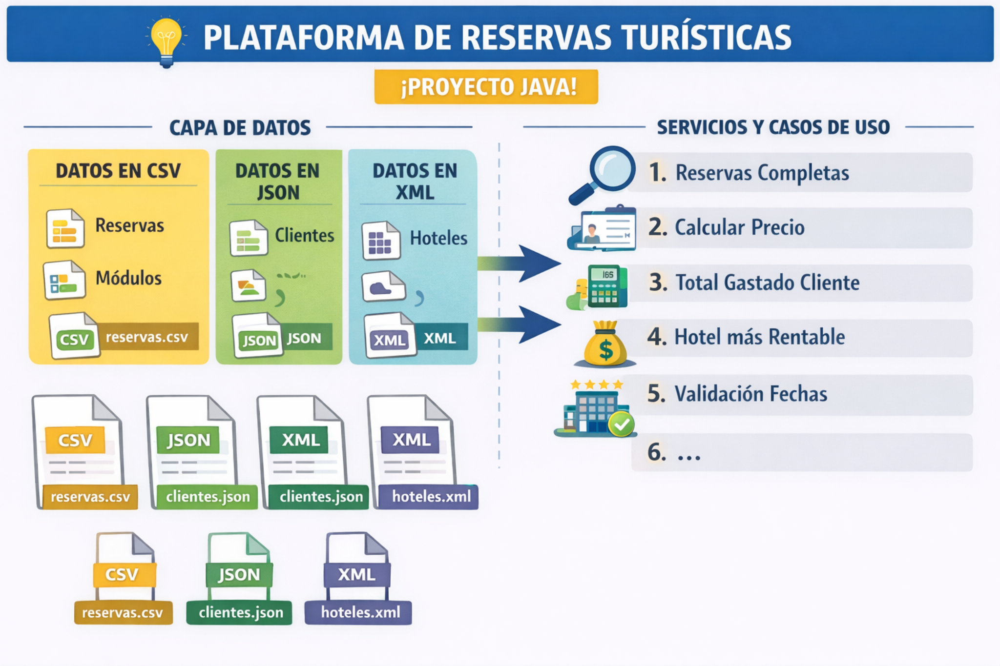

# Plataforma de Reservas Turísticas

Proyecto Java para la gestión de reservas turísticas con lectura de datos desde CSV, JSON y XML, orientado a docencia y evaluación automática.

## Objetivo del proyecto

El sistema permite trabajar con reservas, clientes y hoteles a partir de distintos formatos de fichero, manteniendo una estructura sencilla por capas.

Se mantiene la lógica de negocio principal, incluyendo:

- cálculo de importe de reservas
- validación de fechas
- agregaciones como total gastado por cliente
- hotel más rentable
- tests automáticos
- cálculo de nota automática a partir de los resultados de test

## Diagrama del sistema




## Casos de uso

Los casos de uso que debe cubrir el proyecto son:

1. **Reservas completas**
   - integración de datos de reservas, clientes y hoteles

2. **Calcular precio**
   - cálculo del coste total de una reserva

3. **Total gastado por cliente**
   - suma de importes agrupados por cliente

4. **Hotel más rentable**
   - identificación del hotel con mayor facturación

5. **Validación de fechas**
   - comprobación de formato y coherencia entre fecha de inicio y fecha de fin

## Estructura 

```text
src/main/java/com/docencia/ficheros/
├── model/
├── service/
├── util/
├── validator/ opcional
└── reader/ opcional

src/test/java/com/docencia/ficheros/
```

## 1. reservas.csv

```csv
idReserva,idCliente,idHotel,fechaInicio,fechaFin
1,101,201,2024-01-01,2024-01-03
2,101,202,2024-02-10,2024-02-12
3,102,201,2024-03-05,2024-03-06
4,103,203,2024-04-01,2024-04-05
5,102,202,2024-05-10,2024-05-15
```

### 💡 Descripción
- Cada fila representa una reserva
- Fechas en formato `yyyy-MM-dd`
- Relación con clientes y hoteles mediante IDs

### 🧠 Ejemplos
- Reserva 1 → 2 noches
- Cliente 101 → 2 reservas

---

## 2. clientes.json

```json
[
  {
    "id": 101,
    "nombre": "Juan Pérez",
    "email": "juan@example.com"
  },
  {
    "id": 102,
    "nombre": "Ana García",
    "email": "ana@example.com"
  },
  {
    "id": 103,
    "nombre": "Luis Martínez",
    "email": "luis@example.com"
  }
]
```

### 💡 Descripción
- Lista de clientes
- Se relacionan con reservas mediante `id`

---

## 3. hoteles.xml

```xml
<?xml version="1.0" encoding="UTF-8"?>
<hoteles>
    <hotel>
        <id>201</id>
        <nombre>Hotel Sol</nombre>
        <ciudad>Madrid</ciudad>
        <precioPorNoche>100.0</precioPorNoche>
    </hotel>

    <hotel>
        <id>202</id>
        <nombre>Hotel Luna</nombre>
        <ciudad>Barcelona</ciudad>
        <precioPorNoche>120.0</precioPorNoche>
    </hotel>

    <hotel>
        <id>203</id>
        <nombre>Hotel Estrella</nombre>
        <ciudad>Valencia</ciudad>
        <precioPorNoche>90.0</precioPorNoche>
    </hotel>
</hoteles>
```

### Descripción
- Contiene información de hoteles
- Incluye precio por noche
- Relación con reservas mediante `id`


## 1. Modelo

Resuelve primero las clases base del dominio:

- `Cliente`
- `Hotel`
- `Reserva`

### Qué dejar hecho
- atributos correctos
- constructores
- getters y setters
- fechas como `String`
- `toString()` si lo usas en depuración
- `equals()` y `hashCode()` solo si el proyecto los necesitaç

### Qué comprobar
- que los objetos se construyen bien
- que los campos se guardan correctamente
- que las fechas se mantienen como texto

## 2. Validador de fechas

Antes de meterte en la lógica de negocio, crea el validador:

- `com.docencia.ficheros.validator.FechaValidator`

### Qué resolver

- validar formato `yyyy-MM-dd`
- validar rango de fechas
- parsear a `LocalDate` de forma controlada

### Métodos sugeridos

- `esFormatoValido(String fecha)`
- `esRangoValido(String inicio, String fin)`
- `parse(String fecha)`

> **Importante**: existe código dentro de FechaValidator que te puede aydar.


## 3. Repositorio o lector de reservas CSV

Resuelve la lectura del fichero CSV de reservas.

### Qué resolver

- lectura de `reservas.csv`
- conversión a objetos `Reserva`
- control de errores básicos si una línea viene mal

### Qué comprobar

- número correcto de reservas
- ids correctos
- fechas correctas
- relación correcta de campos
- comportamiento con CSV inválido

### Recomendación

Aquí no metas lógica de negocio. Solo lectura y transformación.

## 4. Repositorio o lector de clientes JSON

Resuelve la lectura del JSON de clientes.

### Qué resolver
- lectura de `clientes.json`
- conversión a objetos `Cliente`

### Qué comprobar
- total de clientes
- ids correctos
- nombres correctos
- recuperación correcta de datos
- comportamiento con JSON inválido, si lo contemplas

---

## 5. Repositorio o lector de hoteles XML

Resuelve la lectura del XML de hoteles.

### Qué resolver
- lectura de `hoteles.xml`
- conversión a objetos `Hotel`

### Qué comprobar
- número de hoteles
- nombre correcto
- ciudad correcta
- precio o categoría correctos
- comportamiento con XML inválido

---

## 6. Función para el cálculo de precio

Una vez que la lectura de datos funciona, resuelve el cálculo del precio.

### Qué resolver
- cálculo del coste de la reserva
- noches por precio, o la regla concreta del ejercicio

### Dependencias esperadas
- `Reserva`
- `Hotel`
- `FechaValidator`

### Qué comprobar
- cálculo correcto para una reserva simple
- una noche
- varias noches
- fechas inválidas
- hotel no encontrado, si aplica

---

## 7. Función para el total gastado por cliente

Después del cálculo unitario, resuelve la agregación por cliente.

### Qué resolver
- suma del gasto total de un cliente
- agrupación de reservas por cliente

### Qué comprobar
- cliente con varias reservas
- cliente con una reserva
- cliente sin reservas
- cliente inexistente

---

## 8. Función para el hotel más rentable

Ahora implementa la operación agregada por hotel.

### Qué resolver
- agrupación por hotel
- suma de ingresos
- selección del hotel con mayor facturación

### Qué comprobar

- hotel con mayor facturación
- empate, si el ejercicio lo contempla
- caso sin reservas

---

## 9. Función para las reservas completas

Cuando todo lo anterior funcione por separado, resuelve la integración final.

### Qué resolver
- unir `Reserva`, `Cliente` y `Hotel`
- construir la estructura final pedida por el ejercicio


### Qué comprobar
- unión correcta por ids
- datos completos
- comportamiento cuando falta cliente
- comportamiento cuando falta hotel

---

## Calificación automática

La calificación automática se ejecuta en la fase `verify` de Maven.

```bash
mvn clean verify -Pcalificar
```

## Ejemplo de salida esperada

```text
=== CALIFICACION AUTOMATICA POR CAPA ===

GLOBAL TESTS -> tests totales: 69, pasados: 69, fallados: 0, nota: 10.00/10

=== DESGLOSE POR CAPA ===

DATOS -> tests totales: 31, pasados: 31, fallados: 0, nota tests: 10.00/10, peso maximo: 4.00, aportacion: 4.00
SERVICIO -> tests totales: 30, pasados: 30, fallados: 0, nota tests: 10.00/10, peso maximo: 4.00, aportacion: 4.00
VALIDACION -> tests totales: 8, pasados: 8, fallados: 0, nota tests: 10.00/10, peso maximo: 1.00, aportacion: 1.00

=== DOCUMENTACION API ===
Puntos documentacion API: 1.00/1.00

=== NOTA FINAL ===
Nota por capas: 9.00/9.00
Nota final: 10.00/10
```

## ¿Qué necesitas para aprobar esta parte?

- Sacar la lectura de ficheros
- Que las clases del modelo funcionen correctamente
- Funcione correctamente la validación

## ¿Qué necesitas para sacar buena nota?

> Todo lo anterior y saber trabajar en los casos de uso del servicio Reserva Service que utiliza los repositoris
